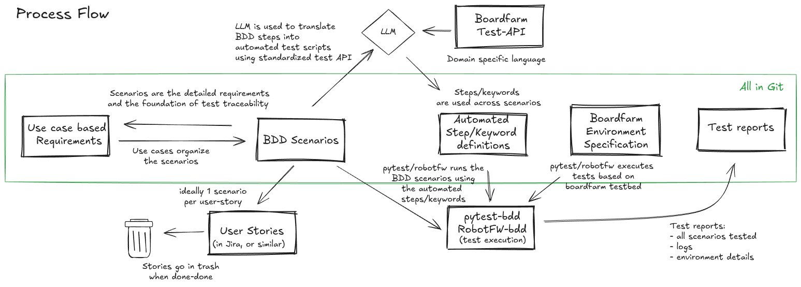

# Boardfarm BDD Test Suite

With this project, we aim to create a consistent set of system requirements as use cases and their corresponding automated test cases. The automated tests leverage **both pytest-bdd and Robot Framework** in combination with `boardfarm3`.

Capturing requirements in Markdown formatted use cases allows the organization to use Git as the version control system of the requirements, enabling us to treat documentation, test cases and reports with the same collaborative processes as code.
With the standardization of the test interface by Boardfarm, LLMs have a clear reference to translate BDD scenario steps into code for execution.

## Dual Framework Support

This project supports two test automation frameworks:

| Framework           | Directory | Integration                | Best For                                             |
| ------------------- | --------- | -------------------------- | ---------------------------------------------------- |
| **pytest-bdd**      | `tests/`  | `pytest-boardfarm3`        | Teams familiar with pytest, Python-centric workflows |
| **Robot Framework** | `robot/`  | `robotframework-boardfarm` | Keyword-driven testing, non-programmer test authors  |

Both frameworks:

- Use the same `boardfarm3.use_cases` for test operations (single source of truth)
- Share the same use case specifications in `requirements/`
- Connect to the same boardfarm testbed infrastructure
- Use consistent CLI options for boardfarm configuration

### Quick Start

```bash
# Install for pytest-bdd
pip install -e ".[pytest]"

# Install for Robot Framework
pip install -e ".[robot]"

# Install both frameworks
pip install -e ".[all]"

# Install with GUI testing support (requires StateExplorer packages)
# First install StateExplorer packages:
pip install -e ../StateExplorer/packages/model-resilience-core
pip install -e ../StateExplorer/packages/aria-state-mapper
playwright install chromium
# Then install with GUI dependencies:
pip install -e ".[full]"

# Development (includes everything)
pip install -e ".[dev]"
```

### Running Tests

All tools use consistent CLI options for boardfarm configuration:

```bash
# pytest-bdd
pytest --board-name prplos-docker-1 \
       --env-config bf_config/boardfarm_env_example.json \
       --inventory-config bf_config/boardfarm_config_example.json \
       tests/

# Robot Framework
bfrobot --board-name prplos-docker-1 \
        --env-config bf_config/boardfarm_env_example.json \
        --inventory-config bf_config/boardfarm_config_example.json \
        robot/tests/
```

### Framework Documentation

| Framework       | Quick Reference                    | Detailed Guide                                   |
| --------------- | ---------------------------------- | ------------------------------------------------ |
| pytest-bdd      | [tests/README.md](tests/README.md) | [Getting Started](docs/tests/getting_started.md) |
| Robot Framework | [robot/README.md](robot/README.md) | [Getting Started](docs/robot/getting_started.md) |



Many thanks to Mike Vogel who inspired me to pursue this requirements structure. 
Please see details of his approach here: [Agile Requirements Framework](https://globallyunique.github.io/agile-requirements-framework/)

I can also highly recommend the book "Writing Effective Use Cases" by Allistair Cockburn.

---

## Architecture

### Four-Layer Abstraction Model

Both pytest-bdd and Robot Framework tests follow the same architectural pattern:

```
┌─────────────────────────────────────────────────────────────┐
│  Layer 1: Test Definition                                    │
│  - pytest-bdd: Feature files + Step definitions              │
│  - Robot Framework: .robot test files + Keyword libraries    │
└───────────────────────────┬─────────────────────────────────┘
                            │
┌───────────────────────────▼─────────────────────────────────┐
│  Layer 2: Framework Integration (Thin Wrappers)              │
│  - pytest-bdd: tests/step_defs/*.py                          │
│  - Robot Framework: robot/libraries/*.py                     │
│  Both use @decorator pattern and delegate to use_cases       │
└───────────────────────────┬─────────────────────────────────┘
                            │
┌───────────────────────────▼─────────────────────────────────┐
│  Layer 3: Boardfarm use_cases (SINGLE SOURCE OF TRUTH)       │
│  - boardfarm3/use_cases/acs.py, cpe.py, voice.py, etc.       │
│  - Reusable test operations independent of framework         │
└───────────────────────────┬─────────────────────────────────┘
                            │
┌───────────────────────────▼─────────────────────────────────┐
│  Layer 4: Device Templates                                   │
│  - Low-level device operations (nbi, gui, sw, hw)            │
│  - Provided by boardfarm                                     │
└─────────────────────────────────────────────────────────────┘
```

For detailed architecture documentation, see [Use Case Architecture](docs/use_case_architecture.md).

---

## Standards and Conventions

To ensure consistency and portability, this project adheres to the following standards:

### Requirements

- **Use Case Format:** All use cases follow the structure defined in [Use Case Template](docs/Use%20Case%20Template%20(reflect%20the%20goal).md).
- **Synchronization:** Use case documents (`.md`), BDD scenarios (`.feature`/`.robot`), and implementations must be kept in sync.
- **Guarantee Verification:** Each test must verify Success Guarantees (success paths) or Minimal Guarantees (failure paths) from the use case.

### Test Implementation

- **Single Source of Truth:** Test logic resides in `boardfarm3.use_cases`, not in framework-specific code.
- **Type Hinting:** All code interacting with devices must use Python type hints with boardfarm templates.
- **Configuration Cleanup:** Tests that modify configuration must restore original values. See [Configuration Cleanup Process](docs/Configuration%20Cleanup%20Process.md).

### Framework-Specific Conventions

| Convention        | pytest-bdd                                | Robot Framework                                    |
| ----------------- | ----------------------------------------- | -------------------------------------------------- |
| Step organization | By actor (`acs_steps.py`, `cpe_steps.py`) | By actor (`acs_keywords.py`, `cpe_keywords.py`)    |
| Decorator pattern | `@when("step text")`                      | `@keyword("step text")`                            |
| Use case access   | Direct import of `use_cases` modules      | Direct import of `use_cases` modules               |
| Environment tags  | Scenario naming patterns                  | `[Tags]` annotation                                |

---

## Testbed

The networked components for the testbed are arranged using Raikou.
See [Raikou](https://github.com/lgirdk/raikou-factory) for details.

Our testbed is based on:

- [raikou/config.json](raikou/config.json)
- [raikou/docker-compose.yaml](raikou/docker-compose.yaml)
- Component configurations in [raikou/components/](raikou/components/)

Boardfarm configuration files: [bf_config/](bf_config/)

A description of the network topology: [Testbed Network Topology](docs/Testbed%20Network%20Topology.md)

---

## Development Workflow

### 1. Write the Use Case

- Create a Markdown file in `requirements/`
- Follow the [Use Case Template](docs/Use%20Case%20Template%20(reflect%20the%20goal).md)

### 2. Create Test Scenarios

**For pytest-bdd:**

- Add `.feature` file in `tests/features/`
- Use Gherkin syntax with scenario names including use case IDs

**For Robot Framework:**

- Add `.robot` file in `robot/tests/`
- Create corresponding keyword library in `robot/libraries/` if needed

### 3. Implement Test Logic

- **pytest-bdd:** Add step definitions in `tests/step_defs/` using `@given/@when/@then`
- **Robot Framework:** Add keywords in `robot/libraries/` using `@keyword`
- Both should delegate to `boardfarm3.use_cases` as the single source of truth

### 4. Prepare Test Artifacts

- Place required files (firmware, configs) in `tests/test_artifacts/`

### 5. Run and Validate

```bash
# pytest-bdd
pytest -k "UC12347" --board-name prplos-docker-1 ...

# Robot Framework
bfrobot --test "*Reboot*" --board-name prplos-docker-1 ...
```

---

## GUI Testing (ACS Web Interface)

This project supports automated GUI testing for ACS web interfaces using Playwright and the StateExplorer packages.

### Installation

GUI testing requires the StateExplorer packages, which provide state-machine-based UI testing capabilities:

```bash
# 1. Install StateExplorer packages (local packages)
pip install -e ../StateExplorer/packages/model-resilience-core
pip install -e ../StateExplorer/packages/aria-state-mapper

# 2. Install Playwright browsers
playwright install chromium

# 3. Install boardfarm-bdd with GUI support
pip install -e ".[full]"       # Both frameworks + GUI
# or
pip install -e ".[pytest,gui]" # pytest-bdd + GUI only
```

### StateExplorer Packages

| Package | Description |
|---------|-------------|
| `model-resilience-core` | State fingerprinting and matching algorithms |
| `aria-state-mapper` | Web UI state mapping using Playwright and accessibility trees |

### GUI Testing Workflow

1. **Discover UI Structure** - Run discovery tools to generate UI maps
2. **Generate Selectors** - Create `selectors.yaml` and `navigation.yaml` artifacts
3. **Write Tests** - Use the standard GUI interface in tests

For detailed GUI testing documentation, see [UI Testing Guide](docs/UI_Testing_Guide.md).

---

## Documentation Index

| Document | Description |
|----------|-------------|
| [Use Case Architecture](docs/use_case_architecture.md) | Detailed architecture documentation |
| [Use Case Template](docs/Use%20Case%20Template%20(reflect%20the%20goal).md) | Template for writing requirements |
| [Configuration Cleanup Process](docs/Configuration%20Cleanup%20Process.md) | Cleanup guidelines for test isolation |
| [Testbed Network Topology](docs/Testbed%20Network%20Topology.md) | Network topology documentation |
| [UI Testing Guide](docs/UI_Testing_Guide.md) | GUI testing with Playwright and StateExplorer |

### Framework-Specific Documentation

**pytest-bdd:**

- [tests/README.md](tests/README.md) - Directory structure and conventions
- [docs/tests/getting_started.md](docs/tests/getting_started.md) - Detailed guide with examples

**Robot Framework:**

- [robot/README.md](robot/README.md) - Directory structure and conventions
- [docs/robot/getting_started.md](docs/robot/getting_started.md) - Detailed guide with examples
- [robot/libraries/README.md](robot/libraries/README.md) - Keyword library documentation
