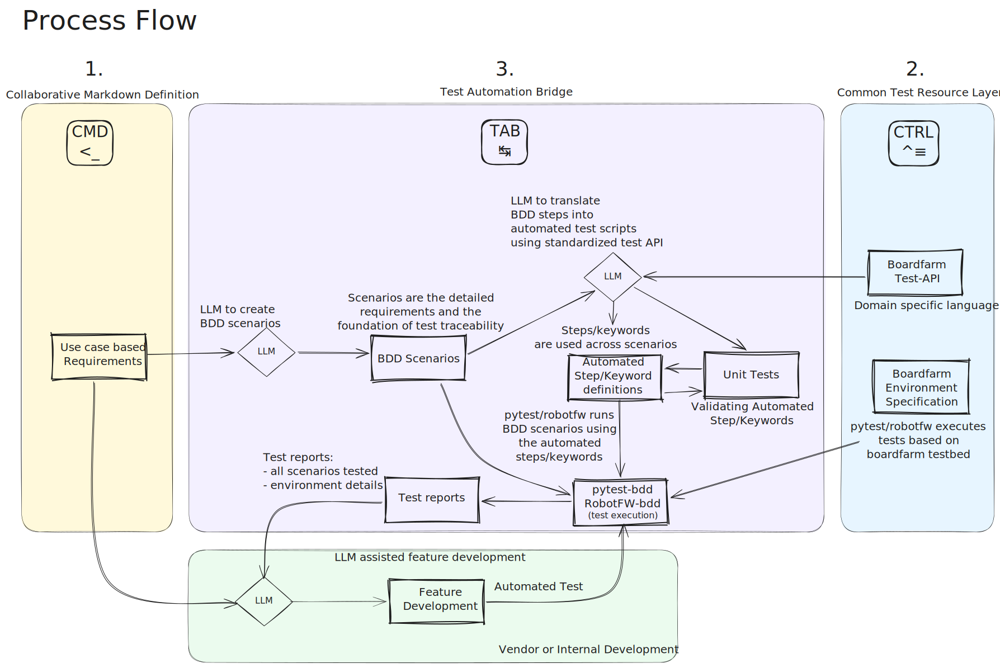
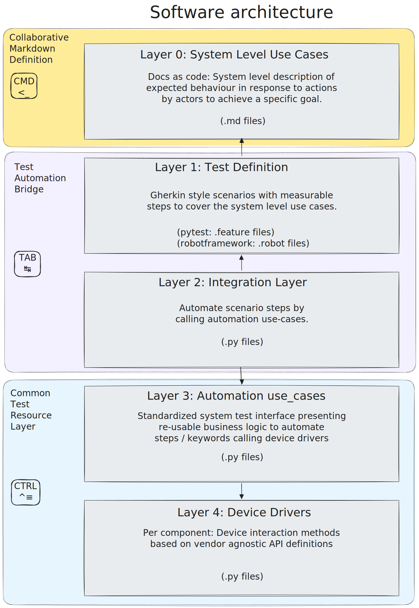

# Boardfarm BDD — Standardized Test Automation Examples

This repository demonstrates how to use **Boardfarm** as a standardized test
interface for configuring testbeds and automating system-level testing. It
provides three concrete application examples — each with a fully orchestrated
testbed — and shows the end-to-end process from requirements to automated
execution.

Capturing requirements as Markdown use cases allows the organisation to treat
documentation, test cases, and reports with the same collaborative Git
workflows as code. With the standardization of the test interface by Boardfarm,
LLMs have a clear reference to translate BDD scenario steps into executable
code.

## Process Flow

The development and test workflow follows three steps:

1. **Collaborative Markdown Definition (CMD)** Define system behavior with system-level use cases (`requirements/`)
2. **Common Test Resource Layer (CTRL)** Standardize the test interface API to all test-bed components (`boardfarm3.use_cases`)
3. **Test Automation Bridge (TAB)** Utilize AI, with Human in the Loop, to generate BDD scenarios, automated test scripts, test unit tests, and execute the test suite



Many thanks to Mike Vogel who inspired me to pursue this requirements structure. 
Please see details of his approach here:
[Agile Requirements Framework](https://globallyunique.github.io/agile-requirements-framework/).

I can also highly recommend the book *Writing Effective Use Cases* by Alistair
Cockburn.

---

## Five-Layer Architecture

Both pytest-bdd and Robot Framework tests follow the same five-layer
architectural pattern:




For the full architecture reference, see
[Boardfarm Five-Layer Model](docs/architecture/boardfarm-five-layer-model.md).

---

## Application Examples

### 1. Dockerized CPE Testing

Full TR-069/ACS testbed with a containerized PrplOS home gateway, SIP voice
services, DHCP provisioning, and LAN clients — all orchestrated by Raikou.

| | |
|---|---|
| **Compose file** | `raikou/docker-compose.yaml` |
| **Use cases** | UC-12347 Remote CPE Reboot, UC-12348 Voice Call, UC-ACS-GUI-01 ACS GUI |
| **Documentation** | [docs/examples/cpe-docker/](docs/examples/cpe-docker/) |

```bash
docker compose -f raikou/docker-compose.yaml up -d
pytest --board-name prplos-docker-1 \
       --env-config bf_config/boardfarm_env_example.json \
       --inventory-config bf_config/boardfarm_config_example.json \
       tests/
```

### 2. Physical CPE Testing

Same testbed services, but the CPE is a **physical Raspberry Pi** running
prplOS. USB-Ethernet dongles on the host bridge the RPi into the Raikou OVS
network.

| | |
|---|---|
| **Compose file** | `raikou/docker-compose-openwrt.yaml` |
| **Use cases** | UC-12347, UC-12348 (same as dockerized, targeting physical CPE) |
| **Documentation** | [docs/examples/cpe-physical/](docs/examples/cpe-physical/) |

```bash
docker compose -f raikou/docker-compose-openwrt.yaml up -d
pytest --board-name prplos-rpi-1 \
       --env-config bf_config/boardfarm_env_example.json \
       --inventory-config bf_config/boardfarm_config_prplos_rpi.json \
       tests/
```

### 3. Dockerized SD-WAN Testing

Digital twin testbed for WAN edge appliance validation: Linux SD-WAN router
with FRR + StrongSwan, dual-WAN traffic controllers, Playwright QoE client,
HTTPS/HTTP3 application servers, and IPsec overlay.

| | |
|---|---|
| **Compose file** | `raikou/docker-compose-sdwan.yaml` |
| **Use cases** | UC-SDWAN-01 through UC-SDWAN-05 |
| **Documentation** | [docs/examples/sdwan-digital-twin/](docs/examples/sdwan-digital-twin/) |

```bash
docker compose -p boardfarm-bdd-sdwan -f raikou/docker-compose-sdwan.yaml up -d
pytest --board-name sdwan-digital-twin \
       --env-config bf_config/boardfarm_env_sdwan.json \
       --inventory-config bf_config/boardfarm_config_sdwan.json \
       tests/
```

---

## Dual Framework Support

Each application domain demonstrates test implementation in both frameworks,
sharing `boardfarm3.use_cases` as the single source of truth.

| Framework           | Directory | Integration with Boardfarm |
| ------------------- | --------- | -------------------------- |
| **pytest-bdd**      | `tests/`  | `pytest-boardfarm3`        |
| **Robot Framework** | `robot/`  | `robotframework-boardfarm` |

### Framework-Specific Conventions

| Convention | pytest-bdd | Robot Framework |
|---|---|---|
| Step organisation | By actor (`acs_steps.py`, `cpe_steps.py`) | By actor (`acs_keywords.py`, `cpe_keywords.py`) |
| Decorator pattern | `@when("step text")` | `@keyword("step text")` |
| Use case access | Direct import of `use_cases` modules | Direct import of `use_cases` modules |
| Environment tags | Scenario naming patterns | `[Tags]` annotation |

### Framework Documentation

| Framework | Quick Reference | Detailed Guide |
|---|---|---|
| pytest-bdd | [tests/README.md](tests/README.md) | [Getting Started](docs/frameworks/pytest-bdd/getting-started.md) |
| Robot Framework | [robot/README.md](robot/README.md) | [Getting Started](docs/frameworks/robot-framework/getting-started.md) |

---

## Installation

```bash
# pytest-bdd only
pip install -e ".[pytest]"

# Robot Framework only
pip install -e ".[robot]"

# Both frameworks
pip install -e ".[all]"

# With GUI testing support (requires StateExplorer packages)
pip install -e ../StateExplorer/packages/model-resilience-core
pip install -e ../StateExplorer/packages/aria-state-mapper
playwright install chromium
pip install -e ".[full]"

# Development (everything)
pip install -e ".[dev]"
```

---

## Use Case → Test Mapping

| Use Case | Application | Feature File | Robot Suite |
|---|---|---|---|
| UC-12347 Remote CPE Reboot | cpe-docker | `Remote CPE Reboot.feature` | `remote_cpe_reboot.robot` |
| UC-12348 Voice Call | cpe-docker | `UC-12348 User makes a one-way call.feature` | `user_makes_one_way_call.robot` |
| UC-ACS-GUI-01 ACS GUI Device Mgmt | cpe-docker | `ACS GUI Device Management.feature` | — |
| UC-SDWAN-01 WAN Failover | sdwan-digital-twin | `WAN Failover Maintains Application Continuity.feature` | — |
| UC-SDWAN-02 Remote Worker Cloud App | sdwan-digital-twin | `Remote Worker Accesses Cloud Application.feature` | — |
| UC-SDWAN-03 Video Conference QoE | sdwan-digital-twin | — (planned) | — |
| UC-SDWAN-04 Encrypted Overlay Tunnel | sdwan-digital-twin | — (planned) | — |
| UC-SDWAN-05 Tunnel Survives Failover | sdwan-digital-twin | — (planned) | — |

---

## Standards and Conventions

### Requirements

- **Use Case Format:** All use cases follow the [Use Case Template](docs/architecture/use-case-template.md). See the [System Use Case Guide](docs/architecture/system-use-case-guide.md) for methodology and process.
- **Synchronization:** Use case documents, BDD scenarios, and implementations are kept in sync.
- **Guarantee Verification:** Each test verifies Success Guarantees or Minimal Guarantees from the use case.

### Test Implementation

- **Single Source of Truth:** Test logic resides in `boardfarm3.use_cases`, not in framework-specific code.
- **Type Hinting:** All device interactions use Python type hints with boardfarm templates.
- **Automatic Test Cleanup:** State-changing operations register their own teardown — cleanup runs automatically after each test in LIFO order. See [Test Cleanup Architecture](docs/architecture/test-cleanup-architecture.md).

---

## Documentation

For the full documentation index, see [docs/index.md](docs/index.md).

| Section | Contents |
|---|---|
| [Architecture](docs/architecture/) | Five-layer model, use case template, UI testing guide, configuration cleanup |
| [CPE Docker](docs/examples/cpe-docker/) | Containerized CPE testbed topology, ACS, voice, GUI |
| [CPE Physical](docs/examples/cpe-physical/) | Raspberry Pi integration, build guide, device class |
| [SD-WAN Digital Twin](docs/examples/sdwan-digital-twin/) | WAN edge architecture, components, QoE, traffic management |
| [Frameworks](docs/frameworks/) | pytest-bdd and Robot Framework guides |
| [ADRs](docs/adr/) | Architecture decision records |

---

## GUI Testing (ACS Web Interface)

This project supports automated GUI testing for ACS web interfaces using
Playwright and the StateExplorer packages.

| Package | Description |
|---|---|
| `model-resilience-core` | State fingerprinting and matching algorithms |
| `aria-state-mapper` | Web UI state mapping using Playwright and accessibility trees |

For the generic workflow, see the
[UI Testing Guide](docs/architecture/ui-testing-guide.md). For
ACS-specific details, see
[ACS GUI Testing](docs/examples/cpe-docker/ui-testing-guide.md).
