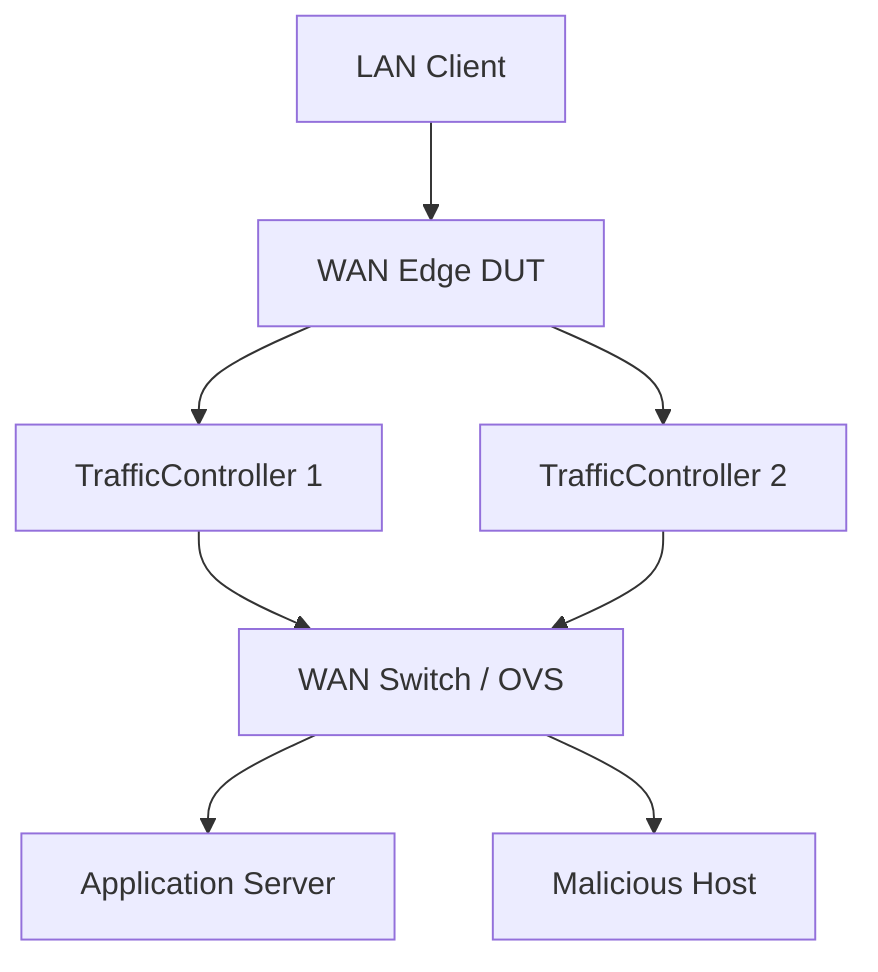

# Application Services Implementation Plan

**Date:** February 24, 2026
**Status:** Design Document
**Related:** `WAN_Edge_Appliance_testing.md`, `QoE_Client_Implementation_Plan.md`, `LinuxSDWANRouter_Implementation_Plan.md`

---

## 1. Overview

This document defines the implementation plan for the **Application Services** (North-Side) and **Security** components. These components represent the "Cloud" or "Internet" side of the testbed topology. They serve as the targets for the clients (South-Side) to access through the DUT.

### Purpose
1.  **Traffic Targets:** Provide stable, controllable endpoints for Productivity (SaaS), Streaming (Video), and Conferencing flows.
2.  **Threat Emulation:** Host the "Malicious" actors required to validate the Security pillar (firewalling, IPS, C2 blocking).
3.  **Independence:** Ensure that test results reflect the DUT's performance, not the server's limitations (e.g., using high-performance web servers).

---

## 2. Architecture & Topology

These services run as containers (or VMs) on the **WAN side** of the Traffic Controllers.



---

## 3. Implementation Details: Application Server

The **Application Server** is a single container/VM hosting multiple services on different ports to simulate a rich internet environment.

**Docker Strategy:**
*   **Base Image:** `nginx:alpine` or `httpd:alpine` (Lightweight, high concurrency).
*   **Networking:** Exposes ports 80, 443 (SaaS), 1935 (RTMP/Video), 8443 (WebRTC Echo signalling).

### 3.1 Service: Productivity (Mock SaaS)
*   **Goal:** Simulate Office 365 / Salesforce interaction.
*   **Implementation:**
    *   **Nginx Config:** Serve a static SPA (Single Page Application) with a configurable payload size.
    *   **Content:**
        *   `index.html`: Minimal framework.
        *   `large_asset.js`: A 2MB-5MB dummy file to measure **Page Load Time** and throughput.
        *   `api/latency`: An endpoint that reflects the request timestamp to measure Application Response Time.
*   **Protocol:** HTTP/2 and HTTP/3 (QUIC) enabled to test modern protocol acceleration.

#### Boardfarm Template: `ProductivityServer`
**Location:** `boardfarm3/templates/productivity_server.py`

```python
class ProductivityServer(ABC):
    @abstractmethod
    def get_service_url(self) -> str:
        """Return the base URL for the SaaS application."""

    @abstractmethod
    def set_response_delay(self, delay_ms: int) -> None:
        """Inject server-side processing delay (latency simulation)."""

    @abstractmethod
    def set_content_size(self, size_bytes: int) -> None:
        """Configure the size of the 'large asset' to simulate heavy/light apps."""
```

**Implementation (`NginxProductivityServer`):**
*   `set_response_delay`: Updates Nginx config or CGI script to sleep before responding.
*   `set_content_size`: Generates a dummy file of specific size on the fly.

### 3.2 Service: Streaming (Video on Demand)
*   **Goal:** Simulate Netflix / YouTube / Training videos.
*   **Implementation:**
    *   **Server:** Nginx with `nginx-rtmp-module` or standard HLS file serving.
    *   **Content:**
        *   Pre-transcoded video files (Big Buck Bunny is a standard test asset).
        *   **HLS Manifest (`.m3u8`):** Provides multiple bitrates (360p, 720p, 1080p, 4K).
        *   **DASH Manifest (`.mpd`):** Alternative streaming format.
    *   **Behavior:** The QoE Client requests the manifest and adaptively switches bitrates based on network conditions (which we impair via TrafficController).

#### Boardfarm Template: `StreamingServer`
**Location:** `boardfarm3/templates/streaming_server.py`

```python
class StreamingServer(ABC):
    @abstractmethod
    def get_manifest_url(self, video_id: str = "default") -> str:
        """Return the HLS (.m3u8) or DASH (.mpd) URL for a video asset."""

    @abstractmethod
    def list_available_bitrates(self, video_id: str) -> list[str]:
        """Return list of available quality profiles (e.g. ['360p', '1080p'])."""
```

**Implementation (`NginxStreamingServer`):**
*   Parses the static `.m3u8` files on disk to return available profiles.

### 3.3 Service: Conferencing (Synthetic)
*   **Goal:** Simulate Teams / Zoom Real-Time Protocol (RTP) traffic.
*   **Implementation:** **WebRTC Echo server** (`pion`-based lightweight container). Negotiates a real WebRTC peer connection with the client and echoes the media stream back, producing genuine application-layer signalling (SDP/ICE) and UDP RTP flows. No Coturn STUN/TURN required — the testbed network is fully controlled and direct peer connectivity is guaranteed.

#### Boardfarm Template: `ConferencingServer`
**Location:** `boardfarm3/templates/conferencing_server.py`

```python
class ConferencingServer(ABC):
    @abstractmethod
    def start_session(self, session_id: str) -> str:
        """Start a new conference room/session.
        
        :return: The WebRTC signalling URL for clients to connect (e.g. 'wss://webrtc-echo:8443/session1').
        """

    @abstractmethod
    def get_session_stats(self, session_id: str) -> dict:
        """Return server-side statistics for the session (Packet Loss, Jitter).
        
        Useful for correlating Client-side MOS with Server-side metrics.
        """
```

**Implementation (`WebRTCConferencingServer`):**
*   Wraps the WebRTC Echo server.
*   `start_session`: Configures the server to accept connections.
*   `get_session_stats`: Queries internal RTCP metrics.

---

## 4. Implementation Details: Malicious Host

The **Malicious Host** represents the dark side of the internet. It is a single WAN-side Kali Linux container that fulfils two distinct roles:

1. **Active inbound attacker** — generates attack traffic directed at the DUT WAN IP from the internet side (port scans, SYN floods). The DUT must detect or mitigate these.
2. **Passive threat server** — hosts services that LAN clients should be blocked from reaching (C2 beacon listener, EICAR malware distribution). The DUT's Application Control and Antivirus policies must intercept the outbound connections.

The LAN-side "compromised host" for C2 callback tests is the **existing `QoEClient`** — it attempts an outbound TCP connection to the `MaliciousHost` listener port. No separate LAN-side threat container is required.

Keeping this container separate from the Application Server allows strict firewall rules (e.g., "Block all traffic to/from IP 203.0.113.66").

**Docker Strategy:**
*   **Base Image:** `kalilinux/kali-rolling` (The standard for security tools).
*   **Tools:** `nmap` (scanning), `hping3` (flooding), `netcat` (C2 listener), `python3` (HTTP server for EICAR, custom scripts).

#### Boardfarm Template: `MaliciousHost`
**Location:** `boardfarm3/templates/malicious_host.py`

```python
from abc import ABC, abstractmethod
from dataclasses import dataclass

@dataclass
class ScanResult:
    target: str
    open_ports: list[int]
    scan_duration_s: float

class MaliciousHost(ABC):
    """Abstract WAN-side threat infrastructure for Security pillar validation.

    Implementations: KaliMaliciousHost.
    """

    # --- Active inbound attacks (WAN → DUT) ---

    @abstractmethod
    def run_port_scan(self, target: str, port_range: str = "1-1024") -> ScanResult:
        """Run a TCP SYN scan against target (typically the DUT WAN IP).

        :param target: IP address or hostname to scan.
        :param port_range: Port range string, e.g. "1-1024".
        :return: ScanResult with open ports visible from the WAN side.
        """

    @abstractmethod
    def inject_syn_flood(self, target: str, rate_pps: int, duration_s: int) -> None:
        """Inject a SYN flood at the given packet rate for the given duration.

        :param target: IP address of the DUT WAN interface.
        :param rate_pps: Packets per second (e.g. 1000).
        :param duration_s: Duration of the flood in seconds.
        """

    # --- Passive threat services (targets for LAN → WAN blocking tests) ---

    @abstractmethod
    def start_c2_listener(self, port: int) -> None:
        """Start a TCP listener to accept inbound C2 beacon connections.

        :param port: TCP port to listen on (e.g. 4444).
        """

    @abstractmethod
    def stop_c2_listener(self, port: int) -> None:
        """Stop the C2 listener on the given port."""

    @abstractmethod
    def check_connection_received(self, port: int, source_ip: str | None = None) -> bool:
        """Return True if a connection attempt reached the listener (firewall bypass).

        A True result means the DUT did NOT block the connection — the test should
        assert False on this return value.

        :param port: Port the listener was running on.
        :param source_ip: Optional — filter by the expected source IP (LAN client).
        """

    @abstractmethod
    def get_eicar_url(self) -> str:
        """Return the HTTP URL hosting the EICAR test file.

        :return: Full URL, e.g. 'http://203.0.113.66/eicar.com'.
        """
```

**Implementation (`KaliMaliciousHost`):**
*   Active attacks: calls `nmap` and `hping3` via SSH.
*   Passive services: uses `netcat` (`nc -lvp <port>`) for C2 listening; Python `http.server` or nginx for EICAR distribution.
*   Parses listener logs to determine whether a connection arrived.

### 4.1 Threat: Inbound Attacks (WAN → DUT)
*   **Port Scan:** `malicious_host.run_port_scan(target=DUT_WAN_IP)` → calls `nmap -sS <DUT_WAN_IP>`. The test asserts that the DUT logs the scan and/or no unexpected ports are reachable.
*   **DDoS (SYN Flood):** `malicious_host.inject_syn_flood(target=DUT_WAN_IP, rate_pps=1000, duration_s=10)` → calls `hping3 -S --flood <DUT_WAN_IP>`. The test asserts that the DUT applies rate limiting and LAN client QoE is unaffected.

### 4.2 Threat: Outbound Callbacks (LAN → WAN)
*   **C2 Callback Blocking:**
    *   `malicious_host.start_c2_listener(port=4444)` — starts `nc -lvp 4444`.
    *   `qoe_client` (acting as the compromised LAN host) attempts a TCP connection to `malicious_host` IP on port 4444.
    *   `malicious_host.check_connection_received(port=4444)` — asserts `False` (DUT blocked it).
    *   **Goal:** Verify DUT "Application Control" or "IP Reputation" blocks the outbound connection to this known-bad IP.
*   **Malware Distribution (EICAR):**
    *   `malicious_host.get_eicar_url()` returns the download URL.
    *   `qoe_client` attempts to download the file via HTTP.
    *   **Goal:** Verify DUT "Antivirus/Malware" inspection intercepts the file before it reaches the client.

> **Safety Note:** The EICAR string is a harmless ASCII string used industry-wide to test antivirus scanners. It will not infect the testbed host.

---

## 6. Development Phases

> See the [Component Readiness Map](WAN_Edge_Appliance_testing.md#component-readiness-map) in `WAN_Edge_Appliance_testing.md §5` for how these phases map to project-level gates.

1.  **Phase 1: App Server (Productivity)** *(Project Phase 1 — Foundation)*
    *   Build Nginx container with HTTP/2.
    *   Implement `NginxProductivityServer` class.
    *   Validate with `curl` and Boardfarm interactive mode.
2.  **Phase 2: App Server (Streaming)** *(Project Phase 1 — Foundation)*
    *   Add HLS video assets.
    *   Implement `NginxStreamingServer` class.
    *   Validate playback with VLC or local browser.
3.  **Phase 3: Malicious Host** *(Project Phase 4 — Expansion)*
    *   Build Kali container with SSH access.
    *   Implement `KaliMaliciousHost` class.
    *   Deploy EICAR file and configure `netcat` C2 listener scripts.
4.  **Phase 4: Integration** *(Project Phase 2 — Raikou Integration)*
    *   Deploy in Raikou.
    *   Verify connectivity from LAN Client through DUT to these services.

---

## 7. VM Migration Note

To migrate these components to VMs:
*   **App Server:** Install `nginx`. Copy the `nginx.conf` and web root (`/var/www/html`) from the Docker build context.
*   **Malicious Host:** Install Kali Linux (or Ubuntu + `apt install nmap hping3 netcat python3`). The same VM fulfils both inbound attacker and passive threat-server roles.
*   **Security:** Ensure the host VM firewall (UFW/iptables) allows the test traffic (e.g., allow port 80/443/1935).
