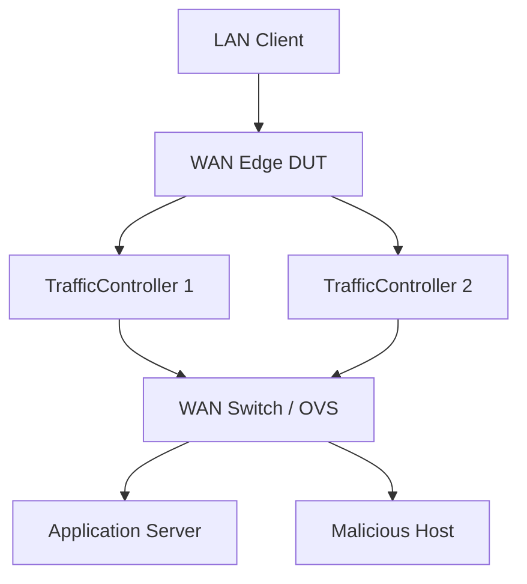

# Application Services Implementation Plan

**Date:** February 24, 2026
**Status:** Design Document
**Related:** `WAN_Edge_Appliance_testing.md`, `QoE_Client_Implementation_Plan.md`, `LinuxSDWANRouter_Implementation_Plan.md`

---

## 1. Overview

This document defines the implementation plan for the **Application Services** (North-Side) and **Security** components. These components represent the "Cloud" or "Internet" side of the testbed topology. They serve as the targets for the clients (South-Side) to access through the DUT.

### Purpose
1.  **Traffic Targets:** Provide stable, controllable endpoints for Productivity (SaaS), Streaming (Video), and Conferencing flows.
2.  **Threat Emulation:** Host the "Malicious" actors required to validate the Security pillar (firewalling, IPS, C2 blocking).
3.  **Independence:** Ensure that test results reflect the DUT's performance, not the server's limitations (e.g., using high-performance web servers).

---

## 2. Architecture & Topology

These services run as containers (or VMs) on the **WAN side** of the Traffic Controllers.



---

## 3. Implementation Details: Application Server

The **Application Server** is a single container/VM hosting multiple services on different ports to simulate a rich internet environment.

**Docker Strategy:**
*   **Base Image:** `nginx:alpine` or `httpd:alpine` (Lightweight, high concurrency).
*   **Networking:** Exposes ports 80, 443 (SaaS), 1935 (RTMP/Video), 8443 (WebRTC Echo signalling).

### 3.1 Service: Productivity (Mock SaaS)
*   **Goal:** Simulate Office 365 / Salesforce interaction.
*   **Implementation:**
    *   **Nginx Config:** Serve a static SPA (Single Page Application) with a configurable payload size.
    *   **Content:**
        *   `index.html`: Minimal framework.
        *   `large_asset.js`: A 2MB-5MB dummy file to measure **Page Load Time** and throughput.
        *   `api/latency`: An endpoint that reflects the request timestamp to measure Application Response Time.
*   **Protocol:** HTTP/2 in Phase 1–3 (plain HTTP). HTTPS and HTTP/3 (QUIC) are enabled in **Phase 3.5** (Digital Twin Hardening) using the testbed CA. See §6 Phase 3.5.

#### Boardfarm Template: `ProductivityServer`
**Location:** `boardfarm3/templates/productivity_server.py`

```python
class ProductivityServer(ABC):
    @abstractmethod
    def get_service_url(self) -> str:
        """Return the base URL for the SaaS application."""

    @abstractmethod
    def set_response_delay(self, delay_ms: int) -> None:
        """Inject server-side processing delay (latency simulation)."""

    @abstractmethod
    def set_content_size(self, size_bytes: int) -> None:
        """Configure the size of the 'large asset' to simulate heavy/light apps."""
```

**Implementation (`NginxProductivityServer`):**
*   `set_response_delay`: Updates Nginx config or CGI script to sleep before responding.
*   `set_content_size`: Generates a dummy file of specific size on the fly.

### 3.2 Service: Streaming (Video on Demand)

*   **Goal:** Simulate Netflix / YouTube / Training videos.
*   **Architecture:** Two-container design mirroring commercial CDN infrastructure:
    *   **`NginxStreamingServer` (CDN edge):** Nginx with [`nginx-s3-gateway`](https://github.com/nginxinc/nginx-s3-gateway) proxies HLS manifest and segment requests to the MinIO content origin. The edge is stateless — it caches nothing and holds no content.
    *   **`MinIO` (content origin):** S3-compatible object store holding `.m3u8` playlists and `.ts` segments. MinIO is testbed infrastructure — no Boardfarm template or device class. See **§5** for full MinIO implementation details including Raikou bridge integration, content specification, FFmpeg generation, and S3 endpoint portability.
*   **Behavior:** The QoE Client requests the HLS master manifest from `NginxStreamingServer`, which proxies the request to MinIO over the `content-internal` Raikou bridge (`http://10.100.0.2:9000`). The browser's ABR (Adaptive Bitrate) logic selects the appropriate quality profile based on the impairment applied by the TrafficController.

> **Design note — DASH:** DASH (`.mpd`) is explicitly deferred. HLS is sufficient for all QoE pillar test cases and is natively supported by Playwright/Chromium via `hls.js`. DASH support can be added to the same MinIO bucket without any server changes.

**`NginxStreamingServer` — S3 gateway configuration:**

```nginx
# nginx.conf (nginx-s3-gateway proxies /hls/* to MinIO)
server {
    listen 8081;
    location /hls/ {
        proxy_pass http://10.100.0.2:9000/streaming-content/;
        proxy_set_header Host 10.100.0.2:9000;
        # nginx-s3-gateway handles AWS SigV4 signing automatically
        # 10.100.0.2 is MinIO's Raikou-assigned IP on the content-internal bridge
    }
}
```

#### Boardfarm Template: `StreamingServer`

**Location:** `boardfarm3/templates/streaming_server.py`

```python
class StreamingServer(ABC):
    @abstractmethod
    def get_manifest_url(self, video_id: str = "default") -> str:
        """Return the HLS master playlist URL for the given video asset.

        :param video_id: Asset subdirectory in the MinIO bucket (e.g. 'default', 'bbb').
        :returns: Full URL to the HLS master manifest, e.g.
                  'http://172.16.0.11:8081/hls/default/index.m3u8'
        """

    @abstractmethod
    def list_available_bitrates(self, video_id: str = "default") -> list[str]:
        """Return list of available quality profiles for the given asset.

        :returns: Profile labels, e.g. ['360p', '720p', '1080p']
        """

    @abstractmethod
    def ensure_content_available(self, video_id: str = "default") -> None:
        """Guarantee that the named video asset is present and ready to serve.

        Called by the Boardfarm session-scoped setup fixture before any test
        runs. Implementations must be idempotent — if content is already
        present the method returns immediately without re-ingesting.

        This method is testbed infrastructure, not a test operation. It is
        called directly through the typed StreamingServer template reference
        from conftest.py — no use_case wrapper is required or appropriate.

        :param video_id: Asset identifier in the content origin (e.g. 'default', 'bbb').
        :raises RuntimeError: If content cannot be made available.
        """
```

**Implementation (`NginxStreamingServer`):**
*   `get_manifest_url()` — constructs the URL from env config (`base_url` + `video_id`).
*   `list_available_bitrates()` — queries MinIO via the S3 `ListObjectsV2` API to enumerate subdirectories for the given `video_id` — no hard-coded profile names.
*   `ensure_content_available()` — connects to `app-server` via SSH, checks whether the MinIO bucket already contains the asset (`mc ls testbed/streaming-content/<video_id>/`), and if absent runs the FFmpeg content generation script followed by `mc cp` ingest to MinIO at `http://10.100.0.2:9000` over the `content-internal` Raikou bridge. A second call on an already-populated bucket is a no-op.
*   TLS is added in Phase 3.5 using the testbed CA certificate (applies to the Nginx edge only; MinIO remains plain HTTP on the `content-internal` bridge — it is not reachable from LAN clients or the DUT).

### 3.3 Service: Conferencing (Synthetic)

*   **Goal:** Simulate Teams / Zoom Real-Time Protocol (RTP) traffic.
*   **Implementation:** **WebRTC Echo server** (`pion`-based lightweight container). Negotiates a real WebRTC peer connection with the client and echoes the media stream back, producing genuine application-layer signalling (SDP/ICE) and UDP RTP flows.

#### WebRTC Connectivity Model — Why No STUN/TURN Is Required

WebRTC's ICE process works by gathering **ICE candidates** (IP:port pairs) on each peer, exchanging them over the signalling channel, then attempting connectivity in priority order: `host` → `srflx` (STUN) → `relay` (TURN).

**STUN** is needed when a peer does not know its own public IP because it is behind NAT. **TURN** is needed when all direct paths are blocked. In this testbed, neither condition applies:

*   All peers have statically known, routable IPs on Raikou OVS bridges — no NAT is present.
*   The direct path `lan-client` (`192.168.10.10`) → DUT → TrafficController → `conf-server` (`172.16.0.12`) is always available.
*   A single `host` ICE candidate (`172.16.0.12`) is sufficient. The `srflx` and `relay` candidate types are never required.

> **Future consideration:** If Phase 5/6 commercial DUT testing introduces NAT traversal scenarios (e.g., validating the DUT's ALG or SIP/WebRTC NAT helper), a STUN/TURN server would become relevant. For the controlled testbed, it adds no value and introduces unnecessary complexity.

#### ICE Candidate Configuration (Critical)

The `pion` server runs with two network interfaces: `eth0` (Docker management, `192.168.55.x`) and `eth1` (north-segment, `172.16.0.12`). If `pion` autodiscovers all interfaces, it will advertise the management-network IP as a `host` candidate. The `lan-client` browser (on `192.168.10.0/24`) cannot reach `192.168.55.x`, causing ICE negotiation to fail silently.

**The `pion` server must be explicitly configured to advertise only `172.16.0.12`:**

```bash
# docker-compose.yaml environment — suppresses management-network candidates
environment:
    - PION_PUBLIC_IP=172.16.0.12   # Advertise only the north-segment IP as host candidate
    - PION_PORT=8443               # WebRTC signalling (WSS) and ICE UDP port
```

The `PION_PUBLIC_IP` environment variable instructs `pion` to use a static `host` candidate instead of interface autodiscovery. This is the single configuration step that makes WebRTC work correctly in this testbed.

#### Playwright Session Flow

The `QoEClient` uses Playwright/Chromium to drive the WebRTC session. Chromium has full native WebRTC support — no special browser flags are needed for direct-path connectivity:

1. `qoe_client.measure_conferencing(url)` navigates Chromium to the WSS signalling URL (e.g. `wss://172.16.0.12:8443/session1`).
2. The browser performs WebRTC offer/answer exchange with `pion` over the WSS connection.
3. ICE negotiation completes using the `host` candidate pair: `192.168.10.10` ↔ `172.16.0.12`.
4. UDP RTP media flows directly from `lan-client` to `conf-server` through the DUT and TrafficController.
5. `pion` echoes the media stream back; Playwright measures round-trip latency, jitter, and packet loss via the WebRTC `getStats()` API.

> **Phase 3.5 note:** When TLS is added in Phase 3.5, the signalling URL changes from `ws://` to `wss://`, requiring a TLS certificate issued by the testbed CA. ICE handling is unchanged — STUN/TURN is still not needed after TLS is added. See §6 Phase 3.5 and [`Testbed_CA_Setup.md §5.2`](Testbed_CA_Setup.md) for the `conf-server` certificate setup.

#### Container Configuration

| Parameter | Value |
| :--- | :--- |
| Image | Custom `pion`-based WebRTC Echo server build |
| Raikou bridge | `north-segment` (`172.16.0.12/24`) |
| Management SSH port | 5007 |
| Signalling port | 8443 (WS in Phase 1–3; WSS in Phase 3.5+) |
| `PION_PUBLIC_IP` | `172.16.0.12` — suppresses management-network ICE candidates |
| `PION_PORT` | `8443` |
| Signalling URL pattern | `ws://172.16.0.12:8443/<session_id>` (Phase 1–3) |

#### Boardfarm Template: `ConferencingServer`

**Location:** `boardfarm3/templates/conferencing_server.py`

```python
class ConferencingServer(ABC):
    @abstractmethod
    def start_session(self, session_id: str) -> str:
        """Start a new conference room/session.

        :param session_id: Unique identifier for the session (used in the WSS URL path).
        :return: The WebRTC signalling URL for clients to connect,
                 e.g. 'ws://172.16.0.12:8443/session1'.
        """

    @abstractmethod
    def get_session_stats(self, session_id: str) -> dict:
        """Return server-side RTCP statistics for the session.

        :param session_id: Session identifier passed to start_session().
        :return: Dict with keys: 'packets_sent', 'packets_lost', 'jitter_ms',
                 'round_trip_time_ms'. Used to correlate client-side MOS with
                 server-side media quality metrics.
        """
```

**Implementation (`WebRTCConferencingServer`):**
*   `start_session()` — signals the `pion` process (via SSH or HTTP control endpoint) to open a new session slot and returns the WSS URL constructed from the `simulated_ip` and `port` Boardfarm inventory config values.
*   `get_session_stats()` — queries `pion`'s internal RTCP statistics endpoint (HTTP) and parses packet loss, jitter, and round-trip time for the named session.

---

## 4. Implementation Details: Malicious Host

The **Malicious Host** represents the dark side of the internet. It is a single WAN-side Kali Linux container that fulfils two distinct roles:

1. **Active inbound attacker** — generates attack traffic directed at the DUT WAN IP from the internet side (port scans, SYN floods). The DUT must detect or mitigate these.
2. **Passive threat server** — hosts services that LAN clients should be blocked from reaching (C2 beacon listener, EICAR malware distribution). The DUT's Application Control and Antivirus policies must intercept the outbound connections.

The LAN-side "compromised host" for C2 callback tests is the **existing `QoEClient`** — it attempts an outbound TCP connection to the `MaliciousHost` listener port. No separate LAN-side threat container is required.

Keeping this container separate from the Application Server allows strict firewall rules (e.g., "Block all traffic to/from IP 203.0.113.66").

**Docker Strategy:**
*   **Base Image:** `kalilinux/kali-rolling` (The standard for security tools).
*   **Tools:** `nmap` (scanning), `hping3` (flooding), `netcat` (C2 listener), `python3` (HTTP server for EICAR, custom scripts).

#### Boardfarm Template: `MaliciousHost`
**Location:** `boardfarm3/templates/malicious_host.py`

```python
from abc import ABC, abstractmethod
from dataclasses import dataclass

@dataclass
class ScanResult:
    target: str
    open_ports: list[int]
    scan_duration_s: float

class MaliciousHost(ABC):
    """Abstract WAN-side threat infrastructure for Security pillar validation.

    Implementations: KaliMaliciousHost.
    """

    # --- Active inbound attacks (WAN → DUT) ---

    @abstractmethod
    def run_port_scan(self, target: str, port_range: str = "1-1024") -> ScanResult:
        """Run a TCP SYN scan against target (typically the DUT WAN IP).

        :param target: IP address or hostname to scan.
        :param port_range: Port range string, e.g. "1-1024".
        :return: ScanResult with open ports visible from the WAN side.
        """

    @abstractmethod
    def inject_syn_flood(self, target: str, rate_pps: int, duration_s: int) -> None:
        """Inject a SYN flood at the given packet rate for the given duration.

        :param target: IP address of the DUT WAN interface.
        :param rate_pps: Packets per second (e.g. 1000).
        :param duration_s: Duration of the flood in seconds.
        """

    # --- Passive threat services (targets for LAN → WAN blocking tests) ---

    @abstractmethod
    def start_c2_listener(self, port: int) -> None:
        """Start a TCP listener to accept inbound C2 beacon connections.

        :param port: TCP port to listen on (e.g. 4444).
        """

    @abstractmethod
    def stop_c2_listener(self, port: int) -> None:
        """Stop the C2 listener on the given port."""

    @abstractmethod
    def check_connection_received(self, port: int, source_ip: str | None = None) -> bool:
        """Return True if a connection attempt reached the listener (firewall bypass).

        A True result means the DUT did NOT block the connection — the test should
        assert False on this return value.

        :param port: Port the listener was running on.
        :param source_ip: Optional — filter by the expected source IP (LAN client).
        """

    @abstractmethod
    def get_eicar_url(self) -> str:
        """Return the HTTP URL hosting the EICAR test file.

        :return: Full URL, e.g. 'http://203.0.113.66/eicar.com'.
        """
```

**Implementation (`KaliMaliciousHost`):**
*   Active attacks: calls `nmap` and `hping3` via SSH.
*   Passive services: uses `netcat` (`nc -lvp <port>`) for C2 listening; Python `http.server` or nginx for EICAR distribution.
*   Parses listener logs to determine whether a connection arrived.

### 4.1 Threat: Inbound Attacks (WAN → DUT)
*   **Port Scan:** `malicious_host.run_port_scan(target=DUT_WAN_IP)` → calls `nmap -sS <DUT_WAN_IP>`. The test asserts that the DUT logs the scan and/or no unexpected ports are reachable.
*   **DDoS (SYN Flood):** `malicious_host.inject_syn_flood(target=DUT_WAN_IP, rate_pps=1000, duration_s=10)` → calls `hping3 -S --flood <DUT_WAN_IP>`. The test asserts that the DUT applies rate limiting and LAN client QoE is unaffected.

### 4.2 Threat: Outbound Callbacks (LAN → WAN)
*   **C2 Callback Blocking:**
    *   `malicious_host.start_c2_listener(port=4444)` — starts `nc -lvp 4444`.
    *   `qoe_client` (acting as the compromised LAN host) attempts a TCP connection to `malicious_host` IP on port 4444.
    *   `malicious_host.check_connection_received(port=4444)` — asserts `False` (DUT blocked it).
    *   **Goal:** Verify DUT "Application Control" or "IP Reputation" blocks the outbound connection to this known-bad IP.
*   **Malware Distribution (EICAR):**
    *   `malicious_host.get_eicar_url()` returns the download URL.
    *   `qoe_client` attempts to download the file via HTTP.
    *   **Goal:** Verify DUT "Antivirus/Malware" inspection intercepts the file before it reaches the client.

> **Safety Note:** The EICAR string is a harmless ASCII string used industry-wide to test antivirus scanners. It will not infect the testbed host.

---

## 5. Implementation Details: Content Origin (MinIO)

MinIO is the **S3-compatible content origin** for the HLS streaming service. It is not a Boardfarm device — it has no template and no device class. It is testbed infrastructure whose lifecycle is managed by Raikou and Docker Compose. Its only Boardfarm-visible interface is the `StreamingServer.ensure_content_available()` abstract method, implemented by `NginxStreamingServer`.

### 5.1 Role and Isolation

*   Holds HLS `.m3u8` playlists and `.ts` segments for the `NginxStreamingServer` CDN edge to proxy.
*   Connected to the `content-internal` Raikou OVS bridge **only** — there is no route to LAN clients or the DUT. Test traffic cannot reach MinIO directly.
*   The management host accesses MinIO's Docker management-network port (19000) for content ingest and debugging. This port is not involved in any testbed traffic path.
*   `NginxStreamingServer` reaches MinIO at `http://10.100.0.2:9000` (MinIO's Raikou-assigned IP on `content-internal`), deliberately avoiding Docker hostname resolution to enforce testbed isolation.

### 5.2 Content Specification

| Profile | Resolution | Target bitrate | When selected by ABR |
| :--- | :--- | :--- | :--- |
| `low` | 640×360 | 400 kbps | `congested` / `satellite` impairment profile |
| `medium` | 1280×720 | 1500 kbps | `cable_typical` impairment profile |
| `high` | 1920×1080 | 4000 kbps | `pristine` impairment profile — validates SLO headroom |

> **Note — 4K excluded:** 4K (≥ 15 Mbps) exceeds typical testbed WAN capacities and would rarely be selected by the ABR algorithm. It is not included in the bitrate ladder.

*   **HLS segment duration:** 6 seconds (Apple recommended default; industry standard)
*   **Content duration per asset:** 60 seconds (10 segments per profile)
*   **Default asset:** Synthetically generated using FFmpeg `testsrc2` — no external download dependency, reproducible, compresses efficiently in H.264

**FFmpeg generation command:**

```bash
ffmpeg -f lavfi -i "testsrc2=size=1920x1080:rate=25" -t 60 \
  -map 0 -s:v:0 640x360   -b:v:0 400k  -hls_time 6 \
    -hls_segment_filename /tmp/streaming/default/360p/seg%03d.ts \
    /tmp/streaming/default/360p/index.m3u8 \
  -map 0 -s:v:1 1280x720  -b:v:1 1500k -hls_time 6 \
    -hls_segment_filename /tmp/streaming/default/720p/seg%03d.ts \
    /tmp/streaming/default/720p/index.m3u8 \
  -map 0 -s:v:2 1920x1080 -b:v:2 4000k -hls_time 6 \
    -hls_segment_filename /tmp/streaming/default/1080p/seg%03d.ts \
    /tmp/streaming/default/1080p/index.m3u8

# To substitute an alternative asset (e.g. Big Buck Bunny) for demos:
# mc cp --recursive /path/to/bbb/ testbed/streaming-content/bbb/
```

### 5.3 Content Ingest and `ensure_content_available()`

Content readiness is managed through the `StreamingServer.ensure_content_available()` abstract method, implemented by `NginxStreamingServer`. The Boardfarm `sdwan_testbed_setup` session-scoped autouse fixture (in `tests/conftest.py`) calls this method **once per test session**, before any test runs. See `WAN_Edge_Appliance_testing.md §3.9` for the fixture skeleton.

**Implementation steps performed by `NginxStreamingServer.ensure_content_available()`:**

1. SSH into `app-server`.
2. Check whether the MinIO bucket already contains the asset: `mc ls testbed/streaming-content/<video_id>/`.
3. If absent: run the FFmpeg generation command (§5.2), then push segments to MinIO via `mc cp` over the `content-internal` bridge at `http://10.100.0.2:9000`.
4. If present: return immediately (no-op — the method is idempotent).

> **Manual fallback (debugging only):** If content needs to be seeded outside a Boardfarm session, use the management-network S3 API port directly from the host:
> ```bash
> mc alias set testbed http://localhost:19000 testbed testbed-secret
> mc mb --ignore-existing testbed/streaming-content
> mc cp --recursive /tmp/streaming/ testbed/streaming-content/
> ```

### 5.4 S3 Endpoint Portability

The `NginxStreamingServer` container image does not change across testbed tiers. Only the S3 endpoint, credentials, and bucket name change — all of which are Boardfarm env config values.

| Testbed tier | `s3_endpoint` (nginx-s3-gateway) | `mc` ingest endpoint | Notes |
| :--- | :--- | :--- | :--- |
| Docker (Phase 1–3) | `http://10.100.0.2:9000` | `http://localhost:19000` | MinIO on `content-internal` Raikou bridge; management port for ingest |
| VM-based digital twin | `http://<minio-vm>:9000` | `http://<minio-vm>:9000` | MinIO on VM; same S3 API |
| Pre-production / cloud | `https://s3.<region>.amazonaws.com` | AWS CLI / S3 console | AWS S3; IAM credentials replace `access_key` / `secret_key` |

### 5.5 Container Configuration

| Parameter | Value |
| :--- | :--- |
| Image | `minio/minio:latest` |
| Raikou bridge | `content-internal` (`10.100.0.2/30`) |
| Management ports | 19000 (S3 API), 19001 (web console) |
| Default bucket | `streaming-content` |
| Credentials | `MINIO_ROOT_USER=testbed` / `MINIO_ROOT_PASSWORD=testbed-secret` |
| Data persistence | `minio-data` Docker volume (persists content across container restarts) |
| `depends_on` | `raikou-net` — Raikou injects `eth1` on `content-internal` before MinIO begins serving |

See `SDWAN_Testbed_Configuration.md §4.1` (config.json) and `§4.2` (docker-compose.yaml) for the complete container declarations, and `§3.5` for the `content-internal` bridge segment detail.

---

## 6. Development Phases

> See the [Component Readiness Map](WAN_Edge_Appliance_testing.md#component-readiness-map) in `WAN_Edge_Appliance_testing.md §5` for how these phases map to project-level gates.

1.  **Phase 1: App Server (Productivity)** *(Project Phase 1 — Foundation)*
    *   Build Nginx container with HTTP/2.
    *   Implement `NginxProductivityServer` class.
    *   Validate with `curl` and Boardfarm interactive mode.
2.  **Phase 2: App Server (Streaming)** *(Project Phase 1 — Foundation)*
    *   Add HLS video assets.
    *   Implement `NginxStreamingServer` class.
    *   Validate playback with VLC or local browser.
3.  **Phase 3: Malicious Host** *(Project Phase 4 — Expansion)*
    *   Build Kali container with SSH access.
    *   Implement `KaliMaliciousHost` class.
    *   Deploy EICAR file and configure `netcat` C2 listener scripts.
4.  **Phase 3.5: HTTPS & HTTP/3 Enablement** *(Project Phase 3.5 — Digital Twin, Optional)*

    > **Prerequisite:** Testbed CA generated and service certificates issued per **[`Testbed_CA_Setup.md`](Testbed_CA_Setup.md)**. Specifically, complete §4 (Root CA), §5.1 (app-server cert), and §6 (volume mounts) before proceeding.

    *   **Productivity Server — TLS:**
        *   Add `server_certificate` and `server_key` to Nginx config (issued by testbed CA).
        *   Update `get_service_url()` to return `https://...` once TLS is active.
        *   Example Nginx stanza:
            ```nginx
            listen 443 ssl;
            ssl_certificate     /certs/productivity-server.crt;
            ssl_certificate_key /certs/productivity-server.key;
            ssl_protocols       TLSv1.3;
            ```
    *   **Productivity Server — HTTP/3:**
        *   Requires Nginx built with `--with-http_v3_module` (available in Nginx ≥ 1.25).
        *   Add QUIC listener and `Alt-Svc` header:
            ```nginx
            listen 443 quic reuseport;
            add_header Alt-Svc 'h3=":443"; ma=86400';
            ```
        *   Browsers upgrade to HTTP/3 on the second request.
    *   **Streaming Server — TLS:** Same certificate approach as Productivity. QUIC is optional for streaming (HLS over HTTPS is sufficient for Phase 3.5).
    *   **No changes to Boardfarm templates** — `get_service_url()` returns the URL with the correct scheme; use cases are protocol-agnostic.

    **Exit criteria:**
    *   `curl -v --cacert testbed-ca.crt https://productivity-server/` returns HTTP 200 with TLSv1.3.
    *   Browser (Chromium, testbed CA trusted) loads the productivity page over `h2` then `h3` on second load.
    *   All existing QoE SLO tests pass unchanged over HTTPS.

5.  **Phase 4: Integration** *(Project Phase 2 — Raikou Integration)*
    *   Deploy in Raikou.
    *   Verify connectivity from LAN Client through DUT to these services.

---

## 7. VM Migration Note

To migrate these components to VMs:
*   **App Server:** Install `nginx`. Copy the `nginx.conf` and web root (`/var/www/html`) from the Docker build context.
*   **Malicious Host:** Install Kali Linux (or Ubuntu + `apt install nmap hping3 netcat python3`). The same VM fulfils both inbound attacker and passive threat-server roles.
*   **Security:** Ensure the host VM firewall (UFW/iptables) allows the test traffic (e.g., allow port 80/443/1935).
