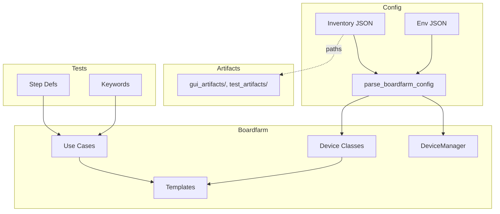

# Boardfarm Test Automation Architecture

> A unified architecture enabling portable test automation across pytest-bdd and Robot Framework using Boardfarm use_cases as the single source of truth.

**Version**: 1.0  
**Created**: January 26, 2026  
**Status**: Reference Architecture  
**Audience**: Test Developers, AI Agents, Framework Contributors

---

## Table of Contents

1. [Overview](#overview)
2. [Layer Summary](#layer-summary)
3. [Four-Layer Architecture](#four-layer-architecture)
4. [Layer Structure Details](#layer-structure-details) (Templates, Device Classes, Lib)
5. [Device Interface Model](#device-interface-model)
6. [Interface Selection Pattern](#interface-selection-pattern)
7. [Boardfarm Configuration Files](#boardfarm-configuration-files)
8. [Test Artifacts](#test-artifacts)
9. [Data Flow Diagram](#data-flow-diagram)
10. [pytest-bdd Integration](#pytest-bdd-integration)
11. [Robot Framework Integration](#robot-framework-integration)
12. [Writing New Test Scenarios](#writing-new-test-scenarios)
13. [use_cases Module Reference](#use_cases-module-reference)
14. [Best Practices](#best-practices)
15. [Anti-Patterns to Avoid](#anti-patterns-to-avoid)

---

## Overview

### Purpose

This architecture provides a **framework-agnostic approach** to test automation where:

- **Test logic lives in Boardfarm use_cases** (single source of truth)
- **Test definitions are thin wrappers** (pytest-bdd steps, Robot Framework keywords)
- **Device operations are abstracted** through consistent interfaces
- **Tests remain portable** across different testbed topologies and component instantiations (containerized "digital twins" vs. dedicated appliances)

### Key Benefits

| Benefit | Description |
|---------|-------------|
| **Portability** | Same use_cases work with pytest-bdd AND Robot Framework |
| **Maintainability** | Fix once in use_cases, benefit everywhere |
| **Consistency** | Standardized patterns across all test scenarios |
| **Testability** | use_cases can be unit tested independently |

### Core Principle

```
Tests → Step Defs/Keywords → Boardfarm Use Cases → Templates
         (thin wrappers)     (business logic)      (device contract)
```

Tests never call device implementations directly. They depend on **templates** and **boardfarm use cases** only.

### Layer Summary

| Layer | Location | Purpose | Depends On |
|-------|----------|---------|------------|
| **Templates** | `boardfarm3/templates/` | Abstract device contracts (ABCs) | — |
| **Device Classes** | `boardfarm3/devices/` | Concrete implementations | Templates, Lib |
| **Lib** | `boardfarm3/lib/` | Schema, helpers, adapters | — |
| **Boardfarm Use Cases** | `boardfarm3/use_cases/` | Test operations (single source of truth) | Templates |
| **pytest-bdd Step Definitions** | `tests/step_defs/` | Gherkin step implementations | Boardfarm Use Cases |
| **Robot Keyword Libraries** | `robot/libraries/` | Robot keyword implementations | Boardfarm Use Cases |
| **Configuration** | `bf_config/` | Inventory + env config | — |
| **Test Artifacts** | `bf_config/*_artifacts/`, `tests/test_artifacts/` | Large/binary data referenced by config | — |

---

## Four-Layer Architecture

### Visual Overview

```
┌─────────────────────────────────────────────────────────────────────────┐
│ LAYER 1: Test Definition                                                │
│                                                                         │
│   pytest-bdd                         Robot Framework                    │
│   ┌──────────────────────┐          ┌──────────────────────┐            │
│   │ @given/@when/@then   │          │ *** Test Cases ***   │            │
│   │ step functions       │          │ Keywords             │            │
│   │ (.py files)          │          │ (.robot files)       │            │
│   └──────────┬───────────┘          └──────────┬───────────┘            │
│              │                                  │                       │
└──────────────┼──────────────────────────────────┼───────────────────────┘
               │                                  │
               ▼                                  ▼
┌─────────────────────────────────────────────────────────────────────────┐
│ LAYER 2: Integration Layer (THIN WRAPPER - NO BUSINESS LOGIC)           │
│                                                                         │
│   pytest-bdd                         Robot Framework                    │
│   ┌──────────────────────┐          ┌──────────────────────┐           │
│   │ Step definitions     │          │ Keyword libraries    │           │
│   │ @given/@when/@then   │          │ @keyword decorator   │           │
│   │ call use_cases       │          │ call use_cases       │           │
│   │                      │          │                      │           │
│   │ tests/step_defs/     │          │ robot/libraries/     │           │
│   │ - acs_steps.py       │          │ - acs_keywords.py    │           │
│   │ - cpe_steps.py       │          │ - cpe_keywords.py    │           │
│   └──────────┬───────────┘          └───────────┬──────────┘           │
│              │                                  │                       │
└──────────────┼──────────────────────────────────┼───────────────────────┘
               │                                  │
               └────────────────┬─────────────────┘
                                │
                                ▼
┌─────────────────────────────────────────────────────────────────────────┐
│ LAYER 3: Boardfarm use_cases (boardfarm3/use_cases/*.py)                │
│                                                                         │
│   SINGLE SOURCE OF TRUTH FOR TEST OPERATIONS                            │
│                                                                         │
│   ┌─────────────┐  ┌─────────────┐  ┌─────────────┐  ┌─────────────┐   │
│   │   acs.py    │  │   cpe.py    │  │  voice.py   │  │networking.py│   │
│   │             │  │             │  │             │  │             │   │
│   │ get_param() │  │ get_uptime()│  │ call_phone()│  │   ping()    │   │
│   │ set_param() │  │ reboot()    │  │ answer()    │  │ http_get()  │   │
│   │ reboot()    │  │ factory()   │  │ hangup()    │  │ dns_lookup()│   │
│   └──────┬──────┘  └──────┬──────┘  └──────┬──────┘  └──────┬──────┘   │
│          │                │                │                │          │
└──────────┼────────────────┼────────────────┼────────────────┼──────────┘
           │                │                │                │
           └────────────────┼────────────────┼────────────────┘
                            │                │
                            ▼                ▼
┌─────────────────────────────────────────────────────────────────────────┐
│ LAYER 4: Device Templates (boardfarm3/templates/*.py)                   │
│                                                                         │
│   LOW-LEVEL DEVICE OPERATIONS                                           │
│                                                                         │
│   ┌─────────────────┐  ┌─────────────────┐  ┌─────────────────┐        │
│   │      ACS        │  │      CPE        │  │   SIPPhone      │        │
│   │   ┌─────────┐   │  │   ┌─────────┐   │  │                 │        │
│   │   │   nbi   │   │  │   │   sw    │   │  │  dial()         │        │
│   │   │ (REST)  │   │  │   │(software│   │  │  answer()       │        │
│   │   ├─────────┤   │  │   │ layer)  │   │  │  hangup()       │        │
│   │   │   gui   │   │  │   ├─────────┤   │  │                 │        │
│   │   │ (web UI)│   │  │   │   hw    │   │  │                 │        │
│   │   ├─────────┤   │  │   │(console)│   │  │                 │        │
│   │   │ console │   │  │   ├─────────┤   │  │                 │        │
│   │   │ (SSH)   │   │  │   │   gui   │   │  │                 │        │
│   │   └─────────┘   │  │   │ (LuCI)  │   │  │                 │        │
│   └─────────────────┘  └─────────────────┘  └─────────────────┘        │
│                                                                         │
└─────────────────────────────────────────────────────────────────────────┘
```

### Layer Responsibilities

| Layer       | Responsibility                   | Contains                      | Does NOT Contain        |
| ----------- | -------------------------------- | ----------------------------- | ----------------------- |
| **Layer 1** | Test definition (human-readable) | Gherkin steps, Robot keywords | Business logic          |
| **Layer 2** | Framework integration            | Parameter passing, fixtures   | Business logic          |
| **Layer 3** | Test operations (business logic) | Retries, polling, validation  | Device protocol details |
| **Layer 4** | Device communication             | Protocol implementations      | Test-specific logic     |

---

## Layer Structure Details

### Templates

**Location:** `boardfarm3/templates/*.py`

**Purpose:** Define the **contract** (abstract interface) that devices must implement. Boardfarm use cases and tests import templates, not concrete device classes.

**Characteristics:**
- Python ABCs with `@abstractmethod`
- High-level, stable signatures
- No transport or vendor specifics

**Examples:** `WAN`, `LAN`, `ACS`, `CPE`, `SIPPhone`, `SIPServer`, `Provisioner`, `TrafficController`

```python
# boardfarm3/templates/sip_phone.py
class SIPPhone(ABC):
    @abstractmethod
    def dial(self, number: str) -> None: ...

    @abstractmethod
    def answer(self) -> None: ...
```

**Guideline:** Add capabilities via new ABCs or optional mixins rather than changing existing signatures.

### Device Classes

**Location:** `boardfarm3/devices/*.py`

**Purpose:** Concrete implementations of templates. Translate template methods into transport-specific actions (SSH, serial, HTTP, docker exec, etc.).

**Characteristics:**
- Inherit from template(s) and base device (`LinuxDevice`, `BoardfarmDevice`)
- Receive merged config (`config`, `cmdline_args`) at construction
- May implement device hooks for boot/provision lifecycle
- Registered via `boardfarm_add_devices` hook (`type` → class mapping)

**Example:** `PJSIPPhone(SIPPhone)`, `LinuxWAN(WAN)`, `GenieACS(ACS)`

**Config flow:** Device receives **merged config** (inventory + env) from `parse_boardfarm_config()`. Device-specific keys (e.g. `impairment_profile`, `gui_fsm_graph_file`) come from this merged dict.

### Lib

**Location:** `boardfarm3/lib/*.py`

**Purpose:** Shared utilities, schemas, and adapters that are **not** device implementations.

**Contains:**
- **Schemas:** Dataclasses, type definitions (e.g. `ImpairmentProfile`)
- **Helpers:** Console-agnostic functions (e.g. `set_profile_via_tc`, `http_get`)
- **Adapters:** Composable components (e.g. `LinuxTrafficControlAdapter`, `FsmGuiComponent`)

**Does NOT contain:** Business logic that belongs in use cases, or device-specific I/O that belongs in device classes.

**Example:** `lib/traffic_control.py` has `ImpairmentProfile`, `profile_from_dict`, `set_profile_via_tc`, `LinuxTrafficControlAdapter`.

---

## Device Interface Model

### ACS Device Interfaces

The ACS (Auto Configuration Server) exposes three interfaces:

```python
class ACS:
    @property
    def nbi(self) -> ACSNBI:
        """Northbound Interface - REST API for TR-069 operations."""
        
    @property
    def gui(self) -> ACSGUI:
        """GUI Interface - Web browser operations."""
        
    @property
    def console(self) -> BoardfarmPexpect:
        """Console Interface - SSH access to ACS server."""
```

| Interface | Protocol | Use Case | Performance |
|-----------|----------|----------|-------------|
| `acs.nbi` | REST API | Programmatic TR-069 operations | Fast |
| `acs.gui` | Selenium/Web | GUI testing, visual verification | Slow |
| `acs.console` | SSH | Log access, server management | Medium |

### CPE Device Interfaces

The CPE (Customer Premises Equipment) exposes:

```python
class CPE:
    @property
    def sw(self) -> CPESW:
        """Software layer - OS services, applications."""
        
    @property
    def hw(self) -> CPEHW:
        """Hardware layer - Console/serial access."""
        
    # Future
    @property
    def gui(self) -> CPEGUI:
        """GUI layer - LuCI web interface (planned)."""
```

| Interface | Access Method | Use Case |
|-----------|---------------|----------|
| `cpe.sw` | Software APIs | Application operations, services |
| `cpe.hw` | Serial/Console | Direct hardware access, boot ops |
| `cpe.gui` | Web (future) | LuCI/web admin interface |

### Interface Usage in Templates

```python
# ACS interfaces in use_cases
def get_parameter_value(acs: ACS, cpe: CPE, param: str, via: str = "nbi"):
    if via == "gui":
        return acs.gui.get_device_parameter_via_gui(cpe.sw.cpe_id, param)
    return acs.nbi.GPV(param, cpe_id=cpe.sw.cpe_id)

# CPE interfaces in use_cases
def get_seconds_uptime(board: CPE) -> float:
    return board.sw.get_seconds_uptime()  # Uses software layer

def stop_tr069_client(board: CPE) -> None:
    console = board.hw.get_console("console")  # Uses hardware layer
    console.execute_command("/etc/init.d/cwmp_plugin stop")
```

---

## Interface Selection Pattern

### The `via` Parameter

For use_cases where multiple interfaces can perform the same operation, we use a **`via` parameter with a sensible default**:

```python
from typing import Literal

InterfaceType = Literal["nbi", "gui"]

def reboot_device(
    acs: ACS, 
    cpe: CPE, 
    via: InterfaceType = "nbi"
) -> bool:
    """Reboot device via ACS.
    
    :param acs: ACS device instance
    :param cpe: CPE device instance
    :param via: Interface to use ("nbi" for API, "gui" for web interface)
    :return: True if reboot initiated successfully
    """
    if via == "gui":
        return acs.gui.reboot_device_via_gui(cpe.sw.cpe_id)
    return acs.nbi.Reboot(cpe_id=cpe.sw.cpe_id)
```

### Why This Pattern?

| Reason | Explanation |
|--------|-------------|
| **Single function** | One function per operation, not multiple variants |
| **Consistent API** | Same pattern everywhere, predictable |
| **Sensible defaults** | 90% of tests use the default interface |
| **Explicit override** | Tests targeting specific interfaces pass `via="gui"` |
| **No duplication** | Implementation logic in one place |

### When to Include `via` Parameter

**Include `via` when:**
- Multiple interfaces can perform the same operation
- There's value in testing different interfaces
- The operation semantics are identical across interfaces

**Omit `via` when:**
- Only one interface supports the operation
- The operation is inherently tied to a specific interface

```python
# WITH via - multiple interfaces possible
def get_parameter_value(acs, cpe, param, via="nbi"):
    ...

def reboot_device(acs, cpe, via="nbi"):
    ...

# WITHOUT via - single interface only
def wait_for_inform_in_logs(acs, cpe_id, timeout=120):
    """Always uses console access - no alternative."""
    # Uses acs.console internally
    ...

def stop_tr069_client(board):
    """Always uses hardware console - no alternative."""
    # Uses board.hw internally
    ...
```

### Interface Selection Guidelines

| Scenario | Recommendation | Reason |
|----------|----------------|--------|
| Testing business logic | Use default (NBI) | Faster, more reliable |
| Testing GUI functionality | Explicitly pass `via="gui"` | Tests the specific interface |
| Performance-critical | Use NBI | Web UI is slower |
| Single-interface operation | No `via` parameter | Keeps API simple |

---

## Boardfarm Configuration Files

Boardfarm uses **two** configuration files, merged at runtime.

### Inventory Config

**Location:** `bf_config/boardfarm_config_*.json`  
**CLI:** `--inventory-config`

**Purpose:** Device identity, connection details, topology.

**Contains:**
- Device list with `name`, `type`, `connection_type`, `ipaddr`, `port`, etc.
- Topology-specific keys (e.g. `impairment_interface`, `wan_iface`)
- **Paths to artifact files** when data is too large for inline config (see [Test Artifacts](#test-artifacts))

**Structure (supports multi-testbed):** Top-level keys are testbed names; each value has `devices` array.

### Environment Config

**Location:** `bf_config/boardfarm_env_*.json`  
**CLI:** `--env-config`

**Purpose:** Per-device defaults, provisioning behavior, named presets.

**Contains:**
- `environment_def[device_name]`: Merged with each device's inventory entry
- `environment_def.impairment_presets`: Optional named presets for BDD vocabulary
- Provisioning mode, model, lan_clients, etc.

### Merge Behavior

`parse_boardfarm_config()` merges inventory + env via `jsonmerge.merge()`:
- For each device, `environment_def[device_name]` is merged on top of inventory device config
- Result: single merged config per device passed to device constructor

**Guideline:** Prefer env config for per-device defaults and presets. Use inventory for connection/topology only.

---

## Test Artifacts

**When to use:** When configuration data is **too large** or **binary** to fit inline in JSON config files.

### Pattern: Config References Artifacts

Config files stay small. Device config holds **paths** to artifact files. Devices load artifacts at runtime.

```
bf_config/
├── boardfarm_config_prplos_rpi.json   # References paths
├── boardfarm_env_example.json
└── gui_artifacts/
    └── genieacs/
        ├── fsm_graph_expanded.json    # Large FSM graph
        ├── fsm_graph_augmented.json
        └── screenshots/               # Reference images
            ├── references/
            └── ...
```

### GUI Example: FSM Graphs and Screenshots

The GenieACS GUI device uses artifacts because:
- **FSM graphs** are large JSON files (states, transitions, fingerprints)
- **Screenshots** are binary reference images for visual regression

**Device config (inventory):**
```json
{
  "name": "genieacs",
  "type": "bf_acs",
  "gui_fsm_graph_file": "bf_config/gui_artifacts/genieacs/fsm_graph_expanded.json",
  "gui_screenshot_dir": "bf_config/gui_artifacts/genieacs/screenshots"
}
```

**Artifact layout:**
- `gui_artifacts/{device}/`: FSM graphs, selectors, navigation files
- `gui_artifacts/{device}/screenshots/`: Visual regression references

**Reference:** See `boardfarm3/lib/gui/README.md` in the boardfarm repository for FSM graph generation and GUI configuration.

### tests/test_artifacts/

**Location:** `tests/test_artifacts/`

**Purpose:** Test data that is **not** device configuration—e.g. firmware images, metadata, fixtures for unit tests.

**Use when:** Data is test-suite specific, not testbed-specific.

**Example:** `metadata.json` for device compatibility info.

### Decision: Config vs. Artifact

| Data Type | Put In | Reason |
|-----------|--------|--------|
| Per-device defaults (small) | Env config | Fits in JSON, merged cleanly |
| Connection details | Inventory | Topology/identity |
| Large graphs, images | Artifacts + path in config | Too large for JSON |
| Test-specific fixtures | `tests/test_artifacts/` | Not testbed config |
| Named presets for BDD | Env config `impairment_presets` | Small, shared vocabulary |

---

## Data Flow Diagram



---

## pytest-bdd Integration

### Architecture Overview

```
┌────────────────────────────────────────────────────────────────────────┐
│                          pytest-bdd                                     │
│                                                                        │
│  ┌──────────────────────────────────────────────────────────────────┐ │
│  │                    Feature Files (.feature)                       │ │
│  │  Scenario: Operator reboots CPE via ACS                          │ │
│  │    Given the CPE is online and provisioned                       │ │
│  │    When the operator initiates a reboot task on the ACS          │ │
│  │    Then the CPE executes the reboot command and restarts         │ │
│  └────────────────────────────────┬─────────────────────────────────┘ │
│                                   │                                    │
│  ┌────────────────────────────────▼─────────────────────────────────┐ │
│  │                  Step Definitions (step_defs/*.py)                │ │
│  │                                                                   │ │
│  │  @when("the operator initiates a reboot task on the ACS")        │ │
│  │  def operator_initiates_reboot(acs, cpe, bf_context):            │ │
│  │      acs_use_cases.initiate_reboot(acs, cpe)  # ← use_case call  │ │
│  │      print("✓ Reboot task initiated")                            │ │
│  │                                                                   │ │
│  └────────────────────────────────┬─────────────────────────────────┘ │
│                                   │                                    │
│  ┌────────────────────────────────▼─────────────────────────────────┐ │
│  │                         Fixtures (conftest.py)                    │ │
│  │  - acs: ACS device fixture                                       │ │
│  │  - cpe: CPE device fixture                                       │ │
│  │  - bf_context: Test context for state sharing                    │ │
│  │  - sipcenter: SIP server fixture                                 │ │
│  └──────────────────────────────────────────────────────────────────┘ │
│                                                                        │
└─────────────────────────────────────┬──────────────────────────────────┘
                                      │
                                      ▼
                         ┌────────────────────────┐
                         │ boardfarm3.use_cases   │
                         │ (Layer 3)              │
                         └────────────────────────┘
```

### Step Definition Pattern

**CORRECT - Thin Wrapper:**

```python
from boardfarm3.use_cases import acs as acs_use_cases
from boardfarm3.use_cases import cpe as cpe_use_cases

@when("the operator initiates a reboot task on the ACS for the CPE")
def operator_initiates_reboot(acs, cpe, bf_context):
    """Initiate reboot via ACS - delegates to use_case."""
    # Store context for later steps
    bf_context.reboot_cpe_id = cpe.sw.cpe_id
    
    # Single use_case call
    acs_use_cases.initiate_reboot(acs, cpe)
    
    # Logging for test output
    print(f"✓ Reboot task initiated for CPE {bf_context.reboot_cpe_id}")


@then("the CPE executes the reboot command and restarts")
def cpe_reboots(acs, cpe, bf_context):
    """Wait for CPE reboot - delegates to use_case."""
    cpe_use_cases.wait_for_reboot_completion(cpe, timeout=60)
    print(f"✓ CPE {bf_context.reboot_cpe_id} reboot completed")
```

**INCORRECT - Business Logic in Step:**

```python
# ❌ DON'T DO THIS
@then("the CPE executes the reboot command and restarts")
def cpe_reboots(acs, cpe, bf_context):
    # Business logic embedded in step definition
    max_attempts = 30
    for attempt in range(max_attempts):
        try:
            console = cpe.hw.get_console("console")
            console.execute_command("echo test", timeout=2)
            time.sleep(1)
        except Exception:
            # 50+ more lines of polling, log parsing, etc.
            ...
```

### Fixture Usage

```python
# conftest.py - Device fixtures from Boardfarm
@pytest.fixture
def acs(device_manager) -> ACS:
    """Get ACS device from device manager."""
    return device_manager.get_device_by_type(ACS)

@pytest.fixture
def cpe(device_manager) -> CPE:
    """Get CPE device from device manager."""
    return device_manager.get_device_by_type(CPE)

@pytest.fixture
def bf_context() -> SimpleNamespace:
    """Test context for sharing state between steps."""
    return SimpleNamespace()
```

---

## Robot Framework Integration

### Architecture Overview

```
┌────────────────────────────────────────────────────────────────────────┐
│                        Robot Framework                                  │
│                                                                        │
│  ┌──────────────────────────────────────────────────────────────────┐ │
│  │                    Test Suite (.robot)                            │ │
│  │  *** Settings ***                                                │ │
│  │  Library    robotframework_boardfarm.BoardfarmLibrary            │ │
│  │  Library    ../libraries/acs_keywords.py                         │ │
│  │  Library    ../libraries/cpe_keywords.py                         │ │
│  │                                                                   │ │
│  │  *** Test Cases ***                                              │ │
│  │  UC-12347: Operator Reboots CPE Via ACS                          │ │
│  │      ${acs}=    Get Device By Type    ACS                        │ │
│  │      ${cpe}=    Get Device By Type    CPE                        │ │
│  │      The Operator Initiates A Reboot Task On The ACS    ${acs}   │ │
│  │      The CPE Should Have Rebooted    ${cpe}                      │ │
│  └────────────────────────────────┬─────────────────────────────────┘ │
│                                   │                                    │
│  ┌────────────────────────────────▼─────────────────────────────────┐ │
│  │                      Keyword Libraries                            │ │
│  │                                                                   │ │
│  │  BoardfarmLibrary          │  Keyword Libraries (robot/libraries/)│ │
│  │  (robotframework-boardfarm)│  (boardfarm-bdd project)            │ │
│  │  ─────────────────         │  ─────────────────────────          │ │
│  │  Get Device Manager        │  acs_keywords.py                    │ │
│  │  Get Device By Type        │  cpe_keywords.py                    │ │
│  │  Get Boardfarm Config      │  voice_keywords.py                  │ │
│  │  Require Environment       │  (mirrors tests/step_defs/)         │ │
│  │                            │  @keyword decorator pattern         │ │
│  └────────────────────────────┴─────────────────────────────────────┘ │
│                                                                        │
│  ┌──────────────────────────────────────────────────────────────────┐ │
│  │                      BoardfarmListener                            │ │
│  │  - start_suite() → Deploy devices                                │ │
│  │  - end_suite()   → Release devices                               │ │
│  │  - start_test()  → Environment validation                        │ │
│  └──────────────────────────────────────────────────────────────────┘ │
│                                                                        │
└─────────────────────────────────────┬──────────────────────────────────┘
                                      │
                                      ▼
                         ┌────────────────────────┐
                         │ boardfarm3.use_cases   │
                         │ (Layer 3)              │
                         └────────────────────────┘
```

### Keyword Libraries - Mirroring pytest-bdd Step Definitions

Robot Framework keywords are defined in Python libraries that mirror the pytest-bdd step definitions:

```python
# robot/libraries/acs_keywords.py
from robot.api.deco import keyword
from boardfarm3.use_cases import acs as acs_use_cases

class AcsKeywords:
    """Keywords for ACS operations matching BDD scenario steps."""
    
    ROBOT_LIBRARY_SCOPE = "SUITE"
    
    @keyword("The CPE is online via ACS")
    def verify_cpe_online(self, acs, cpe):
        """Verify CPE connectivity via ACS."""
        return acs_use_cases.is_cpe_online(acs, cpe)
    
    @keyword("The operator initiates a reboot task on the ACS for the CPE")
    def initiate_reboot(self, acs, cpe):
        """Initiate CPE reboot via ACS."""
        acs_use_cases.initiate_reboot(acs, cpe)
```

### Keyword Naming Convention

Keywords use the `@keyword` decorator to map Python functions to scenario step text:

| pytest-bdd Step | Robot Framework Keyword |
|-----------------|------------------------|
| `@when("the operator initiates a reboot")` | `@keyword("The operator initiates a reboot")` |
| `@then("the CPE should have rebooted")` | `@keyword("The CPE should have rebooted")` |

Both decorators delegate to the same `boardfarm3.use_cases` functions.

### Example Test

```robotframework
*** Settings ***
Library    robotframework_boardfarm.BoardfarmLibrary
Library    ../libraries/acs_keywords.py
Library    ../libraries/cpe_keywords.py

*** Test Cases ***
UC-12347: Remote CPE Reboot
    [Documentation]    Remote reboot of CPE via ACS
    ${acs}=    Get Device By Type    ACS
    ${cpe}=    Get Device By Type    CPE
    
    # Given
    A CPE Is Online And Fully Provisioned    ${acs}    ${cpe}
    
    # When
    The Operator Initiates A Reboot Task On The ACS For The CPE    ${acs}    ${cpe}
    
    # Then
    The CPE Should Have Rebooted    ${cpe}
```

---

## Writing New Test Scenarios

### Step-by-Step Process

```
1. IDENTIFY THE TEST OPERATION
   "What high-level action does the test perform?"
   
2. FIND OR CREATE THE USE_CASE
   "Does boardfarm3/use_cases have a function for this?"
   - If yes: Use it
   - If no: Create it in the appropriate use_cases module
   
3. WRITE THE STEP DEFINITION (pytest-bdd) OR KEYWORD USAGE (Robot Framework)
   "Thin wrapper that calls the use_case"
   
4. ADD ASSERTIONS AND LOGGING
   "Verify the result and provide test output"
```

### Example: Adding a New WiFi Test

**Step 1: Identify the operation**
> "Connect a LAN client to WiFi and verify connectivity"

**Step 2: Check use_cases**

```python
# boardfarm3/use_cases/wifi.py - Already exists!
def connect_client_to_wifi(
    client: LAN,
    cpe: CPE,
    ssid: str,
    password: str,
    band: str = "5"
) -> bool:
    """Connect LAN client to CPE WiFi network."""
    ...
```

**Step 3: Write step definition (pytest-bdd)**

```python
from boardfarm3.use_cases import wifi as wifi_use_cases

@when('the LAN client connects to WiFi network "{ssid}"')
def lan_connects_to_wifi(lan, cpe, ssid, bf_context):
    """Connect LAN to WiFi - delegates to use_case."""
    password = bf_context.wifi_password
    
    success = wifi_use_cases.connect_client_to_wifi(
        client=lan,
        cpe=cpe,
        ssid=ssid,
        password=password
    )
    
    assert success, f"Failed to connect to WiFi network {ssid}"
    print(f"✓ LAN connected to WiFi network {ssid}")
```

**Step 4: Feature file**

```gherkin
Scenario: LAN client connects to WiFi
  Given the CPE WiFi is enabled with SSID "TestNetwork"
  When the LAN client connects to WiFi network "TestNetwork"
  Then the LAN client should have internet connectivity
```

### Creating a New use_case

When no existing use_case covers the operation:

```python
# boardfarm3/use_cases/acs.py

def verify_device_online(
    acs: ACS,
    cpe: CPE,
    timeout: int = 60,
    via: InterfaceType = "nbi"
) -> bool:
    """Verify device is online and responding.
    
    .. hint:: This Use Case implements statements from the test suite such as:
    
        - Verify CPE is online and reachable via ACS
        - The CPE should be online
    
    :param acs: ACS device instance
    :param cpe: CPE device instance
    :param timeout: Maximum wait time in seconds
    :param via: Interface to use ("nbi" for API, "gui" for web interface)
    :return: True if device is online
    :raises AssertionError: If device not online within timeout
    """
    if via == "gui":
        return acs.gui.verify_device_online(cpe.sw.cpe_id, timeout)
    
    # NBI implementation with retry
    from boardfarm3.lib.utils import retry
    
    def check_online():
        result = acs.nbi.GPV("Device.DeviceInfo.Uptime", cpe_id=cpe.sw.cpe_id)
        return bool(result)
    
    return retry(check_online, retries=timeout // 5)
```

---

## use_cases Module Reference

### Available Modules

| Module | Purpose | Key Functions |
|--------|---------|---------------|
| `acs.py` | ACS/TR-069 operations | `get_parameter_value()`, `set_parameter_value()`, `initiate_reboot()` |
| `cpe.py` | CPE device operations | `get_cpu_usage()`, `get_seconds_uptime()`, `factory_reset()` |
| `voice.py` | SIP/Voice operations | `call_a_phone()`, `answer_a_call()`, `disconnect_the_call()` |
| `networking.py` | Network operations | `ping()`, `http_get()`, `dns_lookup()`, `create_tcp_session()` |
| `wifi.py` | WiFi operations | `get_ssid()`, `connect_client_to_wifi()`, `trigger_radar_event()` |
| `dhcp.py` | DHCP operations | `release_lease()`, `renew_lease()` |
| `iperf.py` | Performance testing | `run_iperf_client()`, `run_iperf_server()` |

### Function Documentation Pattern

All use_case functions follow this documentation pattern:

```python
def operation_name(
    device: DeviceType,
    parameter: str,
    optional_param: int = 30,
    via: InterfaceType = "nbi",
) -> ReturnType:
    """One-line description of what this does.
    
    Detailed description if needed.
    
    .. hint:: This Use Case implements statements from the test suite such as:
    
        - Gherkin step 1 that uses this
        - Gherkin step 2 that uses this
        - Robot keyword that uses this
    
    :param device: Device instance description
    :param parameter: Parameter description
    :param optional_param: Optional param with default
    :param via: Interface to use ("nbi" for API, "gui" for web interface)
    :return: What the function returns
    :raises ExceptionType: When this exception is raised
    """
```

---

## Best Practices

### DO ✓

| Practice | Example |
|----------|---------|
| Call use_cases for all operations | `acs_use_cases.initiate_reboot(acs, cpe)` |
| Keep steps under 20 lines | Only fixture access, use_case call, assertion, logging |
| Use fixtures for device access | `def step(acs, cpe, bf_context):` |
| Include meaningful assertions | `assert result, "Clear error message"` |
| Log progress for test output | `print("✓ Step completed")` |
| Use `via` parameter for interface selection | `use_case.operation(device, via="gui")` |
| Document use_cases with hints | `.. hint:: This implements...` |

### Code Example - Correct Pattern

```python
from boardfarm3.use_cases import acs as acs_use_cases

@when("the operator gets the CPE firmware version via ACS GUI")
def get_firmware_via_gui(acs, cpe, bf_context):
    """Get firmware version via GUI - demonstrates via parameter."""
    # Single use_case call with explicit interface selection
    version = acs_use_cases.get_parameter_value(
        acs, cpe,
        parameter="Device.DeviceInfo.SoftwareVersion",
        via="gui"  # Explicitly testing GUI interface
    )
    
    # Store for later verification
    bf_context.firmware_version = version
    
    # Assertion
    assert version, "Failed to get firmware version via GUI"
    
    # Logging
    print(f"✓ Firmware version (via GUI): {version}")
```

---

## Anti-Patterns to Avoid

### DON'T ✗

| Anti-Pattern | Why It's Bad | Correct Approach |
|--------------|--------------|------------------|
| Direct device calls in steps | Bypasses use_cases, not portable | Call use_case function |
| Business logic in steps | Duplicates code, hard to maintain | Move to use_cases |
| Parsing logs in steps | Complex logic belongs in use_cases | Create use_case function |
| Helper functions for device ops | Shadow use_cases, confusing | Use existing use_cases |
| Hardcoded interface selection | Inflexible | Use `via` parameter |

### Code Examples - What NOT to Do

```python
# ❌ WRONG: Direct device method call
@then("the CPE uptime is greater than zero")
def check_uptime(cpe):
    uptime = cpe.sw.get_seconds_uptime()  # Direct call!
    assert uptime > 0

# ✓ CORRECT: Use case call
@then("the CPE uptime is greater than zero")
def check_uptime(cpe):
    uptime = cpe_use_cases.get_seconds_uptime(cpe)  # use_case!
    assert uptime > 0
```

```python
# ❌ WRONG: Business logic in step
@then("the CPE sends an Inform message")
def wait_for_inform(acs, cpe, bf_context):
    max_attempts = 30
    for attempt in range(max_attempts):
        logs = acs.console.execute_command("tail -n 100 /var/log/cwmp.log")
        if "Inform" in logs and cpe.sw.cpe_id in logs:
            return
        time.sleep(1)
    raise AssertionError("No Inform found")

# ✓ CORRECT: Delegate to use_case
@then("the CPE sends an Inform message")
def wait_for_inform(acs, cpe, bf_context):
    found = acs_use_cases.wait_for_inform_message(
        acs, cpe.sw.cpe_id, timeout=30
    )
    assert found, "CPE did not send Inform message"
```

```python
# ❌ WRONG: Helper function duplicating use_case
def gpv_value(acs, cpe, param):
    result = acs.GPV(param, cpe_id=cpe.sw.cpe_id)
    return result[0].get("value")

# ✓ CORRECT: Use the use_case
value = acs_use_cases.get_parameter_value(acs, cpe, param)
```

---

## Appendix A: Quick Reference Card

### Action-Oriented Quick Reference

| I want to... | Do this |
|--------------|---------|
| Add a new device type | Create template (ABC), device class, register in `boardfarm_add_devices` |
| Add a test operation | Add use case in `boardfarm3/use_cases/` |
| Add a BDD step | Add step def in `tests/step_defs/` that calls use case |
| Add a Robot keyword | Add keyword in `robot/libraries/` that calls use case |
| Configure device defaults | Add to env config `environment_def[device_name]` |
| Add large/binary data | Put in `bf_config/*_artifacts/`, reference path in device config |
| Support multiple testbeds | Use inventory top-level keys or separate config files |

### pytest-bdd Step Pattern

```python
from boardfarm3.use_cases import <module> as <module>_use_cases

@when("<step text>")
def step_function(device_fixture, bf_context):
    """Docstring describing the step."""
    # Optional: Store context
    bf_context.some_value = value
    
    # REQUIRED: Single use_case call
    result = <module>_use_cases.operation(device_fixture, param=value)
    
    # REQUIRED: Assertion
    assert result, "Error message"
    
    # REQUIRED: Logging
    print("✓ Step completed")
```

### Robot Framework Keyword Library Pattern

```python
# robot/libraries/my_keywords.py
from robot.api.deco import keyword
from boardfarm3.use_cases import module as module_use_cases

class MyKeywords:
    ROBOT_LIBRARY_SCOPE = "SUITE"
    
    @keyword("The operation is performed")
    def perform_operation(self, device, parameter):
        """Docstring describing the keyword."""
        module_use_cases.operation(device, parameter)
        print("✓ Operation completed")
```

### Robot Framework Test Pattern

```robotframework
*** Settings ***
Library    robotframework_boardfarm.BoardfarmLibrary
Library    ../libraries/my_keywords.py

*** Test Cases ***
Test Name
    [Documentation]    What this test verifies
    ${device}=    Get Device By Type    DeviceType
    The Operation Is Performed    ${device}    param=value
```

### use_case Function Pattern

```python
def operation_name(
    device: DeviceType,
    parameter: str,
    via: Literal["nbi", "gui"] = "nbi",
) -> ReturnType:
    """Short description.
    
    .. hint:: This Use Case implements:
        - Step/keyword 1
        - Step/keyword 2
    
    :param device: Description
    :param via: Interface selection
    :return: Description
    """
    if via == "gui":
        return device.gui.operation()
    return device.nbi.operation()
```

---

## Implementation Status

> **Status**: ✅ Implementation Complete (January 26, 2026)

### Implemented use_cases Functions

#### ACS Module (`boardfarm3/use_cases/acs.py`)

| Function | Description | `via` Support |
|----------|-------------|---------------|
| `get_parameter_value()` | Get TR-069 parameter with retry | ✅ nbi/gui |
| `set_parameter_value()` | Set TR-069 parameter | ✅ nbi/gui |
| `initiate_reboot()` | Initiate CPE reboot via ACS | ✅ nbi/gui |
| `is_cpe_online()` | Check if CPE is online | ✅ nbi/gui |
| `wait_for_inform_message()` | Wait for Inform in logs | - |
| `wait_for_reboot_rpc()` | Wait for Reboot RPC in logs | - |
| `wait_for_boot_inform()` | Wait for post-reboot Inform | - |
| `send_connection_request()` | Send connection request to CPE | - |
| `verify_queued_task()` | Verify task in ACS queue | - |

#### CPE Module (`boardfarm3/use_cases/cpe.py`)

| Function | Description |
|----------|-------------|
| `wait_for_reboot_completion()` | Wait for CPE to reboot and come back online |
| `stop_tr069_client()` | Stop TR-069 client on CPE |
| `start_tr069_client()` | Start TR-069 client on CPE |
| `is_tr069_agent_running()` | Check if TR-069 agent is running |
| `refresh_console_connection()` | Reconnect console after reboot |
| `get_console_uptime_seconds()` | Get CPE uptime via console |
| `verify_config_preservation()` | Verify config preserved after reboot |

#### Voice Module (`boardfarm3/use_cases/voice.py`)

| Function | Description |
|----------|-------------|
| `call_a_phone()` | Initiate call between phones |
| `answer_a_call()` | Answer incoming call |
| `disconnect_the_call()` | Hang up active call |
| `put_phone_offhook()` | Take phone off hook |

### Refactored Step Definitions

| File | Status | Notes |
|------|--------|-------|
| `cpe_steps.py` | ✅ Complete | Uses acs/cpe use_cases |
| `acs_steps.py` | ✅ Complete | Uses acs/cpe use_cases |
| `operator_steps.py` | ✅ Complete | Uses acs use_cases |
| `background_steps.py` | ✅ Complete | Uses acs/cpe use_cases |
| `sip_phone_steps.py` | ✅ Complete | Uses voice use_cases |

### Unit Test Coverage

| Test File | Tests | Status |
|-----------|-------|--------|
| `test_acs_use_cases.py` | 26 | ✅ Pass |
| `test_cpe_use_cases.py` | 18 | ✅ Pass |
| boardfarm-bdd unit tests | 60 | ✅ Pass |

---

## Related Documents

- **[Traffic Management Components Architecture](./Traffic_Management_Components_Architecture.md)** — Example of template, device, lib, use case, config split for traffic control
- **[Dual Framework Restructure Plan](./dual_framework_restructure_plan.md)** — pytest-bdd and Robot structure
- **[Boardfarm Architecture](https://ketantewari.github.io/boardfarm/)** — Core framework overview

---

**Document Version**: 1.2  
**Last Updated**: February 14, 2026  
**Maintainer**: Test Automation Team  
**Implementation Status**: ✅ Complete
