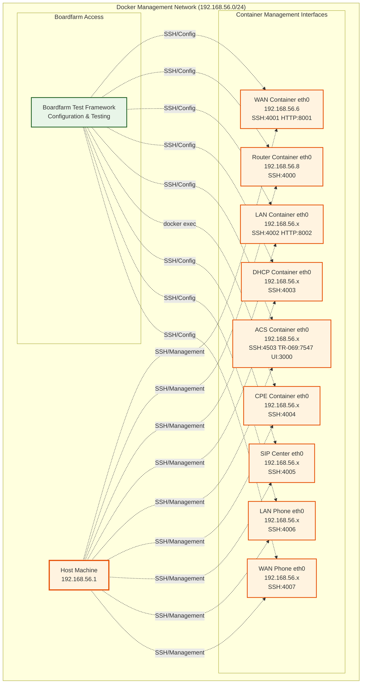
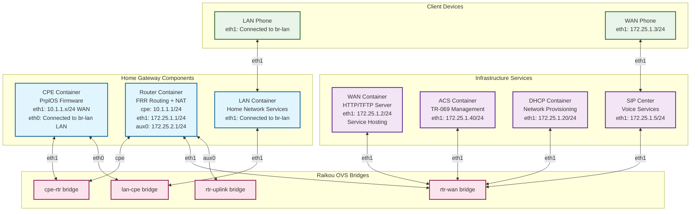

# Network Topology Analysis: Raikou + Boardfarm Testbed

## Executive Summary

This document captures the comprehensive analysis of the Raikou + Boardfarm testbed network topology, focusing on how the containerized home gateway components interact to enable firmware upgrades and realistic network simulation.

## Key Findings

### 1. **Home Gateway Architecture**
The complete home gateway functionality is represented by **three core containers**:
- **CPE Container**: The actual home gateway device (PrplOS firmware)
- **Router Container**: Network gateway with routing and NAT functionality  
- **LAN Container**: Local network services and home network simulation

### 2. **Network Interface Configuration Issue Resolved**
**Critical Discovery**: The router's NAT configuration was incorrectly set to `ENABLE_NAT_ON=eth0`, but the actual CPE interface was named `cpe`. 

**Initial Solution**: Changed to `ENABLE_NAT_ON=cpe` to enable NAT on the interface connecting to the CPE.

**Corrected Solution**: Should be `ENABLE_NAT_ON=eth1` to enable NAT on the WAN interface, which is the correct direction for masquerading traffic going out to the internet/WAN services.

### 3. **Dual Network Architecture**
The testbed operates on **two distinct network layers**:
- **Docker Management Network** (`192.168.56.0/24`): **ALL containers** have SSH access via port forwarding for Boardfarm configuration and management
- **Simulated Network** (`172.25.1.0/24`, `10.1.1.0/24`): The actual testbed topology created by Raikou

### 4. **Network Service Access**
The CPE accesses services on the **simulated network** (`172.25.1.2`), not the Docker management network (`192.168.56.6`).

## Network Topology Diagrams

### Docker Management Network



### Simulated Network Topology



## Detailed Network Analysis

### Network Segments

#### 1. **CPE-Router Segment** (`cpe-rtr` bridge)
- **CPE eth1**: `10.1.1.x/24` (DHCP assigned)
- **Router cpe**: `10.1.1.1/24` (Gateway)
- **Purpose**: WAN connectivity for CPE

#### 2. **LAN Segment** (`lan-cpe` bridge)
- **CPE eth0**: Connected to `br-lan` bridge
- **LAN Container**: Provides home network services
- **LAN Phone**: Connected to home network
- **Purpose**: Local network simulation

#### 3. **WAN Segment** (`rtr-wan` bridge)
- **Router eth1**: `172.25.1.1/24` (Gateway)
- **WAN Container**: `172.25.1.2/24` (Firmware server)
- **ACS**: `172.25.1.40/24` (TR-069 management)
- **DHCP**: `172.25.1.20/24` (Provisioning)
- **SIP Center**: `172.25.1.5/24` (Voice services)
- **Purpose**: Internet/cloud simulation

#### 4. **Uplink Segment** (`rtr-uplink` bridge)
- **Router aux0**: `172.25.2.1/24`
- **Purpose**: External connectivity simulation

### Network Communication Flow

1. **CPE** (`10.1.1.x`) sends network request to `172.25.1.2`
2. **Router** receives on `cpe` interface, routes to `eth1`
3. **Router** applies NAT (source: `10.1.1.x` → `172.25.1.1`)
4. **WAN Container** receives request, processes service
5. **Router** routes response back to CPE
6. **CPE** receives service response

### Critical Configuration Details

#### Router NAT Configuration
```yaml
environment:
    - ENABLE_NAT_ON=eth1  # ✅ Correct: NAT on WAN interface
    # NOT eth0 (Docker management) or cpe (LAN interface)
```

#### Interface Naming Convention
- **`cpe`**: Interface connecting to CPE (LAN side)
- **`eth1`**: Interface connecting to WAN services (internet-facing)
- **`aux0`**: Auxiliary uplink interface
- **`eth0`**: Docker management interface (not part of simulation)

#### NAT Interface Rationale
**Why `ENABLE_NAT_ON=eth1` is correct:**
- **Traffic Direction**: NAT masquerades traffic going OUT to the WAN/internet
- **Real-world Behavior**: Matches actual home gateway NAT configuration on WAN interface
- **Network Semantics**: `eth1` is the internet-facing side of the router
- **Traffic Flow**: CPE (`10.1.1.x`) → Router `cpe` → Router `eth1` → WAN (`172.25.1.2`)
- **NAT Purpose**: Masquerade private IPs (`10.1.1.x`) as router's WAN IP (`172.25.1.1`) when accessing internet services

#### Network Isolation
- **Docker Management** (`192.168.56.0/24`): **ALL containers** accessible via SSH for Boardfarm configuration, testing, and management
- **Simulated Network**: Complete testbed topology for realistic network behavior
- **No cross-communication** between management and simulated networks

## Troubleshooting Guide

### Common Issues

1. **CPE Cannot Reach WAN**
   - Check: CPE has IP on eth1 (`10.1.1.x/24`)
   - Check: Router NAT enabled on `eth1` interface
   - Check: Router has routes between `10.1.1.0/24` and `172.25.1.0/24`

2. **Wrong IP Address for Testing**
   - Use `172.25.1.2` for WAN services (simulated network)
   - NOT `192.168.56.6` (Docker management)

3. **NAT Not Working**
   - Verify `ENABLE_NAT_ON=eth1` (not `eth0` or `cpe`)
   - Check iptables rules: `iptables -t nat -L`

### Verification Commands

```bash
# Check CPE connectivity
docker exec -it cpe ash -c "ping -c 3 10.1.1.1"    # Router gateway
docker exec -it cpe ash -c "ping -c 3 172.25.1.2"  # WAN container

# Check router NAT
docker exec -it router bash -c "iptables -t nat -L"

# Check network topology
docker exec -it router bash -c "ip route show"
```

## Integration with Boardfarm

### Device Mapping
- **`bf_cpe`**: Maps to CPE container (via `docker exec`)
- **`bf_wan`**: Maps to WAN container (via SSH port 4001)
- **`bf_lan`**: Maps to LAN container (via SSH port 4002)
- **`bf_acs`**: Maps to ACS container (via SSH port 4503)
- **`bf_dhcp`**: Maps to DHCP container (via SSH port 4003)
- **`bf_phone`**: Maps to phone containers (via SSH ports 4006/4007)

### Boardfarm Connection Methods
- **CPE**: Uses `docker exec -it cpe ash` (direct container access)
- **All Other Devices**: Use SSH connections via Docker management network:
  - `localhost:4001` → WAN container
  - `localhost:4002` → LAN container  
  - `localhost:4003` → DHCP container
  - `localhost:4503` → ACS container
  - `localhost:4004` → CPE container
  - `localhost:4005` → SIP Center
  - `localhost:4006` → LAN Phone
  - `localhost:4007` → WAN Phone

### Boot Process
1. **Raikou**: Creates network topology and starts containers
2. **Boardfarm**: Connects to containers via Docker management network and provisions devices
3. **CPE**: Obtains IP via DHCP and registers with ACS
4. **Testing**: Network validation and service access

## Conclusion

The testbed successfully simulates a complete home gateway environment with:
- ✅ Realistic network topology using OVS bridges
- ✅ Proper NAT configuration for internet access simulation
- ✅ Complete network service access via HTTP/TFTP
- ✅ TR-069 management and provisioning
- ✅ Voice services and client device simulation

The key insight is understanding the **dual network architecture** where Docker management networks are separate from the simulated testbed topology, ensuring realistic network behavior for testing home gateway functionality.
