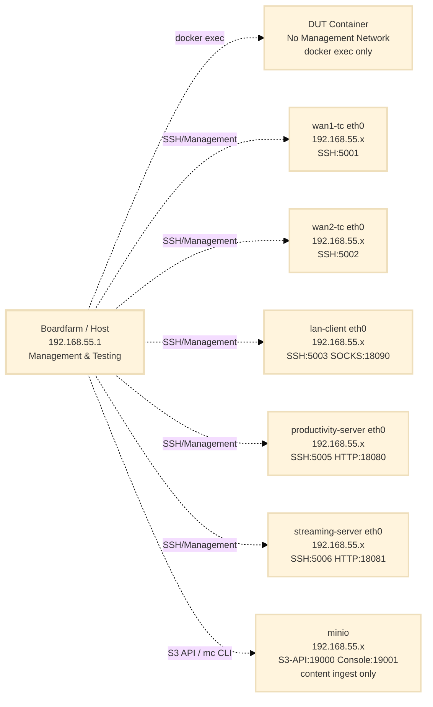
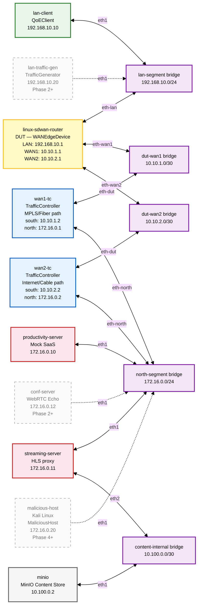

# SD-WAN Testbed Configuration

**Date:** February 24, 2026
**Status:** Design Document — Dual WAN (initial); Triple WAN (expansion noted)
**Related:** `WAN_Edge_Appliance_testing.md`, `TrafficGenerator_Implementation_Plan.md`, `Traffic_Management_Components_Architecture.md`

---

## Configuration File Reference

The SD-WAN testbed uses **dedicated configuration files** to keep it isolated from other testbeds (e.g. OpenWrt, prplOS). All references in this document and related implementation plans use these paths.

| Purpose | File | Location |
| :--- | :--- | :--- |
| **Boardfarm inventory** | `bf_config_sdwan.json` | `bf_config/bf_config_sdwan.json` |
| **Boardfarm environment** | `bf_env_sdwan.json` | `bf_config/bf_env_sdwan.json` |
| **Docker Compose** | `docker-compose-sdwan.yaml` | `raikou/docker-compose-sdwan.yaml` |
| **Raikou OVS topology** | `config_sdwan.json` | `raikou/config_sdwan.json` |

**Docker project name:** `boardfarm-bdd-sdwan` (set via `name:` in `docker-compose-sdwan.yaml` or `-p boardfarm-bdd-sdwan`).

**CLI usage:**
```bash
# Start the SD-WAN testbed
docker compose -p boardfarm-bdd-sdwan -f raikou/docker-compose-sdwan.yaml up -d

# Run Boardfarm tests
pytest --inventory-config bf_config/bf_config_sdwan.json --env-config bf_config/bf_env_sdwan.json ...
```

---

## Overview

The SD-WAN testbed is a fully Dockerised, Raikou-orchestrated environment that simulates a WAN Edge Appliance deployment with two independent WAN paths and a set of North-side application services. It operates on two distinct network layers:

- **Docker Management Network** (`192.168.55.0/24`): Provides SSH access to all containers for Boardfarm orchestration (the DUT is the exception — see below).
- **Simulated Network** (four OVS bridges): The functional testbed topology created by Raikou using Open vSwitch. This is the network through which test traffic actually flows.

The Raikou orchestrator container reads `config_sdwan.json` that declares the OVS bridge topology and the interface assignments for each container. Docker Compose (`docker-compose-sdwan.yaml`) starts the containers; Raikou then wires them together via OVS.

---

## 1. Network Architecture

### 1.1 Component Overview

| Component | Boardfarm Role | Container Name | Description |
| :--- | :--- | :--- | :--- |
| **Linux SD-WAN Router** | DUT (`WANEdgeDevice`) | `linux-sdwan-router` | Device Under Test. FRR, Policy-Based Routing (pbr-map), dual WAN. |
| **WAN1 Traffic Controller** | Impairment (`TrafficController`) | `wan1-tc` | Linux `tc netem` impairment emulator on the MPLS/Fiber path. |
| **WAN2 Traffic Controller** | Impairment (`TrafficController`) | `wan2-tc` | Linux `tc netem` impairment emulator on the Internet/Cable path. |
| **LAN Client** | Client (`QoEClient`) | `lan-client` | Playwright-based QoE measurement container (productivity, streaming, conferencing). |
| **Productivity Server** | Server (North-side) | `productivity-server` | Nginx Mock SaaS (index.html, large_asset.js, /api/latency). Separate from `streaming-server` to enable independent L7 path steering. |
| **Streaming Server** | Server (North-side) | `streaming-server` | Nginx HLS streaming edge (proxies to MinIO via `content-internal` bridge). Separate from `productivity-server` to enable independent L7 path steering. |
| **MinIO Content Store** | Infrastructure | `minio` | S3-compatible object store. Holds HLS manifests and `.ts` segments. Connected to the `content-internal` Raikou OVS bridge — only `streaming-server` reaches it for proxy traffic. The management host accesses the MinIO S3 API via a Docker management-network port for content ingest. |
| **Log Collector** | Infrastructure | `log-collector` | Fluent Bit container on the management network. Reads all container stdout/stderr (including DUT) via the Docker socket and writes a unified, timestamped log to the host. No OVS interfaces — log traffic never enters the simulated network. |
| **Raikou Orchestrator** | Infrastructure | `orchestrator` | OVS bridge manager. Creates and wires simulated network. No test traffic. |
| **LAN Traffic Generator** _(Phase 2+)_ | Load (`TrafficGenerator`) | `lan-traffic-gen` | iPerf3 client container for QoS contention background load. Added when QoS pillar validation begins. |
| **Conferencing Server** _(Phase 2+)_ | Server (North-side) | `conf-server` | `pion`-based WebRTC Echo server for conferencing QoE measurement. Added when conferencing QoE tests begin. |
| **Malicious Host** _(Phase 4+)_ | Threat (`MaliciousHost`) | `malicious-host` | Kali Linux container. Active inbound attacker + passive threat services (C2 listener, EICAR). Added when Security pillar validation begins. |

### 1.2 Network Segments

| OVS Bridge | Subnet | Purpose |
| :--- | :--- | :--- |
| `lan-segment` | `192.168.10.0/24` | LAN side — clients and DUT LAN port |
| `dut-wan1` | `10.10.1.0/30` | Point-to-point link: DUT WAN1 ↔ WAN1-TC south port |
| `dut-wan2` | `10.10.2.0/30` | Point-to-point link: DUT WAN2 ↔ WAN2-TC south port |
| `north-segment` | `172.16.0.0/24` | North side — application services and threat infrastructure |
| `content-internal` | `10.100.0.0/30` | Internal only — `streaming-server` (HLS proxy) ↔ `minio` content origin |

---

## 2. Network Topology Diagrams

### 2.1 Docker Management Network

Boardfarm uses the Docker management network to SSH into containers for configuration, test execution, and log inspection. All containers except the DUT are connected to the management network via their `eth0` (Docker default).

> **Device access:** The `linux-sdwan-router` device uses `network_mode: none`. All its interfaces come from Raikou OVS. Boardfarm accesses it via `docker exec` (similar to the CPE in the home-gateway testbed). This prevents management-network traffic from influencing device forwarding decisions.



### 2.2 Simulated Network Topology (Dual WAN)

This is the functional testbed network created by Raikou using OVS bridges. Test traffic flows here.



---

## 3. Per-Segment Detail

### 3.1 LAN Segment (`lan-segment` bridge)

| Container | Interface | IP Address | Role |
| :--- | :--- | :--- | :--- |
| `linux-sdwan-router` | `eth-lan` | `192.168.10.1/24` | LAN gateway |
| `lan-client` | `eth1` | `192.168.10.10/24` | QoEClient — Playwright measurements |
| `lan-traffic-gen` _(Phase 2+)_ | `eth1` | `192.168.10.20/24` | TrafficGenerator — iPerf3 client |

### 3.2 DUT–WAN1 Segment (`dut-wan1` bridge)

Point-to-point link between the DUT WAN1 interface and the WAN1 Traffic Controller's south-facing port. Simulates the MPLS/Fiber uplink.

| Container | Interface | IP Address | Role |
| :--- | :--- | :--- | :--- |
| `linux-sdwan-router` | `eth-wan1` | `10.10.1.1/30` | DUT WAN1 interface (MPLS/Fiber) |
| `wan1-tc` | `eth-dut` | `10.10.1.2/30` | TC south port — WAN1 gateway seen by DUT |

### 3.3 DUT–WAN2 Segment (`dut-wan2` bridge)

Point-to-point link between the DUT WAN2 interface and the WAN2 Traffic Controller's south-facing port. Simulates the Internet/Cable uplink.

| Container | Interface | IP Address | Role |
| :--- | :--- | :--- | :--- |
| `linux-sdwan-router` | `eth-wan2` | `10.10.2.1/30` | DUT WAN2 interface (Internet/Cable) |
| `wan2-tc` | `eth-dut` | `10.10.2.2/30` | TC south port — WAN2 gateway seen by DUT |

### 3.4 North Segment (`north-segment` bridge)

The simulated Internet/cloud services network. Both Traffic Controllers connect here on their north-facing ports. All application services and the threat infrastructure reside here.

| Container | Interface | IP Address | Role |
| :--- | :--- | :--- | :--- |
| `wan1-tc` | `eth-dut`, `eth-north` | `10.10.1.2/30`, `172.16.0.1/24` | Per-direction impairment: eth-north (forward), eth-dut (return) |
| `wan2-tc` | `eth-dut`, `eth-north` | `10.10.2.2/30`, `172.16.0.2/24` | Per-direction impairment: eth-north (forward), eth-dut (return) |
| `productivity-server` | `eth1` | `172.16.0.10/24` | Nginx Mock SaaS (productivity) |
| `streaming-server` | `eth1`, `eth2` | `172.16.0.11/24`, `10.100.0.1/30` | Nginx HLS streaming edge (`eth1` north-segment, `eth2` content-internal to MinIO) |
| `conf-server` _(Phase 2+)_ | `eth1` | `172.16.0.12/24` | `pion`-based WebRTC Echo server |
| `malicious-host` _(Phase 4+)_ | `eth1` | `172.16.0.20/24` | Kali Linux — active attacks + passive C2/EICAR services |

### 3.5 Content-Internal Segment (`content-internal` bridge)

An isolated point-to-point link between `streaming-server` and `minio`. This bridge is invisible to all test traffic — LAN clients cannot reach MinIO directly. The streaming-server proxies all HLS requests to MinIO over this bridge using the Raikou-assigned IP address (`10.100.0.2:9000`), deliberately avoiding Docker's default DNS resolution (`minio:9000`) to enforce testbed isolation.

| Container | Interface | IP Address | Role |
| :--- | :--- | :--- | :--- |
| `streaming-server` | `eth2` | `10.100.0.1/30` | HLS proxy → MinIO egress |
| `minio` | `eth1` | `10.100.0.2/30` | MinIO S3 API endpoint for streaming-server proxy |

> **Management access to MinIO:** The `minio` container also has a Docker management-network interface (`eth0`), which exposes ports 19000 (S3 API) and 19001 (web console) to the host. This is used exclusively for content ingest (`mc cp`) and operational debugging. It does not carry any testbed traffic.

---

## 4. Raikou Configuration

### 4.1 `config_sdwan.json` — OVS Bridge and Interface Assignments

**Location:** `raikou/config_sdwan.json`

The Raikou orchestrator reads this file at startup and:
1. Creates the four OVS bridges.
2. For each container entry, creates a veth pair, attaches one end to the named OVS bridge, and injects the other end into the container with the specified name and IP assignment.

```json
{
    "bridge": {
        "lan-segment":     {},
        "dut-wan1":        {},
        "dut-wan2":        {},
        "north-segment":   {},
        "content-internal": {}
    },
    "container": {
        "linux-sdwan-router": [
            {
                "bridge":    "lan-segment",
                "iface":     "eth-lan",
                "ipaddress": "192.168.10.1/24"
            },
            {
                "bridge":    "dut-wan1",
                "iface":     "eth-wan1",
                "ipaddress": "10.10.1.1/30"
            },
            {
                "bridge":    "dut-wan2",
                "iface":     "eth-wan2",
                "ipaddress": "10.10.2.1/30"
            }
        ],
        "wan1-tc": [
            {
                "bridge":    "dut-wan1",
                "iface":     "eth-dut",
                "ipaddress": "10.10.1.2/30"
            },
            {
                "bridge":    "north-segment",
                "iface":     "eth-north",
                "ipaddress": "172.16.0.1/24"
            }
        ],
        "wan2-tc": [
            {
                "bridge":    "dut-wan2",
                "iface":     "eth-dut",
                "ipaddress": "10.10.2.2/30"
            },
            {
                "bridge":    "north-segment",
                "iface":     "eth-north",
                "ipaddress": "172.16.0.2/24"
            }
        ],
        "lan-client": [
            {
                "bridge":    "lan-segment",
                "iface":     "eth1",
                "ipaddress": "192.168.10.10/24",
                "gateway":   "192.168.10.1"
            }
        ],
        "productivity-server": [
            {
                "bridge":    "north-segment",
                "iface":     "eth1",
                "ipaddress": "172.16.0.10/24",
                "gateway":   "172.16.0.1"
            }
        ],
        "streaming-server": [
            {
                "bridge":    "north-segment",
                "iface":     "eth1",
                "ipaddress": "172.16.0.11/24",
                "gateway":   "172.16.0.1"
            },
            {
                "bridge":    "content-internal",
                "iface":     "eth2",
                "ipaddress": "10.100.0.1/30"
            }
        ],
        "minio": [
            {
                "bridge":    "content-internal",
                "iface":     "eth1",
                "ipaddress": "10.100.0.2/30"
            }
        ]
        // Phase 2+: add "lan-traffic-gen" (192.168.10.20/24, lan-segment)
        //           and "conf-server" (172.16.0.12/24, north-segment)
        // Phase 4+: add "malicious-host" (172.16.0.20/24, north-segment)
    },
    "vlan_translations": []
}
```

### 4.2 `docker-compose-sdwan.yaml`

**Location:** `raikou/docker-compose-sdwan.yaml`

#### Resource Allocation

The compose file enforces CPU and memory limits on all services using `deploy.resources`. Two values are set per service:

- **Limit:** Hard ceiling — the container is throttled at this value.
- **Reservation:** Soft guarantee — Docker's scheduler ensures at least this CPU share is available under host contention.

The latency-sensitive containers (`linux-sdwan-router`, `wan1-tc`, `wan2-tc`) have reservations to protect BFD echo timers (100 ms interval) from being starved by CPU-hungry containers (Chromium/Playwright, iPerf3 saturation flows). Without reservations, a complex Playwright navigation can briefly consume 3+ cores and cause `tc netem` timer slip on the host kernel, corrupting the impairment profile under test.

**Minimum recommended host:** 8 physical cores (16 threads), 32 GB RAM.

| Container | CPU Limit | CPU Reservation | Memory Limit | Notes |
| :--- | :---: | :---: | :---: | :--- |
| `linux-sdwan-router` | 2.0 | 1.5 | 512M | BFD timer sensitivity — guaranteed cores |
| `wan1-tc` / `wan2-tc` | 0.5 | 0.25 | 128M | `tc netem` is kernel-driven; container is near-idle |
| `lan-client` | 3.0 | 1.5 | 3G | Chromium + WebRTC codec work; largest memory consumer |
| `productivity-server` | 1.0 | 0.5 | 256M | Nginx serving static assets |
| `streaming-server` | 2.0 | 1.0 | 512M | Nginx + MinIO proxy for HLS segments |
| `minio` | 1.0 | — | 256M | Content origin; management-plane ingest only |
| `log-collector` | 0.25 | 0.1 | 128M | Fluent Bit is extremely lightweight at this log volume |
| `raikou-net` | 0.5 | 0.25 | 128M | Startup only; idle during tests |
| `lan-traffic-gen` _(Phase 2+)_ | 1.0 | 0.5 | 256M | iPerf3 UDP at 85 Mbps is PPS-heavy in userspace |
| `conf-server` _(Phase 2+)_ | 0.5 | 0.25 | 256M | pion WebRTC echo — trivially light |
| `malicious-host` _(Phase 4+)_ | 1.5 | 0.5 | 256M | Brief spikes during nmap scans / hping3 floods |

> **CI environments:** On a 4–8 vCPU CI runner, reduce `lan-client` to `cpus: '1.0'` and `streaming-server` to `cpus: '1.0'`. Phase 2+ containers (`lan-traffic-gen`, `conf-server`) and Phase 4+ containers (`malicious-host`) are not in scope until their respective pillars are validated.

```yaml
# SD-WAN Testbed — Phase 1
# Dual-WAN router + Raikou OVS orchestrator.
#
# NETWORKING: Containers are NOT connected via Docker networks for test traffic.
# - Test traffic flows through Raikou OVS bridges (lan-segment, dut-wan1, dut-wan2,
#   north-segment). Raikou injects interfaces per config_sdwan.json.
# - The default network (192.168.55.0/24) is management-only: SSH access and host
#   port mapping. DUT uses network_mode: none (all interfaces from Raikou).
#
# See: docs/SDWAN_Testbed_Configuration.md
# Usage: docker compose -p boardfarm-bdd-sdwan -f docker-compose-sdwan.yaml up -d

name: boardfarm-bdd-sdwan
---
services:

    # ── Device Under Test ──────────────────────────────────────────────────────
    # All interfaces from Raikou OVS (eth-lan, eth-wan1, eth-wan2). No Docker network.
    # restart: always ensures power_cycle() (docker restart) is fully effective.
    linux-sdwan-router:
        container_name: linux-sdwan-router
        restart: always
        build:
            context: ./components/sdwan-router
            tags:
                - sdwan-router:sdwan_frr_0.01
        network_mode: none
        privileged: true
        hostname: sdwan-router
        environment:
            - LAN_IFACE=eth-lan
            - WAN1_IFACE=eth-wan1
            - WAN2_IFACE=eth-wan2
        deploy:
            resources:
                limits:
                    cpus: '2.0'
                    memory: 512M
                reservations:
                    cpus: '1.5'
                    memory: 256M

    # ── Traffic Controllers (WAN Impairment) ───────────────────────────────────
    # Test traffic via Raikou OVS: eth-dut (dut-wan1), eth-north (north-segment).
    wan1-tc:
        container_name: wan1-tc
        build:
            context: ./components/traffic-controller
            tags:
                - traffic-controller:traffic_controller_0.01
        ports:
            - "5001:22"
        environment:
            - TC_DUT_IFACE=eth-dut
            - TC_NORTH_IFACE=eth-north
            - LEGACY=no
        privileged: true
        hostname: wan1-tc
        deploy:
            resources:
                limits:
                    cpus: '0.5'
                    memory: 128M
                reservations:
                    cpus: '0.25'
                    memory: 64M

    # Test traffic via Raikou OVS: eth-dut (dut-wan2), eth-north (north-segment).
    wan2-tc:
        container_name: wan2-tc
        build:
            context: ./components/traffic-controller
            tags:
                - traffic-controller:traffic_controller_0.01
        ports:
            - "5002:22"
        environment:
            - TC_DUT_IFACE=eth-dut
            - TC_NORTH_IFACE=eth-north
            - LEGACY=no
        privileged: true
        hostname: wan2-tc
        deploy:
            resources:
                limits:
                    cpus: '0.5'
                    memory: 128M
                reservations:
                    cpus: '0.25'
                    memory: 64M

    # ── QoE Client (Playwright) ─────────────────────────────────────────────────
    # Test traffic via Raikou OVS: eth1 (lan-segment). Docker eth0 for SSH/port mapping only.
    lan-client:
        container_name: lan-client
        build:
            context: ./components/lan-client
            tags:
                - lan-client:qoe_client_0.01
        ports:
            - "5003:22"
            - "18090:8080"   # Dante SOCKS v5 proxy — developer access to LAN-side services
        environment:
            - LEGACY=no
        privileged: true
        hostname: lan-client
        deploy:
            resources:
                limits:
                    cpus: '3.0'
                    memory: 3G
                reservations:
                    cpus: '1.5'
                    memory: 1G

    # ── North-Side Application Services ────────────────────────────────────────
    # Separate containers enable L7 path steering: productivity vs streaming via different WAN paths.
    productivity-server:
        container_name: productivity-server
        build:
            context: ./components/productivity-server
            tags:
                - productivity-server:productivity_server_0.01
        ports:
            - "5005:22"
            - "18080:8080"       # Nginx productivity (HTTP)
        environment:
            - LEGACY=no
        privileged: true
        hostname: productivity-server
        deploy:
            resources:
                limits:
                    cpus: '1.0'
                    memory: 256M
                reservations:
                    cpus: '0.5'
                    memory: 128M

    # Test traffic via Raikou OVS: eth1 (north-segment), eth2 (content-internal → MinIO).
    streaming-server:
        container_name: streaming-server
        build:
            context: ./components/streaming-server
            tags:
                - streaming-server:streaming_server_0.01
        ports:
            - "5006:22"
            - "18081:8081"       # Nginx streaming (HLS proxy)
        environment:
            - LEGACY=no
        privileged: true
        hostname: streaming-server
        deploy:
            resources:
                limits:
                    cpus: '2.0'
                    memory: 512M
                reservations:
                    cpus: '1.0'
                    memory: 256M

    # ── Content Origin (MinIO) ───────────────────────────────────────────────────
    # S3-compatible store for HLS content. Raikou OVS: eth1 on content-internal only.
    # Management: host ports 19000 (S3 API), 19001 (console) via Docker.
    minio:
        container_name: minio
        build:
            context: ./components/minio
            tags:
                - minio:content_origin_0.01
        ports:
            - "19000:9000"       # S3 API (management ingest)
            - "19001:9001"       # Web console
        environment:
            - MINIO_ROOT_USER=testbed
            - MINIO_ROOT_PASSWORD=testbed-secret
        volumes:
            - minio-data:/data
        privileged: true
        hostname: minio
        deploy:
            resources:
                limits:
                    cpus: '1.0'
                    memory: 256M

    # ── Centralized Log Collector ──────────────────────────────────────────────
    # Management network only. NOT in config_sdwan.json — no Raikou OVS interfaces.
    # Tails Docker log files; unified output at ./logs/sdwan-testbed.log
    log-collector:
        container_name: log-collector
        image: fluent/fluent-bit:3.2
        volumes:
            - /var/run/docker.sock:/var/run/docker.sock:ro
            - /var/lib/docker/containers:/var/lib/docker/containers:ro
            - ./components/log-collector/fluent-bit.conf:/fluent-bit/etc/fluent-bit.conf:ro
            - ./components/log-collector/parsers.conf:/fluent-bit/etc/parsers.conf:ro
            - ./components/log-collector/format.lua:/fluent-bit/etc/format.lua:ro
            - ./logs:/logs
            - fluent-bit-db:/fluent-bit/db
        hostname: log-collector
        restart: unless-stopped
        deploy:
            resources:
                limits:
                    cpus: '0.25'
                    memory: 128M
                reservations:
                    cpus: '0.1'
                    memory: 64M

    # ── Raikou OVS Orchestrator ────────────────────────────────────────────────
    raikou-net:
        container_name: orchestrator
        image: ghcr.io/ketantewari/raikou/orchestrator:v1
        volumes:
            - /lib/modules:/lib/modules
            - /var/run/docker.sock:/var/run/docker.sock
            - ./config_sdwan.json:/root/config.json
        privileged: true
        environment:
            - USE_LINUX_BRIDGE=false
        pid: host
        network_mode: host
        hostname: orchestrator
        depends_on:
            - linux-sdwan-router
            - lan-client
            - wan1-tc
            - wan2-tc
            - productivity-server
            - streaming-server
            - minio
        deploy:
            resources:
                limits:
                    cpus: '0.5'
                    memory: 128M
                reservations:
                    cpus: '0.25'
                    memory: 64M

# Management network only — SSH and host port mapping. Test traffic uses Raikou OVS.
networks:
    default:
        ipam:
            config:
                - subnet: 192.168.55.0/24
                  gateway: 192.168.55.1

volumes:
    minio-data: {}
    fluent-bit-db:
        driver: local
```

> **Phase 2+ services** (`lan-traffic-gen`, `conf-server`) and **Phase 4+ services** (`malicious-host`) are added to the compose file and `config_sdwan.json` when their respective testing pillars begin implementation.
---

## 5. Container Specifications

### 5.1 Port and Access Summary

| Container | SSH Port | Other Ports | Connection Method | Notes |
| :--- | :--- | :--- | :--- | :--- |
| `linux-sdwan-router` | — | — | `docker exec -it linux-sdwan-router bash` | `network_mode: none`; no management network |
| `wan1-tc` | 5001 | — | `ssh -p 5001 root@localhost` | |
| `wan2-tc` | 5002 | — | `ssh -p 5002 root@localhost` | |
| `lan-client` | 5003 | 18090 (SOCKS v5 proxy) | `ssh -p 5003 root@localhost` | SOCKS proxy for developer browser access to LAN-side services — see §5.2 |
| `productivity-server` | 5005 | 18080 (HTTP prod) | `ssh -p 5005 root@localhost` | Nginx productivity SaaS |
| `streaming-server` | 5006 | 18081 (HLS edge) | `ssh -p 5006 root@localhost` | HLS proxy to MinIO via content-internal |
| `minio` | — | 19000 (S3 API), 19001 (Console) | `mc alias set testbed http://localhost:19000 testbed testbed-secret` | Management network (ingest/debug only); eth1 on `content-internal` bridge carries proxy traffic |
| `lan-traffic-gen` _(Phase 2+)_ | 5004 | — | `ssh -p 5004 root@localhost` | |
| `conf-server` _(Phase 2+)_ | 5007 | 18443 (WSS) | `ssh -p 5007 root@localhost` | |
| `malicious-host` _(Phase 4+)_ | 5008 | — | `ssh -p 5008 root@localhost` | |
| `log-collector` | — | — | `tail -f logs/sdwan-testbed.log` | Management network only; no OVS interfaces — see §5.4 |

**Default credentials:** `root` / `boardfarm`

### 5.2 Developer Debugging Access

The `lan-client` container provides two complementary tools for debugging QoE test failures. Neither tool compromises testbed isolation — all traffic still traverses the DUT and WAN impairment containers via the OVS bridges.

#### SOCKS v5 Proxy (Dante) — Browse through the testbed LAN

Dante is running inside `lan-client` and listening on port 8080, exposed to the host as **port 18090**. Configure your browser to use it as a SOCKS v5 proxy:

```
Firefox → Settings → Network Settings → Manual Proxy Configuration
  SOCKS Host: 127.0.0.1
  Port:       18090
  SOCKS v5
  ✓ Proxy DNS when using SOCKS v5
```

With this configuration your browser routes traffic out via the `lan-client`'s `eth1` interface on the `lan-segment` bridge — through the DUT — through the active WAN impairment — to the north-side services. This is **the exact same path Playwright uses**.

| Service reachable via proxy | URL |
| :--- | :--- |
| Productivity server | `http://172.16.0.10:8080/` |
| HLS streaming edge | `http://172.16.0.11:8081/hls/default/index.m3u8` |
| WebRTC conferencing _(Phase 2+)_ | `wss://172.16.0.12:8443/session1` |

This is the primary tool for verifying that north-side services are reachable and rendering correctly, and for experiencing impairment profiles firsthand when calibrating QoE SLOs.

#### Playwright Trace Viewer — Inspect automated browser sessions

For failures specific to Playwright's automated session (element selection, navigation timing, WebRTC `getStats()` parsing), use Playwright's built-in trace recording. This requires no container changes.

```bash
# View a trace captured during a test run
playwright show-trace trace.zip
```

See `QoE_Client_Implementation_Plan.md §3.4` for the full tracing setup and CI artifact integration.

### 5.3 Component Image Sources

| Container | Image / Build Context | Package Requirements |
| :--- | :--- | :--- |
| `linux-sdwan-router` | `components/sdwan-router` | `frr`, `iproute2`, `iptables`, `strongswan` |
| `wan1-tc`, `wan2-tc` | `components/traffic-controller` | `iproute2` (tc + netem), `openssh-server` |
| `lan-client` | `components/lan-client` | `playwright`, `chromium`, `openssh-server` |
| `productivity-server` | `components/productivity-server` | `nginx`, `openssh-server` |
| `streaming-server` | `components/streaming-server` | `nginx`, `openssh-server` |
| `minio` | `components/minio` | Custom build on MinIO base |
| `log-collector` | `fluent/fluent-bit:3.2` (official image, no custom build) | — |
| `lan-traffic-gen` _(Phase 2+)_ | `components/traffic-generator` | `iperf3`, `openssh-server`, `iproute2` |
| `conf-server` _(Phase 2+)_ | `components/conf-server` | `pion` WebRTC Echo binary, `openssh-server` |
| `malicious-host` _(Phase 4+)_ | `components/malicious-host` | `kali-linux-core`, `nmap`, `hping3`, `netcat`, `openssh-server` |

---

### 5.4 Centralized Log Access

The `log-collector` container (Fluent Bit) provides a unified, chronologically ordered stream of all container logs on the management network. It reads container stdout/stderr via the Docker socket — including the DUT (`network_mode: none`) whose FRR daemons write to stdout — and writes a single rotating log file to the host. Log traffic never touches the OVS bridges.

#### Fluent Bit Configuration

Two files are mounted from `./fluent-bit/` in the project directory:

**`fluent-bit/fluent-bit.conf`**

```ini
[SERVICE]
    Flush             5
    Daemon            Off
    Log_Level         info
    Parsers_File      /fluent-bit/etc/parsers.conf

# Tail Docker JSON log files directly — low-latency, works for all containers
# including network_mode: none (DUT). Docker captures stdout/stderr for all
# containers regardless of network configuration.
[INPUT]
    Name              tail
    Tag               docker.*
    Path              /var/lib/docker/containers/*/*.log
    Parser            docker_json
    Docker_Mode       On
    Docker_Mode_Flush 4
    DB                /fluent-bit/db/pos.db
    Refresh_Interval  10
    Rotate_Wait       30

# Enrich each record with the container name (extracted from the file path)
# and a testbed label for filtering in optional Loki/Grafana setup.
[FILTER]
    Name              record_modifier
    Match             docker.*
    Record            testbed sdwan-testbed

# Primary output — unified rotating log file on the host.
# Each line: [ISO-8601 timestamp] [container_name] <message>
# Retained for 7 days; rotatable without restarting Fluent Bit.
[OUTPUT]
    Name              file
    Match             *
    Path              /logs
    File              sdwan-testbed.log
    Format            plain
```

**`fluent-bit/parsers.conf`**

```ini
[PARSER]
    Name        docker_json
    Format      json
    Time_Key    time
    Time_Format %Y-%m-%dT%H:%M:%S.%L%z
    Time_Keep   On
```

#### DUT Log Configuration (FRR)

Configure FRR to write to stdout so Docker captures it without any network path. In `/etc/frr/frr.conf` (or via `vtysh`):

```
log stdout informational
log facility daemon
```

This produces structured FRR log lines (daemon name, severity, message) that appear in `sdwan-testbed.log` labelled as `linux-sdwan-router`.

#### Accessing Logs

**Live tail — all containers:**
```bash
tail -f logs/sdwan-testbed.log
```

**Filter by container — correlate a single component:**
```bash
grep "linux-sdwan-router" logs/sdwan-testbed.log | tail -50   # DUT (FRR)
grep "wan1-tc" logs/sdwan-testbed.log | tail -50              # WAN1 impairment
grep "lan-client" logs/sdwan-testbed.log | tail -50           # Playwright / Dante
```

**Correlate a time window across all containers** (the primary debugging use case):
```bash
# Show everything between two timestamps — reconstructs the full event sequence
awk '/2026-02-25T10:23:40/,/2026-02-25T10:23:46/' logs/sdwan-testbed.log
```

**Per-container logs still available directly** (unchanged by centralized logging):
```bash
docker logs linux-sdwan-router --timestamps --tail 100
docker logs wan1-tc --since 5m
docker logs lan-client --follow
```

#### Optional Extension — Loki + Grafana

For structured querying and a visual timeline, add the following to `docker-compose-sdwan.yaml`. Fluent Bit's existing pipeline requires one additional output block only; the flat file output continues to run alongside it.

**Additional compose services:**
```yaml
    loki:
        container_name: loki
        image: grafana/loki:3.3.0
        ports:
            - "3100:3100"
        command: -config.file=/etc/loki/local-config.yaml
        hostname: loki

    grafana:
        container_name: grafana
        image: grafana/grafana:11.5.0
        ports:
            - "3001:3000"
        environment:
            - GF_SECURITY_ADMIN_PASSWORD=testbed
        depends_on:
            - loki
        hostname: grafana
```

**Additional Fluent Bit output block** (append to `fluent-bit.conf`):
```ini
[OUTPUT]
    Name            loki
    Match           *
    Host            loki
    Port            3100
    Labels          testbed=sdwan-testbed
    Label_Keys      $container_name
    Line_Format     key_value
```

Access Grafana at `http://localhost:3001` (credentials: `admin` / `testbed`). Add Loki as a data source at `http://loki:3100`. The Explore view supports LogQL queries such as:

```logql
{testbed="sdwan-testbed"} |= "BFD"
{container_name="linux-sdwan-router"} | logfmt | level="error"
```

---

## 6. Boardfarm Integration

### 6.1 Device Mapping (Boardfarm Inventory)

**Location:** `bf_config/bf_config_sdwan.json` (or `--inventory-config` path)

Inventory holds device identity and connection details. Topology keys (`dut_iface`, `north_iface`) describe the TC container's interfaces for reference; the interface to apply impairment on is defined in env config (§6.2).

```json
{
    "devices": [
        {
            "name": "sdwan",
            "type": "linux_sdwan_router",
            "connection_type": "docker_exec",
            "container_name": "linux-sdwan-router",
            "wan_interfaces": {
                "wan1": "eth-wan1",
                "wan2": "eth-wan2"
            },
            "lan_interface": "eth-lan"
        },
        {
            "name": "wan1_impairment",
            "type": "linux_traffic_controller",
            "connection_type": "ssh",
            "ipaddr": "localhost",
            "port": 5001,
            "username": "root",
            "password": "boardfarm",
            "dut_iface": "eth-dut",
            "north_iface": "eth-north"
        },
        {
            "name": "wan2_impairment",
            "type": "linux_traffic_controller",
            "connection_type": "ssh",
            "ipaddr": "localhost",
            "port": 5002,
            "username": "root",
            "password": "boardfarm",
            "dut_iface": "eth-dut",
            "north_iface": "eth-north"
        },
        {
            "name": "lan_client",
            "type": "playwright_qoe_client",
            "connection_type": "ssh",
            "ipaddr": "localhost",
            "port": 5003,
            "username": "root",
            "password": "boardfarm"
        },
        {
            "name": "productivity_server",
            "type": "nginx_productivity_server",
            "connection_type": "ssh",
            "ipaddr": "localhost",
            "port": 5005,
            "username": "root",
            "password": "boardfarm",
            "simulated_ip": "172.16.0.10"
        },
        {
            "name": "streaming_server",
            "type": "nginx_streaming_server",
            "connection_type": "ssh",
            "ipaddr": "localhost",
            "port": 5006,
            "username": "root",
            "password": "boardfarm",
            "simulated_ip": "172.16.0.11",
            "hls_base_url": "http://172.16.0.11:8081/hls",
            "s3_endpoint": "http://10.100.0.2:9000",
            "s3_bucket": "streaming-content",
            "s3_access_key": "testbed",
            "s3_secret_key": "testbed-secret"
        }
        // Phase 2+: add "lan_traffic_gen" (port: 5004, type: iperf_traffic_generator)
        //           and "conf_server"     (port: 5007, simulated_ip: "172.16.0.12")
        // Phase 4+: add "malicious_host"  (port: 5008, simulated_ip: "172.16.0.20")
    ]
}
```

### 6.2 Environment Config (Boardfarm Env)

**Location:** `bf_config/bf_env_sdwan.json` (or `--env-config` path)

The environment config defines per-device defaults and behavior. Each TrafficController **must** have impairment interface(s) in `environment_def`. For the SD-WAN dual-homed TC, use **per-direction interfaces**: `impairment_interface_north` (forward: client→server) and `impairment_interface_dut` (return: server→client). See `Traffic_Management_Components_Architecture.md §4.2, §4.4`.

```json
{
  "environment_def": {
    "wan1_impairment": {
      "impairment_interface_north": "eth-north",
      "impairment_interface_dut": "eth-dut",
      "impairment_profile": {
        "latency_ms": 5,
        "jitter_ms": 1,
        "loss_percent": 0,
        "bandwidth_limit_mbps": 1000
      }
    },
    "wan2_impairment": {
      "impairment_interface_north": "eth-north",
      "impairment_interface_dut": "eth-dut",
      "impairment_profile": {
        "latency_ms": 5,
        "jitter_ms": 1,
        "loss_percent": 0,
        "bandwidth_limit_mbps": 1000
      }
    },
    "impairment_presets": {
      "pristine":      { "latency_ms": 5,   "jitter_ms": 1,  "loss_percent": 0,   "bandwidth_limit_mbps": 1000 },
      "cable_typical": { "latency_ms": 15,  "jitter_ms": 5,  "loss_percent": 0.1, "bandwidth_limit_mbps": 100  },
      "4g_mobile":     { "latency_ms": 80,  "jitter_ms": 30, "loss_percent": 1,   "bandwidth_limit_mbps": 20   },
      "satellite":     { "latency_ms": 600, "jitter_ms": 50, "loss_percent": 2,   "bandwidth_limit_mbps": 10   },
      "congested":     { "latency_ms": 25,  "jitter_ms": 40, "loss_percent": 3,   "bandwidth_limit_mbps": null }
    }
  }
}
```

### 6.3 Startup Sequence

1. **`docker compose -p boardfarm-bdd-sdwan -f raikou/docker-compose-sdwan.yaml up -d`** — starts all containers. Raikou starts last (`depends_on`). The `streaming-server` may start before MinIO is ready — content ingest is handled by the Boardfarm session fixture, not at startup.
2. **Raikou** reads `config_sdwan.json`, creates OVS bridges, and injects veth pairs into each container with the configured IP and interface names.
3. **Device startup** — The `linux-sdwan-router` container has `restart: always` so it restarts after `boardfarm_device_boot` power cycles it. FRR initialises BGP/OSPF adjacencies and policy-based routing. WAN1 and WAN2 interfaces receive their IPs from Raikou.
4. **TC startup** — each Traffic Controller enables IP forwarding between `eth-dut` and `eth-north`. No impairment is applied by default (`pristine` state).
5. **Content ingest (handled automatically by Boardfarm)** — The `sdwan_testbed_setup` session-scoped autouse fixture in `tests/conftest.py` calls `streaming_server.ensure_content_available()` through the typed `StreamingServer` template reference before the first test runs. The method is idempotent: it checks whether the asset is already present in MinIO and returns immediately if so; otherwise it runs FFmpeg content generation and `mc cp` ingest automatically.

    > **Manual fallback (debugging only):** If needed outside of a Boardfarm session, the ingest can be triggered manually. The shell script below mirrors what `ensure_content_available()` does internally via SSH into `streaming-server`:
    ```bash
    # Generate synthetic HLS content
    scripts/generate_streaming_content.sh

    # Ingest into MinIO via the management-network S3 API port (host → MinIO eth0)
    mc alias set testbed http://localhost:19000 testbed testbed-secret
    mc mb --ignore-existing testbed/streaming-content
    mc cp --recursive /tmp/streaming/ testbed/streaming-content/
    ```
    At runtime, `streaming-server` proxies to MinIO at `http://10.100.0.2:9000` over the `content-internal` Raikou bridge — not via Docker hostname resolution.
    See `Application_Services_Implementation_Plan.md §3.2` for the full FFmpeg command and bitrate ladder.
6. **Boardfarm** connects to all containers via SSH (or `docker exec` for DUT), parses `bf_config_sdwan.json` and `bf_env_sdwan.json`, instantiates devices with merged config (including `impairment_interface_north` and `impairment_interface_dut` from env for each TC), and the testbed is ready.

---

## 7. Traffic Flow Reference

### 7.1 QoE Test Flow (LAN → North via DUT → TC → App Server)

```
lan-client (192.168.10.10)
  → [lan-segment bridge]
  → DUT eth-lan → DUT eth-wan1 (active WAN, PBR selects wan1)
  → [dut-wan1 bridge]
  → wan1-tc eth-dut → [netem impairment applied] → wan1-tc eth-north
  → [north-segment bridge]
  → productivity-server (172.16.0.10) :8080
```

### 7.2 Path Failover Flow (WAN1 → WAN2)

```
wan1-tc applies: ImpairmentProfile(latency_ms=600, loss_percent=50)  ← brownout / blackout
DUT BFD/SLA probe on WAN1 detects breach
DUT BFD echo detects WAN1 failure; FRR metric-based routing promotes WAN2 route
Traffic re-routes:
  lan-client → DUT eth-wan2 → [dut-wan2 bridge] → wan2-tc → [north-segment] → productivity-server
```

### 7.3 QoS Contention Flow (Background load + Priority traffic)

```
lan-traffic-gen (192.168.10.20)
  → iPerf3 UDP DSCP=0 (Best Effort, 85 Mbps background)
  → DUT → wan1-tc (100 Mbps WAN1 link creates queue pressure)
  → north-segment → lan-traffic-gen (Phase 2+) iPerf3 server

lan-client (192.168.10.10)
  → WebRTC DSCP=46 (EF — voice priority)
  → DUT QoS policy: EF traffic in high-priority queue → guaranteed forwarding
  → conf-server (172.16.0.12) :8443  ← Phase 2+
```

### 7.4 Security Flow (C2 Callback Block Test)

```
malicious-host (172.16.0.20) starts nc listener on :4444
lan-client (192.168.10.10) attempts outbound TCP → 172.16.0.20:4444
  → DUT Application Control policy → DROP (log entry written)
  → malicious-host check_connection_received() → False  ← assert passes
```

---

## 8. Network Addresses Summary

### 8.1 Complete Address Table

| Network | Subnet | Purpose |
| :--- | :--- | :--- |
| Docker Management | `192.168.55.0/24` | Boardfarm SSH access (DUT excluded); MinIO console/ingest |
| LAN Segment | `192.168.10.0/24` | LAN clients and DUT LAN port |
| DUT–WAN1 (p2p) | `10.10.1.0/30` | DUT WAN1 ↔ WAN1-TC south |
| DUT–WAN2 (p2p) | `10.10.2.0/30` | DUT WAN2 ↔ WAN2-TC south |
| North Segment | `172.16.0.0/24` | Application services and threat infrastructure |
| Content-Internal (p2p) | `10.100.0.0/30` | streaming-server (HLS proxy) ↔ MinIO origin — invisible to test traffic |

### 8.2 Service IP Quick Reference

| Service | Simulated IP | Ports (simulated net) | Boardfarm Device |
| :--- | :--- | :--- | :--- |
| DUT LAN gateway | `192.168.10.1` | — | `dut` |
| DUT WAN1 | `10.10.1.1` | — | `dut` |
| DUT WAN2 | `10.10.2.1` | — | `dut` |
| WAN1-TC south | `10.10.1.2` | — | `wan1_impairment` |
| WAN2-TC south | `10.10.2.2` | — | `wan2_impairment` |
| WAN1-TC north | `172.16.0.1` | — | `wan1_impairment` |
| WAN2-TC north | `172.16.0.2` | — | `wan2_impairment` |
| Productivity server | `172.16.0.10` | 8080 (HTTP prod) | `productivity_server` |
| Streaming server (HLS edge) | `172.16.0.11` | 8081 (HLS proxy) | `streaming_server` |
| Streaming server → MinIO egress | `10.100.0.1` | — (content-internal) | `streaming_server` |
| MinIO content origin | `10.100.0.2` | 9000 (S3 API via content-internal) | — |
| Conferencing server _(Phase 2+)_ | `172.16.0.12` | 8443 (WSS) | `conf_server` |
| Malicious host _(Phase 4+)_ | `172.16.0.20` | 4444 (C2), 80 (EICAR HTTP) | `malicious_host` |

---

## 9. Triple WAN Expansion

When expanding to Triple WAN (Project Phase 4), add the following to `config_sdwan.json` and `docker-compose-sdwan.yaml`:

**Additional container:** `wan3-tc` (LTE/4G mobile path)

**Additional OVS bridge:** `dut-wan3` (`10.10.3.0/30`)

**DUT additional interface entry:**
```json
{
    "bridge":    "dut-wan3",
    "iface":     "eth-wan3",
    "ipaddress": "10.10.3.1/30"
}
```

**`wan3-tc` config_sdwan.json entry:**
```json
"wan3-tc": [
    { "bridge": "dut-wan3",    "iface": "eth-dut",   "ipaddress": "10.10.3.2/30" },
    { "bridge": "north-segment","iface": "eth-north", "ipaddress": "172.16.0.3/24" }
]
```

No changes are required to the North segment or application services — WAN3 simply adds a third path to the same `north-segment` bridge. The `LinuxSDWANRouter` driver's `wan_interfaces` config gains a `"wan3": "eth-wan3"` entry.

---

## 10. Boardfarm Initialization (Device Boot)

To run Boardfarm initialization **with** device boot (power cycle of `linux-sdwan-router`), use:

```bash
boardfarm --board-name sdwan \
  --env-config bf_config/bf_env_sdwan.json \
  --inventory-config bf_config/bf_config_sdwan.json
```

**Important:** Do **not** pass `--skip-boot`. With `--skip-boot`, Boardfarm runs `boardfarm_skip_boot` instead of `boardfarm_device_boot`, and the DUT will not be power cycled.

When boot runs, you should see log lines:
- `Booting sdwan (linux_sdwan_router)`
- `Power cycling sdwan (connection_type=local_cmd)`
- `Sending reboot command to sdwan`
- `Reconnected to sdwan after reboot`

The `linux-sdwan-router` container will restart (visible via `docker ps` — its "Up" time resets).

---

## 11. Verification Commands

All commands assume the SD-WAN testbed is running under project name `boardfarm-bdd-sdwan`. Run from the project root.

```bash
# Verify all containers are running
docker compose -p boardfarm-bdd-sdwan -f raikou/docker-compose-sdwan.yaml ps

# Check OVS bridge topology (run on host)
docker exec orchestrator ovs-vsctl show

# Verify DUT interface configuration
docker exec linux-sdwan-router ip addr show
docker exec linux-sdwan-router ip route show
docker exec linux-sdwan-router vtysh -c "show ip bgp summary"

# Verify LAN connectivity through DUT
docker exec lan-client ping -c 3 192.168.10.1         # DUT LAN gateway
docker exec lan-client ping -c 3 172.16.0.10          # App server (via WAN)

# Verify Traffic Controller forwarding
docker exec wan1-tc ip route show
docker exec wan1-tc tc qdisc show dev eth-north        # Confirm netem is clean

# Verify application server services
curl http://localhost:18080/health                     # From host (productivity-server via port mapping)
curl http://localhost:18081/hls/default/index.m3u8    # From host (streaming-server HLS playlist)

# Check SSH access to Phase 1 containers
for port in 5001 5002 5003 5005 5006; do
    ssh -p $port -o ConnectTimeout=3 root@localhost "hostname" && echo "Port $port OK"
done
```
