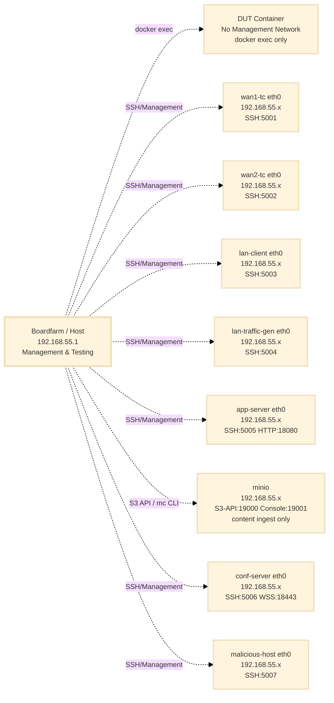
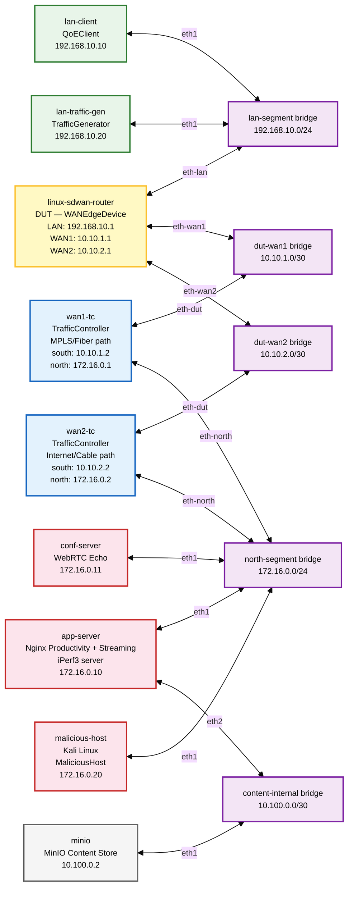

# SD-WAN Testbed Configuration

**Date:** February 24, 2026
**Status:** Design Document — Dual WAN (initial); Triple WAN (expansion noted)
**Related:** `WAN_Edge_Appliance_testing.md`, `TrafficGenerator_Implementation_Plan.md`, `Traffic_Management_Components_Architecture.md`

---

## Overview

The SD-WAN testbed is a fully Dockerised, Raikou-orchestrated environment that simulates a WAN Edge Appliance deployment with two independent WAN paths and a set of North-side application services. It operates on two distinct network layers:

- **Docker Management Network** (`192.168.55.0/24`): Provides SSH access to all containers for Boardfarm orchestration (the DUT is the exception — see below).
- **Simulated Network** (four OVS bridges): The functional testbed topology created by Raikou using Open vSwitch. This is the network through which test traffic actually flows.

The Raikou orchestrator container reads a `config.json` file that declares the OVS bridge topology and the interface assignments for each container. Docker Compose starts the containers; Raikou then wires them together via OVS.

---

## 1. Network Architecture

### 1.1 Component Overview

| Component | Boardfarm Role | Container Name | Description |
| :--- | :--- | :--- | :--- |
| **Linux SD-WAN Router** | DUT (`WANEdgeDevice`) | `linux-sdwan-router` | Device Under Test. FRR (BGP/OSPF), Policy-Based Routing, dual WAN. |
| **WAN1 Traffic Controller** | Impairment (`TrafficController`) | `wan1-tc` | Linux `tc netem` impairment emulator on the MPLS/Fiber path. |
| **WAN2 Traffic Controller** | Impairment (`TrafficController`) | `wan2-tc` | Linux `tc netem` impairment emulator on the Internet/Cable path. |
| **LAN Client** | Client (`QoEClient`) | `lan-client` | Playwright-based QoE measurement container (productivity, streaming, conferencing). |
| **LAN Traffic Generator** | Load (`TrafficGenerator`) | `lan-traffic-gen` | iPerf3 client container for QoS contention background load. |
| **Application Server** | Server (North-side) | `app-server` | Nginx productivity server + Nginx HLS streaming edge (`nginx-s3-gateway` proxies to MinIO) + iPerf3 server. |
| **MinIO Content Store** | Infrastructure | `minio` | S3-compatible object store. Holds HLS manifests and `.ts` segments. Connected to the `content-internal` Raikou OVS bridge so that only `app-server` reaches it for proxy traffic. The management host accesses the MinIO console/S3 API directly via a Docker management-network port for content ingest. |
| **Conferencing Server** | Server (North-side) | `conf-server` | `pion`-based WebRTC Echo server for conferencing QoE measurement. |
| **Malicious Host** | Threat (`MaliciousHost`) | `malicious-host` | Kali Linux container. Active inbound attacker + passive threat services (C2 listener, EICAR). |
| **Log Collector** | Infrastructure | `log-collector` | Fluent Bit container on the management network. Reads all container stdout/stderr (including DUT) via the Docker socket and writes a unified, timestamped log to the host. No OVS interfaces — log traffic never enters the simulated network. |
| **Raikou Orchestrator** | Infrastructure | `orchestrator` | OVS bridge manager. Creates and wires simulated network. No test traffic. |

### 1.2 Network Segments

| OVS Bridge | Subnet | Purpose |
| :--- | :--- | :--- |
| `lan-segment` | `192.168.10.0/24` | LAN side — clients and DUT LAN port |
| `dut-wan1` | `10.10.1.0/30` | Point-to-point link: DUT WAN1 ↔ WAN1-TC south port |
| `dut-wan2` | `10.10.2.0/30` | Point-to-point link: DUT WAN2 ↔ WAN2-TC south port |
| `north-segment` | `172.16.0.0/24` | North side — application services and threat infrastructure |
| `content-internal` | `10.100.0.0/30` | Internal only — `app-server` (nginx-s3-gateway) ↔ `minio` content origin |

---

## 2. Network Topology Diagrams

### 2.1 Docker Management Network

Boardfarm uses the Docker management network to SSH into containers for configuration, test execution, and log inspection. All containers except the DUT are connected to the management network via their `eth0` (Docker default).

> **DUT access:** The `linux-sdwan-router` DUT uses `network_mode: none`. All its interfaces come from Raikou OVS. Boardfarm accesses it via `docker exec` (similar to the CPE in the home-gateway testbed). This prevents management-network traffic from influencing DUT forwarding decisions.



### 2.2 Simulated Network Topology (Dual WAN)

This is the functional testbed network created by Raikou using OVS bridges. Test traffic flows here.



---

## 3. Per-Segment Detail

### 3.1 LAN Segment (`lan-segment` bridge)

| Container | Interface | IP Address | Role |
| :--- | :--- | :--- | :--- |
| `linux-sdwan-router` | `eth-lan` | `192.168.10.1/24` | LAN gateway |
| `lan-client` | `eth1` | `192.168.10.10/24` | QoEClient — Playwright measurements |
| `lan-traffic-gen` | `eth1` | `192.168.10.20/24` | TrafficGenerator — iPerf3 client |

### 3.2 DUT–WAN1 Segment (`dut-wan1` bridge)

Point-to-point link between the DUT WAN1 interface and the WAN1 Traffic Controller's south-facing port. Simulates the MPLS/Fiber uplink.

| Container | Interface | IP Address | Role |
| :--- | :--- | :--- | :--- |
| `linux-sdwan-router` | `eth-wan1` | `10.10.1.1/30` | DUT WAN1 interface (MPLS/Fiber) |
| `wan1-tc` | `eth-dut` | `10.10.1.2/30` | TC south port — WAN1 gateway seen by DUT |

### 3.3 DUT–WAN2 Segment (`dut-wan2` bridge)

Point-to-point link between the DUT WAN2 interface and the WAN2 Traffic Controller's south-facing port. Simulates the Internet/Cable uplink.

| Container | Interface | IP Address | Role |
| :--- | :--- | :--- | :--- |
| `linux-sdwan-router` | `eth-wan2` | `10.10.2.1/30` | DUT WAN2 interface (Internet/Cable) |
| `wan2-tc` | `eth-dut` | `10.10.2.2/30` | TC south port — WAN2 gateway seen by DUT |

### 3.4 North Segment (`north-segment` bridge)

The simulated Internet/cloud services network. Both Traffic Controllers connect here on their north-facing ports. All application services and the threat infrastructure reside here.

| Container | Interface | IP Address | Role |
| :--- | :--- | :--- | :--- |
| `wan1-tc` | `eth-north` | `172.16.0.1/24` | WAN1 uplink to internet (egress applies WAN1 impairment) |
| `wan2-tc` | `eth-north` | `172.16.0.2/24` | WAN2 uplink to internet (egress applies WAN2 impairment) |
| `app-server` | `eth1` | `172.16.0.10/24` | Nginx productivity + VOD streaming + iPerf3 server |
| `conf-server` | `eth1` | `172.16.0.11/24` | `pion`-based WebRTC Echo server |
| `malicious-host` | `eth1` | `172.16.0.20/24` | Kali Linux — active attacks + passive C2/EICAR services |

### 3.5 Content-Internal Segment (`content-internal` bridge)

An isolated point-to-point link between `app-server` and `minio`. This bridge is invisible to all test traffic — LAN clients cannot reach MinIO directly. The `nginx-s3-gateway` module running inside `app-server` proxies all HLS requests to MinIO over this bridge using the Raikou-assigned IP address (`10.100.0.2:9000`), deliberately avoiding Docker's default DNS resolution (`minio:9000`) to enforce testbed isolation.

| Container | Interface | IP Address | Role |
| :--- | :--- | :--- | :--- |
| `app-server` | `eth2` | `10.100.0.1/30` | nginx-s3-gateway → MinIO proxy egress |
| `minio` | `eth1` | `10.100.0.2/30` | MinIO S3 API endpoint for app-server proxy |

> **Management access to MinIO:** The `minio` container also has a Docker management-network interface (`eth0`), which exposes ports 19000 (S3 API) and 19001 (web console) to the host. This is used exclusively for content ingest (`mc cp`) and operational debugging. It does not carry any testbed traffic.

---

## 4. Raikou Configuration

### 4.1 `config.json` — OVS Bridge and Interface Assignments

The Raikou orchestrator reads this file at startup and:
1. Creates the four OVS bridges.
2. For each container entry, creates a veth pair, attaches one end to the named OVS bridge, and injects the other end into the container with the specified name and IP assignment.

```json
{
    "bridge": {
        "lan-segment":     {},
        "dut-wan1":        {},
        "dut-wan2":        {},
        "north-segment":   {},
        "content-internal": {}
    },
    "container": {
        "linux-sdwan-router": [
            {
                "bridge":    "lan-segment",
                "iface":     "eth-lan",
                "ipaddress": "192.168.10.1/24"
            },
            {
                "bridge":    "dut-wan1",
                "iface":     "eth-wan1",
                "ipaddress": "10.10.1.1/30"
            },
            {
                "bridge":    "dut-wan2",
                "iface":     "eth-wan2",
                "ipaddress": "10.10.2.1/30"
            }
        ],
        "wan1-tc": [
            {
                "bridge":    "dut-wan1",
                "iface":     "eth-dut",
                "ipaddress": "10.10.1.2/30"
            },
            {
                "bridge":    "north-segment",
                "iface":     "eth-north",
                "ipaddress": "172.16.0.1/24"
            }
        ],
        "wan2-tc": [
            {
                "bridge":    "dut-wan2",
                "iface":     "eth-dut",
                "ipaddress": "10.10.2.2/30"
            },
            {
                "bridge":    "north-segment",
                "iface":     "eth-north",
                "ipaddress": "172.16.0.2/24"
            }
        ],
        "lan-client": [
            {
                "bridge":    "lan-segment",
                "iface":     "eth1",
                "ipaddress": "192.168.10.10/24",
                "gateway":   "192.168.10.1"
            }
        ],
        "lan-traffic-gen": [
            {
                "bridge":    "lan-segment",
                "iface":     "eth1",
                "ipaddress": "192.168.10.20/24",
                "gateway":   "192.168.10.1"
            }
        ],
        "app-server": [
            {
                "bridge":    "north-segment",
                "iface":     "eth1",
                "ipaddress": "172.16.0.10/24"
            },
            {
                "bridge":    "content-internal",
                "iface":     "eth2",
                "ipaddress": "10.100.0.1/30"
            }
        ],
        "minio": [
            {
                "bridge":    "content-internal",
                "iface":     "eth1",
                "ipaddress": "10.100.0.2/30"
            }
        ],
        "conf-server": [
            {
                "bridge":    "north-segment",
                "iface":     "eth1",
                "ipaddress": "172.16.0.11/24"
            }
        ],
        "malicious-host": [
            {
                "bridge":    "north-segment",
                "iface":     "eth1",
                "ipaddress": "172.16.0.20/24"
            }
        ]
    },
    "vlan_translations": []
}
```

### 4.2 `docker-compose.yaml`

#### Resource Allocation

The compose file enforces CPU and memory limits on all services using `deploy.resources`. Two values are set per service:

- **Limit:** Hard ceiling — the container is throttled at this value.
- **Reservation:** Soft guarantee — Docker's scheduler ensures at least this CPU share is available under host contention.

The latency-sensitive containers (`linux-sdwan-router`, `wan1-tc`, `wan2-tc`) have reservations to protect BFD echo timers (100 ms interval) from being starved by CPU-hungry containers (Chromium/Playwright, iPerf3 saturation flows). Without reservations, a complex Playwright navigation can briefly consume 3+ cores and cause `tc netem` timer slip on the host kernel, corrupting the impairment profile under test.

**Minimum recommended host:** 8 physical cores (16 threads), 32 GB RAM.

| Container | CPU Limit | CPU Reservation | Memory Limit | Notes |
| :--- | :---: | :---: | :---: | :--- |
| `linux-sdwan-router` | 2.0 | 1.5 | 512M | BFD timer sensitivity — guaranteed cores |
| `wan1-tc` / `wan2-tc` | 0.5 | 0.25 | 128M | `tc netem` is kernel-driven; container is near-idle |
| `lan-client` | 3.0 | 1.5 | 3G | Chromium + WebRTC codec work; largest memory consumer |
| `lan-traffic-gen` | 1.0 | 0.5 | 256M | iPerf3 UDP at 85 Mbps is PPS-heavy in userspace |
| `app-server` | 2.0 | 1.0 | 512M | Nginx + iPerf3 server + nginx-s3-gateway proxy |
| `minio` | 1.0 | 0.5 | 2G | Memory-heavy during FFmpeg content ingest phase |
| `conf-server` | 0.5 | 0.25 | 256M | pion WebRTC echo — trivially light |
| `malicious-host` | 1.5 | 0.5 | 256M | Brief spikes during nmap scans / hping3 floods |
| `log-collector` | 0.25 | 0.1 | 128M | Fluent Bit is extremely lightweight at this log volume |
| `raikou-net` | 0.5 | 0.25 | 128M | Startup only; idle during tests |

> **CI environments:** On a 4–8 vCPU CI runner, reduce `lan-client` to `cpus: '1.0'` and `app-server` to `cpus: '1.0'`. The `malicious-host` container can be excluded from Phase 1–3 runs (Security pillar not in scope until Phase 4).

```yaml
name: sdwan-testbed
---
services:

    # ── Device Under Test ──────────────────────────────────────────────────────
    linux-sdwan-router:
        container_name: linux-sdwan-router
        build:
            context: ./components/sdwan-router
            tags:
                - sdwan-router:v0.1.0
        # network_mode: none — all interfaces come from Raikou OVS.
        # Boardfarm accesses DUT via `docker exec`.
        network_mode: none
        privileged: true
        hostname: sdwan-router
        environment:
            - FRR_AUTO_CONF=yes
            - WAN1_IFACE=eth-wan1
            - WAN2_IFACE=eth-wan2
            - LAN_IFACE=eth-lan
        depends_on:
            - raikou-net
        deploy:
            resources:
                limits:
                    cpus: '2.0'
                    memory: 512M
                reservations:
                    cpus: '1.5'
                    memory: 256M

    # ── Traffic Controllers (WAN Impairment) ───────────────────────────────────
    wan1-tc:
        container_name: wan1-tc
        build:
            context: ./components/traffic-controller
            tags:
                - traffic-controller:v0.1.0
        ports:
            - "5001:22"
        environment:
            - TC_DUT_IFACE=eth-dut
            - TC_NORTH_IFACE=eth-north
            - LEGACY=no
        privileged: true
        hostname: wan1-tc
        depends_on:
            - raikou-net
        deploy:
            resources:
                limits:
                    cpus: '0.5'
                    memory: 128M
                reservations:
                    cpus: '0.25'
                    memory: 64M

    wan2-tc:
        container_name: wan2-tc
        build:
            context: ./components/traffic-controller
            tags:
                - traffic-controller:v0.1.0
        ports:
            - "5002:22"
        environment:
            - TC_DUT_IFACE=eth-dut
            - TC_NORTH_IFACE=eth-north
            - LEGACY=no
        privileged: true
        hostname: wan2-tc
        depends_on:
            - raikou-net
        deploy:
            resources:
                limits:
                    cpus: '0.5'
                    memory: 128M
                reservations:
                    cpus: '0.25'
                    memory: 64M

    # ── LAN-Side Clients ───────────────────────────────────────────────────────
    lan-client:
        container_name: lan-client
        build:
            context: ./components/lan-client
            tags:
                - lan-client:v0.1.0
        ports:
            - "5003:22"
            - "18090:8080"   # Dante SOCKS v5 proxy — developer access to LAN-side services (see §5.2)
        environment:
            - LEGACY=no
        privileged: true
        hostname: lan-client
        depends_on:
            - raikou-net
        deploy:
            resources:
                limits:
                    cpus: '3.0'
                    memory: 3G
                reservations:
                    cpus: '1.5'
                    memory: 1G

    lan-traffic-gen:
        container_name: lan-traffic-gen
        build:
            context: ./components/traffic-generator
            tags:
                - traffic-generator:v0.1.0
        ports:
            - "5004:22"
        environment:
            - LEGACY=no
        privileged: true
        hostname: lan-traffic-gen
        depends_on:
            - raikou-net
        deploy:
            resources:
                limits:
                    cpus: '1.0'
                    memory: 256M
                reservations:
                    cpus: '0.5'
                    memory: 128M

    # ── Content Origin ─────────────────────────────────────────────────────────
    minio:
        container_name: minio
        image: minio/minio:latest
        command: server /data --console-address ":9001"
        ports:
            - "19000:9000"       # S3 API — management-plane content ingest only (mc cp)
            - "19001:9001"       # MinIO web console — debugging/browsing
        environment:
            - MINIO_ROOT_USER=testbed
            - MINIO_ROOT_PASSWORD=testbed-secret
        volumes:
            - minio-data:/data   # Persists content across container restarts
        hostname: minio
        # Raikou injects eth1 (10.100.0.2/30) on the content-internal bridge.
        # app-server proxies to this address via nginx-s3-gateway.
        # The management-network eth0 exposes ports 19000/19001 for content ingest ONLY.
        depends_on:
            - raikou-net
        deploy:
            resources:
                limits:
                    cpus: '1.0'
                    memory: 2G
                reservations:
                    cpus: '0.5'
                    memory: 512M

    # ── North-Side Application Services ────────────────────────────────────────
    app-server:
        container_name: app-server
        build:
            context: ./components/app-server
            tags:
                - app-server:v0.1.0
        ports:
            - "5005:22"
            - "18080:8080"       # Nginx productivity (HTTP)
            - "18081:8081"       # Nginx HLS streaming edge (proxies to MinIO via nginx-s3-gateway)
            # iPerf3 server (5201) is on the simulated network only — no host port mapping
        environment:
            - LEGACY=no
            - MINIO_ENDPOINT=http://10.100.0.2:9000
            - MINIO_BUCKET=streaming-content
            - MINIO_ACCESS_KEY=testbed
            - MINIO_SECRET_KEY=testbed-secret
        privileged: true
        hostname: app-server
        depends_on:
            - raikou-net
            - minio
        deploy:
            resources:
                limits:
                    cpus: '2.0'
                    memory: 512M
                reservations:
                    cpus: '1.0'
                    memory: 256M

    conf-server:
        container_name: conf-server
        build:
            context: ./components/conf-server
            tags:
                - conf-server:v0.1.0
        ports:
            - "5006:22"
            - "18443:8443"       # WebRTC Echo signalling (WSS)
        environment:
            - LEGACY=no
        privileged: true
        hostname: conf-server
        depends_on:
            - raikou-net
        deploy:
            resources:
                limits:
                    cpus: '0.5'
                    memory: 256M
                reservations:
                    cpus: '0.25'
                    memory: 128M

    # ── Threat Infrastructure (Phase 4 — Expansion) ───────────────────────────
    malicious-host:
        container_name: malicious-host
        build:
            context: ./components/malicious-host
            tags:
                - malicious-host:v0.1.0
        ports:
            - "5007:22"
        environment:
            - LEGACY=no
        privileged: true
        hostname: malicious-host
        depends_on:
            - raikou-net
        deploy:
            resources:
                limits:
                    cpus: '1.5'
                    memory: 256M
                reservations:
                    cpus: '0.5'
                    memory: 128M

    # ── Raikou OVS Orchestrator ────────────────────────────────────────────────
    raikou-net:
        container_name: orchestrator
        image: ghcr.io/ketantewari/raikou/orchestrator:v1
        volumes:
            - /lib/modules:/lib/modules
            - /var/run/docker.sock:/var/run/docker.sock
            - ./config.json:/root/config.json
        privileged: true
        environment:
            - USE_LINUX_BRIDGE=false
        pid: host
        network_mode: host
        hostname: orchestrator
        depends_on:
            - linux-sdwan-router
            - wan1-tc
            - wan2-tc
            - lan-client
            - lan-traffic-gen
            - app-server
            - minio
            - conf-server
            - malicious-host
        deploy:
            resources:
                limits:
                    cpus: '0.5'
                    memory: 128M
                reservations:
                    cpus: '0.25'
                    memory: 64M

    # ── Centralized Log Collector ──────────────────────────────────────────────
    log-collector:
        container_name: log-collector
        image: cr.fluentbit.io/fluent/fluent-bit:3.3
        volumes:
            # Docker socket — read-only access to all container logs via the daemon.
            # Works for network_mode: none containers (DUT) because Docker itself
            # captures stdout/stderr regardless of the container's network stack.
            - /var/run/docker.sock:/var/run/docker.sock:ro
            # Docker log files — Fluent Bit tails these directly for low-latency capture.
            - /var/lib/docker/containers:/var/lib/docker/containers:ro
            # Fluent Bit configuration (see §5.4 for full config content)
            - ./fluent-bit/fluent-bit.conf:/fluent-bit/etc/fluent-bit.conf:ro
            - ./fluent-bit/parsers.conf:/fluent-bit/etc/parsers.conf:ro
            # Unified log output on the host — grepable, rotating, 7-day retention
            - ./logs:/logs
            # Position database — tracks tail offsets across container restarts
            - fluent-bit-db:/fluent-bit/db
        hostname: log-collector
        restart: unless-stopped
        # Management network only — no OVS interfaces injected by Raikou.
        # Log traffic flows on the management network (eth0), never on OVS bridges.
        deploy:
            resources:
                limits:
                    cpus: '0.25'
                    memory: 128M
                reservations:
                    cpus: '0.1'
                    memory: 64M

networks:
    default:
        ipam:
            config:
                - subnet: 192.168.55.0/24
                  gateway: 192.168.55.1

volumes:
    minio-data:
        driver: local    # Persists HLS content across container restarts
    fluent-bit-db:
        driver: local    # Persists Fluent Bit tail position across container restarts
```

---

## 5. Container Specifications

### 5.1 Port and Access Summary

| Container | SSH Port | Other Ports | Connection Method | Notes |
| :--- | :--- | :--- | :--- | :--- |
| `linux-sdwan-router` | — | — | `docker exec -it linux-sdwan-router bash` | `network_mode: none`; no management network |
| `wan1-tc` | 5001 | — | `ssh -p 5001 root@localhost` | |
| `wan2-tc` | 5002 | — | `ssh -p 5002 root@localhost` | |
| `lan-client` | 5003 | 18090 (SOCKS v5 proxy) | `ssh -p 5003 root@localhost` | SOCKS proxy for developer browser access to LAN-side services — see §5.2 |
| `lan-traffic-gen` | 5004 | — | `ssh -p 5004 root@localhost` | |
| `app-server` | 5005 | 18080 (HTTP prod), 18081 (HLS edge) | `ssh -p 5005 root@localhost` | HLS edge proxies to MinIO; iPerf3 on simulated net only |
| `minio` | — | 19000 (S3 API), 19001 (Console) | `mc alias set testbed http://localhost:19000 testbed testbed-secret` | Management network (ingest/debug only); eth1 on `content-internal` bridge carries proxy traffic |
| `conf-server` | 5006 | 18443 (WSS) | `ssh -p 5006 root@localhost` | |
| `malicious-host` | 5007 | — | `ssh -p 5007 root@localhost` | |
| `log-collector` | — | — | `tail -f logs/sdwan-testbed.log` | Management network only; no OVS interfaces — see §5.4 |

**Default credentials:** `root` / `boardfarm`

### 5.2 Developer Debugging Access

The `lan-client` container provides two complementary tools for debugging QoE test failures. Neither tool compromises testbed isolation — all traffic still traverses the DUT and WAN impairment containers via the OVS bridges.

#### SOCKS v5 Proxy (Dante) — Browse through the testbed LAN

Dante is running inside `lan-client` and listening on port 8080, exposed to the host as **port 18090**. Configure your browser to use it as a SOCKS v5 proxy:

```
Firefox → Settings → Network Settings → Manual Proxy Configuration
  SOCKS Host: 127.0.0.1
  Port:       18090
  SOCKS v5
  ✓ Proxy DNS when using SOCKS v5
```

With this configuration your browser routes traffic out via the `lan-client`'s `eth1` interface on the `lan-segment` bridge — through the DUT — through the active WAN impairment — to the north-side services. This is **the exact same path Playwright uses**.

| Service reachable via proxy | URL |
| :--- | :--- |
| Productivity server | `http://172.16.0.10:8080/` |
| HLS streaming edge | `http://172.16.0.10:8081/hls/default/index.m3u8` |
| WebRTC conferencing | `wss://172.16.0.11:8443/session1` |

This is the primary tool for verifying that north-side services are reachable and rendering correctly, and for experiencing impairment profiles firsthand when calibrating QoE SLOs.

#### Playwright Trace Viewer — Inspect automated browser sessions

For failures specific to Playwright's automated session (element selection, navigation timing, WebRTC `getStats()` parsing), use Playwright's built-in trace recording. This requires no container changes.

```bash
# View a trace captured during a test run
playwright show-trace trace.zip
```

See `QoE_Client_Implementation_Plan.md §3.4` for the full tracing setup and CI artifact integration.

### 5.3 Component Image Sources

| Container | Image / Build Context | Package Requirements |
| :--- | :--- | :--- |
| `linux-sdwan-router` | `components/sdwan-router` | `frr`, `iproute2`, `iptables`, `strongswan` |
| `wan1-tc`, `wan2-tc` | `components/traffic-controller` | `iproute2` (tc + netem), `openssh-server` |
| `lan-client` | `components/lan-client` | `playwright`, `chromium`, `openssh-server` |
| `lan-traffic-gen` | `components/traffic-generator` | `iperf3`, `openssh-server`, `iproute2` |
| `app-server` | `components/app-server` | `nginx`, `iperf3`, `openssh-server` |
| `conf-server` | `components/conf-server` | `pion` WebRTC Echo binary, `openssh-server` |
| `malicious-host` | `components/malicious-host` | `kali-linux-core`, `nmap`, `hping3`, `netcat`, `openssh-server` |
| `log-collector` | `cr.fluentbit.io/fluent/fluent-bit:3.3` (official image, no custom build) | — |

---

### 5.4 Centralized Log Access

The `log-collector` container (Fluent Bit) provides a unified, chronologically ordered stream of all container logs on the management network. It reads container stdout/stderr via the Docker socket — including the DUT (`network_mode: none`) whose FRR daemons write to stdout — and writes a single rotating log file to the host. Log traffic never touches the OVS bridges.

#### Fluent Bit Configuration

Two files are mounted from `./fluent-bit/` in the project directory:

**`fluent-bit/fluent-bit.conf`**

```ini
[SERVICE]
    Flush             5
    Daemon            Off
    Log_Level         info
    Parsers_File      /fluent-bit/etc/parsers.conf

# Tail Docker JSON log files directly — low-latency, works for all containers
# including network_mode: none (DUT). Docker captures stdout/stderr for all
# containers regardless of network configuration.
[INPUT]
    Name              tail
    Tag               docker.*
    Path              /var/lib/docker/containers/*/*.log
    Parser            docker_json
    Docker_Mode       On
    Docker_Mode_Flush 4
    DB                /fluent-bit/db/pos.db
    Refresh_Interval  10
    Rotate_Wait       30

# Enrich each record with the container name (extracted from the file path)
# and a testbed label for filtering in optional Loki/Grafana setup.
[FILTER]
    Name              record_modifier
    Match             docker.*
    Record            testbed sdwan-testbed

# Primary output — unified rotating log file on the host.
# Each line: [ISO-8601 timestamp] [container_name] <message>
# Retained for 7 days; rotatable without restarting Fluent Bit.
[OUTPUT]
    Name              file
    Match             *
    Path              /logs
    File              sdwan-testbed.log
    Format            plain
```

**`fluent-bit/parsers.conf`**

```ini
[PARSER]
    Name        docker_json
    Format      json
    Time_Key    time
    Time_Format %Y-%m-%dT%H:%M:%S.%L%z
    Time_Keep   On
```

#### DUT Log Configuration (FRR)

Configure FRR to write to stdout so Docker captures it without any network path. In `/etc/frr/frr.conf` (or via `vtysh`):

```
log stdout informational
log facility daemon
```

This produces structured FRR log lines (daemon name, severity, message) that appear in `sdwan-testbed.log` labelled as `linux-sdwan-router`.

#### Accessing Logs

**Live tail — all containers:**
```bash
tail -f logs/sdwan-testbed.log
```

**Filter by container — correlate a single component:**
```bash
grep "linux-sdwan-router" logs/sdwan-testbed.log | tail -50   # DUT (FRR)
grep "wan1-tc" logs/sdwan-testbed.log | tail -50              # WAN1 impairment
grep "lan-client" logs/sdwan-testbed.log | tail -50           # Playwright / Dante
```

**Correlate a time window across all containers** (the primary debugging use case):
```bash
# Show everything between two timestamps — reconstructs the full event sequence
awk '/2026-02-25T10:23:40/,/2026-02-25T10:23:46/' logs/sdwan-testbed.log
```

**Per-container logs still available directly** (unchanged by centralized logging):
```bash
docker logs linux-sdwan-router --timestamps --tail 100
docker logs wan1-tc --since 5m
docker logs lan-client --follow
```

#### Optional Extension — Loki + Grafana

For structured querying and a visual timeline, add the following to `docker-compose.yaml`. Fluent Bit's existing pipeline requires one additional output block only; the flat file output continues to run alongside it.

**Additional compose services:**
```yaml
    loki:
        container_name: loki
        image: grafana/loki:3.3.0
        ports:
            - "3100:3100"
        command: -config.file=/etc/loki/local-config.yaml
        hostname: loki

    grafana:
        container_name: grafana
        image: grafana/grafana:11.5.0
        ports:
            - "3001:3000"
        environment:
            - GF_SECURITY_ADMIN_PASSWORD=testbed
        depends_on:
            - loki
        hostname: grafana
```

**Additional Fluent Bit output block** (append to `fluent-bit.conf`):
```ini
[OUTPUT]
    Name            loki
    Match           *
    Host            loki
    Port            3100
    Labels          testbed=sdwan-testbed
    Label_Keys      $container_name
    Line_Format     key_value
```

Access Grafana at `http://localhost:3001` (credentials: `admin` / `testbed`). Add Loki as a data source at `http://loki:3100`. The Explore view supports LogQL queries such as:

```logql
{testbed="sdwan-testbed"} |= "BFD"
{container_name="linux-sdwan-router"} | logfmt | level="error"
```

---

## 6. Boardfarm Integration

### 6.1 Device Mapping (Boardfarm Inventory)

```json
{
    "devices": [
        {
            "name": "dut",
            "type": "linux_sdwan_router",
            "connection_type": "docker_exec",
            "container_name": "linux-sdwan-router",
            "wan_interfaces": {
                "wan1": "eth-wan1",
                "wan2": "eth-wan2"
            },
            "lan_interface": "eth-lan"
        },
        {
            "name": "wan1_impairment",
            "type": "linux_traffic_controller",
            "connection_type": "ssh",
            "ipaddr": "localhost",
            "port": 5001,
            "username": "root",
            "password": "boardfarm",
            "dut_iface": "eth-dut",
            "north_iface": "eth-north"
        },
        {
            "name": "wan2_impairment",
            "type": "linux_traffic_controller",
            "connection_type": "ssh",
            "ipaddr": "localhost",
            "port": 5002,
            "username": "root",
            "password": "boardfarm",
            "dut_iface": "eth-dut",
            "north_iface": "eth-north"
        },
        {
            "name": "lan_client",
            "type": "playwright_qoe_client",
            "connection_type": "ssh",
            "ipaddr": "localhost",
            "port": 5003,
            "username": "root",
            "password": "boardfarm"
        },
        {
            "name": "lan_traffic_gen",
            "type": "iperf_traffic_generator",
            "connection_type": "ssh",
            "ipaddr": "localhost",
            "port": 5004,
            "username": "root",
            "password": "boardfarm"
        },
        {
            "name": "app_server",
            "type": "nginx_app_server",
            "connection_type": "ssh",
            "ipaddr": "localhost",
            "port": 5005,
            "username": "root",
            "password": "boardfarm",
            "simulated_ip": "172.16.0.10",
            "streaming": {
                "s3_endpoint": "http://10.100.0.2:9000",
                "s3_bucket": "streaming-content",
                "s3_access_key": "testbed",
                "s3_secret_key": "testbed-secret",
                "hls_base_url": "http://172.16.0.10:8081/hls"
            }
        },
        {
            "name": "conf_server",
            "type": "webrtc_echo_server",
            "connection_type": "ssh",
            "ipaddr": "localhost",
            "port": 5006,
            "username": "root",
            "password": "boardfarm",
            "simulated_ip": "172.16.0.11",
            "wss_url": "wss://172.16.0.11:8443/session1"
        },
        {
            "name": "malicious_host",
            "type": "kali_malicious_host",
            "connection_type": "ssh",
            "ipaddr": "localhost",
            "port": 5007,
            "username": "root",
            "password": "boardfarm",
            "simulated_ip": "172.16.0.20"
        }
    ]
}
```

### 6.2 Startup Sequence

1. **`docker compose up -d`** — starts all containers. Raikou starts last (`depends_on`). MinIO starts before `app-server` (declared dependency).
2. **Raikou** reads `config.json`, creates OVS bridges, and injects veth pairs into each container with the configured IP and interface names.
3. **DUT startup** — FRR initialises BGP/OSPF adjacencies and policy-based routing. WAN1 and WAN2 interfaces receive their IPs from Raikou.
4. **TC startup** — each Traffic Controller enables IP forwarding between `eth-dut` and `eth-north`. No impairment is applied by default (`pristine` state).
5. **Content ingest (handled automatically by Boardfarm)** — The `sdwan_testbed_setup` session-scoped autouse fixture in `tests/conftest.py` calls `streaming_server.ensure_content_available()` through the typed `StreamingServer` template reference before the first test runs. The method is idempotent: it checks whether the asset is already present in MinIO and returns immediately if so; otherwise it runs FFmpeg content generation and `mc cp` ingest automatically.

    > **Manual fallback (debugging only):** If needed outside of a Boardfarm session, the ingest can be triggered manually. The shell script below mirrors what `ensure_content_available()` does internally via SSH into `app-server`:
    ```bash
    # Generate synthetic HLS content
    scripts/generate_streaming_content.sh

    # Ingest into MinIO via the management-network S3 API port (host → MinIO eth0)
    mc alias set testbed http://localhost:19000 testbed testbed-secret
    mc mb --ignore-existing testbed/streaming-content
    mc cp --recursive /tmp/streaming/ testbed/streaming-content/
    ```
    At runtime, `app-server` proxies to MinIO at `http://10.100.0.2:9000` over the `content-internal` Raikou bridge — not via Docker hostname resolution.
    See `Application_Services_Implementation_Plan.md §3.2` for the full FFmpeg command and bitrate ladder.
6. **Boardfarm** connects to all containers via SSH (or `docker exec` for DUT), verifies connectivity, and the testbed is ready.

---

## 7. Traffic Flow Reference

### 7.1 QoE Test Flow (LAN → North via DUT → TC → App Server)

```
lan-client (192.168.10.10)
  → [lan-segment bridge]
  → DUT eth-lan → DUT eth-wan1 (active WAN, PBR selects wan1)
  → [dut-wan1 bridge]
  → wan1-tc eth-dut → [netem impairment applied] → wan1-tc eth-north
  → [north-segment bridge]
  → app-server (172.16.0.10) :8080
```

### 7.2 Path Failover Flow (WAN1 → WAN2)

```
wan1-tc applies: ImpairmentProfile(latency_ms=600, loss_percent=50)  ← brownout / blackout
DUT BFD/SLA probe on WAN1 detects breach
DUT FRR route-map switches active nexthop to eth-wan2
Traffic re-routes:
  lan-client → DUT eth-wan2 → [dut-wan2 bridge] → wan2-tc → [north-segment] → app-server
```

### 7.3 QoS Contention Flow (Background load + Priority traffic)

```
lan-traffic-gen (192.168.10.20)
  → iPerf3 UDP DSCP=0 (Best Effort, 85 Mbps background)
  → DUT → wan1-tc (100 Mbps WAN1 link creates queue pressure)
  → north-segment → app-server :5201 (iPerf3 server)

lan-client (192.168.10.10)
  → WebRTC DSCP=46 (EF — voice priority)
  → DUT QoS policy: EF traffic in high-priority queue → guaranteed forwarding
  → conf-server (172.16.0.11) :8443
```

### 7.4 Security Flow (C2 Callback Block Test)

```
malicious-host (172.16.0.20) starts nc listener on :4444
lan-client (192.168.10.10) attempts outbound TCP → 172.16.0.20:4444
  → DUT Application Control policy → DROP (log entry written)
  → malicious-host check_connection_received() → False  ← assert passes
```

---

## 8. Network Addresses Summary

### 8.1 Complete Address Table

| Network | Subnet | Purpose |
| :--- | :--- | :--- |
| Docker Management | `192.168.55.0/24` | Boardfarm SSH access (DUT excluded); MinIO console/ingest |
| LAN Segment | `192.168.10.0/24` | LAN clients and DUT LAN port |
| DUT–WAN1 (p2p) | `10.10.1.0/30` | DUT WAN1 ↔ WAN1-TC south |
| DUT–WAN2 (p2p) | `10.10.2.0/30` | DUT WAN2 ↔ WAN2-TC south |
| North Segment | `172.16.0.0/24` | Application services and threat infrastructure |
| Content-Internal (p2p) | `10.100.0.0/30` | app-server (nginx-s3-gateway) ↔ MinIO origin — invisible to test traffic |

### 8.2 Service IP Quick Reference

| Service | Simulated IP | Ports (simulated net) | Boardfarm Device |
| :--- | :--- | :--- | :--- |
| DUT LAN gateway | `192.168.10.1` | — | `dut` |
| DUT WAN1 | `10.10.1.1` | — | `dut` |
| DUT WAN2 | `10.10.2.1` | — | `dut` |
| WAN1-TC south | `10.10.1.2` | — | `wan1_impairment` |
| WAN2-TC south | `10.10.2.2` | — | `wan2_impairment` |
| WAN1-TC north | `172.16.0.1` | — | `wan1_impairment` |
| WAN2-TC north | `172.16.0.2` | — | `wan2_impairment` |
| Productivity + Streaming server | `172.16.0.10` | 8080 (HTTP), 8081 (HLS), 5201 (iPerf3) | `app_server` |
| app-server → MinIO proxy egress | `10.100.0.1` | — (internal) | `app_server` |
| MinIO content origin | `10.100.0.2` | 9000 (S3 API via content-internal) | — |
| Conferencing server | `172.16.0.11` | 8443 (WSS) | `conf_server` |
| Malicious host | `172.16.0.20` | 4444 (C2), 80 (EICAR HTTP) | `malicious_host` |

---

## 9. Triple WAN Expansion

When expanding to Triple WAN (Project Phase 4), add the following to `config.json` and `docker-compose.yaml`:

**Additional container:** `wan3-tc` (LTE/4G mobile path)

**Additional OVS bridge:** `dut-wan3` (`10.10.3.0/30`)

**DUT additional interface entry:**
```json
{
    "bridge":    "dut-wan3",
    "iface":     "eth-wan3",
    "ipaddress": "10.10.3.1/30"
}
```

**`wan3-tc` config.json entry:**
```json
"wan3-tc": [
    { "bridge": "dut-wan3",    "iface": "eth-dut",   "ipaddress": "10.10.3.2/30" },
    { "bridge": "north-segment","iface": "eth-north", "ipaddress": "172.16.0.3/24" }
]
```

No changes are required to the North segment or application services — WAN3 simply adds a third path to the same `north-segment` bridge. The `LinuxSDWANRouter` driver's `wan_interfaces` config gains a `"wan3": "eth-wan3"` entry.

---

## 10. Verification Commands

```bash
# Verify all containers are running
docker compose ps

# Check OVS bridge topology (run on host)
docker exec orchestrator ovs-vsctl show

# Verify DUT interface configuration
docker exec linux-sdwan-router ip addr show
docker exec linux-sdwan-router ip route show
docker exec linux-sdwan-router vtysh -c "show ip bgp summary"

# Verify LAN connectivity through DUT
docker exec lan-client ping -c 3 192.168.10.1         # DUT LAN gateway
docker exec lan-client ping -c 3 172.16.0.10          # App server (via WAN)

# Verify Traffic Controller forwarding
docker exec wan1-tc ip route show
docker exec wan1-tc tc qdisc show dev eth-north        # Confirm netem is clean

# Verify app-server services
curl http://172.16.0.10:8080/health                    # From host (via port mapping 18080)
docker exec app-server iperf3 -s --daemon              # Start iPerf3 server if not running

# Verify conferencing server
curl -k https://localhost:18443/                       # WebRTC Echo signalling endpoint

# Check SSH access to all containers
for port in 5001 5002 5003 5004 5005 5006 5007; do
    ssh -p $port -o ConnectTimeout=3 root@localhost "hostname" && echo "Port $port OK"
done
```
