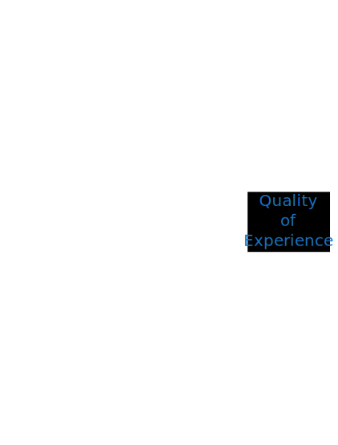

# Technical Brief: Automated End-User Quality of Experience (QoE) Verification Framework

**Date:** February 07, 2026  
**Version:** 3.0  
**Status:** Draft

### Related Documents

- [Testbed Network Topology](./Testbed%20Network%20Topology.md) - Base Raikou + Boardfarm topology reference
- [Traffic Management Components Architecture](./Traffic_Management_Components_Architecture.md) - Boardfarm traffic control / network impairment design

---

## 1. Executive Summary

This document defines a standardized framework for verifying end-user Quality of Experience (QoE) across network infrastructure devices. The framework combines **Boardfarm testbed orchestration** with flexible **Traffic Control** capabilities to create a deterministic environment where network conditions are precisely controlled and user experience is measured objectively.

### Key Value Propositions

1. **User-Centric Metrics**: Shifts focus from network counters (throughput, ping) to actual user experience (page load time, video resolution, call clarity).
2. **Test Portability**: Automated test cases run unchanged across different testbed implementations (functional testbed with physical DUT + containerized surroundings vs. full physical pre-production labs).
3. **Deterministic Reproduction**: Every network issue can be reproduced exactly by replaying recorded impairment profiles.
4. **DUT-Agnostic**: Framework supports any device providing network access (cable modems, SD-WAN appliances, routers, firewalls).
5. **Automated Verification**: Programmatic assertion of QoE thresholds against Service Level Objectives (SLOs).

---

## 2. QoE Testing Concept

The framework approaches verification from a user-centric perspective: **A Client connected to a Network accessing Services.**

### 2.1 The Conceptual Model

To determine system behavior, we introduce **Traffic Control** as a fundamental part of the network. By varying traffic conditions (latency, loss, bandwidth), we stress the Device Under Test (DUT) and measure the impact on the user's experience.



1. **SUT**: The system / device being verified (SD-WAN appliance, Router, Gateway).
2. **Traffic Control**: The active network element applying impairments (the "knobs" we turn).
3. **Services**: Self-hosted instances of real-world applications (Streaming, Conferencing, SaaS).

*   **Industry Alignment**: This "Control Loop" (Stimulate → Execute → Measure → Verify) aligns with **AIOps** and **Intent-Based Networking** standards.
*   **Zero-Trust Impacts**: Modern SUTs often perform Deep Packet Inspection (DPI) or SSL Decryption. This adds processing overhead (CPU/Memory stress) that can degrade QoE even if the network link is pristine.
*   **Critical Variable**: **SUT Resource Utilization** (CPU/RAM) is a co-factor in QoE measurement.

### 2.2 The Control Loop

1. **Stimulate**: Apply a specific network profile via Traffic Control (e.g., "Degraded Uplink").
2. **Execute**: Client uses a Service (e.g., "Watch 4K Video").
3. **Measure**: Capture application-level metrics (e.g., "Rebuffer Ratio").
4. **Verify**: Assert metrics against acceptable thresholds (SLOs).

---

## 3. Main application services to verify

The QoE is concentrating on the following categories of services:

### 3.1 SaaS

#### 3.1.1 Description

Simulates interaction with cloud-based productivity suites (e.g., Office 365, Google Workspace, Salesforce). This service category measures the responsiveness and reliability of transactional workflows, such as logging in, navigating complex dashboards, and uploading/downloading files. It verifies the network's ability to handle bursty, TCP-based traffic typical of modern web applications.

#### 3.1.2 Main variables affecting QoE

*   **Latency (RTT)**: Directly impacts Time to First Byte (TTFB) and perceived responsiveness. High latency makes UI interactions feel sluggish.
*   **Packet Loss**: Causes TCP retransmissions, significantly delaying page loads and API transactions, especially for larger assets.
*   **Bandwidth**: Critical for large file transfers (uploads/downloads) but less sensitive for basic page navigation.
*   **DNS Resolution Time**: Affects the initial connection setup time for new domains.
*   **TCP Initial Congestion Window (initcwnd)**: Determines how much data is sent before waiting for an ACK. Critical for short-lived connections.
*   **MTU/MSS Issues**: Incorrect encapsulation handling (IPsec/VXLAN) causes fragmentation, severely impacting performance.
*   **QUIC/UDP Handling**: Modern SaaS (Google Workspace, Microsoft 365) heavily utilizes HTTP/3 (QUIC) over UDP. The SUT must correctly prioritize and inspect this traffic without treating it as generic UDP bulk data.
*   **Endpoint Health**: Local metrics (CPU/RAM, Wi-Fi Signal) to rule out client-side bottlenecks.

#### 3.1.3 Typical acceptance criteria

*   **Page Load Time**: Excellent < 2s, Acceptable < 5s.
*   **DOM Content Loaded**: < 1.5s (Interactive time).
*   **Time to First Byte (TTFB)**: Excellent < 200ms, Acceptable < 500ms.
*   **LCP (Largest Contentful Paint)**: < 2.5s (Good).
*   **FID (First Input Delay)**: < 100ms (Good).
*   **Transaction Success Rate**: > 99.9%.
*   **File Transfer Speed**: > 80% of available link bandwidth.

#### 3.1.4 E-Commerce (Transactional SaaS)
A specialized subset of SaaS focusing on short, fragile user journeys (Search → Add to Cart → Checkout).
*   **Key Metrics**: Cart Abandonment Potential (correlated to PLT > 3s), API Latency (Payment Gateways).
*   **Acceptance Criteria**: "Visually Complete" < 2s for checkout pages.

### 3.2 Streaming

#### 3.2.1 Description

Simulates Video on Demand (VoD) services like Netflix, YouTube, or Disney+. This service provides adaptive streaming content (HLS/DASH) at multiple bitrates to verify the network's ability to sustain high-bandwidth, long-duration flows. This validates the DUT's handling of deep buffers and sustained throughput.

#### 3.2.2 Main variables affecting QoE

*   **Available Bandwidth**: The primary determinant of video resolution (quality). Insufficient bandwidth forces the player to downgrade quality.
*   **Jitter**: Variations in packet arrival time can drain the playback buffer, potentially causing stalls (rebuffering).
*   **Packet Loss**: Can cause visual artifacts or force retransmissions. If retransmissions arrive too late, the buffer drains.
*   **Latency**: Primarily affects "Time to Start" (initial buffering) and seek time, but is less critical during continuous playback due to client-side buffering.
*   **CDN Reachability (Path Asymmetry)**: In real-world scenarios, request and data paths may differ.
*   **Throughput Stability (Consistency Index)**: Oscillating bandwidth confuses ABR algorithms more than steady low bandwidth.

#### 3.2.3 Typical acceptance criteria

*   **Startup Time**: < 2 seconds.
*   **Rebuffer Ratio**: < 1% of total playback time (0% is ideal).
*   **Video Resolution**: Sustained 1080p or 4K (depending on link capacity profile).
*   **Bitrate Adaptation**: Smooth transitions downward without stalling when bandwidth drops; quick recovery when bandwidth returns.

#### 3.2.4 Immersive Media (XR/VR)
While standard streaming uses large buffers, XR adds a "Motion-to-Photon" latency requirement similar to Cloud Gaming.
*   **Key Metric**: **Motion-to-Photon Latency** (< 20ms).
*   **Challenge**: Requires simulating high-bandwidth (100Mbps+), bursty UDP streams typical of volumetric video.
*   **Implementation**: Can be validated using the same high-framerate WebRTC infrastructure as Cloud Gaming, but with significantly higher throughput thresholds.

### 3.3 Conferencing

#### 3.3.1 Description

Simulates real-time interactive audio and video communication (e.g., Microsoft Teams, Zoom, WebRTC). This service facilitates actual two-way media sessions between clients to measure interactivity. This is the most sensitive traffic class, requiring low latency and high reliability for media quality.

#### 3.3.2 Main variables affecting QoE

*   **Latency (One-Way Delay)**: Critical for interactivity. Delay > 150ms causes users to talk over each other.
*   **Jitter**: High jitter forces the receiver to increase the de-jitter buffer size, which adds latency. Excessive jitter causes "robotic" audio.
*   **Packet Loss**: The most damaging factor.
    *   **Random Loss**: Often masked by PLC (Packet Loss Concealment).
    *   **Burst Loss**: Causes total audio cutouts (cannot be concealed).
*   **FEC Overhead**: Forward Error Correction adds traffic overhead. SUT must not drop this "extra" traffic during congestion.

#### 3.3.3 Mean Opinion Score (MOS)

**What is it?**
MOS is a standard metric (ITU-T P.800) used to evaluate the human-perceived quality of voice and video calls. It ranges from 1 (Bad) to 5 (Excellent).

**Why is MOS specific to Conferencing?**
MOS is designed to model *conversational quality*. It accounts for the psycho-acoustic effects of delay and distortion on human speech and interaction.

*   **Productivity (SaaS)**: Users perceive quality as **Responsiveness** (Time to First Byte, Page Load). A delay of 200ms is noticeable but doesn't destroy the "usability" or "meaning" of a file download. The metric is simply "Duration".
*   **Streaming**: Users perceive quality as **Stability** and **Fidelity**. The application uses a large **buffer** (seconds or minutes) to absorb network jitter and retransmit lost packets. Latency is irrelevant once playback begins. The metrics are "Rebuffer Ratio" and "Resolution".
*   **Conferencing**: Users perceive quality as **Interactivity** and **Clarity**.
    *   **No Buffering**: Real-time communication cannot buffer more than a few milliseconds (jitter buffer) without destroying interactivity (the ability to interrupt or respond instantly).
    *   **Cumulative Effect**: A small amount of packet loss might be audible as a "glitch", but combined with high latency, it causes users to talk over each other. MOS provides a single score (1-5) that captures this complex interaction of network impairments.

**Calculation (Simplified E-Model):**
We use a simplified version of the ITU-T G.107 E-Model to calculate MOS programmatically from network metrics:

```python
# R-Factor Calculation
# Base quality (93.2) minus penalties for Latency (Id) and Packet Loss/Jitter (Ie)
R = 93.2 - (Latency_ms / 40) - (Jitter_ms * 2) - (Packet_Loss_percent * 2.5)

# Convert R-Factor to MOS (1-5)
MOS = 1 + (0.035 * R) + (R * (R - 60) * (100 - R) * 0.000007)
```

#### 3.3.4 Typical acceptance criteria

*   **MOS (Mean Opinion Score)**: > 4.0 (Good/Excellent), > 3.5 (Acceptable).
*   **Round Trip Time (RTT)**: < 150ms (Preferred), < 300ms (Limit).
*   **Jitter**: < 30ms.
*   **Packet Loss**: < 1%.

#### 3.3.5 Cloud Gaming (Interactive Streaming)
A high-performance subset of Real-Time communication.
*   **Characteristics**: High bandwidth (like Streaming) but near-zero buffer (like Conferencing).
*   **Key Metric**: **Click-to-Photon Latency** (< 50ms).
*   **Test Method**: High-framerate WebRTC stream measuring input-to-display round trip.

#### 3.3.6 Telemedicine
Combines high-definition video conferencing with high-priority telemetry data.
*   **Criticality**: "Zero Downtime" for telemetry (ECG/Vitals).
*   **Test Method**: Prioritization of telemetry data streams during link congestion (Brownout).

### 3.4 Testbed Health & Validity Metrics

To ensure that measured QoE degradation is due to the network/SUT and not the test harness itself, the framework monitors "Control" variables.

| Layer | Metric | Purpose |
| :--- | :--- | :--- |
| **Client (Endpoint)** | CPU/RAM Utilization | Ensure Playwright container isn't overloaded. |
| **Client (Endpoint)** | Browser Errors | Capture JS/Console errors to rule out app bugs. |
| **Network (Stack)** | DNS Resolution Time | Isolate naming issues from transport issues. |
| **Network (Stack)** | SSL Handshake Time | Isolate crypto-processing latency from network latency. |

### 3.5 Application Identification Accuracy

Since the SUT is often an Application Gateway or SD-WAN appliance, its ability to correctly identify traffic flows is a prerequisite for applying the correct QoS policy.

*   **Variable**: **First-Packet Classification**.
*   **Impact**: If the SUT takes 10 packets to "realize" a flow is a Zoom call, it might treat those first 10 packets as "Bulk Data," leading to initial jitter that ruins the "Startup" QoE.
*   **Verification**: Ensure the SUT classifies the *start* of the session correctly, not just the middle.

## 4. Testbed Topologies & Implementations

The framework supports multiple topologies and implementation styles. The abstract test cases remain the same regardless of the underlying physical or virtual arrangement.

### 4.1 Topologies

#### A. Single WAN (Simple Topology)

Used for basic routers, cable modems, and residential gateways.

* **Path**: LAN -> DUT -> WAN -> Services.
* **Impairment**: Single point of control on the WAN link.

#### B. Multi-Path / SD-WAN (Complex Topology)

Used for Application Gateways, SD-WAN appliances, and Enterprise Routers.

* **Path**: LAN -> DUT -> [WAN1, WAN2, LTE] -> Services.
* **Impairment**: Independent control on each WAN path.
* **Objective**: Verify path selection, failover, and policy-based routing.

### 4.2 Implementations

#### A. Functional Testbed (Physical DUT, Containerized Surroundings)

* **Environment**: Developer laptops, CI runners, small lab setups.
* **Components**: **Physical DUT** (router, SD-WAN appliance, gateway) + Raikou (Docker) containers for clients, services, and ISP Router.
* **Traffic Control**: `tc` (Linux Traffic Control) + `netem` running on the ISP Router container.
* **Pros**: Fast, low cost, easy to reproduce locally. Validates real hardware without requiring a full pre-production lab.

#### B. Pre-Production Testbed (Physical/Hybrid)

* **Environment**: Lab racks, dedicated hardware.
* **Components**: Physical DUTs, real switches/routers.
* **Traffic Control**: Dedicated hardware appliances (e.g., Spirent, Keysight, or generic WAN emulators).
* **Pros**: High fidelity, performance testing, validation with real RF/Hardware.

#### C. Containerized DUT (Proof of Concept Only)

* **Purpose**: Validates that the testbed framework is functional before integrating physical DUTs. Used during development to prove orchestration, traffic control, and measurement pipelines.
* **Components**: Virtual/container DUT (e.g., pfSense, vEdge VM, FortiGate-VM) + Raikou containers.
* **Scope**: Not a topology expected for production use. Once the testbed is validated, testing moves to Functional (A) or Pre-Production (B) with physical DUTs.

---

## 5. Boardfarm Architecture & Integration

To achieve **Test Portability**, we must decouple the *intent* of the test ("Apply degradation") from the *execution* ("Run `tc` command" vs "Call Hardware API").

### 5.1 The Decoupling Strategy

We define a standardized interface for Traffic Control. The **Boardfarm Templates** define the "What", while the **Device Implementations** define the "How".

**Structure:**

1. **Template (Interface)**: `NetworkImpairment` (defines `set_profile()`).
2. **Consumer (Device)**: `ISPGateway` (The Router) holds a reference to an impairment object.
3. **Implementation (Logic)**: Can be `LinuxTrafficControl` (Library) or `SpirentImpairment` (Device).

### 5.2 Traffic Control Integration Examples

#### Example 1: Containerized ISP Router (Functional)

In a functional testbed, the impairment capability is "internal" to the ISP Router container.

* **Topology**: Raikou Docker containers (Router, WAN, Productivity, Streaming, Conferencing).
* **Mechanism**: The `ISPGateway` device initializes a `LinuxTrafficControl` helper.
* **Execution**: Sends SSH commands (`tc qdisc ...`) to the container console.

```python
# boardfarm3/devices/linux_isp_gateway.py
class LinuxISPGateway(ISPGateway):
    def __init__(self, ...):
        # Internal composition: "I am my own traffic controller"
        self._impairment = LinuxTrafficControl(self.console, "eth1")
```

#### Example 2: Physical/External Device (Pre-Production)

In a physical lab, the impairment is handled by a separate appliance connected to the DUT's WAN port.

* **Topology**: Physical DUT connected to Spirent port.
* **Mechanism**: The `ISPGateway` device references an external `wan_emulator` device.
* **Execution**: Sends REST API calls to the Spirent controller.

```python
# boardfarm3/devices/linux_isp_gateway.py
class LinuxISPGateway(ISPGateway):
    def __init__(self, ...):
        # External delegation: "I delegate control to that device over there"
        device_name = config.get("impairment_device")
        self._impairment = device_manager.get_device(device_name)
```

### 5.3 Device Templates

The framework uses specific templates to model the network participants:

#### 1. ApplicationGateway (The DUT)

Represents L7-capable devices (SD-WAN, NGFW).

* **Sub-components**: `mgmt`, `wan`, `traffic` (analytics), `policy` (QoS).
* **Example DUTs**: Meraki MX, Cisco Viptela, Fortinet.

#### 2. ISPGateway (The Router)

Represents the ISP edge. This is the **anchor point** for Traffic Control.

* **Sub-components**: `firewall`, `impairment` (The Traffic Control interface).

---

## 6. Traffic Control & Impairment Model

Traffic Control provides the deterministic conditions required for verification.

### 6.1 Impairment Profiles

Named profiles abstract the complex parameters of network degradation.

| Profile Name    | Latency | Jitter | Packet Loss | Bandwidth | Description          |
| --------------- | ------- | ------ | ----------- | --------- | -------------------- |
| `pristine`      | 5ms     | 1ms    | 0%          | 1 Gbps    | Ideal conditions     |
| `cable_typical` | 15ms    | 5ms    | 0.1%        | 100 Mbps  | Typical subscriber   |
| `4g_mobile`     | 80ms    | 30ms   | 1%          | 20 Mbps   | Mobile/LTE failover  |
| `satellite`     | 600ms   | 50ms   | 2%          | 10 Mbps   | High latency link    |
| `congested`     | 25ms    | 40ms   | 3%          | Variable  | Peak hour congestion |

### 6.2 Transient Events

Scriptable events to test dynamic system behavior (failover, adaptation).

* `blackout`: Complete link failure (duration X).
* `brownout`: Bandwidth reduction (duration X).
* `latency_spike`: Sudden increase in RTT.
* `packet_storm`: Burst of packet loss.

---

## 7. QoE Services & Measurement Framework

To ensure determinism, we control both ends of the connection: the **North-Side Services** and the **South-Side Clients**.

### 7.1 North-Side: Infrastructure Services (Simulated Internet)

All services are self-hosted within the testbed to avoid public internet variance.

1. **Productivity Services (Mock SaaS)**
   
   * **Container**: `productivity` (New)
   * **Function**: Mock Office 365, Google Workspace.
   * **Metrics**: TTFB, Transaction Time, Page Load.

2. **Streaming Services (Video)**
   
   * **Container**: `streaming`
   * **Function**: HLS/DASH Video Server (nginx-vod-module).
   * **Capabilities**: Multi-bitrate content (360p to 4K) for ABR testing.
   * **Metrics**: Startup Time, Rebuffer Ratio, Resolution Shifts.

3. **Conferencing Services (Real-Time)**
   
   * **Container**: `conferencing`
   * **Function**: Jitsi Meet (WebRTC), Coturn (STUN/TURN).
   * **Metrics**: RTT, Jitter, Packet Loss, MOS Score.

### 7.2 South-Side: Client Measurement

Clients are simulated using **Playwright** (browser automation) running in containers on the LAN side.

* **Browser User**: Executes scenarios (browse, stream, join call).
* **Instrumentation**: Uses Navigation Timing API, Media Source Extensions (MSE), and WebRTC `getStats()` to capture metrics.
* **Assertion**: Compares captured metrics against SLOs (Service Level Objectives).

### 7.3 Metric Thresholds (SLOs)

| Metric | Good | Acceptable | Poor |
|--------|------|------------|------|
| **Page Load (LCP)** | < 2.5s | 2.5s - 4s | > 4s |
| **Input Delay (FID)** | < 100ms | 100ms - 300ms | > 300ms |
| **Video Rebuffer** | 0% | < 1% | > 1% |
| **Voice MOS** | > 4.0 | 3.5-4.0 | < 3.5 |
| **Client CPU** | < 70% | 70% - 90% | > 90% (Invalid) |

---

## 8. Test Scenarios

### 8.1 Video Streaming Resilience

**Objective:** Verify Adaptive Bitrate (ABR) handles network degradation gracefully.

```gherkin
Scenario: Video Streaming under Network Degradation
  Given the network is set to "cable_typical"
  And a user is streaming video at 1080p
  When the network degrades to "degraded_uplink"
  Then the video resolution should adapt downward within 10 seconds
  And the rebuffer ratio should remain below 1%
```

### 8.2 SD-WAN Failover (Voice Continuity)

**Objective:** Verify seamless failover during active session.

```gherkin
Scenario: Voice Call Continuity during WAN Failover
  Given the DUT has primary (WAN1) and backup (LTE) paths
  And a user is in an active WebRTC voice call
  When Traffic Control injects a "blackout" event on WAN1
  Then the call should continue without disconnection
  And the MOS score should remain above 3.5
  And the DUT should report failover to LTE
```

### 8.3 QoS Policy Validation

**Objective:** Verify voice traffic prioritization under congestion.

```gherkin
Scenario: Voice Priority over Bulk Data
  Given the network is set to "congested"
  When User A starts a VoIP call
  And User B starts a large file download
  Then User A's MOS should remain > 3.5
  And User B's download speed should be throttled
```

### 8.4 QUIC-based SaaS Performance
**Objective:** Verify that HTTP/3 (QUIC) traffic is handled correctly and not degraded by SUT security inspection.
```gherkin
Scenario: QUIC/UDP SaaS Performance
  Given the SUT is configured for "SaaS Optimization"
  When a user accesses Google Workspace via HTTP/3 (QUIC)
  Then the transaction success rate should be > 99.9%
  And the throughput should match HTTP/2 (TCP) baseline
  And UDP packet loss should remain < 0.1%
```

### 8.5 Security vs. Performance Trade-off
**Objective:** Measure QoE impact of heavy security profiles.
```gherkin
Scenario: Security Inspection Impact
  Given the SUT has "Full SSL Inspection" and "IPS" enabled
  When a user downloads a 1GB file from SaaS
  Then the throughput should degrade by no more than 15% vs "Fast Path"
  And CPU utilization on the SUT should remain < 80%
  And Page Load Time should increase by no more than 200ms
```

### 8.6 Cloud Gaming Latency (Click-to-Photon)
**Objective:** Verify low-latency interactive performance for cloud gaming workloads.
```gherkin
Scenario: Cloud Gaming Input Lag
  Given the network is set to "fiber_pristine"
  When a user starts a Cloud Gaming session (60fps, 25Mbps)
  And the user sends an input command
  Then the Click-to-Photon latency should be < 50ms
  And the frame delivery variance (jitter) should be < 10ms
```

---

## 9. Appendix A: Configuration Examples

### 9.1 Functional Testbed (Internal Impairment)

```json
{
  "testbed_name": "functional_local",
  "devices": {
    "router": {
      "type": "ISPGateway",
      "impairment_type": "internal", 
      "impairment_interface": "eth1"
    },
    "wan": { "type": "WAN", "comment": "General Internet (DNS, NTP)" },
    "productivity": { "type": "SaaS", "comment": "Mock O365, GSuite" }
  }
}
```

### 9.2 Pre-Production Testbed (External Impairment)

```json
{
  "testbed_name": "preprod_lab_1",
  "devices": {
    "router": {
      "type": "ISPGateway",
      "impairment_type": "external",
      "impairment_device": "spirent_wan_emulator_1"
    },
    "spirent_wan_emulator_1": {
      "type": "SpirentImpairment",
      "ip_address": "10.20.30.40",
      "api_key": "secret"
    }
  }
}
```

### 9.3 Multi-Path Topology

```json
{
  "testbed_name": "sdwan_verification",
  "bridges": {
    "wan1-bridge": {}, "wan2-bridge": {}, "lte-bridge": {}
  },
  "impairments": {
    "wan1-bridge": {"default_profile": "fiber"},
    "wan2-bridge": {"default_profile": "cable"},
    "lte-bridge": {"default_profile": "4g"}
  }
}
```

---

## 10. Appendix B: Glossary of Terms

| Term | Definition |
| :--- | :--- |
| **Burst Loss** | A sequence of consecutive packet losses. Unlike random loss (which can be concealed), burst loss often causes noticeable audio/video dropouts. |
| **Click-to-Photon** | The total latency in Cloud Gaming from the user's input (mouse click) to the resulting frame appearing on the screen. Target: < 50ms. |
| **Consistency Index** | A measure of throughput stability. A link that oscillates wildly (e.g., 10Mbps ↔ 100Mbps) has a low consistency index and confuses adaptive bitrate algorithms. |
| **DASH** | **Dynamic Adaptive Streaming over HTTP**. A standard for adaptive bitrate video streaming similar to HLS. |
| **DNS Resolution Time** | The time taken to translate a domain name (e.g., `google.com`) to an IP address. Slow DNS delays the start of every new connection. |
| **DUT / SUT** | **Device Under Test** / **System Under Test**. The network appliance (Router, SD-WAN Gateway, Firewall) being verified. |
| **FEC** | **Forward Error Correction**. A technique where extra "redundant" data is sent so the receiver can reconstruct lost packets without asking for retransmission. |
| **FID** | **First Input Delay**. A Web Vital metric measuring the time from a user's first interaction (click) to the browser's response. |
| **HLS** | **HTTP Live Streaming**. Apple's adaptive bitrate video streaming protocol. |
| **Jitter** | The variance in packet arrival time. High jitter causes packets to arrive out of order, requiring buffering (which adds latency) or causing "robotic" audio. |
| **LCP** | **Largest Contentful Paint**. A Web Vital metric measuring when the main content of a page is likely useful to the user. |
| **Latency (One-Way)** | The time it takes for a packet to travel from Source to Destination. Critical for real-time interactivity. |
| **MOS** | **Mean Opinion Score**. A standard metric (1-5 scale) representing human-perceived quality of voice/video calls. |
| **Motion-to-Photon** | In VR/XR, the latency between a user's physical head movement and the display updating to match. High latency causes cyber-sickness. |
| **MTU** | **Maximum Transmission Unit**. The largest packet size allowed on the link. Incorrect MTU settings in tunnels cause fragmentation and performance drops. |
| **Packet Loss** | The percentage of packets sent that fail to reach their destination. |
| **PLC** | **Packet Loss Concealment**. Algorithms in VoIP codecs that "fill in the gaps" of missing audio data to mask random packet loss. |
| **RTT** | **Round Trip Time**. The time for a packet to go to the destination and back. Influences TCP throughput and application responsiveness. |
| **Rebuffer Ratio** | The percentage of time a video stream spends paused (spinning circle) to load more data. Target: 0%. |
| **TTFB** | **Time to First Byte**. The time from the user's request until the first byte of data is received from the server. |
| **Traffic Control** | The capability to inject artificial network impairments (delay, loss, bandwidth limits) to stress-test the SUT. |

### Corrected Architecture

The structure should cleanly separate the Interface (Template), the Helper Logic (Library), and the Concrete Implementations (Device).

1. Template (boardfarm3/templates/network_impairment.py)
- Defines the abstract base class NetworkImpairment.

- Defines the methods set_profile(), clear(), etc.
1. Library (boardfarm3/lib/networking.py or network_impairment.py)
- Contains the LinuxTrafficControl class.

- Why here? Because it's a utility that wraps tc commands on another device's console (like the Linux Router). It's not a device itself; it's a capability of a Linux device.
1. Device (boardfarm3/devices/spirent_impairment.py)
- Contains SpirentImpairment inheriting from NetworkImpairment (and potentially BoardfarmDevice).

- Why here? Because it's a standalone entity in your testbed inventory. It has its own IP, credentials, and management interface. It is a "Device" in the Boardfarm sense.
