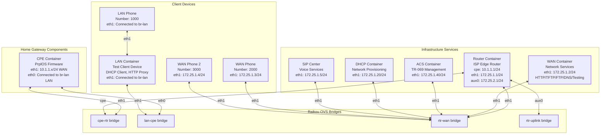

# Network Topology Reference: Raikou + Boardfarm Testbed

## Overview

The Raikou + Boardfarm testbed simulates a complete home gateway environment using containerized components. The testbed operates on two distinct network layers:

- **Docker Management Network** (`192.168.56.0/24`): Provides SSH access to most containers for configuration and management (CPE container excluded - uses `network_mode: none`)
- **Simulated Network** (`172.25.1.0/24`, `10.1.1.0/24`): The testbed topology created by Raikou using OVS bridges

## Network Architecture

### Home Gateway Components

| Component  | Description                                        | Image           |
| ---------- | -------------------------------------------------- | --------------- |
| **CPE**    | Home gateway device (PrplOS firmware)              | `cpe:v1.2.0`    |
| **Router** | Network gateway with FRR routing and NAT           | `router:v1.2.0` |

### Infrastructure Services

| Component      | Description                                                        | Image         |
| -------------- | ------------------------------------------------------------------ | ------------- |
| **WAN**        | Network services container (HTTP/TFTP/FTP/DNS/proxy/testing tools) | `wan:v1.2.0`  |
| **ACS**        | TR-069 management server                                           | `acs:v1.2.0`  |
| **DHCP**       | Network provisioning server                                        | `dhcp:v1.2.0` |
| **SIP Center** | Voice services                                                     | `sip:v1.2.0`  |

### Client Devices

| Component       | Description                                                      | Image          |
| --------------- | ---------------------------------------------------------------- | -------------- |
| **LAN**         | Test client device on LAN network (DHCP client, HTTP proxy)      | `lan:v1.2.0`   |
| **LAN Phone**   | Phone device on LAN network (number 1000)                        | `phone:v1.2.0` |
| **WAN Phone**   | Phone device on WAN network (number 2000)                        | `phone:v1.2.0` |
| **WAN Phone 2** | Second phone device on WAN network (number 3000)                | `phone:v1.2.0` |

## Network Topology Diagrams

### Docker Management Network

```mermaid
flowchart TB
    MGMT[Boardfarm / Host<br/>192.168.56.1<br/>Management & Testing]

    WAN_MGMT[WAN Container eth0<br/>192.168.56.6<br/>SSH:4001 HTTP:8001]
    ROUTER_MGMT[Router Container eth0<br/>192.168.56.8<br/>SSH:4000]
    LAN_MGMT[LAN Container eth0<br/>192.168.56.x<br/>SSH:4002 HTTP:8002]
    DHCP_MGMT[DHCP Container eth0<br/>192.168.56.x<br/>SSH:4003]
    ACS_MGMT[ACS Container eth0<br/>192.168.56.x<br/>SSH:4503 TR-069:7547 UI:3000]
    CPE_MGMT[CPE Container<br/>No Management Network<br/>docker exec only]
    SIP_MGMT[SIP Center eth0<br/>192.168.56.x<br/>SSH:4005]
    LAN_PHONE_MGMT[LAN Phone eth0<br/>192.168.56.x<br/>SSH:4006]
    WAN_PHONE_MGMT[WAN Phone eth0<br/>192.168.56.x<br/>SSH:4007]
    WAN_PHONE2_MGMT[WAN Phone 2 eth0<br/>192.168.56.x<br/>SSH:4008]


    %% Management Connections
    MGMT -.->|SSH/Management| WAN_MGMT
    MGMT -.->|SSH/Management| ROUTER_MGMT
    MGMT -.->|SSH/Management| LAN_MGMT
    MGMT -.->|SSH/Management| DHCP_MGMT
    MGMT -.->|SSH/Management| ACS_MGMT
    MGMT -.->|docker exec| CPE_MGMT
    MGMT -.->|SSH/Management| SIP_MGMT
    MGMT -.->|SSH/Management| LAN_PHONE_MGMT
    MGMT -.->|SSH/Management| WAN_PHONE_MGMT
    MGMT -.->|SSH/Management| WAN_PHONE2_MGMT

    %% Styling
    classDef mgmt stroke-width:3px
    classDef management stroke-width:2px

    class MGMT mgmt
    class WAN_MGMT,ROUTER_MGMT,LAN_MGMT,DHCP_MGMT,ACS_MGMT,CPE_MGMT,SIP_MGMT,LAN_PHONE_MGMT,WAN_PHONE_MGMT,WAN_PHONE2_MGMT management
```



### Simulated Network Topology



## Network Segments Reference

### CPE-Router Segment (`cpe-rtr` bridge)

| Component | Interface | IP Address           | Purpose          |
| --------- | --------- | -------------------- | ---------------- |
| CPE       | eth1      | `10.1.1.x/24` (DHCP) | WAN connectivity |
| Router    | cpe       | `10.1.1.1/24`        | Gateway          |

### LAN Segment (`lan-cpe` bridge)

| Component     | Interface | Connection            | Purpose                                    |
| ------------- | --------- | --------------------- | ------------------------------------------ |
| CPE           | eth0      | Connected to `br-lan` | LAN interface (gateway)                    |
| LAN Container | eth1      | Connected to `br-lan` | Test client device (DHCP client, HTTP proxy) |
| LAN Phone     | eth1      | Connected to `br-lan` | Client device (SIP phone)                  |

### WAN Segment (`rtr-wan` bridge)

| Component      | Interface | IP Address       | Purpose                                            |
| -------------- | --------- | ---------------- | -------------------------------------------------- |
| Router         | eth1      | `172.25.1.1/24`  | Gateway                                            |
| WAN Container  | eth1      | `172.25.1.2/24`  | Network services (HTTP/TFTP/FTP/DNS/proxy/testing) |
| WAN Phone      | eth1      | `172.25.1.3/24`  | Client device (number 2000)                        |
| WAN Phone 2    | eth1      | `172.25.1.4/24`  | Client device (number 3000)                        |
| SIP Center     | eth1      | `172.25.1.5/24`  | Voice services (registers 1000, 2000, 3000)        |
| DHCP Container | eth1      | `172.25.1.20/24` | Network provisioning                               |
| ACS Container  | eth1      | `172.25.1.40/24` | TR-069 management                                  |

### Uplink Segment (`rtr-uplink` bridge)

| Component | Interface | IP Address      | Purpose                          |
| --------- | --------- | --------------- | -------------------------------- |
| Router    | aux0      | `172.25.2.1/24` | External connectivity simulation |

## Container Specifications

### Container Ports and Access

| Container  | SSH Port | Other Ports                          | Connection Method                                 |
| ---------- | -------- | ------------------------------------ | ------------------------------------------------- |
| router     | 4000     | -                                    | `ssh -p 4000 root@localhost`                      |
| wan        | 4001     | 8001 (HTTP)                          | `ssh -p 4001 root@localhost`                      |
| lan        | 4002     | 8002 (HTTP)                          | `ssh -p 4002 root@localhost`                      |
| dhcp       | 4003     | -                                    | `ssh -p 4003 root@localhost`                      |
| acs        | 4503     | 7547 (TR-069), 7557, 7567, 3000 (UI) | `ssh -p 4503 root@localhost`                      |
| cpe        | -        | -                                    | `docker exec -it cpe ash` (no management network) |
| sipcenter  | 4005     | 5060 (SIP)                           | `ssh -p 4005 root@localhost`                      |
| lan-phone  | 4006     | -                                    | `ssh -p 4006 root@localhost` (number 1000)        |
| wan-phone  | 4007     | -                                    | `ssh -p 4007 root@localhost` (number 2000)        |
| wan-phone2 | 4008     | -                                    | `ssh -p 4008 root@localhost` (number 3000)        |

**Default Credentials**: `root` / `bigfoot1`

**Note**: The CPE container uses `network_mode: none` in docker-compose.yaml and has no Docker management network interface. It is accessed directly via `docker exec` and only has interfaces on the simulated network:

- `eth0`: Connected to `lan-cpe` bridge (LAN side, part of `br-lan` bridge inside container)
- `eth1`: Connected to `cpe-rtr` bridge (WAN side, gets IP via DHCP)

## Router Configuration

### Interface Configuration

| Interface | Bridge         | IP Address        | Purpose                             |
| --------- | -------------- | ----------------- | ----------------------------------- |
| cpe       | cpe-rtr        | `10.1.1.1/24`     | CPE-facing (LAN side)               |
| eth1      | rtr-wan        | `172.25.1.1/24`   | WAN-facing (internet-facing)        |
| aux0      | rtr-uplink     | `172.25.2.1/24`   | Auxiliary uplink                    |
| eth0      | Docker network | `192.168.56.x/24` | Management (isolated) - Router only |

### NAT Configuration

```yaml
environment:
    - ENABLE_NAT_ON=eth1
```

**NAT Interface**: `eth1` (WAN interface)  
**NAT Behavior**: Masquerades traffic from `10.1.1.0/24` as `172.25.1.1` when accessing WAN services

### Network Communication Flow

1. CPE (`10.1.1.x`) sends request to `172.25.1.2`
2. Router receives on `cpe` interface, routes to `eth1`
3. Router applies NAT (source: `10.1.1.x` → `172.25.1.1`)
4. WAN Container receives request, processes service
5. Router routes response back to CPE
6. CPE receives service response

## Boardfarm Integration

### Device Mapping

| Boardfarm Device | Container                        | Connection Method          |
| ---------------- | -------------------------------- | -------------------------- |
| `bf_cpe`         | cpe                              | `docker exec -it cpe ash`  |
| `bf_wan`         | wan                              | SSH port 4001              |
| `bf_lan`         | lan                              | SSH port 4002              |
| `bf_acs`         | acs                              | SSH port 4503              |
| `bf_dhcp`        | dhcp                             | SSH port 4003              |
| `bf_phone`       | lan-phone, wan-phone, wan-phone2 | SSH ports 4006, 4007, 4008 |

### Boot Process

1. **Raikou**: Creates network topology and starts containers
2. **Boardfarm**: Connects to containers via Docker management network (SSH) or `docker exec` (CPE) and provisions devices
3. **CPE**: Obtains IP via DHCP on eth1 and registers with ACS
4. **Testing**: Network validation and service access

## Troubleshooting Reference

### Common Issues

#### CPE Cannot Reach WAN

**Checks:**

- CPE has IP on eth1 (`10.1.1.x/24`)
- Router NAT enabled on `eth1` interface
- Router has routes between `10.1.1.0/24` and `172.25.1.0/24`

**Verification:**

```bash
docker exec -it cpe ash -c "ping -c 3 10.1.1.1"    # Router gateway
docker exec -it cpe ash -c "ping -c 3 172.25.1.2"  # WAN container
docker exec -it router bash -c "ip route show"
```

#### Wrong IP Address for Testing

**Use**: `172.25.1.2` for WAN services (simulated network)  
**Do NOT use**: `192.168.56.6` (Docker management network)

#### NAT Not Working

**Check Configuration:**

- Verify `ENABLE_NAT_ON=eth1` in docker-compose.yaml
- Check iptables rules: `docker exec -it router bash -c "iptables -t nat -L"`

### Verification Commands

```bash
# Check CPE connectivity
docker exec -it cpe ash -c "ping -c 3 10.1.1.1"    # Router gateway
docker exec -it cpe ash -c "ping -c 3 172.25.1.2"  # WAN container

# Check router NAT
docker exec -it router bash -c "iptables -t nat -L"

# Check network topology
docker exec -it router bash -c "ip route show"

# Check container status
docker compose ps

# Check SSH service
./validate-ssh.sh
```

## Quick Reference Tables

### Network Addresses Summary

| Network           | Subnet            | Purpose                                                         |
| ----------------- | ----------------- | --------------------------------------------------------------- |
| Docker Management | `192.168.56.0/24` | Container SSH access (CPE excluded - uses `network_mode: none`) |
| CPE-Router        | `10.1.1.0/24`     | CPE WAN connectivity                                            |
| WAN Services      | `172.25.1.0/24`   | Infrastructure services                                         |
| Uplink            | `172.25.2.0/24`   | External connectivity                                           |

### Service IP Addresses

| Service        | IP Address    | Ports                                    |
| -------------- | ------------- | ---------------------------------------- |
| Router Gateway | `172.25.1.1`  | -                                        |
| WAN Server     | `172.25.1.2`  | 80 (HTTP), 69 (TFTP), 21 (FTP), 53 (DNS) |
| WAN Phone      | `172.25.1.3`  | - (number 2000)                          |
| WAN Phone 2    | `172.25.1.4`  | - (number 3000)                          |
| SIP Server     | `172.25.1.5`  | 5060 (SIP)                               |
| DHCP Server    | `172.25.1.20` | 67, 547                                  |
| ACS Server     | `172.25.1.40` | 7547 (TR-069)                            |

### OVS Bridges

| Bridge     | Connected Components                                     | Purpose               |
| ---------- | -------------------------------------------------------- | --------------------- |
| cpe-rtr    | CPE eth1, Router cpe                                     | CPE WAN connectivity  |
| lan-cpe    | CPE eth0, LAN eth1, LAN Phone                            | Home network          |
| rtr-wan    | Router eth1, WAN, WAN Phone, WAN Phone 2, SIP, DHCP, ACS | WAN services          |
| rtr-uplink | Router aux0                                              | External connectivity |
