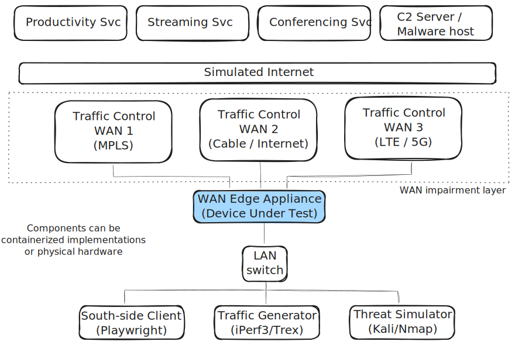

# Technical Brief: WAN Edge Appliance Testing Framework

**Date:** February 07, 2026
**Version:** 2.0 (Container-First Plan, Linux Router DUT)
**Status:** Draft

---

## 1. Executive Summary

This document defines the scope and implementation plan for a unified testing framework designed to validate **WAN Edge appliances**. As the enterprise edge evolves from simple routing to intelligent SD-WAN and SASE (Secure Access Service Edge), verification must move beyond basic connectivity to encompass application performance, traffic intelligence, security efficacy, and user experience.

### Related Documents

**SD-WAN Component Implementation Plans**

| Document | Description |
| :--- | :--- |
| `LinuxSDWANRouter_Implementation_Plan.md` | Implementation design for the Linux-based DUT (Digital Twin): FRR routing, BFD echo-mode failover, PBR, StrongSwan (Phase 3.5) |
| `QoE_Client_Implementation_Plan.md` | Implementation design for the Playwright-based QoE measurement client: `QoEResult`, MOS calculation, `measure_productivity/streaming/conferencing()` |
| `Application_Services_Implementation_Plan.md` | Implementation design for North-side target services (Productivity, Streaming, Conferencing) and threat simulation (`MaliciousHost`) |
| `Traffic_Management_Components_Architecture.md` | Detailed design for `TrafficController`, `ImpairmentProfile`, `inject_transient()`, and the `tc netem` kernel interface |
| `TrafficGenerator_Implementation_Plan.md` | Implementation design for the `TrafficGenerator` component: iPerf3 Docker container, device class, QoS contention scenarios |

**Testbed Configuration & Topology**

| Document | Description |
| :--- | :--- |
| `SDWAN_Testbed_Configuration.md` | Complete Raikou `config_sdwan.json`, `docker-compose-sdwan.yaml` (project `boardfarm-bdd-sdwan`), OVS bridge topology, IP addressing, Boardfarm `bf_config_sdwan.json` / `bf_env_sdwan.json`, and startup sequence for the fully Dockerised SD-WAN testbed |
| `Testbed_CA_Setup.md` | Step-by-step procedure for generating the testbed root CA and all service certificates (Phase 3.5): Nginx HTTPS/HTTP3, WebRTC WSS, StrongSwan IKEv2, Playwright trust store |

**Framework Architecture**

| Document | Description |
| :--- | :--- |
| `Boardfarm Test Automation Architecture.md` | Reference architecture for the four-layer Boardfarm framework: Templates → Device Classes → Use Cases → Step Definitions / Keywords. Defines portability, anti-patterns, and the `via` parameter convention |

The framework is designed to validate market-leading WAN Edge platforms, including:

* **Cisco Catalyst 8000 Series (Viptela):** IOS-XE based SD-WAN stack (Heavyweight routing).
* **Fortinet FortiGate:** ASIC-accelerated path steering and NGFW convergence.
* **VMware SD-WAN (Velocloud):** Dynamic Multi-Path Optimization (DMPO) and packet-level steering.
* **Palo Alto ION (Prisma SD-WAN):** App-defined networking (Layer 7 focus).
* **HPE Aruba EdgeConnect (Silver Peak):** Path conditioning (FEC, Packet Order Correction).

The testing strategy focuses on four core pillars:

1. **Quality of Experience (Outcome):** Does the user perceive the network as good?
2. **Quality of Service (Mechanism):** Is traffic prioritized correctly?
3. **Path Steering (Intelligence):** Is the best link chosen dynamically?
4. **Security (Protection):** Is the edge secure against threats without compromising performance?

Portability across DUTs (Linux Router → commercial appliances) is enforced by the **`WANEdge` Boardfarm template**, which is the single abstraction boundary between test logic and vendor-specific implementations. QoE measurement follows the same four-layer Boardfarm architecture via the **`QoEClient` template**, keeping measurement logic out of step definitions.

---

## 2. Testing Pillars

### 2.1 Quality of Experience (QoE) - The Outcome

QoE verifies the end-user's perspective. It answers: *"Can the user effectively perform their job despite network conditions?"*
This pillar uses the **FSM Three-Mode Architecture** (Functional, Navigation, Visual) to validate specific service categories.

#### Service Categories & Metrics

| Category | Description | Key Metrics (SLOs) |
| :--- | :--- | :--- |
| **Productivity (SaaS)** | Interaction with cloud suites (Office 365, Salesforce). | **Page Load Time:** < 2.5s (Good), < 4s (Acceptable)<br>**Time to First Byte (TTFB):** < 200ms<br>**Transaction Success:** > 99.9% |
| **Streaming** | Video on Demand (Netflix, YouTube, Training). | **Startup Time:** < 2s<br>**Rebuffer Ratio:** < 1%<br>**Resolution:** Sustained 1080p/4K |
| **Conferencing** | Real-time audio/video (Teams, Zoom). | **MOS (Mean Opinion Score):** > 4.0 (Good), > 3.5 (Acceptable)<br>**One-Way Latency:** < 150ms<br>**Jitter:** < 30ms |

#### Canonical Impairment Profiles

To verify resilience, the testbed applies deterministic network profiles. These are the **canonical preset names** used across all tests and env configs (see `Traffic_Management_Components_Architecture.md` for the `impairment_presets` env config block):

| Profile Name | Latency | Jitter | Packet Loss | Bandwidth | Description |
| :--- | :--- | :--- | :--- | :--- | :--- |
| `pristine` | 5ms | 1ms | 0% | 1 Gbps | Ideal conditions |
| `cable_typical` | 15ms | 5ms | 0.1% | 100 Mbps | Typical subscriber |
| `4g_mobile` | 80ms | 30ms | 1% | 20 Mbps | Mobile/LTE failover |
| `satellite` | 600ms | 50ms | 2% | 10 Mbps | High latency link |
| `congested` | 25ms | 40ms | 3% | Variable | Peak hour congestion |

> **Note — Asymmetric Profiles:** SD-WAN devices probe link quality bidirectionally. Tests that target the DUT's path selection algorithm should specify **per-direction impairment** (e.g., uplink pristine / downlink congested) using the `egress_*` / `ingress_*` overrides in `ImpairmentProfile` (see Section 4.5). Symmetric profiles are sufficient for QoE-only tests.

> **Note — Linux `tc` Ingress Limitation:** Linux `tc netem` operates on egress only. Ingress rate-limiting requires an IFB (Intermediate Functional Block) virtual device with an ingress filter redirect. The `LinuxTrafficController` implementation must handle IFB setup when `ingress_bandwidth_limit_mbps` is set. This constraint does not apply to hardware impairment appliances (Spirent, Keysight).

### 2.2 Quality of Service (QoS) - The Mechanism

QoS verifies the underlying mechanisms the DUT uses to manage contention. It answers: *"Is the device correctly classifying and prioritizing traffic?"*

* **Traffic Management:** Verification of Shapers, Policers, and Burst handling.
* **DSCP Tagging:** Ensuring markings are preserved or re-written correctly across the WAN overlay.
* **Rate Limiting:** Verifying SLA enforcement for specific traffic classes.
* **Queuing:** Validating Low Latency Queuing (LLQ) effectiveness under link saturation.

> **Requirement — Background Load:** QoS validation requires **controlled traffic contention** to create queue pressure. Tests use the `TrafficGenerator` Boardfarm template (iPerf3/Trex implementations) to inject calibrated background load at specific DSCP classes before asserting QoE SLOs for priority traffic. See Section 3.4.

### 2.3 Path Steering - The Intelligence

Path Steering verifies the "Brain" of the SD-WAN solution. It answers: *"Is the device making the optimal path decision based on real-time conditions?"*

* **Link Selection:** Choosing the best path based on Latency, Loss, and Jitter measurements.
* **Performance-based Routing (PbR):** Dynamic re-routing of flows when SLA thresholds are breached.
* **Sub-second Failover:** Ensuring session persistence (e.g., Voice calls) during blackout events.
* **Brownout Resilience:** Utilizing features like FEC (Forward Error Correction) or Packet Duplication to mitigate degraded links.

> **Requirement — Convergence Time Measurement:** Sub-second failover assertions require measuring the elapsed time between impairment injection (T0) and traffic switching to the backup path (T1). Tests use `measure_failover_convergence()` from `use_cases/wan_edge.py`, which combines `inject_blackout()` with polling of `WANEdgeDevice.get_active_wan_interface()`. See Section 3.6.

> **Requirement — DUT Path Inspection:** Asserting "traffic is on WAN1" requires reading the DUT's active forwarding state. This is exposed via the `WANEdgeDevice` template (`get_active_wan_interface()`, `get_wan_path_metrics()`). The Linux Router implements `get_active_wan_interface()` via `ip route get` (parsed and translated to a logical label) and `get_wan_path_metrics()` via active `ping` probes to each WAN gateway. Commercial DUT implementations query vendor NETCONF/REST APIs for both. Tests call the template only. See Section 3.4.
>
> **Implementation Note — Failure Detection Mechanism:** The Linux Router uses **FRR BFD single-hop echo mode** for sub-second failover detection (echo interval 100 ms × multiplier 3 = **300 ms detection time**). This deviates from commercial SD-WAN appliances, which typically use **SLA probe-based monitoring** (ICMP/HTTP probes sent through the WAN path to remote servers). Both mechanisms achieve sub-second detection of `netem`-injected packet loss; the difference is hidden behind the `WANEdgeDevice` template. See `LinuxSDWANRouter_Implementation_Plan.md §3.2` for the complete FRR BFD configuration. **Test case portability is fully maintained** — use cases in `wan_edge.py` have no knowledge of the detection mechanism.

### 2.4 Security & Firewalling - The Protection

Security verifies the robustness of the WAN Edge as the first line of defense (SASE/NGFW). It answers: *"Is the network secure, and what is the performance cost of that security?"*

* **Zone-Based Firewalling:** Verification of stateful inspection rules (Allow/Deny) between LAN, WAN, and DMZ zones.
* **Application Control (L7 Filtering):** Blocking specific applications (e.g., BitTorrent, Social Media) regardless of port.
* **Performance Impact:** Measuring "Throughput with Services" vs. "Raw Throughput" to quantify the cost of enabling IPS/IDS and SSL Inspection.
* **Threat Emulation:**
  * **Inbound:** Port scanning detection, DDoS mitigation (rate limiting SYN floods).
  * **Outbound:** Blocking Command & Control (C2) callback attempts (DNS sinkholing).
* **VPN/Overlay Encryption:** Verifying IPsec/WireGuard tunnel establishment and re-keying under load.

#### Security SLOs & Pass/Fail Thresholds

Each security test scenario has a deterministic pass/fail criterion. The table below defines the SLOs, mirroring the QoE metrics table in Section 2.1.

| Category | Description | Key Metrics (SLOs) |
| :--- | :--- | :--- |
| **Zone-Based Firewalling** | Stateful inspection enforcing Allow/Deny between LAN, WAN, and DMZ zones. | **Policy enforcement:** 100% of deny-rule traffic must be blocked<br>**Session tracking:** no traffic accepted without established session<br>**Log completeness:** 100% of deny events logged within 5s |
| **Application Control (L7)** | Deep-packet blocking of specific applications and malware signatures, independent of port. | **C2 callback block rate:** 100% of outbound C2 attempts blocked<br>**EICAR detection:** blocked within first connection attempt (0 bytes transferred to client)<br>**False positive rate:** < 0.1% of legitimate business traffic incorrectly blocked |
| **Threat Mitigation — Inbound** | Detection and mitigation of inbound attacks from the WAN side. | **Port scan detection:** DUT logs detection event within 5s of scan start<br>**SYN flood mitigation:** LAN connectivity maintained (< 1% packet loss to LAN) with flood ≥ 1 000 SYN/s<br>**Rate-limiting trigger:** automatic rate limiting activates at ≥ 1 000 SYN/s |
| **Security Performance Overhead** | Throughput and latency cost of enabling inline security services (IPS, SSL Inspection). | **Throughput degradation:** < 20% reduction vs. raw throughput with IPS + SSL Inspection enabled<br>**Added latency:** < 5ms additional one-way latency introduced by deep-packet inspection<br>**CPU ceiling:** < 80% DUT CPU utilisation at maximum inspection load |
| **VPN / Overlay Integrity** | IPsec/WireGuard tunnel establishment, re-keying, and absence of plaintext leakage. | **Tunnel establishment:** < 3s for IKEv2/IPsec SA negotiation<br>**Phase 2 re-key:** < 1s (no traffic interruption observed by QoEClient)<br>**Plaintext leakage:** zero unencrypted flows observed on WAN after tunnel is up |

> **Note — Security vs. QoE SLOs:** Security and QoE SLOs are complementary, not exclusive. A test that validates C2 blocking may also assert that blocking does not degrade QoE for legitimate traffic. Use `security_use_cases` for the blocking assertion and `qoe_use_cases` for the QoE assertion within the same scenario. See Section 3.7 for `security_use_cases.py` function signatures.

#### Boardfarm Component Mapping for Security Tests

Security test cases follow the same four-layer Boardfarm architecture as all other pillars. They must not embed attack logic in step definitions. **Static test payloads (e.g., EICAR files, PCAP files for packet storms, or C2 callback definitions) must be treated as Test Artifacts. They should be stored in the appropriate artifact directory (e.g., `bf_config/security_artifacts/`) and provided to the `MaliciousHost` via paths resolved from the environment configuration.**

> **Design note — single WAN-side component:** All threat infrastructure lives in one `MaliciousHost` container on the WAN (internet) side of the testbed. It handles both *active inbound attacks* (port scans, SYN floods directed at the DUT WAN IP) and *passive target services* (C2 listener, EICAR file server). The LAN-side "compromised host" role for C2 callback tests is fulfilled by the existing `QoEClient` — it attempts an outbound TCP connection to the `MaliciousHost` listener, which the DUT's Application Control policy must block. No separate LAN-side threat container is required.

> **Layer allocation — Security pillar:** Raw attack actions (`run_port_scan`, `inject_syn_flood`, `start_c2_listener`, etc.) are **template methods** on `MaliciousHost` — they are device actions, not business logic, and different implementations (Kali container, physical host, hardware appliance) implement them differently. `security_use_cases.py` contains only **composite test scenarios** (combining multiple template calls) and **DUT-side assertions** (inspecting DUT logs, firewall counters). This mirrors the pattern of `TrafficController` (device action) vs. `traffic_control.py` use-case (scenario/preset). There is no separate `threat_use_cases.py`.

| Test Goal | Template Method (device action) | `security_use_cases.py` (composite scenario + assertion) |
| :--- | :--- | :--- |
| Port scan detection | `MaliciousHost.run_port_scan(target, port_range)` | `assert_port_scan_detected(malicious_host, target_ip)` |
| SYN flood mitigation | `MaliciousHost.inject_syn_flood(target, rate_pps, duration_s)` | `assert_syn_flood_mitigated(malicious_host, qoe_client, target_ip, connectivity_url)` |
| C2 callback blocking | `MaliciousHost.start_c2_listener(port)` + `QoEClient.attempt_outbound_connection(ip, port)` | `assert_c2_callback_blocked(malicious_host, qoe_client)` |
| EICAR file blocking | `MaliciousHost.get_eicar_url()` (URL served by device) | `assert_eicar_download_blocked(malicious_host, qoe_client)` |
| Generic traffic block | — | `assert_traffic_blocked(wan_edge, src_ip, dst_port)` |

---

## 3. Architecture & Tooling

To ensure consistency and portability across different environments (Functional vs. Pre-Production), the framework leverages a decoupled architecture.

### 3.1 Core Components

* **Raikou:** Used to instantiate networked containers for the functional testbed components (Clients, Servers, ISP Routers). Provides the "Network-in-a-Box" infrastructure with OVS bridges.
* **Boardfarm:** The orchestration layer. Configures the testbed, manages device connections (DUT, Clients, Traffic Generators), and provides a consistent test interface (API) regardless of the underlying hardware.
* **`WANEdge` Template:** The central DUT abstraction. All path-steering, QoS, and security test cases interact with the DUT exclusively through this template. Enables a Linux Router → commercial appliance swap without changing test logic. See Section 3.4.
* **`QoEClient` Template:** Abstracts application-level measurement clients (Playwright, iperf, synthetic conferencing). QoE measurement logic lives in `use_cases/qoe.py`, not in step definitions. See Section 3.5.
* **`TrafficGenerator` Template:** Abstracts background load generation (iPerf3, Trex). Required for QoS contention tests. See Section 3.4.
* **`MaliciousHost` Template:** Abstracts the WAN-side threat infrastructure: inbound attack generation (Nmap, hping3) directed at the DUT, and passive target services (C2 listener, EICAR distribution) for outbound blocking tests. Required for Security pillar tests. See Section 3.4.

### 3.2 Testbed Topology: Dual WAN (Initial) → Triple WAN (Expansion)

The initial testbed uses a **Dual WAN** topology to prove the concept. Expansion to **Triple WAN** follows once validation is complete.



**Connections:**

1. **LAN Side:**
    * **South-Side Clients:** Playwright containers (Browser/App simulation) — exposed via `QoEClient` template. For security tests, the `QoEClient` also simulates a "compromised host" by attempting outbound connections to the `MaliciousHost`.
    * **Traffic Generators:** iPerf3/Trex for background load — exposed via `TrafficGenerator` template.
2. **DUT (WAN Edge Appliance):**
    * **WAN 1 (MPLS/Fiber):** High bandwidth, low latency, high cost.
    * **WAN 2 (Internet/Cable):** High bandwidth, variable latency, low cost.
    * **WAN 3 (LTE/5G):** Metered bandwidth, higher latency, backup path. *(Added in expansion phase.)*
3. **WAN Emulator (Traffic Control):**
    * Injects impairments (Delay, Loss, Jitter, Bandwidth limits) independently on each WAN link — exposed via `TrafficController` template.
4. **Cloud Side:**
    * **North-Side Services:** Productivity, Streaming, and Conferencing servers hosted in the testbed (simulating Cloud/Internet).
    * **Malicious Host:** Single WAN-side Kali Linux container acting as inbound attacker (port scans, SYN floods toward DUT WAN IP) and passive threat server (C2 listener, EICAR distribution) — exposed via `MaliciousHost` template.

### 3.3 Implementation Types

* **Functional Testbed:** All components are containerized implementations, except for the DUT. Traffic control is done via Linux `tc` within Raikou containers.
* **Pre-Production Testbed:** Physical hardware DUTs. Traffic control is handled by dedicated hardware (Spirent, Keysight) or high-performance WAN emulators. Boardfarm abstracts these differences using the `TrafficController` template.

---

### 3.4 Boardfarm Device Templates

This section defines the abstract interfaces (Boardfarm templates) that all SD-WAN test cases depend on. **Test cases import templates only — never concrete device classes.**

#### `WANEdgeDevice` Template

**Location:** `boardfarm3/templates/wan_edge.py`

The central DUT abstraction. Enables the Linux Router (FRR) to serve as a drop-in placeholder for commercial SD-WAN appliances. All path-steering, QoS, and telemetry test logic depends on this interface.

```python
from abc import ABC, abstractmethod
from dataclasses import dataclass

@dataclass
class PathMetrics:
    latency_ms: float
    jitter_ms: float
    loss_percent: float
    link_name: str

@dataclass
class LinkStatus:
    name: str
    state: str          # "up" | "down" | "degraded"
    ip_address: str

@dataclass
class RouteEntry:
    destination: str
    gateway: str
    interface: str
    metric: int

class WANEdgeDevice(ABC):
    """Abstract interface for WAN Edge / SD-WAN appliances.

    Implementations: LinuxRouterDUT, CiscoC8000DUT, FortiGateDUT, VelocloudDUT.
    """

    @property
    @abstractmethod
    def nbi(self):
        """Northbound Interface - Orchestrator REST API."""

    @property
    @abstractmethod
    def gui(self):
        """GUI Interface - Orchestrator Web Dashboard."""

    @property
    @abstractmethod
    def console(self):
        """Console Interface - On-prem CLI/SSH access."""

    @abstractmethod
    def get_active_wan_interface(self, flow_dst: str | None = None, via: str = "console") -> str:
        """Return the logical WAN label currently forwarding traffic.

        The return value is ALWAYS a key from the inventory ``wan_interfaces`` mapping
        (e.g. ``"wan1"``, ``"wan2"``), never a physical OS interface name (e.g. ``"eth2"``
        or ``"GigabitEthernet0/0/0"``). This contract makes test code portable across
        device implementations where physical interface names differ between vendors.

        Implementations MUST:
        1. Query the device for its active forwarding interface (via CLI, API, or NBI).
        2. Reverse-look up the physical name in the ``wan_interfaces`` inventory mapping
           to obtain the logical label before returning.

        The ``wan_interfaces`` key is **required** in the device inventory config for all
        ``WANEdgeDevice`` implementations. Example::

            "wan_interfaces": {"wan1": "eth2", "wan2": "eth3"}          # Linux
            "wan_interfaces": {"wan1": "GigabitEthernet0/0/0", ...}     # Cisco

        :param flow_dst: Optional destination IP/prefix to select a specific flow.
        :param via: Interface to use ("console" for CLI, "nbi" for API, "gui" for web dashboard).
        :return: Logical WAN label, e.g. ``"wan1"`` or ``"wan2"``.
        :raises KeyError: if the physical interface returned by the device is absent from
            the ``wan_interfaces`` mapping.
        """

    @abstractmethod
    def get_wan_path_metrics(self, via: str = "console") -> dict[str, PathMetrics]:
        """Return per-link quality metrics as measured by the device.

        :param via: Interface to use.
        :return: Mapping of logical WAN label → PathMetrics (keys match ``wan_interfaces``).
        """

    @abstractmethod
    def get_wan_interface_status(self, via: str = "console") -> dict[str, LinkStatus]:
        """Return UP/DOWN/degraded state for each WAN interface.

        :param via: Interface to use.
        :return: Mapping of logical WAN label → LinkStatus (keys match ``wan_interfaces``).
        """

    @abstractmethod
    def get_routing_table(self, via: str = "console") -> list[RouteEntry]:
        """Return the current forwarding/routing table.
        
        :param via: Interface to use.
        """

    @abstractmethod
    def apply_policy(self, policy: dict, via: str = "nbi") -> None:
        """Apply a routing or SD-WAN policy (PBR rule, SLA threshold, etc.).

        :param policy: Vendor-neutral policy dict; device class translates to CLI/API.
        :param via: Interface to use (defaulting to API for policy changes).
        """

    @abstractmethod
    def remove_policy(self, name: str, via: str = "nbi") -> None:
        """Remove a previously applied policy by name.

        Required for teardown: scenarios that apply policies must remove them so
        the next scenario starts from a clean baseline.

        :param name: Policy name (as recorded when applied, e.g. from policy dict).
        :param via: Interface to use.
        """

    @abstractmethod
    def bring_wan_down(self, label: str, via: str = "console") -> None:
        """Bring a WAN interface down (e.g. cable unplug simulation).

        :param label: Logical WAN label (e.g. "wan1", "wan2").
        :param via: Interface to use.
        """

    @abstractmethod
    def bring_wan_up(self, label: str, via: str = "console") -> None:
        """Bring a WAN interface up (restore after bring_wan_down).

        :param label: Logical WAN label (e.g. "wan1", "wan2").
        :param via: Interface to use.
        """

    @abstractmethod
    def power_cycle(self) -> None:
        """Power cycle (reboot) the device.

        Implementation varies: PDU for hardware; reboot via console for containers
        (requires restart: always in docker-compose).
        """

    @abstractmethod
    def get_telemetry(self, via: str = "nbi") -> dict:
        """Return a snapshot of device telemetry (uptime, session counts, CPU, etc.).
        
        :param via: Interface to use.
        """
```

**Linux Router implementation** (`LinuxSDWANRouter`): executes `ip route get`, `ip -j link show`, `ping`, and `ip -j route show` via SSH. All methods that return interface identifiers resolve physical names to logical labels via the `wan_interfaces` config mapping. See `LinuxSDWANRouter_Implementation_Plan.md` for the reverse-lookup pattern.

**Commercial implementations** (Phase 5): wrap vendor REST/NETCONF APIs. The test scenarios do not change.

#### `QoEClient` Template

**Location:** `boardfarm3/templates/qoe_client.py`

Abstracts application-level measurement. Keeps QoE measurement logic in `use_cases/qoe.py`, not in step definitions.

```python
from abc import ABC, abstractmethod
from dataclasses import dataclass

@dataclass
class QoEResult:
    """Structured result from a single QoE measurement."""
    category: str               # "productivity" | "streaming" | "conferencing"
    load_time_ms: float | None
    ttfb_ms: float | None
    rebuffer_ratio: float | None  # 0.0–1.0
    mos_score: float | None       # 1.0–5.0
    resolution: str | None        # e.g. "1080p"
    success: bool
    raw_metrics: dict             # Category-specific extras
    # Conferencing metrics (from WebRTC getStats())
    latency_ms: float | None = None
    jitter_ms: float | None = None
    packet_loss_pct: float | None = None

class QoEClient(ABC):
    """Abstract measurement client for end-user experience validation."""

    @property
    @abstractmethod
    def ip_address(self) -> str:
        """Return the LAN-side IP address of this client (for source identification in security assertions)."""

    @abstractmethod
    def measure_productivity(self, url: str, scenario: str = "page_load") -> QoEResult:
        """Load a URL and capture navigation timing / TTFB."""

    @abstractmethod
    def measure_streaming(self, stream_url: str, duration_s: int = 30) -> QoEResult:
        """Play a video stream and capture startup time and rebuffer ratio."""

    @abstractmethod
    def measure_conferencing(self, session_url: str, duration_s: int = 60) -> QoEResult:
        """Join a WebRTC session and capture MOS, latency, jitter via getStats()."""
```

**Functional implementation** (`PlaywrightQoEClient`): uses Playwright navigation timing API and WebRTC `getStats()`. MOS R-Factor calculation lives in `lib/qoe.py`.

#### `TrafficGenerator` Template

**Location:** `boardfarm3/templates/traffic_generator.py`

Abstracts background load generation for QoS contention scenarios.

```python
from abc import ABC, abstractmethod
from dataclasses import dataclass

@dataclass
class TrafficSpec:
    protocol: str           # "tcp" | "udp"
    bandwidth_mbps: int
    dscp: int               # DSCP marking, e.g. 46 for EF (voice)
    duration_s: int
    destination: str        # iPerf3 server IP or hostname
    parallel_streams: int = 1

@dataclass
class TrafficResult:
    sent_mbps: float
    received_mbps: float
    loss_percent: float
    jitter_ms: float | None

class TrafficGenerator(ABC):
    """Abstract background load generator for QoS and contention tests."""

    @abstractmethod
    def start_traffic(self, spec: TrafficSpec) -> None:
        """Start a background traffic flow. Non-blocking."""

    @abstractmethod
    def stop_traffic(self) -> TrafficResult:
        """Stop the flow and return measured results."""

    @abstractmethod
    def run_traffic(self, spec: TrafficSpec) -> TrafficResult:
        """Run a traffic flow to completion and return results."""
```

**Functional implementation** (`IperfTrafficGenerator`): wraps iPerf3 client/server via SSH.

#### `MaliciousHost` Template

**Location:** `boardfarm3/templates/malicious_host.py`

Abstracts the WAN-side threat infrastructure. A single container fulfils two roles:

* **Active inbound attacker** — generates attacks directed at the DUT WAN IP from the internet side (port scans, SYN floods).
* **Passive threat server** — hosts services that LAN clients should be blocked from reaching (C2 listener, EICAR file server).

The LAN-side "compromised host" for C2 callback tests is the existing `QoEClient` — it simply attempts a TCP connection to this host's listener port, which the DUT's Application Control policy must intercept.

```python
from abc import ABC, abstractmethod
from dataclasses import dataclass

@dataclass
class ScanResult:
    target: str
    open_ports: list[int]
    scan_duration_s: float

class MaliciousHost(ABC):
    """Abstract WAN-side threat infrastructure for Security pillar validation.

    Implementations: KaliMaliciousHost.
    """

    @property
    @abstractmethod
    def ip_address(self) -> str:
        """Return the WAN-side IP address of this threat host (from inventory simulated_ip)."""

    # --- Active inbound attacks (WAN → DUT) ---

    @abstractmethod
    def run_port_scan(self, target: str, port_range: str = "1-1024") -> ScanResult:
        """Run a TCP SYN scan against target (typically the DUT WAN IP).

        :param target: IP address or hostname to scan.
        :param port_range: Port range string, e.g. "1-1024".
        :return: ScanResult with open ports visible from the WAN side.
        """

    @abstractmethod
    def inject_syn_flood(self, target: str, rate_pps: int, duration_s: int) -> None:
        """Inject a SYN flood at the given packet rate for the given duration.

        :param target: IP address of the DUT WAN interface.
        :param rate_pps: Packets per second (e.g. 1000).
        :param duration_s: Duration of the flood in seconds.
        """

    # --- Passive threat services (targets for LAN → WAN blocking tests) ---

    @abstractmethod
    def start_c2_listener(self, port: int) -> None:
        """Start a TCP listener to accept inbound C2 beacon connections.

        :param port: TCP port to listen on (e.g. 4444).
        """

    @abstractmethod
    def stop_c2_listener(self, port: int) -> None:
        """Stop the C2 listener on the given port."""

    @abstractmethod
    def check_connection_received(self, port: int, source_ip: str | None = None) -> bool:
        """Return True if a connection attempt reached the listener (firewall bypass).

        A True result means the DUT did NOT block the connection — the test should
        assert False on this return value.

        :param port: Port the listener was running on.
        :param source_ip: Optional — filter by the expected source IP (LAN client).
        """

    @abstractmethod
    def get_eicar_url(self) -> str:
        """Return the HTTP URL hosting the EICAR test file.

        :return: Full URL, e.g. 'http://203.0.113.66/eicar.com'.
        """
```

**Functional implementation** (`KaliMaliciousHost`): SSH into a Kali Linux container. Active attacks use `nmap` and `hping3`; passive services use `netcat` or Python HTTP server.

> **Layer boundary:** All methods above are **device actions** — they live on this template in the same way that `TrafficController.inject_transient()` lives on its template. Step definitions and use-case functions never call `nmap` or `hping3` directly. The `security_use_cases.py` module sits above this template and implements **composite test scenarios** (e.g., `assert_port_scan_detected()` calls `MaliciousHost.run_port_scan()` then inspects the DUT's event log) and **DUT-side assertions** (`assert_traffic_blocked()`). There is no separate `threat_use_cases.py`.

---

#### `ProductivityServer` Template

**Location:** `boardfarm3/templates/productivity_server.py`

Abstracts the North-side Mock SaaS server. QoE productivity tests depend on this interface only — never on Nginx configuration directly.

```python
class ProductivityServer(ABC):
    @abstractmethod
    def get_service_url(self) -> str:
        """Return the base URL for the SaaS application."""

    @abstractmethod
    def set_response_delay(self, delay_ms: int) -> None:
        """Inject server-side processing delay (latency simulation)."""

    @abstractmethod
    def set_content_size(self, size_bytes: int) -> None:
        """Configure the size of the 'large asset' to simulate heavy/light apps."""
```

**Functional implementation** (`NginxProductivityServer`): Nginx container serving a configurable static payload. See `Application_Services_Implementation_Plan.md` Section 3.1.

---

#### `StreamingServer` Template

**Location:** `boardfarm3/templates/streaming_server.py`

Abstracts the North-side Nginx Video-on-Demand server. QoE streaming tests depend on this interface only.

```python
class StreamingServer(ABC):
    @abstractmethod
    def get_manifest_url(self, video_id: str = "default") -> str:
        """Return the HLS (.m3u8) or DASH (.mpd) URL for a video asset."""

    @abstractmethod
    def list_available_bitrates(self, video_id: str = "default") -> list[str]:
        """Return list of available quality profiles (e.g. ['360p', '1080p'])."""

    @abstractmethod
    def ensure_content_available(self, video_id: str = "default") -> None:
        """Guarantee that the named video asset is present and ready to serve.

        Called by the Boardfarm session-scoped setup fixture before any test
        runs. Implementations must be idempotent — if content is already
        present the method returns immediately without re-ingesting.

        This method is testbed infrastructure, not a test operation. It is
        called directly through the typed StreamingServer template reference
        from conftest.py — no use_case wrapper is required or appropriate.

        :param video_id: Asset identifier in the content origin (e.g. 'default', 'bbb').
        :raises RuntimeError: If content cannot be made available within the
                              expected time or the origin rejects the ingest.
        """
```

**Functional implementation** (`NginxStreamingServer`):
- `get_manifest_url()` — constructs the URL from env config (`base_url` + `video_id`).
- `list_available_bitrates()` — queries MinIO via the S3 `ListObjectsV2` API to enumerate subdirectories for the given `video_id`.
- `ensure_content_available()` — connects to `app-server` via SSH, checks whether the MinIO bucket already contains the asset, and if not runs FFmpeg content generation followed by `mc cp` ingest targeting MinIO at `10.100.0.2:9000` over the `content-internal` Raikou bridge. Idempotent: a second call on an already-populated bucket is a no-op.

See `Application_Services_Implementation_Plan.md` Section 3.2 for full content specification.

---

#### `ConferencingServer` Template

**Location:** `boardfarm3/templates/conferencing_server.py`

Abstracts the North-side WebRTC Echo server. QoE conferencing tests depend on this interface only.

```python
class ConferencingServer(ABC):
    @abstractmethod
    def start_session(self, session_id: str) -> str:
        """Start a new conference room/session.

        :return: The WebRTC signalling URL for clients to connect
                 (e.g. 'wss://webrtc-echo:8443/session1').
        """

    @abstractmethod
    def get_session_stats(self, session_id: str) -> dict:
        """Return server-side statistics for the session (Packet Loss, Jitter).

        Useful for correlating client-side MOS with server-side RTCP metrics.
        """
```

**Functional implementation** (`WebRTCConferencingServer`): `pion`-based WebRTC Echo container. No Coturn STUN/TURN required — direct peer connectivity is guaranteed in the controlled testbed network. See `Application_Services_Implementation_Plan.md` Section 3.3.

---

### 3.5 QoE Measurement Architecture

QoE measurement follows the standard Boardfarm four-layer architecture:

```
Feature File (Gherkin)
  └─► Step Definition (thin wrapper)
        └─► use_cases/qoe.py  (business logic: SLO assertions, R-Factor)
              └─► QoEClient template
                    └─► PlaywrightQoEClient (device class)
```

**Key principle:** MOS R-Factor calculation and SLO threshold comparisons live in `lib/qoe.py` and `use_cases/qoe.py`. Step definitions never contain QoE math.

```python
# use_cases/qoe.py (excerpt)

def assert_productivity_slo(client: QoEClient, url: str) -> QoEResult:
    """Run productivity measurement and assert SLOs.

    .. hint:: Implements steps such as:
        - Then the page load time should meet the SLO
        - Then the TTFB should be below 200ms

    :raises AssertionError: if load_time_ms > 4000 or ttfb_ms > 200
    """
    result = client.measure_productivity(url)
    assert result.load_time_ms is not None and result.load_time_ms <= 4000, (
        f"Page load {result.load_time_ms:.0f}ms exceeds 4s SLO"
    )
    assert result.ttfb_ms is not None and result.ttfb_ms <= 200, (
        f"TTFB {result.ttfb_ms:.0f}ms exceeds 200ms SLO"
    )
    return result


def assert_conferencing_slo(client: QoEClient, session_url: str) -> QoEResult:
    """Run conferencing measurement and assert MOS SLO (> 3.5 acceptable).

    .. hint:: Implements steps such as:
        - Then the conferencing quality should meet the SLO

    :raises AssertionError: if mos_score < 3.5
    """
    result = client.measure_conferencing(session_url)
    assert result.mos_score is not None and result.mos_score >= 3.5, (
        f"MOS {result.mos_score:.2f} below 3.5 SLO"
    )
    return result


def assert_conferencing_qoe(
    qoe_client: QoEClient,
    conferencing_server: ConferencingServer,
    session_url: str,
    duration_s: int = 30,
    min_mos: float = 4.0,
    max_jitter_ms: float = 30.0,
    max_loss_pct: float = 1.0,
) -> tuple[QoEResult, dict]:
    """Measure conferencing QoE and correlate with server-side RTCP metrics.

    Calls measure_conferencing() on the client (downlink view) and
    get_session_stats() on the ConferencingServer (uplink view) to check
    both directions of the media path independently.

    Correlation logic:
    - client.packet_loss_pct ≈ server['packets_lost'] / server['packets_sent']:
      symmetric → WAN link impairment; asymmetric → identifies impaired direction.
    - client.jitter_ms vs server['jitter_ms']:
      large delta isolates which direction carries the queuing problem.

    Phase guidance: Phase 1–3 tests use assert_conferencing_slo() (client-side
    only) for SLO pass/fail. Use this function from Phase 2 onwards when
    asymmetric path analysis or richer diagnostic context is needed.

    .. hint:: Implements steps such as:
        - Then the conferencing quality should meet the SLO with server correlation
        - Then the uplink and downlink impairment should be consistent

    :param qoe_client: QoEClient device instance (LAN side).
    :param conferencing_server: ConferencingServer device instance (North side).
    :param session_url: WebRTC signalling URL, e.g. 'ws://172.16.0.11:8443/session1'.
    :param duration_s: Duration of the conferencing session to measure.
    :param min_mos: Minimum acceptable MOS score (default 4.0).
    :param max_jitter_ms: Maximum acceptable client-side jitter in ms (default 30ms).
    :param max_loss_pct: Maximum acceptable client-side packet loss % (default 1%).
    :return: Tuple of (QoEResult from client, server_stats dict from ConferencingServer).
    :raises AssertionError: If any SLO threshold is breached.
    """
    session_id = session_url.rstrip("/").split("/")[-1]
    session_url_with_session = conferencing_server.start_session(session_id)

    result = qoe_client.measure_conferencing(session_url_with_session, duration_s)
    server_stats = conferencing_server.get_session_stats(session_id)

    # Client-side SLO assertions
    assert result.mos_score is not None and result.mos_score >= min_mos, (
        f"MOS {result.mos_score:.2f} below {min_mos} SLO"
    )
    assert result.jitter_ms is not None and result.jitter_ms <= max_jitter_ms, (
        f"Client jitter {result.jitter_ms:.1f}ms exceeds {max_jitter_ms}ms SLO"
    )
    assert result.packet_loss_pct is not None and result.packet_loss_pct <= max_loss_pct, (
        f"Client loss {result.packet_loss_pct:.1f}% exceeds {max_loss_pct}% SLO"
    )

    # Directional correlation (diagnostic — logged, not asserted by default)
    server_loss_pct = (
        100.0 * server_stats.get("packets_lost", 0) / server_stats["packets_sent"]
        if server_stats.get("packets_sent", 0) > 0
        else 0.0
    )
    if abs(result.packet_loss_pct - server_loss_pct) > 2.0:
        direction = "downlink" if result.packet_loss_pct > server_loss_pct else "uplink"
        print(
            f"⚠ Asymmetric loss detected — {direction} impaired: "
            f"client={result.packet_loss_pct:.1f}% server={server_loss_pct:.1f}%"
        )

    return result, server_stats
```

**BDD step (thin wrapper):**

```python
@then('the conferencing quality should meet the SLO')
def assert_conferencing_slo_step(qoe_client, bf_context):
    result = qoe_use_cases.assert_conferencing_slo(qoe_client, bf_context.session_url)
    print(f"✓ MOS {result.mos_score:.2f} — SLO passed")


@then('the conferencing quality should meet the SLO with server correlation')
def assert_conferencing_qoe_step(qoe_client, conf_server, bf_context):
    result, server_stats = qoe_use_cases.assert_conferencing_qoe(
        qoe_client, conf_server, bf_context.session_url
    )
    print(
        f"✓ MOS {result.mos_score:.2f} | client loss {result.packet_loss_pct:.1f}% "
        f"| server loss {100.0 * server_stats.get('packets_lost', 0) / server_stats['packets_sent']:.1f}%"
    )
```

---

### 3.6 Failover Convergence Time Measurement

Sub-second failover validation (Pillar 2.3) requires correlating:

* **T0:** Impairment injected on the primary WAN link
* **T1:** DUT detects failure (BFD timeout, probe failure, SLA breach)
* **T2:** DUT switches active path to backup link
* **T3 - T0:** Total convergence time (the asserted metric)

This is implemented in `use_cases/wan_edge.py`:

```python
def measure_failover_convergence(
    dut: WANEdgeDevice,
    impairment_ctrl: TrafficController,
    primary_link: str,
    backup_link: str,
    poll_interval_ms: int = 50,
    timeout_ms: int = 5000,
) -> float:
    """Inject a blackout on primary_link and measure time until DUT switches to backup_link.

    .. hint:: Implements steps such as:
        - Then the DUT should switch to the backup path within 1000ms

    :param dut: WANEdgeDevice instance
    :param impairment_ctrl: TrafficController for the primary WAN link
    :param primary_link: Expected primary interface name (e.g. "wan1")
    :param backup_link: Expected backup interface name (e.g. "wan2")
    :param poll_interval_ms: How often to poll the DUT's active interface
    :param timeout_ms: Maximum wait for convergence before failing
    :return: Convergence time in milliseconds
    :raises AssertionError: if convergence does not occur within timeout_ms
    """
    import time
    from boardfarm3.use_cases import traffic_control as traffic_control_use_cases
    
    traffic_control_use_cases.inject_blackout(impairment_ctrl, duration_ms=timeout_ms + 1000)
    t0 = time.monotonic()
    deadline = t0 + timeout_ms / 1000
    while time.monotonic() < deadline:
        if dut.get_active_wan_interface() == backup_link:
            return (time.monotonic() - t0) * 1000
        time.sleep(poll_interval_ms / 1000)
    raise AssertionError(
        f"DUT did not switch from {primary_link!r} to {backup_link!r} within {timeout_ms}ms"
    )
```

**BDD step:**

```gherkin
When the primary WAN link fails
Then the DUT should switch to the backup path within 1000ms
```

```python
@then('the DUT should switch to the backup path within {max_ms:d}ms')
def assert_failover_time(dut, wan1_impairment, max_ms, bf_context):
    conv_ms = wan_edge_use_cases.measure_failover_convergence(
        dut, wan1_impairment, primary_link="wan1", backup_link="wan2"
    )
    assert conv_ms <= max_ms, f"Convergence {conv_ms:.0f}ms exceeded {max_ms}ms threshold"
    print(f"✓ Failover in {conv_ms:.0f}ms")
```

---

### 3.7 Security Use Case Architecture

Security tests follow the same four-layer Boardfarm architecture:

```
Feature File (Gherkin)
  └─► Step Definition (thin wrapper)
        └─► use_cases/security_use_cases.py  (composite scenarios + DUT assertions)
              └─► MaliciousHost template   (raw attack device actions)
              └─► QoEClient template       (LAN-side client actions)
              └─► WANEdgeDevice template   (DUT log / policy inspection)
```

**Key principles:**
- Raw attack actions (`run_port_scan`, `inject_syn_flood`, `start_c2_listener`, etc.) are **template methods** on `MaliciousHost` — device actions, not business logic.
- `security_use_cases.py` is the only security-related use-case module. It contains composite test scenarios and DUT-side assertions only.
- No attack logic appears in step definitions or Gherkin files.

#### Required template extensions

Two additional template methods are needed beyond the base definitions in §3.4:

**`QoEClient`** — add `attempt_outbound_connection()`:

```python
@abstractmethod
def attempt_outbound_connection(self, host: str, port: int, timeout_s: float = 5) -> bool:
    """Attempt an outbound connection from the LAN client to the given host:port.

    Used to simulate a compromised host initiating a C2 callback.
    The connection attempt is intentionally fire-and-forget: success or failure
    is reported, but no data is exchanged. The DUT's Application Control policy
    is expected to intercept and block it.

    :param host: IP address or hostname to connect to (e.g. MaliciousHost WAN IP).
    :param port: Port number (e.g. 4444 for C2).
    :param timeout_s: Connection timeout in seconds.
    :return: True if the connection completed; False if refused/blocked.
    """
```

**`WANEdgeDevice`** — add `get_security_log_events()`:

```python
@abstractmethod
def get_security_log_events(self, since_s: int = 30) -> list[dict]:
    """Return security log entries recorded in the last `since_s` seconds.

    Each entry is a dict with at minimum:
      - "action"   : "block" | "alert" | "allow"
      - "src_ip"   : source IP address
      - "dst_port" : destination port (int)
      - "protocol" : "tcp" | "udp" | "icmp"
      - "timestamp": ISO-8601 string

    Linux Router implementation: SSH + grep/journalctl on iptables LOG entries.
    Commercial DUT implementation: query vendor syslog or REST security-events API.

    :param since_s: How far back to search (seconds from now).
    :return: List of event dicts; empty list if none found.
    """
```

#### `security_use_cases.py`

**Location:** `boardfarm3/use_cases/security_use_cases.py`

```python
# use_cases/security_use_cases.py

from boardfarm3.templates.malicious_host import MaliciousHost, ScanResult
from boardfarm3.templates.qoe_client import QoEClient, QoEResult
from boardfarm3.templates.wan_edge import WANEdgeDevice


def assert_port_scan_detected(
    malicious_host: MaliciousHost,
    target_ip: str,
    expected_open_ports: list[int] | None = None,
) -> ScanResult:
    """Run a TCP SYN scan from the WAN side and assert the DUT's port exposure.

    .. hint:: Implements steps such as:
        - When a port scan is launched against the DUT WAN interface
        - Then no unexpected ports should be exposed on the WAN interface

    The DUT is expected to silently drop or reject all ports not explicitly
    required (e.g., IKE 500/4500 for VPN). An empty expected_open_ports list
    asserts full stealth mode.

    :param malicious_host: WAN-side threat infrastructure.
    :param target_ip: IP address of the DUT WAN interface to scan.
    :param expected_open_ports: Ports expected to be reachable from WAN.
                                Pass [] to assert zero exposure (default).
    :return: ScanResult with the ports visible from the WAN side.
    :raises AssertionError: if any unexpected port is open on the WAN interface.
    """
    if expected_open_ports is None:
        expected_open_ports = []
    result = malicious_host.run_port_scan(target_ip)
    unexpected = set(result.open_ports) - set(expected_open_ports)
    assert not unexpected, (
        f"Unexpected open ports on WAN interface {target_ip}: {sorted(unexpected)}"
    )
    return result


def assert_syn_flood_mitigated(
    malicious_host: MaliciousHost,
    qoe_client: QoEClient,
    target_ip: str,
    connectivity_url: str,
    rate_pps: int = 1000,
    duration_s: int = 10,
) -> QoEResult:
    """Inject a SYN flood from the WAN side and assert LAN connectivity is maintained.

    .. hint:: Implements steps such as:
        - When a SYN flood is launched against the DUT at 1000 pps
        - Then LAN clients should maintain connectivity through the DUT

    inject_syn_flood() blocks for duration_s. The QoE check runs immediately
    after to confirm the DUT recovered and is still forwarding LAN traffic.
    For longer floods, the caller may run the flood in a background thread
    and call qoe_client.measure_productivity() concurrently.

    :param malicious_host: WAN-side threat infrastructure.
    :param qoe_client: LAN-side client to verify DUT is still forwarding traffic.
    :param target_ip: DUT WAN IP targeted by the flood.
    :param connectivity_url: URL to load during/after the flood as a liveness probe.
    :param rate_pps: SYN packet rate (e.g. 1000 pps triggers most rate-limiters).
    :param duration_s: Duration of the flood in seconds.
    :return: QoEResult confirming the LAN client can still reach the internet.
    :raises AssertionError: if the DUT stops forwarding LAN traffic under flood.
    """
    malicious_host.inject_syn_flood(target_ip, rate_pps=rate_pps, duration_s=duration_s)
    result = qoe_client.measure_productivity(connectivity_url)
    assert result.success, (
        f"LAN connectivity lost during SYN flood ({rate_pps} pps): "
        f"load_time={result.load_time_ms}ms"
    )
    return result


def assert_c2_callback_blocked(
    malicious_host: MaliciousHost,
    qoe_client: QoEClient,
    c2_port: int = 4444,
) -> None:
    """Assert the DUT blocks an outbound C2 callback from a LAN client.

    .. hint:: Implements steps such as:
        - When the compromised host attempts a C2 callback on port 4444
        - Then the DUT should block the outbound connection

    The MaliciousHost starts a TCP listener. The QoEClient (acting as the
    compromised host) attempts an outbound TCP connection to that listener port.
    If the DUT's Application Control policy is working correctly, the SYN packet
    is dropped before it reaches the listener; check_connection_received() returns False.

    :param malicious_host: WAN-side C2 listener host.
    :param qoe_client: LAN-side client simulating the compromised host.
    :param c2_port: TCP port for the C2 beacon (default 4444).
    :raises AssertionError: if the connection reached the listener (DUT did not block it).
    """
    malicious_host.start_c2_listener(c2_port)
    try:
        qoe_client.attempt_outbound_connection(malicious_host.ip_address, c2_port, timeout_s=5)
        connection_reached = malicious_host.check_connection_received(
            c2_port, source_ip=qoe_client.ip_address
        )
        assert not connection_reached, (
            f"C2 callback on port {c2_port} reached the WAN listener — "
            f"DUT Application Control did not block it"
        )
    finally:
        malicious_host.stop_c2_listener(c2_port)


def assert_eicar_download_blocked(
    malicious_host: MaliciousHost,
    qoe_client: QoEClient,
) -> None:
    """Assert the DUT blocks a download of the EICAR test file from WAN.

    .. hint:: Implements steps such as:
        - When a client attempts to download the EICAR test file
        - Then the DUT should block the download

    The EICAR URL is served by the MaliciousHost. The QoEClient attempts
    an HTTP download via Playwright. The DUT's Application Control / AV
    policy must intercept and block the response. A successful download
    (result.success == True) indicates a policy failure.

    :param malicious_host: WAN-side host serving the EICAR file.
    :param qoe_client: LAN-side client attempting the download.
    :raises AssertionError: if the EICAR download succeeded (DUT did not block it).
    """
    eicar_url = malicious_host.get_eicar_url()
    result = qoe_client.measure_productivity(eicar_url, scenario="download")
    assert not result.success, (
        f"EICAR download from {eicar_url} succeeded — "
        f"DUT Application Control / AV policy did not block it"
    )


def stop_active_attacks(malicious_host: MaliciousHost, bf_context: dict) -> None:
    """Stop any attacks or listeners started during the scenario.

    Called by the teardown fixture to clean up MaliciousHost state. Reads
    bf_context["active_attacks"] for the list of attack contexts (e.g.
    C2 listener ports) and stops each one.

    .. hint:: Used by: reset_sdwan_testbed_after_scenario teardown fixture.

    :param malicious_host: WAN-side threat infrastructure.
    :param bf_context: Test context containing active_attacks (e.g. {"c2_ports": [4444]}).
    """
    active = bf_context.get("active_attacks", {})
    for port in active.get("c2_ports", []):
        try:
            malicious_host.stop_c2_listener(port)
        except Exception:
            pass  # Log and continue; next scenario starts fresh


def assert_traffic_blocked(
    wan_edge: WANEdgeDevice,
    src_ip: str,
    dst_port: int,
    protocol: str = "tcp",
    since_s: int = 30,
) -> None:
    """Assert the DUT has logged a blocked traffic event for the given flow.

    .. hint:: Implements steps such as:
        - Then the DUT security log should record the blocked connection

    Used as a supplementary assertion after any blocking test (C2, EICAR, port scan).
    Confirms the DUT not only dropped the traffic but also generated a log entry,
    which is required for SIEM integration and audit trail purposes.

    :param wan_edge: WANEdgeDevice to inspect for security log entries.
    :param src_ip: Source IP of the flow expected to be blocked.
    :param dst_port: Destination port of the flow expected to be blocked.
    :param protocol: "tcp" or "udp".
    :param since_s: How far back to search the DUT log (seconds from now).
    :raises AssertionError: if no matching block log entry is found.
    """
    events = wan_edge.get_security_log_events(since_s=since_s)
    matching = [
        e for e in events
        if e.get("src_ip") == src_ip
        and e.get("dst_port") == dst_port
        and e.get("action") == "block"
    ]
    assert matching, (
        f"No block log entry for {src_ip} → :{dst_port}/{protocol} found "
        f"in DUT security log (last {since_s}s)"
    )
```

**BDD step examples (thin wrappers):**

```gherkin
When a port scan is launched against the DUT WAN interface
Then no unexpected ports should be exposed on the WAN interface

When the compromised host attempts a C2 callback on port 4444
Then the DUT should block the outbound connection
Then the DUT security log should record the blocked connection

When a client attempts to download the EICAR test file
Then the DUT should block the download
```

```python
@then('no unexpected ports should be exposed on the WAN interface')
def assert_no_open_ports(malicious_host, dut, bf_context):
    security_use_cases.assert_port_scan_detected(
        malicious_host, target_ip=dut.wan1_ip, expected_open_ports=[]
    )

@then('the DUT should block the outbound connection')
def assert_c2_blocked(malicious_host, qoe_client, bf_context):
    security_use_cases.assert_c2_callback_blocked(malicious_host, qoe_client)

@then('the DUT security log should record the blocked connection')
def assert_logged(dut, bf_context):
    security_use_cases.assert_traffic_blocked(
        dut, src_ip=bf_context.lan_client_ip, dst_port=bf_context.c2_port
    )
```

---

### 3.8 WAN Edge Use Case Architecture

Path-steering and interface validation logic follows the same four-layer Boardfarm architecture:

```
Feature File (Gherkin)
  └─► Step Definition (thin wrapper)
        └─► use_cases/wan_edge.py  (path assertions, policy verification, interface health)
              └─► WANEdgeDevice template
                    └─► LinuxSDWANRouter / CommercialDUT (device class)
```

**Key principles:**
- `measure_failover_convergence()` (§3.6) measures **timing** for SLO assertion. The functions below assert **correctness** — which path was chosen, whether that matches expected policy, and whether interface state is as expected.
- All path identifiers are logical labels (`"wan1"`, `"wan2"`) — never physical interface names. The device class performs the physical→logical translation.
- `apply_policy()` is a template method on `WANEdgeDevice` (device action). `assert_policy_steered_path()` is the use-case composite that calls it and then verifies the outcome.

#### `wan_edge.py` — complete function set

**Location:** `boardfarm3/use_cases/wan_edge.py`

```python
# use_cases/wan_edge.py

import time
from boardfarm3.templates.wan_edge import WANEdgeDevice, LinkStatus, PathMetrics
from boardfarm3.templates.traffic_controller import TrafficController
from boardfarm3.use_cases import traffic_control as tc_use_cases


def assert_active_path(
    dut: WANEdgeDevice,
    expected_wan: str,
    flow_dst: str | None = None,
) -> None:
    """Assert the DUT is currently forwarding traffic on the expected WAN interface.

    .. hint:: Implements steps such as:
        - Then traffic should be forwarded on wan1
        - Then the active path should be wan2

    The most direct path assertion — reads the DUT's current forwarding state
    and compares it to the expected logical WAN label. No impairment is applied;
    the testbed must already be in the desired state before calling this.

    :param dut: WANEdgeDevice under test.
    :param expected_wan: Logical WAN label expected to be active (e.g. "wan1").
    :param flow_dst: Optional destination IP to select a specific flow path
                     (used when the DUT has per-flow or per-application steering).
    :raises AssertionError: if the active interface does not match expected_wan.
    """
    active = dut.get_active_wan_interface(flow_dst=flow_dst)
    assert active == expected_wan, (
        f"Expected active path {expected_wan!r} but DUT reports {active!r}"
    )


def assert_path_steers_on_impairment(
    dut: WANEdgeDevice,
    impairment_ctrl: TrafficController,
    impaired_wan: str,
    expected_fallback_wan: str,
    duration_ms: int = 10_000,
    poll_interval_ms: int = 50,
    timeout_ms: int = 3_000,
) -> None:
    """Apply blackout impairment to a WAN link and assert the DUT steers to the expected fallback.

    .. hint:: Implements steps such as:
        - When the wan1 link becomes degraded
        - Then traffic should be re-routed to wan2

    Injects a blackout via inject_blackout() (self-restoring after duration_ms). Polls
    until the DUT's active path changes to expected_fallback_wan, then verifies the
    correct fallback was selected — not just that *any* switch occurred.

    Differs from measure_failover_convergence() (§3.6), which measures the convergence
    time for SLO assertions. This function is a correctness assertion: it verifies the
    DUT chose the right path in response to the impairment.

    :param dut: WANEdgeDevice under test.
    :param impairment_ctrl: TrafficController on the impaired WAN link.
    :param impaired_wan: Logical label of the WAN being impaired (e.g. "wan1").
    :param expected_fallback_wan: Logical label the DUT should steer to (e.g. "wan2").
    :param duration_ms: How long the blackout lasts before auto-restore.
    :param poll_interval_ms: Polling interval while waiting for DUT to switch.
    :param timeout_ms: Maximum wait for path switch before failing.
    :raises AssertionError: if DUT does not switch to expected_fallback_wan within timeout_ms.
    """
    tc_use_cases.inject_blackout(impairment_ctrl, duration_ms=duration_ms)
    deadline = time.monotonic() + timeout_ms / 1000
    while time.monotonic() < deadline:
        active = dut.get_active_wan_interface()
        if active != impaired_wan:
            assert active == expected_fallback_wan, (
                f"DUT steered away from {impaired_wan!r} but chose {active!r} "
                f"instead of expected fallback {expected_fallback_wan!r}"
            )
            return
        time.sleep(poll_interval_ms / 1000)
    raise AssertionError(
        f"DUT did not steer away from impaired {impaired_wan!r} "
        f"to {expected_fallback_wan!r} within {timeout_ms}ms"
    )


def assert_policy_steered_path(
    dut: WANEdgeDevice,
    policy: dict,
    flow_dst: str,
    expected_wan: str,
) -> None:
    """Apply a PBR policy and assert the DUT routes the specified flow via the expected WAN.

    .. hint:: Implements steps such as:
        - When a policy routes video traffic via wan2
        - Then traffic to 203.0.113.11 should use wan2

    Calls apply_policy() (a WANEdgeDevice template method) and then verifies the
    resulting forwarding decision for a specific destination. The policy dict is
    vendor-neutral; the device class translates it to FRR route-maps, NETCONF RPCs,
    or REST API calls depending on the DUT implementation.

    :param dut: WANEdgeDevice under test.
    :param policy: Vendor-neutral policy dict. Example::

        {
            "match": {"dscp": 34},          # AF41 — video
            "action": {"prefer_wan": "wan2"}
        }

    :param flow_dst: Destination IP to verify the policy applies to
                     (passed to get_active_wan_interface as flow_dst).
    :param expected_wan: Logical WAN label the policy should steer this flow to.
    :raises AssertionError: if get_active_wan_interface(flow_dst) ≠ expected_wan after
        policy is applied.
    """
    dut.apply_policy(policy)
    active = dut.get_active_wan_interface(flow_dst=flow_dst)
    assert active == expected_wan, (
        f"Policy {policy} should steer {flow_dst!r} to {expected_wan!r} "
        f"but DUT reports active path {active!r}"
    )


def assert_wan_interface_status(
    dut: WANEdgeDevice,
    wan_label: str,
    expected_state: str,
) -> LinkStatus:
    """Assert a specific WAN interface is in the expected operational state.

    .. hint:: Implements steps such as:
        - Then wan1 should be up
        - Then wan2 should report a degraded state
        - Then the failed link should be down

    Reads the DUT's interface status table and asserts the named WAN link
    reports the expected state. Used to verify interface recovery after impairment
    is cleared, or to confirm a deliberate admin-down state before a failover test.

    :param dut: WANEdgeDevice under test.
    :param wan_label: Logical WAN label to check (e.g. "wan1").
    :param expected_state: Expected state string: "up" | "down" | "degraded".
    :return: The full LinkStatus for further inspection if needed.
    :raises KeyError: if wan_label is not present in the status dict.
    :raises AssertionError: if the interface state does not match expected_state.
    """
    statuses = dut.get_wan_interface_status()
    assert wan_label in statuses, (
        f"WAN label {wan_label!r} not found in DUT interface status. "
        f"Available: {list(statuses.keys())}"
    )
    status = statuses[wan_label]
    assert status.state == expected_state, (
        f"WAN interface {wan_label!r} expected state {expected_state!r} "
        f"but reports {status.state!r} (IP: {status.ip_address})"
    )
    return status


def assert_path_metrics_within_slo(
    dut: WANEdgeDevice,
    wan_label: str,
    max_latency_ms: float | None = None,
    max_jitter_ms: float | None = None,
    max_loss_percent: float | None = None,
) -> PathMetrics:
    """Assert the DUT's measured path metrics for a WAN link are within defined thresholds.

    .. hint:: Implements steps such as:
        - Then the wan1 latency should be below 50ms
        - Then the wan2 packet loss should be below 1%

    Uses get_wan_path_metrics() — on the Linux Router this is implemented via active
    ping probes; on commercial DUTs via built-in SLA monitoring. The same assertion
    code works for both because the template normalises the result to PathMetrics.

    :param dut: WANEdgeDevice under test.
    :param wan_label: Logical WAN label to check (e.g. "wan1").
    :param max_latency_ms: Maximum acceptable one-way latency in ms. None = skip check.
    :param max_jitter_ms: Maximum acceptable jitter in ms. None = skip check.
    :param max_loss_percent: Maximum acceptable packet loss (0–100). None = skip check.
    :return: The full PathMetrics for the link (for logging / further assertions).
    :raises AssertionError: if any provided threshold is exceeded.
    """
    all_metrics = dut.get_wan_path_metrics()
    assert wan_label in all_metrics, (
        f"WAN label {wan_label!r} not found in path metrics. "
        f"Available: {list(all_metrics.keys())}"
    )
    m = all_metrics[wan_label]
    if max_latency_ms is not None:
        assert m.latency_ms <= max_latency_ms, (
            f"{wan_label} latency {m.latency_ms:.1f}ms exceeds SLO {max_latency_ms}ms"
        )
    if max_jitter_ms is not None:
        assert m.jitter_ms <= max_jitter_ms, (
            f"{wan_label} jitter {m.jitter_ms:.1f}ms exceeds SLO {max_jitter_ms}ms"
        )
    if max_loss_percent is not None:
        assert m.loss_percent <= max_loss_percent, (
            f"{wan_label} packet loss {m.loss_percent:.2f}% exceeds SLO {max_loss_percent}%"
        )
    return m


# --- Already defined in §3.6 (reproduced here for module completeness) ---
# measure_failover_convergence(dut, impairment_ctrl, primary_link, backup_link,
#                              poll_interval_ms, timeout_ms) -> float
```

**BDD step examples (thin wrappers):**

```gherkin
Given the testbed is in pristine condition
When a policy routes video traffic via wan2
Then traffic to the conferencing server should use wan2

When the wan1 link becomes degraded
Then traffic should be re-routed to wan2
Then wan1 should report a degraded state
Then the wan2 latency should be below 50ms
```

```python
@then('traffic to the conferencing server should use {expected_wan}')
def assert_steered_path(dut, bf_context, expected_wan):
    wan_edge_use_cases.assert_active_path(
        dut, expected_wan, flow_dst=bf_context.conf_server_ip
    )

@then('{wan_label} should report a {expected_state} state')
def assert_interface_state(dut, wan_label, expected_state):
    wan_edge_use_cases.assert_wan_interface_status(dut, wan_label, expected_state)

@then('the {wan_label} latency should be below {max_ms:f}ms')
def assert_latency(dut, wan_label, max_ms):
    wan_edge_use_cases.assert_path_metrics_within_slo(
        dut, wan_label, max_latency_ms=max_ms
    )
```

---

### 3.9 Testbed Reset & Teardown Strategy

#### Ownership Model

The testbed state is managed by three independent layers. Each layer owns what it sets up and is responsible for restoring it:

| Layer | Responsibility | Scope | Reset trigger |
| :--- | :--- | :--- | :--- |
| **Raikou** | Network topology (OVS bridges, veth pairs, container networking) | Testbed lifetime | Manual re-run of Raikou — not touched by tests |
| **Boardfarm setup phase** | Initial device configuration — default impairment profiles, FRR routing, default PBR policy (none), default firewall rules | Session lifetime | Re-run of pytest session |
| **Test scenario** | Any state change applied _during_ the scenario | Scenario lifetime | `autouse` teardown fixture — **always runs, pass or fail** |

The _default_ state is the state established by the Boardfarm setup phase. Every test scenario must leave the testbed in this default state when it finishes, so that subsequent scenarios start from a known baseline.

#### Per-Device Change Registry: `bf_context`

Following the pattern established in `tests/conftest.py`, each test scenario records state changes in `bf_context` as it executes. The teardown fixture reads this registry and reverts every change in reverse order:

```python
# Example: scenario records a change when setting an impairment
bf_context.setdefault("original_impairments", {})[tc_device_name] = tc.get_impairment_profile()
tc.set_impairment_profile(congested_profile)

# Teardown fixture (autouse, function scope) reads and reverts:
for tc_name, original_profile in bf_context.get("original_impairments", {}).items():
    traffic_controllers[tc_name].set_impairment_profile(original_profile)
bf_context.pop("original_impairments", None)
```

#### Teardown Responsibility by Device Template

| Template method called during scenario | Teardown action | Notes |
| :--- | :--- | :--- |
| `TrafficController.set_impairment_profile(profile)` | Restore saved original profile (from `bf_context`) | Record original before first change |
| `TrafficController.inject_transient(...)` | **Automatic** — background thread restores previous kernel state after `duration_ms` | See `Traffic_Management_Components_Architecture.md §7.2` |
| `WANEdgeDevice.apply_policy(policy)` | Call `remove_policy(policy.name)` for each applied policy (from `bf_context`) | Policy names recorded at apply time |
| `WANEdgeDevice.bring_wan_down(label)` | Call `bring_wan_up(label)` for each downed interface | Interface labels recorded at bring-down time |
| `TrafficGenerator.start_traffic(...)` | Call `stop_traffic()` — `bf_context` flag set when traffic is running | Only needed if traffic is still active at teardown time |
| MaliciousHost attacks started during scenario | Call security use-case to stop active attacks | Attack context recorded in `bf_context` |

#### `autouse` Fixture Pattern

The `tests/conftest.py` establishes the cleanup pattern used for existing Boardfarm test suites. The SD-WAN teardown fixture follows the same `autouse=True`, `scope="function"` structure:

```python
@pytest.fixture(scope="function", autouse=True)
def reset_sdwan_testbed_after_scenario(devices, bf_context):
    """Restore testbed to default state after every SD-WAN scenario.

    Runs automatically for every test function, regardless of pass or fail.
    Uses bf_context as the change registry — only changes recorded there
    are reverted. Raikou-managed network topology is never touched.
    """
    # ── Scenario runs here ──────────────────────────────────────────────
    yield
    # ── Teardown: always runs ────────────────────────────────────────────

    # 1. Restore impairment profiles on all TrafficControllers
    for tc_name, original_profile in bf_context.get("original_impairments", {}).items():
        tc = getattr(devices, tc_name)
        tc.set_impairment_profile(original_profile)
    bf_context.pop("original_impairments", None)

    # 2. Remove PBR policies applied during the scenario
    dut = getattr(devices, "dut", None)
    if dut:
        for policy_name in bf_context.get("applied_policies", []):
            try:
                dut.remove_policy(policy_name)
            except Exception:
                pass  # Log and continue; next scenario starts fresh
    bf_context.pop("applied_policies", None)

    # 3. Restore any WAN interfaces brought down during the scenario
    if dut:
        for wan_label in bf_context.get("downed_interfaces", []):
            try:
                dut.bring_wan_up(wan_label)
            except Exception:
                pass
    bf_context.pop("downed_interfaces", None)

    # 4. Stop any background traffic generation still running
    for tg_name in bf_context.get("active_traffic_generators", []):
        tg = getattr(devices, tg_name, None)
        if tg:
            try:
                tg.stop_traffic()
            except Exception:
                pass
    bf_context.pop("active_traffic_generators", None)

    # 5. Stop any active attacks on MaliciousHost (via security use-case)
    mh = getattr(devices, "malicious_host", None)
    if mh:
        security_use_cases.stop_active_attacks(mh, bf_context)
    bf_context.pop("active_attacks", None)
```

> **Note — Future improvement:** A `reset_to_default()` method on each device template would be a cleaner alternative to the change-registry approach: it would re-apply the device's initial configuration from `environment_def` without requiring each test step to record its changes. This is the natural next step once the SD-WAN template implementations are stable.

#### Session-Scoped Setup Fixture

The teardown fixture above is the scenario-lifetime complement to a **session-scoped setup fixture** that establishes the Layer 2 default state once per pytest session. The setup fixture is the symmetric counterpart: it guarantees that every device is correctly configured and all prerequisites are met before the first test runs.

Like the teardown fixture, it calls **template methods directly through typed template references** — there is no use_case intermediary. The use_case layer exists to support test-case business logic (step-defs and keywords); session setup is testbed infrastructure and does not belong there.

```python
@pytest.fixture(scope="session", autouse=True)
def sdwan_testbed_setup(devices, boardfarm_config):
    """Establish the SD-WAN testbed default state once per test session.

    Layer 2 responsibility (Boardfarm setup phase):
    - Sets all TrafficControllers to the 'pristine' impairment profile.
    - Applies default PBR policy and failover thresholds on the DUT.
    - Ensures streaming content is available in the MinIO origin.
    - Verifies all devices are reachable before tests begin.

    Template methods are called directly through typed template references
    (not via use_cases) because this is testbed infrastructure, not a
    test operation. The concrete device class is never referenced by name.
    """
    from boardfarm3.lib.traffic_control import profile_from_dict

    dut: WANEdgeDevice             = devices.dut
    wan1_tc: TrafficController     = devices.wan1_impairment
    wan2_tc: TrafficController     = devices.wan2_impairment
    streaming_server: StreamingServer = devices.app_server

    # Set baseline impairment state — no degradation applied by default
    env_def = boardfarm_config.env_config.get("environment_def", {})
    pristine = profile_from_dict(env_def["impairment_presets"]["pristine"])
    wan1_tc.set_impairment_profile(pristine)
    wan2_tc.set_impairment_profile(pristine)

    # Apply default DUT routing policy (all traffic forwarded, no PBR overrides)
    dut.apply_policy(default_wan_policy())

    # Ensure HLS streaming content is present in the MinIO origin (idempotent)
    streaming_server.ensure_content_available(video_id="default")

    yield  # All test scenarios run here
    # Session-level teardown (if needed — typically not required)
```

> **Fixture placement:** `sdwan_testbed_setup` lives in `tests/conftest.py` alongside the existing autouse teardown fixtures. It runs before any test scenario and does not interact with the Raikou network topology (Layer 1 — managed independently by `docker compose -p boardfarm-bdd-sdwan -f raikou/docker-compose-sdwan.yaml up`).

---

## 4. Implementation Plan

### 4.1 Container-First Approach

The testbed is built by **developing Docker containers first**, then aligning the Raikou `docker-compose-sdwan.yaml` file to instantiate them. This approach allows each component to be developed and tested independently before integration. See `SDWAN_Testbed_Configuration.md` for the configuration file reference (`bf_config_sdwan.json`, `bf_env_sdwan.json`, `docker-compose-sdwan.yaml`, `config_sdwan.json`).

**Development order:**

1. Build and validate each container image.
2. Create Docker Compose for Raikou with OVS topology.
3. Align Boardfarm inventory and env config to the running topology.

### 4.2 Minimum Viable Component Set (PoC)

The initial proof-of-concept uses the following minimal set of containers:

| Component | Purpose | Boardfarm Template | Notes |
| :--- | :--- | :--- | :--- |
| **Linux Router (device)** | FRR-based router with two WAN interfaces | `WANEdgeDevice` | Path steering, failover |
| **WAN 1 (TrafficController)** | Impairment container for first WAN link | `TrafficController` | `tc`/netem |
| **WAN 2 (TrafficController)** | Impairment container for second WAN link | `TrafficController` | `tc`/netem |
| **WAN-side Services** | Productivity + Streaming servers | — | Mock SaaS, Nginx HLS/DASH |
| **LAN-side Clients** | Productivity + Streaming clients | `QoEClient` | Playwright |

**Topology:** `[LAN Client] → [DUT] → [WAN1 / WAN2] → [Services]`

### 4.3 Device: Linux Router with FRR (Dual WAN)

Before validating commercial SD-WAN appliances, the testbed itself must be validated. We use a **Linux Router with FRR** as the software DUT placeholder.

**Why Linux Router + FRR?**

* **Raikou Alignment:** Extends the existing Raikou router component (already uses FRR).
* **No KVM Required:** Runs as a standard Linux container; works in CI and cloud environments.
* **Path Steering:** FRR supports policy routing (PBR), nexthop groups, and next-hop tracking for failover.
* **Automation:** CLI (vtysh) and config files; easy to drive from Boardfarm.

**Initial scope (FRR only):**

* Multi-WAN with two interfaces (WAN1, WAN2).
* Policy routing and nexthop groups for path selection and failover.
* Gateway monitoring via resilient nexthop groups or a lightweight script.

**Planned expansion (later phases):**

* **StrongSwan:** Add IPsec VPN overlay for the "VPN/Overlay Encryption" pillar.
* **tc (Traffic Control):** Add traffic shaping (htb, fq_codel) for QoS validation.
* **iptables/nftables:** Add zone-based firewall rules for Security pillar validation.

#### WANEdge Template Implementation: Linux Router

`LinuxSDWANRouter` implements `WANEdgeDevice` using FRR CLI. This is the critical link that makes the PoC's test scenarios portable to commercial DUTs in Phase 5 — the test code does not change, only the device class and Boardfarm config.

| `WANEdgeDevice` Method | `LinuxSDWANRouter` Implementation |
| :--- | :--- |
| `get_active_wan_interface()` | `ip route get <dst>` → parse `dev` field (physical name) → reverse-lookup in `self._wan_interfaces` → **return logical label** (e.g. `"wan1"`) |
| `get_wan_path_metrics()` | `ping -c 5 <gateway>` per WAN interface → parse rtt/mdev/loss → return `dict[logical_label, PathMetrics]` |
| `get_wan_interface_status()` | `ip -j link show` → parse `operstate` → return `dict[logical_label, LinkStatus]` |
| `get_routing_table()` | `ip -j route show` |
| `apply_policy()` | Linux kernel PBR: `ip rule add` + `ip route add ... table N` |
| `get_telemetry()` | `ip -s link show`, `/proc/net/dev`, `/proc/stat`, `/proc/meminfo` |

#### Proxy Mapping: Linux Router to Commercial DUTs

| Feature Category | Commercial DUT (e.g., Meraki) | Linux Router Proxy Equivalent | `WANEdgeDevice` Method |
| :--- | :--- | :--- | :--- |
| **SD-WAN Policies** | Traffic Steering / Policy Routing | FRR PBR + Nexthop Groups | `apply_policy()` |
| **Active Path** | Flow table / dashboard | `ip route get` + vtysh | `get_active_wan_interface()` |
| **Link Metrics** | Built-in SLA probes (ICMP/HTTP to remote servers) | `ping` per WAN gateway (see §3.4) | `get_wan_path_metrics()` |
| **Failure Detection** | SLA probe-based path monitoring | BFD echo mode (`bfdd`, 100 ms × 3 = 300 ms) — see `LinuxSDWANRouter_Implementation_Plan.md §3.2` | _(internal to DUT driver — not a template method)_ |
| **QoS / Shaper** | App-aware Shaping | `tc` (planned) | — (QoS template TBD) |
| **Security / FW** | Zone-based FW / IPS | `iptables` (planned) | `get_telemetry()` for counters |
| **VPN/Overlay** | IPsec / WireGuard | StrongSwan (planned) | `get_telemetry()` |
| **Management** | Cloud Dashboard / API | SSH + vtysh / Config Files | `get_telemetry()` |

#### Pre-Hardware Validation Scenarios

1. **Orchestration Handshake**
    * **Goal:** Ensure Boardfarm can talk to the DUT via the `WANEdgeDevice` template.
    * **Method:** Call `dut.get_wan_interface_status()` and `dut.get_routing_table()`.
    * **Success:** Returns populated `LinkStatus` and `RouteEntry` objects without exception.

2. **Impairment Trigger Loop**
    * **Goal:** Verify that applying a "Satellite" profile via the TrafficController triggers failover.
    * **Method:** Configure FRR gateway monitoring. Inject 600ms latency via `tc` on WAN1.
    * **Success:** `dut.get_active_wan_interface()` returns `"wan2"`; LAN Client records transient QoE dip during switch.

3. **Path Steering Verification**
    * **Goal:** Verify that path selection responds to impairment changes.
    * **Method:** Apply `cable_typical` to WAN1, `satellite` to WAN2; verify traffic prefers WAN1.
    * **Success:** `dut.get_active_wan_interface()` returns `"wan1"`; assert confirmed via template call.

4. **Failover Convergence Time**
    * **Goal:** Measure how quickly the DUT switches paths after a blackout.
    * **Method:** Call `measure_failover_convergence(dut, wan1_ctrl, "wan1", "wan2")`.
    * **Success:** Convergence time returned; logged for baseline. (Threshold TBD in Phase 3.)

### 4.4 Additional Component Development

Beyond the PoC set, the following components are developed or integrated:

1. **Traffic Controller (Impairment Layer):**
    * Develop `LinuxTrafficControl` library for functional tests (wrapping `tc`/`netem`).
    * Implement IFB device setup for ingress rate-limiting (required for asymmetric profiles).
    * Implement the `TrafficController` Boardfarm template.
    * Implement `get_impairment_profile()` by parsing `tc qdisc show` output (not from in-memory state) to ensure round-trip fidelity.
    * Develop `SpirentTrafficController` driver for pre-production labs.

2. **Application Services (North-Side):**
    * **Productivity:** Mock SaaS server (HTTP/2, HTTP/3).
    * **Streaming:** Nginx VOD module with multi-bitrate HLS/DASH content.
    * **Conferencing:** WebRTC Echo server (`pion`-based lightweight container).
    * **Security:** "Bad Actor" container serving EICAR test files and listening for C2 callbacks — exposed via `MaliciousHost` device type.

3. **Client Measurement Tools (South-Side):**
    * Implement `PlaywrightQoEClient` device class (implements `QoEClient` template).
    * Capture navigation timing, media stats, and WebRTC `getStats()`.
    * Implement **MOS R-Factor calculation** in `lib/qoe.py` (not in Playwright scripts or step definitions).
    * Implement `qoe_use_cases.py` with SLO assertion functions for all three service categories.

4. **Background Load & Threat Generation:**
    * Implement `IperfTrafficGenerator` device class (implements `TrafficGenerator` template).
    * Implement `KaliMaliciousHost` device class (implements `MaliciousHost` template).
    * Implement `security_use_cases.py` (composite scenarios + DUT-side assertions; raw attack actions are template methods on `MaliciousHost`).

5. **WANEdge DUT Driver:**
    * Implement `LinuxSDWANRouter` device class (implements `WANEdgeDevice` template).
    * Implement `wan_edge_use_cases.py` including `measure_failover_convergence()`.

### 4.5 ImpairmentProfile: Advanced Parameters

The standard four-parameter `ImpairmentProfile` covers symmetric link emulation. SD-WAN testing additionally requires advanced parameters. **Note:** These advanced parameters must be merged directly into the canonical schema definition in `boardfarm3/lib/traffic_control.py` to ensure a single source of truth for validation across the overriding framework.

#### Asymmetric Impairment

SD-WAN devices measure link quality bidirectionally. Realistic tests need independent control of uplink (egress from DUT) and downlink (ingress to DUT) conditions:

```python
@dataclass
class ImpairmentProfile:
    # Symmetric baseline (applied to both directions if overrides not set)
    latency_ms: int
    jitter_ms: int
    loss_percent: float
    bandwidth_limit_mbps: int | None      # None = no limit (no TBF qdisc applied)

    # Per-direction overrides (None = use symmetric value above)
    egress_bandwidth_limit_mbps: int | None = None   # DUT → WAN (upload)
    ingress_bandwidth_limit_mbps: int | None = None  # WAN → DUT (download)
    egress_loss_percent: float | None = None
    ingress_loss_percent: float | None = None
```

> **Linux `tc` constraint:** `tc netem` applies only to egress. Ingress shaping requires creating an IFB virtual interface and redirecting ingress traffic through it. `LinuxTrafficController.set_impairment_profile()` handles IFB setup automatically when `ingress_*` overrides are set. This constraint does not apply to `SpirentTrafficController`.

#### Packet Reordering and Corruption

For testing HPE Aruba EdgeConnect FEC and Packet Order Correction:

```python
@dataclass
class ImpairmentProfile:
    ...
    reorder_percent: float = 0.0    # % of packets delivered out of order
    corrupt_percent: float = 0.0    # % of packets with bit errors
    duplicate_percent: float = 0.0  # % of packets duplicated
```

These map directly to `tc netem reorder`, `corrupt`, and `duplicate` parameters.

#### Canonical Preset Completeness

All five canonical presets (`pristine`, `cable_typical`, `4g_mobile`, `satellite`, `congested`) must be present in `bf_config/bf_env_sdwan.json` under `environment_def.impairment_presets`. Tests that reference a preset by name will fail at init if the preset is absent. See `SDWAN_Testbed_Configuration.md §6.2` for the SD-WAN testbed env config.

---

## 5. Development Phases

### Component Readiness Map

Each component has its own internal phase numbering (see linked documents). The table below shows which component phases must be **complete** before each project phase gate is satisfied. Component plans are the authoritative source; this table is a navigation aid.

| Component | Project Ph 1 — Foundation | Project Ph 2 — Raikou Integration | Project Ph 3 — Validation | Project Ph 3.5 — Digital Twin _(optional)_ | Project Ph 4 — Expansion |
| :--- | :--- | :--- | :--- | :--- | :--- |
| [LinuxSDWANRouter](LinuxSDWANRouter_Implementation_Plan.md) | §4.2 Ph 1 (Base Container) + Ph 2 (Driver) | §4.2 Ph 3 (Integration) | — | §4.2 Ph 3.5 (StrongSwan + testbed CA) | FRR/iptables (StrongSwan done if Ph 3.5 taken) |
| [QoEClient](QoE_Client_Implementation_Plan.md) | §5 Ph 1 (Container) + Ph 2 (Productivity) + Ph 3 (Streaming/Conf.) | §5 Ph 4 (Integration) | — | §5 Ph 3.5 (testbed CA trust + `protocol` field) | — |
| [Application Services](Application_Services_Implementation_Plan.md) | §6 Ph 1 (Productivity) + Ph 2 (Streaming) | §6 Ph 4 (Integration) | — | §6 Ph 3.5 (HTTPS + HTTP/3 on Productivity + Streaming) | §6 Ph 3 (Malicious Host) |
| [Traffic Management](Traffic_Management_Components_Architecture.md) | `LinuxTrafficController` implementation (§7.1) | — | — | — | — |
| [TrafficGenerator](TrafficGenerator_Implementation_Plan.md) | — | — | — | — | §4.4 Ph 1 (Container) + Ph 2 (Driver) + Ph 3 (Integration) |

> **Note:** Application Services Phase 3 (Malicious Host) is deferred to Project Phase 4 because it is only required for the Security pillar, which is exercised in that phase. Similarly, `TrafficGenerator` is only required for QoS contention tests (Project Phase 4).
>
> **Note — Phase 3.5 (Digital Twin Hardening):** This optional phase extends the Linux Router testbed with commercial-DUT-class capabilities (StrongSwan IPsec overlay, HTTPS application traffic, HTTP/3 QUIC). Its purpose is to validate the testbed infrastructure for the full Phase 5 commercial DUT test suite before the hardware arrives — making the DUT swap the only variable in that transition. See the Phase 3.5 section below.

---

1. **Phase 1: Container Development (Foundation)**
    * Develop Docker images for each component: Linux Router (DUT), WAN1/WAN2 (TrafficController), Productivity, Streaming, LAN Client.
    * Extend Linux Router DUT with FRR for two WAN interfaces, policy routing, and failover.
    * Implement the `WANEdgeDevice` template and `LinuxSDWANRouter` device class.
    * Implement the `TrafficController` Boardfarm template and `LinuxTrafficControl` library (including IFB ingress support).
    * Implement the `QoEClient` template and `PlaywrightQoEClient` device class.
    * Develop `lib/qoe.py` (MOS R-Factor) and `use_cases/qoe.py` (SLO assertions).
    * Develop `use_cases/wan_edge.py` (path assertions, failover convergence).
    * Validate each container independently.

    **Exit criteria:**
    * All container images build successfully and pass standalone smoke tests.
    * `LinuxSDWANRouter` implements all `WANEdgeDevice` abstract methods with unit test coverage.
    * `PlaywrightQoEClient` returns a valid `QoEResult` for each service category against a local test server.
    * `LinuxTrafficController` round-trips `get_impairment_profile()` correctly (parsed from `tc qdisc show`, not memory).

2. **Phase 2: Raikou Integration & Dual WAN Topology**
    * Create Docker Compose for Raikou with Dual WAN topology.
    * Configure OVS bridges and network links.
    * Deploy full testbed (all containers instantiated via Raikou).
    * Align Boardfarm inventory and env config to the running topology.
    * Verify all five canonical impairment presets are present in env config.

    **Exit criteria:**
    * `raikou up` brings all containers online without manual intervention.
    * Boardfarm `parse_boardfarm_config()` resolves all devices from `bf_config_sdwan.json` and `bf_env_sdwan.json` (DUT, both TrafficControllers, QoEClient, services) without error.
    * End-to-end ping from LAN Client to WAN-side service passes through DUT via both WAN paths.

3. **Phase 3: Validation**
    * Run all four Pre-Hardware Validation Scenarios (Section 4.3).
    * Execute QoE baseline measurements under `pristine` profile for all three service categories.
    * Measure failover convergence time baseline (no threshold enforced yet — record for calibration).

    **Exit criteria:**
    * All four Pre-Hardware Validation Scenarios pass in ≥ 3 consecutive runs.
    * QoE SLOs pass under `pristine` and `cable_typical` profiles.
    * Failover convergence baseline is recorded (P50, P95 over 10 runs).
    * `dut.get_active_wan_interface()` returns the correct interface after each path-steering event.
    * No step definition contains business logic (QoE math, path polling loops, device CLI commands).

4. **Phase 3.5: Digital Twin Hardening (Optional — recommended before Phase 5)**

    > **Purpose:** Extend the Linux Router testbed with capabilities that mirror commercial SD-WAN appliances — IPsec overlay encryption, HTTPS application traffic, and HTTP/3 (QUIC). This maximises the functional coverage of the "digital twin" so that the commercial DUT swap in Phase 5 is truly the **only variable**. It also validates the testbed infrastructure needed for commercial DUT test pillars (Application Control / DPI, SSL inspection) before the hardware arrives.

    * **StrongSwan (IPsec/IKEv2):** Add StrongSwan to the Linux Router container. Establish an IKEv2 tunnel between the DUT and a stub peer. Validates VPN/overlay encryption pillar.
    * **Testbed CA:** Stand up a lightweight `easy-rsa` CA. Issue certificates for: StrongSwan IKEv2 peers, Nginx TLS (Productivity + Streaming servers), QoE Client browser trust store. This single PKI step unlocks all subsequent HTTPS/HTTP/3 work.
    * **HTTPS on Application Servers:** Enable TLS on the Nginx Productivity and Streaming containers using testbed CA certificates. QoE Client Chromium is configured to trust the testbed CA.
    * **HTTP/3 (QUIC):** Enable Nginx QUIC module (`listen 443 quic reuseport`) and add `Alt-Svc: h3=":443"` header. Chromium upgrades to HTTP/3 on the second request. Verify `QoEResult.protocol == "h3"`.
    * **`QoEResult.protocol` field:** Already added as a free side-effect of Phase 3.5 — populated from Playwright's `nextHopProtocol` Navigation Timing entry.
    * _(No test scenario changes required — all use cases work over HTTP or HTTPS. This is a testbed infrastructure step only.)_

    **Exit criteria:**
    * StrongSwan: `ipsec statusall` shows tunnel `ESTABLISHED`; ESP traffic visible on WAN link.
    * HTTPS: `curl -v --cacert testbed-ca.crt https://productivity-server/` returns HTTP 200 with valid TLS.
    * HTTP/3: `QoEResult.protocol` returns `"h3"` for the Productivity server after the Alt-Svc upgrade.
    * All Phase 3 validation scenarios continue to pass unchanged over HTTPS.

    **What remains DUT-specific (cannot be validated with Linux Router):**
    * DPI-based application classification (identifying "Zoom" vs "Salesforce" from packet content)
    * SSL Inspection / TLS MITM (requires commercial DUT to intercept and re-encrypt TLS flows)
    * QUIC blocking / downgrade-to-HTTP/2 policies

5. **Phase 4: Linux Router Expansion (Optional)**
    * Add **tc** for QoS shaping validation.
    * Add **iptables** for firewall/security validation.
    * Add **StrongSwan** if not already completed in Phase 3.5.
    * Implement `IperfTrafficGenerator` and `KaliMaliciousHost` device classes.
    * Implement `security_use_cases.py` (composite scenarios + DUT-side assertions).
    * Expand to **Triple WAN** topology.
    * _(If pursued, done before moving to commercial hardware.)_

    **Exit criteria:**
    * QoS: LLQ test confirms voice traffic (DSCP EF) maintains MOS > 4.0 under link saturation.
    * Security: Port scan is detected; C2 callback is blocked; EICAR download is blocked.
    * Triple WAN: `dut.get_active_wan_interface()` correctly identifies WAN3 as failover when WAN1 and WAN2 are both degraded.

6. **Phase 5: Commercial DUT Integration**
    * Swap Linux Router for Cisco/Fortinet/VMware virtual or physical appliances.
    * Develop vendor-specific `WANEdgeDevice` implementations (e.g. `CiscoC8000DUT`, `FortiGateDUT`).
    * Update Boardfarm inventory config to point to the physical/virtual DUT.
    * **No test scenario changes are expected** — all use cases depend only on the `WANEdgeDevice` template.
    * Execute "Scenario A: Brownout Resilience" and all Phase 3 / 3.5 / 4 use cases against commercial DUT.

    **Transition checklist (what changes vs. Phase 3/3.5/4):**
    * Boardfarm inventory: new device type, IP, credentials, connection method.
    * New device class implementing `WANEdgeDevice` (vendor-specific CLI/API).
    * Env config: any vendor-specific `apply_policy()` dict format.
    * Test scenarios: unchanged.
