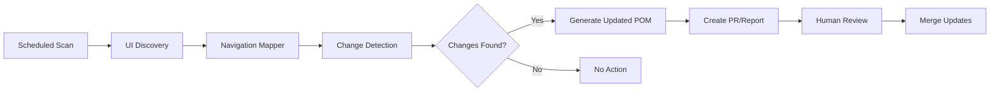

# Automated UI Maintenance Strategy

## Overview

This document describes an automated approach to keep UI methods up-to-date with GenieACS UI changes. The strategy combines automated discovery, navigation path mapping, change detection, and POM generation to minimize manual maintenance.

## The Challenge

UI-based automation is fragile because:
- UI elements change (IDs, classes, structure)
- Navigation paths evolve (new pages, reorganized menus)
- Features are added/removed
- Manual POM maintenance is time-consuming and error-prone

## Solution: Automated UI Maintenance Pipeline



## Component 1: Enhanced UI Discovery with Navigation Mapping

### Automated Navigation Path Discovery

```python
#!/usr/bin/env python3
"""
Automated Navigation Path Discovery

Crawls the GenieACS UI to discover all pages and navigation paths.
"""

import json
import logging
from typing import Any, Dict, List, Set
from urllib.parse import urlparse, urljoin

from selenium import webdriver
from selenium.webdriver.common.by import By
from selenium.webdriver.firefox.options import Options
from selenium.webdriver.support import expected_conditions as EC
from selenium.webdriver.support.ui import WebDriverWait

logging.basicConfig(level=logging.INFO)
logger = logging.getLogger(__name__)


class NavigationMapper:
    """Discover and map all navigation paths in the UI."""
    
    def __init__(self, base_url: str, username: str, password: str, headless: bool = True):
        self.base_url = base_url
        self.username = username
        self.password = password
        
        options = Options()
        if headless:
            options.add_argument("--headless")
        self.driver = webdriver.Firefox(options=options)
        self.wait = WebDriverWait(self.driver, 10)
        
        self.visited_urls: Set[str] = set()
        self.navigation_graph: Dict[str, Any] = {}
        self.pages: List[Dict[str, Any]] = []
    
    def login(self) -> None:
        """Login to the application."""
        logger.info("Logging in to %s", self.base_url)
        self.driver.get(f"{self.base_url}/login")
        
        username_field = self.wait.until(
            EC.presence_of_element_located((By.NAME, "username"))
        )
        username_field.send_keys(self.username)
        
        password_field = self.driver.find_element(By.CSS_SELECTOR, "input[type='password']")
        password_field.send_keys(self.password)
        
        login_btn = self.driver.find_element(By.CSS_SELECTOR, "button[type='submit']")
        login_btn.click()
        
        self.wait.until(lambda d: "/login" not in d.current_url)
        logger.info("Login successful")
    
    def discover_navigation_paths(self, max_depth: int = 3) -> Dict[str, Any]:
        """Discover all navigation paths starting from the home page."""
        self.login()
        
        # Start from home page
        home_url = self.driver.current_url
        self._crawl_page(home_url, depth=0, max_depth=max_depth)
        
        return {
            "base_url": self.base_url,
            "pages": self.pages,
            "navigation_graph": self.navigation_graph,
        }
    
    def _crawl_page(self, url: str, depth: int, max_depth: int) -> None:
        """Recursively crawl pages to discover navigation paths."""
        if depth > max_depth or url in self.visited_urls:
            return
        
        # Normalize URL
        parsed = urlparse(url)
        normalized_url = f"{parsed.scheme}://{parsed.netloc}{parsed.path}"
        
        if normalized_url in self.visited_urls:
            return
        
        logger.info("Crawling: %s (depth: %d)", normalized_url, depth)
        self.visited_urls.add(normalized_url)
        
        try:
            self.driver.get(url)
            self.wait.until(lambda d: d.execute_script("return document.readyState") == "complete")
            
            # Discover page elements
            page_info = self._discover_page_info(normalized_url)
            self.pages.append(page_info)
            
            # Find all navigation links
            links = self._find_navigation_links()
            
            # Store navigation graph
            self.navigation_graph[normalized_url] = {
                "title": page_info["title"],
                "links": [link["href"] for link in links],
            }
            
            # Recursively crawl linked pages
            for link in links:
                if self._is_internal_link(link["href"]):
                    self._crawl_page(link["href"], depth + 1, max_depth)
        
        except Exception as e:
            logger.error("Error crawling %s: %s", url, e)
    
    def _discover_page_info(self, url: str) -> Dict[str, Any]:
        """Discover information about the current page."""
        return {
            "url": url,
            "title": self.driver.title,
            "page_type": self._classify_page(url),
            "buttons": self._discover_buttons(),
            "inputs": self._discover_inputs(),
            "links": self._discover_links(),
            "tables": self._discover_tables(),
        }
    
    def _classify_page(self, url: str) -> str:
        """Classify the page type based on URL."""
        path = urlparse(url).path
        
        if "/login" in path:
            return "login"
        elif "/devices/" in path and len(path.split("/")) > 2:
            return "device_details"
        elif "/devices" in path:
            return "device_list"
        elif "/tasks" in path:
            return "tasks"
        elif "/files" in path:
            return "files"
        elif "/presets" in path:
            return "presets"
        else:
            return "unknown"
    
    def _find_navigation_links(self) -> List[Dict[str, str]]:
        """Find all navigation links on the current page."""
        links = []
        for link in self.driver.find_elements(By.TAG_NAME, "a"):
            href = link.get_attribute("href")
            if href and self._is_internal_link(href):
                links.append({
                    "text": link.text.strip(),
                    "href": href,
                    "css_selector": self._get_css_selector(link),
                })
        return links
    
    def _is_internal_link(self, href: str) -> bool:
        """Check if link is internal to the application."""
        if not href:
            return False
        
        parsed = urlparse(href)
        base_parsed = urlparse(self.base_url)
        
        # Same domain or relative URL
        return (not parsed.netloc or parsed.netloc == base_parsed.netloc)
    
    def _discover_buttons(self) -> List[Dict[str, Any]]:
        """Discover all buttons on the page."""
        buttons = []
        for btn in self.driver.find_elements(By.TAG_NAME, "button"):
            buttons.append({
                "text": btn.text.strip(),
                "title": btn.get_attribute("title"),
                "id": btn.get_attribute("id"),
                "class": btn.get_attribute("class"),
                "css_selector": self._get_css_selector(btn),
            })
        return buttons
    
    def _discover_inputs(self) -> List[Dict[str, Any]]:
        """Discover all input fields on the page."""
        inputs = []
        for inp in self.driver.find_elements(By.TAG_NAME, "input"):
            inputs.append({
                "type": inp.get_attribute("type"),
                "name": inp.get_attribute("name"),
                "id": inp.get_attribute("id"),
                "placeholder": inp.get_attribute("placeholder"),
                "css_selector": self._get_css_selector(inp),
            })
        return inputs
    
    def _discover_links(self) -> List[Dict[str, Any]]:
        """Discover all links on the page."""
        links = []
        for link in self.driver.find_elements(By.TAG_NAME, "a"):
            href = link.get_attribute("href")
            if href:
                links.append({
                    "text": link.text.strip(),
                    "href": href,
                    "css_selector": self._get_css_selector(link),
                })
        return links
    
    def _discover_tables(self) -> List[Dict[str, Any]]:
        """Discover all tables on the page."""
        tables = []
        for table in self.driver.find_elements(By.TAG_NAME, "table"):
            headers = [th.text.strip() for th in table.find_elements(By.TAG_NAME, "th")]
            tables.append({
                "id": table.get_attribute("id"),
                "class": table.get_attribute("class"),
                "headers": headers,
                "css_selector": self._get_css_selector(table),
            })
        return tables
    
    def _get_css_selector(self, element) -> str:
        """Generate CSS selector for element."""
        elem_id = element.get_attribute("id")
        if elem_id:
            return f"#{elem_id}"
        
        elem_class = element.get_attribute("class")
        if elem_class:
            first_class = elem_class.split()[0]
            return f".{first_class}"
        
        return element.tag_name
    
    def close(self) -> None:
        """Close the browser."""
        self.driver.quit()


def main():
    import argparse
    
    parser = argparse.ArgumentParser(description="Discover navigation paths")
    parser.add_argument("--url", required=True, help="Base URL")
    parser.add_argument("--username", default="admin", help="Username")
    parser.add_argument("--password", default="admin", help="Password")
    parser.add_argument("--output", default="navigation_map.json", help="Output file")
    parser.add_argument("--max-depth", type=int, default=3, help="Max crawl depth")
    parser.add_argument("--headless", action="store_true", help="Run headless")
    args = parser.parse_args()
    
    mapper = NavigationMapper(args.url, args.username, args.password, args.headless)
    
    try:
        navigation_data = mapper.discover_navigation_paths(max_depth=args.max_depth)
        
        with open(args.output, "w") as f:
            json.dump(navigation_data, f, indent=2)
        
        logger.info("Navigation map saved to %s", args.output)
        logger.info("Discovered %d pages", len(navigation_data["pages"]))
        
    finally:
        mapper.close()


if __name__ == "__main__":
    main()
```

## Component 2: Change Detection System

### Detect UI Changes Automatically

```python
#!/usr/bin/env python3
"""
UI Change Detection

Compares current UI state with baseline to detect changes.
"""

import json
import logging
from typing import Any, Dict, List, Set
from difflib import unified_diff

logging.basicConfig(level=logging.INFO)
logger = logging.getLogger(__name__)


class UIChangeDetector:
    """Detect changes in UI structure."""
    
    def __init__(self, baseline_file: str, current_file: str):
        self.baseline_file = baseline_file
        self.current_file = current_file
        
        with open(baseline_file) as f:
            self.baseline = json.load(f)
        
        with open(current_file) as f:
            self.current = json.load(f)
    
    def detect_changes(self) -> Dict[str, Any]:
        """Detect all changes between baseline and current."""
        changes = {
            "new_pages": self._find_new_pages(),
            "removed_pages": self._find_removed_pages(),
            "modified_pages": self._find_modified_pages(),
            "navigation_changes": self._find_navigation_changes(),
            "summary": {},
        }
        
        # Generate summary
        changes["summary"] = {
            "total_changes": (
                len(changes["new_pages"]) +
                len(changes["removed_pages"]) +
                len(changes["modified_pages"])
            ),
            "new_pages_count": len(changes["new_pages"]),
            "removed_pages_count": len(changes["removed_pages"]),
            "modified_pages_count": len(changes["modified_pages"]),
        }
        
        return changes
    
    def _find_new_pages(self) -> List[Dict[str, Any]]:
        """Find pages that exist in current but not in baseline."""
        baseline_urls = {page["url"] for page in self.baseline["pages"]}
        current_urls = {page["url"] for page in self.current["pages"]}
        
        new_urls = current_urls - baseline_urls
        
        return [
            page for page in self.current["pages"]
            if page["url"] in new_urls
        ]
    
    def _find_removed_pages(self) -> List[Dict[str, Any]]:
        """Find pages that exist in baseline but not in current."""
        baseline_urls = {page["url"] for page in self.baseline["pages"]}
        current_urls = {page["url"] for page in self.current["pages"]}
        
        removed_urls = baseline_urls - current_urls
        
        return [
            page for page in self.baseline["pages"]
            if page["url"] in removed_urls
        ]
    
    def _find_modified_pages(self) -> List[Dict[str, Any]]:
        """Find pages that have changed."""
        baseline_pages = {page["url"]: page for page in self.baseline["pages"]}
        current_pages = {page["url"]: page for page in self.current["pages"]}
        
        modified = []
        
        for url in baseline_pages:
            if url in current_pages:
                baseline_page = baseline_pages[url]
                current_page = current_pages[url]
                
                changes = self._compare_pages(baseline_page, current_page)
                if changes:
                    modified.append({
                        "url": url,
                        "changes": changes,
                    })
        
        return modified
    
    def _compare_pages(self, baseline: Dict, current: Dict) -> Dict[str, Any]:
        """Compare two pages and return differences."""
        changes = {}
        
        # Compare buttons
        baseline_buttons = {btn["css_selector"]: btn for btn in baseline.get("buttons", [])}
        current_buttons = {btn["css_selector"]: btn for btn in current.get("buttons", [])}
        
        new_buttons = set(current_buttons.keys()) - set(baseline_buttons.keys())
        removed_buttons = set(baseline_buttons.keys()) - set(current_buttons.keys())
        
        if new_buttons or removed_buttons:
            changes["buttons"] = {
                "new": [current_buttons[sel] for sel in new_buttons],
                "removed": [baseline_buttons[sel] for sel in removed_buttons],
            }
        
        # Compare inputs
        baseline_inputs = {inp["css_selector"]: inp for inp in baseline.get("inputs", [])}
        current_inputs = {inp["css_selector"]: inp for inp in current.get("inputs", [])}
        
        new_inputs = set(current_inputs.keys()) - set(baseline_inputs.keys())
        removed_inputs = set(baseline_inputs.keys()) - set(current_inputs.keys())
        
        if new_inputs or removed_inputs:
            changes["inputs"] = {
                "new": [current_inputs[sel] for sel in new_inputs],
                "removed": [baseline_inputs[sel] for sel in removed_inputs],
            }
        
        # Compare title
        if baseline.get("title") != current.get("title"):
            changes["title"] = {
                "old": baseline.get("title"),
                "new": current.get("title"),
            }
        
        return changes
    
    def _find_navigation_changes(self) -> List[Dict[str, Any]]:
        """Find changes in navigation structure."""
        baseline_nav = self.baseline.get("navigation_graph", {})
        current_nav = self.current.get("navigation_graph", {})
        
        changes = []
        
        for url in baseline_nav:
            if url in current_nav:
                baseline_links = set(baseline_nav[url]["links"])
                current_links = set(current_nav[url]["links"])
                
                new_links = current_links - baseline_links
                removed_links = baseline_links - current_links
                
                if new_links or removed_links:
                    changes.append({
                        "page": url,
                        "new_links": list(new_links),
                        "removed_links": list(removed_links),
                    })
        
        return changes
    
    def generate_report(self, changes: Dict[str, Any]) -> str:
        """Generate human-readable report of changes."""
        lines = ["# UI Change Detection Report", ""]
        
        # Summary
        lines.append("## Summary")
        lines.append("")
        lines.append(f"- Total changes: {changes['summary']['total_changes']}")
        lines.append(f"- New pages: {changes['summary']['new_pages_count']}")
        lines.append(f"- Removed pages: {changes['summary']['removed_pages_count']}")
        lines.append(f"- Modified pages: {changes['summary']['modified_pages_count']}")
        lines.append("")
        
        # New pages
        if changes["new_pages"]:
            lines.append("## New Pages")
            lines.append("")
            for page in changes["new_pages"]:
                lines.append(f"- **{page['title']}** - `{page['url']}`")
                lines.append(f"  - Type: {page['page_type']}")
                lines.append(f"  - Buttons: {len(page['buttons'])}")
                lines.append(f"  - Inputs: {len(page['inputs'])}")
            lines.append("")
        
        # Removed pages
        if changes["removed_pages"]:
            lines.append("## Removed Pages")
            lines.append("")
            for page in changes["removed_pages"]:
                lines.append(f"- **{page['title']}** - `{page['url']}`")
            lines.append("")
        
        # Modified pages
        if changes["modified_pages"]:
            lines.append("## Modified Pages")
            lines.append("")
            for mod in changes["modified_pages"]:
                lines.append(f"### {mod['url']}")
                lines.append("")
                
                if "buttons" in mod["changes"]:
                    btn_changes = mod["changes"]["buttons"]
                    if btn_changes.get("new"):
                        lines.append("**New buttons:**")
                        for btn in btn_changes["new"]:
                            lines.append(f"- {btn['text']} (`{btn['css_selector']}`)")
                    if btn_changes.get("removed"):
                        lines.append("**Removed buttons:**")
                        for btn in btn_changes["removed"]:
                            lines.append(f"- {btn['text']} (`{btn['css_selector']}`)")
                
                lines.append("")
        
        return "\n".join(lines)


def main():
    import argparse
    
    parser = argparse.ArgumentParser(description="Detect UI changes")
    parser.add_argument("--baseline", required=True, help="Baseline JSON file")
    parser.add_argument("--current", required=True, help="Current JSON file")
    parser.add_argument("--output", default="ui_changes.md", help="Output report file")
    args = parser.parse_args()
    
    detector = UIChangeDetector(args.baseline, args.current)
    changes = detector.detect_changes()
    
    # Generate report
    report = detector.generate_report(changes)
    
    with open(args.output, "w") as f:
        f.write(report)
    
    logger.info("Change report saved to %s", args.output)
    
    # Also save JSON
    json_output = args.output.replace(".md", ".json")
    with open(json_output, "w") as f:
        json.dump(changes, f, indent=2)
    
    logger.info("Change data saved to %s", json_output)
    
    # Print summary
    print(f"\nSummary:")
    print(f"  New pages: {changes['summary']['new_pages_count']}")
    print(f"  Removed pages: {changes['summary']['removed_pages_count']}")
    print(f"  Modified pages: {changes['summary']['modified_pages_count']}")


if __name__ == "__main__":
    main()
```

## Component 3: Automated POM Generator

### Generate Page Object Model Classes

```python
#!/usr/bin/env python3
"""
Automated POM Generator

Generates Page Object Model classes from discovered UI elements.
"""

import json
import logging
from pathlib import Path
from typing import Any, Dict, List

logging.basicConfig(level=logging.INFO)
logger = logging.getLogger(__name__)


class POMGenerator:
    """Generate Page Object Model classes from UI discovery data."""
    
    def __init__(self, navigation_file: str, output_dir: str):
        self.navigation_file = navigation_file
        self.output_dir = Path(output_dir)
        
        with open(navigation_file) as f:
            self.navigation_data = json.load(f)
        
        self.output_dir.mkdir(parents=True, exist_ok=True)
    
    def generate_all_poms(self) -> None:
        """Generate POM classes for all discovered pages."""
        # Generate base POM
        self._generate_base_pom()
        
        # Generate page-specific POMs
        for page in self.navigation_data["pages"]:
            self._generate_page_pom(page)
        
        # Generate __init__.py
        self._generate_init_file()
        
        logger.info("Generated POMs in %s", self.output_dir)
    
    def _generate_base_pom(self) -> None:
        """Generate base POM class."""
        code = '''"""Base Page Object Model for GenieACS UI."""

from __future__ import annotations
from typing import TYPE_CHECKING
from selenium.webdriver.support.ui import WebDriverWait

if TYPE_CHECKING:
    from selenium.webdriver.remote.webdriver import WebDriver

class GenieACSBasePOM:
    """Base Page Object Model for GenieACS UI."""
    
    def __init__(self, driver: WebDriver, base_url: str, fluent_wait: int = 20):
        """Initialize base POM.
        
        :param driver: WebDriver instance
        :param base_url: Base URL of GenieACS
        :param fluent_wait: Wait timeout in seconds
        """
        self.driver = driver
        self.base_url = base_url
        self.fluent_wait = fluent_wait
        self.wait = WebDriverWait(driver, fluent_wait)
    
    def is_page_loaded(self, driver: WebDriver) -> bool:
        """Check if page is loaded. Must be overridden in derived class."""
        raise NotImplementedError
'''
        
        output_file = self.output_dir / "genieacs_base_pom.py"
        with open(output_file, "w") as f:
            f.write(code)
        
        logger.info("Generated base POM: %s", output_file)
    
    def _generate_page_pom(self, page: Dict[str, Any]) -> None:
        """Generate POM class for a specific page."""
        page_type = page["page_type"]
        class_name = self._get_class_name(page_type)
        file_name = self._get_file_name(page_type)
        
        code = self._build_page_class(page, class_name)
        
        output_file = self.output_dir / f"{file_name}.py"
        with open(output_file, "w") as f:
            f.write(code)
        
        logger.info("Generated POM for %s: %s", page_type, output_file)
    
    def _get_class_name(self, page_type: str) -> str:
        """Convert page type to class name."""
        return "".join(word.capitalize() for word in page_type.split("_")) + "Page"
    
    def _get_file_name(self, page_type: str) -> str:
        """Convert page type to file name."""
        return page_type.lower()
    
    def _build_page_class(self, page: Dict[str, Any], class_name: str) -> str:
        """Build the page class code."""
        lines = [
            f'"""Page Object Model for {page["title"]}."""',
            "",
            "from selenium.webdriver.common.by import By",
            "from selenium.webdriver.support import expected_conditions as EC",
            "from .genieacs_base_pom import GenieACSBasePOM",
            "",
            "",
            f"class {class_name}(GenieACSBasePOM):",
            f'    """Page Object for {page["title"]}."""',
            "",
            "    # Locators",
        ]
        
        # Add button locators
        for btn in page.get("buttons", []):
            if btn.get("css_selector"):
                locator_name = self._sanitize_name(btn.get("text") or btn.get("title") or "button")
                lines.append(f'    {locator_name}_BUTTON = (By.CSS_SELECTOR, "{btn["css_selector"]}")')
        
        # Add input locators
        for inp in page.get("inputs", []):
            if inp.get("css_selector"):
                locator_name = self._sanitize_name(inp.get("name") or inp.get("placeholder") or "input")
                lines.append(f'    {locator_name}_INPUT = (By.CSS_SELECTOR, "{inp["css_selector"]}")')
        
        lines.extend([
            "",
            "    def __init__(self, driver, base_url, fluent_wait=20):",
            f'        """Initialize {class_name}."""',
            "        super().__init__(driver, base_url, fluent_wait)",
            f'        self.driver.get(f"{{self.base_url}}{self._get_path(page["url"])}")',
            "        self.wait.until(self.is_page_loaded)",
            "",
            "    def is_page_loaded(self, driver) -> bool:",
            f'        """Check if {page["title"]} is loaded."""',
            "        try:",
        ])
        
        # Add page load check (use first button or input as indicator)
        if page.get("buttons"):
            first_btn = page["buttons"][0]
            locator_name = self._sanitize_name(first_btn.get("text") or first_btn.get("title") or "button")
            lines.append(f"            element = self.wait.until(")
            lines.append(f"                EC.presence_of_element_located(self.{locator_name}_BUTTON)")
            lines.append(f"            )")
            lines.append(f"            return element.is_displayed()")
        else:
            lines.append(f"            return True")
        
        lines.extend([
            "        except:",
            "            return False",
            "",
        ])
        
        # Add methods for buttons
        for btn in page.get("buttons", []):
            if btn.get("text") or btn.get("title"):
                method_name = self._sanitize_name(btn.get("text") or btn.get("title"))
                lines.extend([
                    f"    def click_{method_name}(self) -> None:",
                    f'        """Click {btn.get("text") or btn.get("title")} button."""',
                    f"        btn = self.wait.until(",
                    f"            EC.element_to_be_clickable(self.{method_name}_BUTTON)",
                    f"        )",
                    f"        btn.click()",
                    "",
                ])
        
        return "\n".join(lines)
    
    def _get_path(self, url: str) -> str:
        """Extract path from URL."""
        from urllib.parse import urlparse
        return urlparse(url).path
    
    def _sanitize_name(self, name: str) -> str:
        """Sanitize name for use as Python identifier."""
        # Remove special characters, replace spaces with underscores
        sanitized = "".join(c if c.isalnum() or c == "_" else "_" for c in name)
        # Remove leading/trailing underscores
        sanitized = sanitized.strip("_")
        # Convert to uppercase for constants
        return sanitized.upper()
    
    def _generate_init_file(self) -> None:
        """Generate __init__.py file."""
        code = '''"""GenieACS Page Object Models."""

from .genieacs_base_pom import GenieACSBasePOM

__all__ = ["GenieACSBasePOM"]
'''
        
        output_file = self.output_dir / "__init__.py"
        with open(output_file, "w") as f:
            f.write(code)


def main():
    import argparse
    
    parser = argparse.ArgumentParser(description="Generate POM classes")
    parser.add_argument("--input", required=True, help="Navigation JSON file")
    parser.add_argument("--output", required=True, help="Output directory")
    args = parser.parse_args()
    
    generator = POMGenerator(args.input, args.output)
    generator.generate_all_poms()
    
    logger.info("POM generation complete")


if __name__ == "__main__":
    main()
```

## Component 4: Automated Maintenance Workflow

### CI/CD Integration

```yaml
# .github/workflows/ui-maintenance.yml

name: UI Maintenance Check

on:
  schedule:
    # Run every day at 2 AM
    - cron: '0 2 * * *'
  workflow_dispatch:  # Allow manual trigger

jobs:
  check-ui-changes:
    runs-on: ubuntu-latest
    
    steps:
      - name: Checkout code
        uses: actions/checkout@v3
      
      - name: Set up Python
        uses: actions/setup-python@v4
        with:
          python-version: '3.10'
      
      - name: Install dependencies
        run: |
          pip install selenium
          # Install geckodriver for Firefox
          wget https://github.com/mozilla/geckodriver/releases/download/v0.33.0/geckodriver-v0.33.0-linux64.tar.gz
          tar -xvzf geckodriver-v0.33.0-linux64.tar.gz
          chmod +x geckodriver
          sudo mv geckodriver /usr/local/bin/
      
      - name: Discover current UI state
        run: |
          python tools/navigation_mapper.py \
            --url ${{ secrets.GENIEACS_URL }} \
            --username ${{ secrets.GENIEACS_USERNAME }} \
            --password ${{ secrets.GENIEACS_PASSWORD }} \
            --output current_navigation.json \
            --headless
      
      - name: Detect changes
        id: detect
        run: |
          python tools/ui_change_detector.py \
            --baseline baseline_navigation.json \
            --current current_navigation.json \
            --output ui_changes.md
          
          # Check if there are changes
          if [ -s ui_changes.json ]; then
            echo "changes_detected=true" >> $GITHUB_OUTPUT
          else
            echo "changes_detected=false" >> $GITHUB_OUTPUT
          fi
      
      - name: Generate updated POMs
        if: steps.detect.outputs.changes_detected == 'true'
        run: |
          python tools/pom_generator.py \
            --input current_navigation.json \
            --output boardfarm/boardfarm3/lib/gui/genieacs/pages/
      
      - name: Create Pull Request
        if: steps.detect.outputs.changes_detected == 'true'
        uses: peter-evans/create-pull-request@v5
        with:
          commit-message: 'chore: Update GenieACS UI POMs'
          title: 'UI Changes Detected: Update POMs'
          body-path: ui_changes.md
          branch: ui-maintenance/update-poms
          labels: automated, ui-maintenance
```

## Component 5: Usage Workflow

### Daily Automated Workflow

```bash
#!/bin/bash
# tools/update_ui_baseline.sh

set -e

GENIEACS_URL="http://localhost:3000"
USERNAME="admin"
PASSWORD="admin"

echo "Step 1: Discover current UI state..."
python tools/navigation_mapper.py \
  --url "$GENIEACS_URL" \
  --username "$USERNAME" \
  --password "$PASSWORD" \
  --output current_navigation.json \
  --headless

echo "Step 2: Detect changes..."
python tools/ui_change_detector.py \
  --baseline baseline_navigation.json \
  --current current_navigation.json \
  --output ui_changes.md

echo "Step 3: Check if changes detected..."
if [ -s ui_changes.json ]; then
  echo "Changes detected!"
  
  echo "Step 4: Generate updated POMs..."
  python tools/pom_generator.py \
    --input current_navigation.json \
    --output boardfarm/boardfarm3/lib/gui/genieacs/pages/
  
  echo "Step 5: Update baseline..."
  cp current_navigation.json baseline_navigation.json
  
  echo "Done! Review ui_changes.md for details."
else
  echo "No changes detected."
fi
```

## Benefits of This Approach

### 1. **Automated Discovery**
- No manual element hunting
- Comprehensive coverage
- Navigation paths automatically mapped

### 2. **Change Detection**
- Early warning of UI changes
- Detailed change reports
- Automated notifications

### 3. **POM Generation**
- Consistent code structure
- Reduced manual coding
- Quick updates when UI changes

### 4. **Continuous Maintenance**
- Scheduled checks (daily/weekly)
- CI/CD integration
- Pull request automation

### 5. **Version Control**
- Baseline tracking
- Change history
- Easy rollback

## Implementation Roadmap

### Phase 1: Setup (Week 1)
1. ✅ Create navigation mapper script
2. ✅ Create change detector script
3. ✅ Create POM generator script
4. ✅ Set up baseline navigation map

### Phase 2: Automation (Week 2)
1. ✅ Create CI/CD workflow
2. ✅ Set up scheduled scans
3. ✅ Configure notifications
4. ✅ Test with GenieACS instance

### Phase 3: Integration (Week 3)
1. ✅ Integrate with existing test framework
2. ✅ Update device class to use generated POMs
3. ✅ Create documentation
4. ✅ Train team on workflow

### Phase 4: Optimization (Week 4)
1. ✅ Tune change detection sensitivity
2. ✅ Optimize crawl performance
3. ✅ Add visual regression testing
4. ✅ Refine POM generation templates

## Best Practices

### 1. **Baseline Management**
- Update baseline after verifying changes
- Version control baseline files
- Document baseline update process

### 2. **Change Review**
- Always review generated POMs
- Test before merging
- Update tests if needed

### 3. **Selective Generation**
- Only generate POMs for pages you use
- Skip admin/config pages if not needed
- Focus on critical user journeys

### 4. **Performance**
- Limit crawl depth (max 3 levels)
- Use headless mode
- Run during off-peak hours

### 5. **Error Handling**
- Handle dynamic content gracefully
- Retry on transient failures
- Log all errors for review

## Monitoring and Alerts

### Slack Integration

```python
# tools/notify_slack.py

import json
import requests

def notify_slack(webhook_url: str, changes: dict):
    """Send notification to Slack."""
    message = {
        "text": "GenieACS UI Changes Detected",
        "blocks": [
            {
                "type": "section",
                "text": {
                    "type": "mrkdwn",
                    "text": f"*UI Changes Summary*\n"
                           f"• New pages: {changes['summary']['new_pages_count']}\n"
                           f"• Removed pages: {changes['summary']['removed_pages_count']}\n"
                           f"• Modified pages: {changes['summary']['modified_pages_count']}"
                }
            }
        ]
    }
    
    requests.post(webhook_url, json=message)
```

## Conclusion

This automated maintenance strategy:
- ✅ Minimizes manual POM updates
- ✅ Detects UI changes early
- ✅ Generates consistent code
- ✅ Integrates with CI/CD
- ✅ Provides change visibility
- ✅ Reduces maintenance burden

The combination of automated discovery, change detection, and POM generation keeps your UI tests up-to-date with minimal manual effort.
