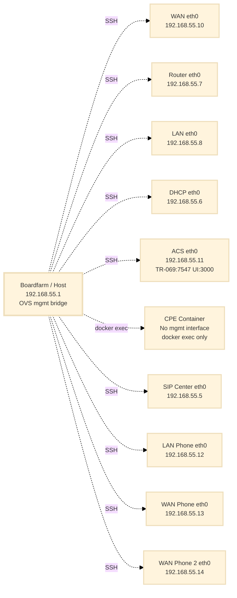
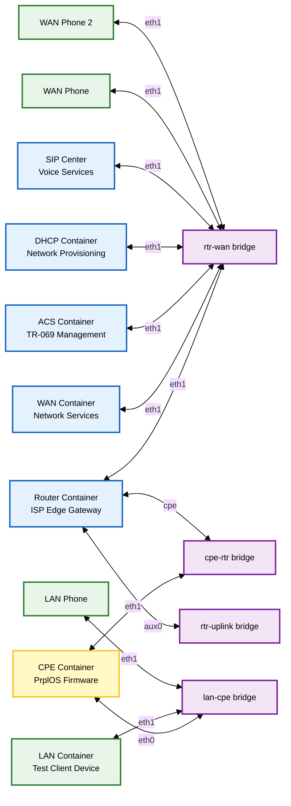

# Network Topology Reference: Raikou + Boardfarm Testbed

## Overview

The Raikou + Boardfarm testbed simulates a complete home gateway environment using containerized components. The testbed operates on two distinct network layers:

- **OVS Management Bridge** (`192.168.55.0/24`): All containers use `network_mode: none`; SSH access is provided via a dedicated OVS `mgmt` bridge managed by Raikou. See [Management Network Isolation](../../architecture/management-network-isolation.md).
- **Simulated Network** (`172.25.1.0/24`, `10.1.1.0/24`): The testbed topology created by Raikou using OVS bridges

## Network Architecture

### Customer Premises Equipment (CPE)

| Component | Description                           | Image        |
| --------- | ------------------------------------- | ------------ |
| **CPE**   | Home gateway device (PrplOS firmware) | `cpe:v1.2.0` |

### Infrastructure Services (ISP Simulation)

| Component      | Description                                                        | Image           |
| -------------- | ------------------------------------------------------------------ | --------------- |
| **Router**     | ISP edge gateway with FRR routing and NAT                          | `router:v1.2.0` |
| **WAN**        | Network services container (HTTP/TFTP/FTP/DNS/proxy/testing tools) | `wan:v1.2.0`    |
| **ACS**        | TR-069 management server                                           | `acs:v1.2.0`    |
| **DHCP**       | Network provisioning server                                        | `dhcp:v1.2.0`   |
| **SIP Center** | Voice services                                                     | `sip:v1.2.0`    |

### Client Devices

| Component       | Description                                                 | Image          |
| --------------- | ----------------------------------------------------------- | -------------- |
| **LAN**         | Test client device on LAN network (DHCP client, HTTP proxy) | `lan:v1.2.0`   |
| **LAN Phone**   | Phone device on LAN network (number 1000)                   | `phone:v1.2.0` |
| **WAN Phone**   | Phone device on WAN network (number 2000)                   | `phone:v1.2.0` |
| **WAN Phone 2** | Second phone device on WAN network (number 3000)            | `phone:v1.2.0` |

## Network Topology Diagrams

### OVS Management Bridge

All containers use `network_mode: none`. Management access is via the OVS `mgmt` bridge (`192.168.55.0/24`), not Docker port mappings.



### Simulated Network Topology



### CPE-Router Segment (`cpe-rtr` bridge)

| Component | Interface | IP Address           | Purpose          |
| --------- | --------- | -------------------- | ---------------- |
| CPE       | eth1      | `10.1.1.x/24` (DHCP) | WAN connectivity |
| Router    | cpe       | `10.1.1.1/24`        | Gateway          |

### LAN Segment (`lan-cpe` bridge)

| Component     | Interface | Connection            | Purpose                                      |
| ------------- | --------- | --------------------- | -------------------------------------------- |
| CPE           | eth0      | Connected to `br-lan` | LAN interface (gateway)                      |
| LAN Container | eth1      | Connected to `br-lan` | Test client device (DHCP client, HTTP proxy) |
| LAN Phone     | eth1      | Connected to `br-lan` | Client device (SIP phone)                    |

### WAN Segment (`rtr-wan` bridge)

| Component      | Interface | IP Address       | Purpose                                            |
| -------------- | --------- | ---------------- | -------------------------------------------------- |
| Router         | eth1      | `172.25.1.1/24`  | Gateway                                            |
| WAN Container  | eth1      | `172.25.1.2/24`  | Network services (HTTP/TFTP/FTP/DNS/proxy/testing) |
| WAN Phone      | eth1      | `172.25.1.3/24`  | Client device (number 2000)                        |
| WAN Phone 2    | eth1      | `172.25.1.4/24`  | Client device (number 3000)                        |
| SIP Center     | eth1      | `172.25.1.5/24`  | Voice services (registers 1000, 2000, 3000)        |
| DHCP Container | eth1      | `172.25.1.20/24` | Network provisioning                               |
| ACS Container  | eth1      | `172.25.1.40/24` | TR-069 management                                  |

### Uplink Segment (`rtr-uplink` bridge)

| Component | Interface | IP Address      | Purpose                          |
| --------- | --------- | --------------- | -------------------------------- |
| Router    | aux0      | `172.25.2.1/24` | External connectivity simulation |

## Container Specifications

### Container Access

All containers use `network_mode: none`. Management access is via the OVS `mgmt` bridge — no Docker port mappings.

| Container  | Management IP    | Services                            | Connection Method                    |
| ---------- | ---------------- | ----------------------------------- | ------------------------------------ |
| router     | `192.168.55.7`   | SSH                                 | `ssh root@192.168.55.7`             |
| wan        | `192.168.55.10`  | SSH, HTTP proxy (:8080)             | `ssh root@192.168.55.10`            |
| lan        | `192.168.55.8`   | SSH, HTTP proxy (:8080)             | `ssh root@192.168.55.8`             |
| dhcp       | `192.168.55.6`   | SSH                                 | `ssh root@192.168.55.6`             |
| acs        | `192.168.55.11`  | SSH, TR-069 (:7547), NBI (:7557), UI (:3000) | `ssh root@192.168.55.11`  |
| cpe        | —                | —                                   | `docker exec -it cpe ash`           |
| mongo      | `192.168.55.9`   | MongoDB (:27017)                    | —                                   |
| sipcenter  | `192.168.55.5`   | SSH, SIP (:5060)                    | `ssh root@192.168.55.5`             |
| lan-phone  | `192.168.55.12`  | SSH                                 | `ssh root@192.168.55.12` (num 1000) |
| wan-phone  | `192.168.55.13`  | SSH                                 | `ssh root@192.168.55.13` (num 2000) |
| wan-phone2 | `192.168.55.14`  | SSH                                 | `ssh root@192.168.55.14` (num 3000) |

**Default Credentials**: `root` / `bigfoot1`

**Note**: All containers use `network_mode: none`. The CPE container has no management bridge interface and is accessed via `docker exec`. It only has interfaces on the simulated network:

- `eth0`: Connected to `lan-cpe` bridge (LAN side, part of `br-lan` bridge inside container)
- `eth1`: Connected to `cpe-rtr` bridge (WAN side, gets IP via DHCP)

## ISP Gateway (Router) Configuration

### Interface Configuration

| Interface | Bridge         | IP Address        | Purpose                             |
| --------- | -------------- | ----------------- | ----------------------------------- |
| cpe       | cpe-rtr        | `10.1.1.1/24`     | CPE-facing (LAN side)               |
| eth1      | rtr-wan        | `172.25.1.1/24`   | WAN-facing (internet-facing)        |
| aux0      | rtr-uplink     | `172.25.2.1/24`   | Auxiliary uplink                    |
| eth0      | OVS mgmt bridge | `192.168.55.7/24` | Management (SSH access) |

### NAT Configuration

```yaml
environment:
    - ENABLE_NAT_ON=eth1
```

**NAT Interface**: `eth1` (WAN interface)  
**NAT Behavior**: Masquerades traffic from `10.1.1.0/24` as `172.25.1.1` when accessing WAN services

### Network Communication Flow

1. CPE (`10.1.1.x`) sends request to `172.25.1.2`
2. Router receives on `cpe` interface, routes to `eth1`
3. Router applies NAT (source: `10.1.1.x` → `172.25.1.1`)
4. WAN Container receives request, processes service
5. Router routes response back to CPE
6. CPE receives service response

## Boardfarm Integration

### Device Mapping

| Boardfarm Device | Container                        | Connection Method                   |
| ---------------- | -------------------------------- | ----------------------------------- |
| `bf_cpe`         | cpe                              | `docker exec -it cpe ash`           |
| `bf_wan`         | wan                              | SSH `192.168.55.10`                 |
| `bf_lan`         | lan                              | SSH `192.168.55.8`                  |
| `bf_acs`         | acs                              | SSH `192.168.55.11`                 |
| `bf_dhcp`        | dhcp                             | SSH `192.168.55.6`                  |
| `bf_phone`       | lan-phone, wan-phone, wan-phone2 | SSH `192.168.55.12`, `.13`, `.14`   |

### Boot Process

1. **Raikou**: Creates network topology and starts containers
2. **Boardfarm**: Connects to containers via Docker management network (SSH) or `docker exec` (CPE) and provisions devices
3. **CPE**: Obtains IP via DHCP on eth1 and registers with ACS
4. **Testing**: Network validation and service access

## Troubleshooting Reference

### Common Issues

#### CPE Cannot Reach WAN

**Checks:**

- CPE has IP on eth1 (`10.1.1.x/24`)
- Router NAT enabled on `eth1` interface
- Router has routes between `10.1.1.0/24` and `172.25.1.0/24`

**Verification:**

```bash
docker exec -it cpe ash -c "ping -c 3 10.1.1.1"    # Router gateway
docker exec -it cpe ash -c "ping -c 3 172.25.1.2"  # WAN container
docker exec -it router bash -c "ip route show"
```

#### Wrong IP Address for Testing

**Use**: `172.25.1.2` for WAN services (simulated network)  
**Do NOT use**: management bridge IPs (`192.168.55.x`) for service testing

#### NAT Not Working

**Check Configuration:**

- Verify `ENABLE_NAT_ON=eth1` in docker-compose.yaml
- Check iptables rules: `docker exec -it router bash -c "iptables -t nat -L"`

### Verification Commands

```bash
# Check CPE connectivity
docker exec -it cpe ash -c "ping -c 3 10.1.1.1"    # Router gateway
docker exec -it cpe ash -c "ping -c 3 172.25.1.2"  # WAN container

# Check router NAT
docker exec -it router bash -c "iptables -t nat -L"

# Check network topology
docker exec -it router bash -c "ip route show"

# Check container status
docker compose ps

# Check SSH service
./validate-ssh.sh
```

## Quick Reference Tables

### Network Addresses Summary

| Network           | Subnet            | Purpose                                                         |
| ----------------- | ----------------- | --------------------------------------------------------------- |
| OVS Management Bridge | `192.168.55.0/24` | Container SSH access (all containers use `network_mode: none`) |
| CPE-Router        | `10.1.1.0/24`     | CPE WAN connectivity                                            |
| WAN Services      | `172.25.1.0/24`   | Infrastructure services                                         |
| Uplink            | `172.25.2.0/24`   | External connectivity                                           |

### Service IP Addresses

| Service        | IP Address    | Ports                                    |
| -------------- | ------------- | ---------------------------------------- |
| Router Gateway | `172.25.1.1`  | -                                        |
| WAN Server     | `172.25.1.2`  | 80 (HTTP), 69 (TFTP), 21 (FTP), 53 (DNS) |
| WAN Phone      | `172.25.1.3`  | - (number 2000)                          |
| WAN Phone 2    | `172.25.1.4`  | - (number 3000)                          |
| SIP Server     | `172.25.1.5`  | 5060 (SIP)                               |
| DHCP Server    | `172.25.1.20` | 67, 547                                  |
| ACS Server     | `172.25.1.40` | 7547 (TR-069)                            |

### OVS Bridges

| Bridge     | Connected Components                                     | Purpose               |
| ---------- | -------------------------------------------------------- | --------------------- |
| cpe-rtr    | CPE eth1, Router cpe                                     | CPE WAN connectivity  |
| lan-cpe    | CPE eth0, LAN eth1, LAN Phone                            | Home network          |
| rtr-wan    | Router eth1, WAN, WAN Phone, WAN Phone 2, SIP, DHCP, ACS | WAN services          |
| rtr-uplink | Router aux0                                              | External connectivity |
