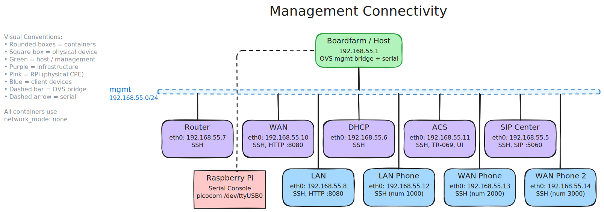
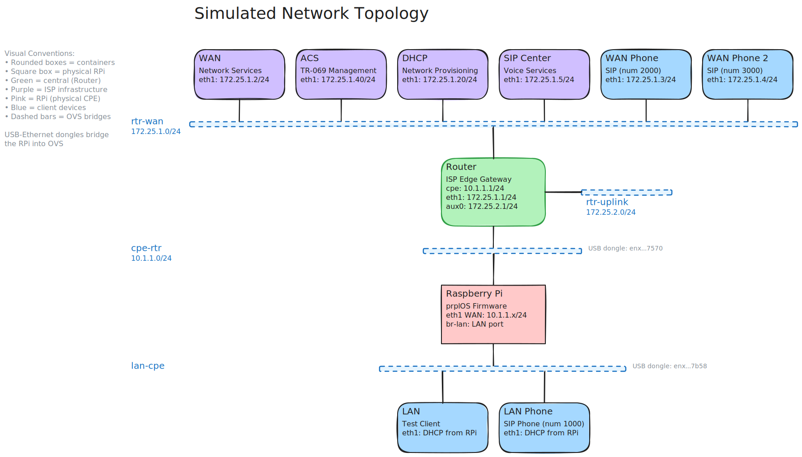

# Network Topology Reference: Physical RPi + Raikou Testbed

## Overview

The physical CPE testbed replaces the containerized CPE with a real Raspberry Pi
running prplOS. All other components (router, WAN, ACS, DHCP, SIP, phones) remain
dockerized and orchestrated by Raikou. The RPi connects to the Raikou OVS bridges
via two USB-Ethernet dongles on the host machine.

The testbed operates on two distinct network layers:

- **OVS Management Bridge** (`192.168.55.0/24`): All containers use `network_mode: none`; SSH access is provided via a dedicated OVS `mgmt` bridge managed by Raikou. See [Management Network Isolation](../../architecture/management-network-isolation.md).
- **Serial Console**: The RPi is accessed via `picocom` over a USB serial connection (`/dev/ttyUSB0`)
- **Simulated Network** (`172.25.1.0/24`, `10.1.1.0/24`): The testbed topology created by Raikou using OVS bridges, with USB-Ethernet dongles bridging the physical RPi

## Network Architecture

### Customer Premises Equipment (CPE)

| Component | Description | Hardware |
| --------- | ---------------------------------- | ------------------------------------ |
| **RPi** | Physical home gateway (prplOS) | Raspberry Pi 4, USB-Ethernet dongles |

### Infrastructure Services (ISP Simulation)

| Component | Description | Image |
| -------------- | ------------------------------------------------------------------ | --------------- |
| **Router** | ISP edge gateway with FRR routing and NAT | `router:v1.2.0` |
| **WAN** | Network services container (HTTP/TFTP/FTP/DNS/proxy/testing tools) | `wan:v1.2.0` |
| **ACS** | TR-069 management server | `acs:v1.2.0` |
| **DHCP** | Network provisioning server | `dhcp:v1.2.0` |
| **SIP Center** | Voice services | `sip:v1.2.0` |

### Client Devices

| Component | Description | Image |
| --------------- | ----------------------------------------------------------- | -------------- |
| **LAN** | Test client device on LAN network (DHCP client, HTTP proxy) | `lan:v1.2.0` |
| **LAN Phone** | Phone device on LAN network (number 1000) | `phone:v1.2.0` |
| **WAN Phone** | Phone device on WAN network (number 2000) | `phone:v1.2.0` |
| **WAN Phone 2** | Second phone device on WAN network (number 3000) | `phone:v1.2.0` |

## Network Topology Diagrams

### Management Connectivity



### Simulated Network Topology



### CPE-Router Segment (`cpe-rtr` bridge)

| Component | Interface | IP Address | Purpose |
| --------------- | --------- | -------------------- | ---------------------------------- |
| RPi (prplOS) | eth1 | `10.1.1.x/24` (DHCP) | WAN connectivity |
| Router | cpe | `10.1.1.1/24` | Gateway |
| USB dongle | enx00e04c5b7570 | — | Bridges RPi WAN port into OVS |

### LAN Segment (`lan-cpe` bridge)

| Component | Interface | Connection | Purpose |
| ------------- | --------------- | --------------------- | -------------------------------------------- |
| RPi (prplOS) | br-lan | Physical LAN port | LAN interface (gateway) |
| USB dongle | enx00e04c327b58 | — | Bridges RPi LAN port into OVS |
| LAN Container | eth1 | Connected to `br-lan` | Test client device (DHCP client, HTTP proxy) |
| LAN Phone | eth1 | Connected to `br-lan` | Client device (SIP phone) |

### WAN Segment (`rtr-wan` bridge)

| Component | Interface | IP Address | Purpose |
| -------------- | --------- | ---------------- | -------------------------------------------------- |
| Router | eth1 | `172.25.1.1/24` | Gateway |
| WAN Container | eth1 | `172.25.1.2/24` | Network services (HTTP/TFTP/FTP/DNS/proxy/testing) |
| WAN Phone | eth1 | `172.25.1.3/24` | Client device (number 2000) |
| WAN Phone 2 | eth1 | `172.25.1.4/24` | Client device (number 3000) |
| SIP Center | eth1 | `172.25.1.5/24` | Voice services (registers 1000, 2000, 3000) |
| DHCP Container | eth1 | `172.25.1.20/24` | Network provisioning |
| ACS Container | eth1 | `172.25.1.40/24` | TR-069 management |

### Uplink Segment (`rtr-uplink` bridge)

| Component | Interface | IP Address | Purpose |
| --------- | --------- | --------------- | -------------------------------- |
| Router | aux0 | `172.25.2.1/24` | External connectivity simulation |

## Physical Connectivity

### USB-Ethernet Dongle Mapping

The physical RPi connects to the OVS topology via two USB-Ethernet dongles plugged
into the host machine. Raikou's `config_openwrt.json` adds these host interfaces
as parents of the OVS bridges:

| Host Interface | OVS Bridge | RPi Side | Network |
| ------------------- | ---------- | -------- | ------------ |
| `enx00e04c5b7570` | `cpe-rtr` | WAN port | `10.1.1.0/24` |
| `enx00e04c327b58` | `lan-cpe` | LAN port | DHCP from RPi |

### Serial Console

The RPi is accessed via a USB serial adapter at `/dev/ttyUSB0`:

```bash
picocom -b 115200 /dev/ttyUSB0
```

Boardfarm uses this connection (`connection_type: local_cmd`) to interact with
the prplOS shell during tests.

## Container Specifications

### Container Access

All containers use `network_mode: none`. Management access is via the OVS `mgmt` bridge — no Docker port mappings.

| Container  | Management IP    | Services                            | Connection Method                    |
| ---------- | ---------------- | ----------------------------------- | ------------------------------------ |
| router     | `192.168.55.7`   | SSH                                 | `ssh root@192.168.55.7`             |
| wan        | `192.168.55.10`  | SSH, HTTP proxy (:8080)             | `ssh root@192.168.55.10`            |
| lan        | `192.168.55.8`   | SSH, HTTP proxy (:8080)             | `ssh root@192.168.55.8`             |
| dhcp       | `192.168.55.6`   | SSH                                 | `ssh root@192.168.55.6`             |
| acs        | `192.168.55.11`  | SSH, TR-069 (:7547), NBI (:7557), UI (:3000) | `ssh root@192.168.55.11`  |
| RPi        | —                | —                                   | `picocom -b 115200 /dev/ttyUSB0`    |
| sipcenter  | `192.168.55.5`   | SSH, SIP (:5060)                    | `ssh root@192.168.55.5`             |
| lan-phone  | `192.168.55.12`  | SSH                                 | `ssh root@192.168.55.12` (num 1000) |
| wan-phone  | `192.168.55.13`  | SSH                                 | `ssh root@192.168.55.13` (num 2000) |
| wan-phone2 | `192.168.55.14`  | SSH                                 | `ssh root@192.168.55.14` (num 3000) |

**Default Credentials (containers)**: `root` / `bigfoot1`

## ISP Gateway (Router) Configuration

### Interface Configuration

| Interface | Bridge | IP Address | Purpose |
| --------- | -------------- | ----------------- | ----------------------------------- |
| cpe | cpe-rtr | `10.1.1.1/24` | CPE-facing (LAN side) |
| eth1 | rtr-wan | `172.25.1.1/24` | WAN-facing (internet-facing) |
| aux0 | rtr-uplink | `172.25.2.1/24` | Auxiliary uplink |
| eth0 | OVS mgmt bridge | `192.168.55.7/24` | Management (SSH access) |

### NAT Configuration

```yaml
environment:
    - ENABLE_NAT_ON=eth1,aux0
```

**NAT Interfaces**: `eth1` (WAN) and `aux0` (uplink)
**NAT Behavior**: Masquerades traffic from `10.1.1.0/24` as `172.25.1.1` when accessing WAN services

### Network Communication Flow

1. RPi (`10.1.1.x`) sends request to `172.25.1.2`
2. Traffic exits the RPi WAN port → USB dongle → `cpe-rtr` OVS bridge
3. Router receives on `cpe` interface, routes to `eth1`
4. Router applies NAT (source: `10.1.1.x` → `172.25.1.1`)
5. WAN Container receives request, processes service
6. Router routes response back through `cpe-rtr` bridge → USB dongle → RPi

## Boardfarm Integration

### Device Mapping

| Boardfarm Device | Component | Connection Method                     |
| ------------------- | -------------------------------- | ------------------------------------- |
| `bf_rpiprplos_cpe` | Raspberry Pi | `picocom -b 115200 /dev/ttyUSB0`     |
| `bf_wan` | wan | SSH `192.168.55.10`                   |
| `bf_lan` | lan | SSH `192.168.55.8`                    |
| `bf_acs` | acs | SSH `192.168.55.11`                   |
| `bf_dhcp` | dhcp | SSH `192.168.55.6`                    |
| `bf_kamailio` | sipcenter | SSH `192.168.55.5`                    |
| `bf_phone` | lan-phone, wan-phone, wan-phone2 | SSH `192.168.55.12`, `.13`, `.14`     |

### Boot Process

1. **Raikou**: Creates OVS bridges and attaches USB-Ethernet dongles as bridge parents
2. **Boardfarm**: Connects to containers via SSH and to the RPi via serial console
3. **RPi**: Obtains IP via DHCP on eth1 (`10.1.1.x`) and registers with ACS (`172.25.1.40`)
4. **Testing**: Network validation and service access — same use cases as the dockerized CPE

## Troubleshooting Reference

### Common Issues

#### RPi Cannot Reach WAN

**Checks:**

- RPi has IP on eth1 (`10.1.1.x/24`)
- USB-Ethernet dongles are plugged in and recognized by the host (`ip link show | grep enx`)
- Raikou OVS bridges have the dongles as parents (`ovs-vsctl show`)
- Router NAT enabled on `eth1` interface

**Verification:**

```bash
# On the RPi (via serial console)
ping -c 3 10.1.1.1        # Router gateway
ping -c 3 172.25.1.2      # WAN container

# On the host
ovs-vsctl show             # Check bridge parents include USB dongles
docker exec -it router bash -c "ip route show"
```

#### USB-Ethernet Dongles Not Detected

```bash
# List USB devices
lsusb

# Check network interfaces
ip link show | grep enx

# Verify dongle names match config_openwrt.json
cat raikou/config_openwrt.json | grep enx
```

#### Serial Console Not Connecting

```bash
# Check USB serial device
ls -la /dev/ttyUSB*

# Verify no other process is using the port
fuser /dev/ttyUSB0

# Connect manually
picocom -b 115200 /dev/ttyUSB0
```

#### Wrong IP Address for Testing

**Use**: `172.25.1.2` for WAN services (simulated network)
**Do NOT use**: management bridge IPs (`192.168.55.x`) for service testing

### Verification Commands

```bash
# Check RPi connectivity (via serial console)
ping -c 3 10.1.1.1        # Router gateway
ping -c 3 172.25.1.2      # WAN container

# Check router NAT
docker exec -it router bash -c "iptables -t nat -L"

# Check OVS topology (USB dongles as bridge parents)
ovs-vsctl show

# Check container status
docker compose -f docker-compose-openwrt.yaml ps

# Check Kamailio is running
docker exec -it sipcenter service kamailio status
```

## Quick Reference Tables

### Network Addresses Summary

| Network | Subnet | Purpose |
| ----------------- | ----------------- | --------------------------------------------------- |
| OVS Management Bridge | `192.168.55.0/24` | Container SSH access (RPi uses serial console) |
| CPE-Router | `10.1.1.0/24` | RPi WAN connectivity (via USB dongle → OVS bridge) |
| WAN Services | `172.25.1.0/24` | Infrastructure services |
| Uplink | `172.25.2.0/24` | External connectivity |

### Service IP Addresses

| Service | IP Address | Ports |
| -------------- | ------------- | ----------------------------------------- |
| Router Gateway | `172.25.1.1` | - |
| WAN Server | `172.25.1.2` | 80 (HTTP), 69 (TFTP), 21 (FTP), 53 (DNS) |
| WAN Phone | `172.25.1.3` | - (number 2000) |
| WAN Phone 2 | `172.25.1.4` | - (number 3000) |
| SIP Server | `172.25.1.5` | 5060 (SIP) |
| DHCP Server | `172.25.1.20` | 67, 547 |
| ACS Server | `172.25.1.40` | 7547 (TR-069) |

### OVS Bridges

| Bridge | Connected Components | Purpose |
| ---------- | -------------------------------------------------------- | ----------------------------------- |
| cpe-rtr | RPi WAN (via USB dongle), Router cpe | RPi WAN connectivity |
| lan-cpe | RPi LAN (via USB dongle), LAN eth1, LAN Phone | Home network |
| rtr-wan | Router eth1, WAN, WAN Phone, WAN Phone 2, SIP, DHCP, ACS | WAN services |
| rtr-uplink | Router aux0 | External connectivity |
