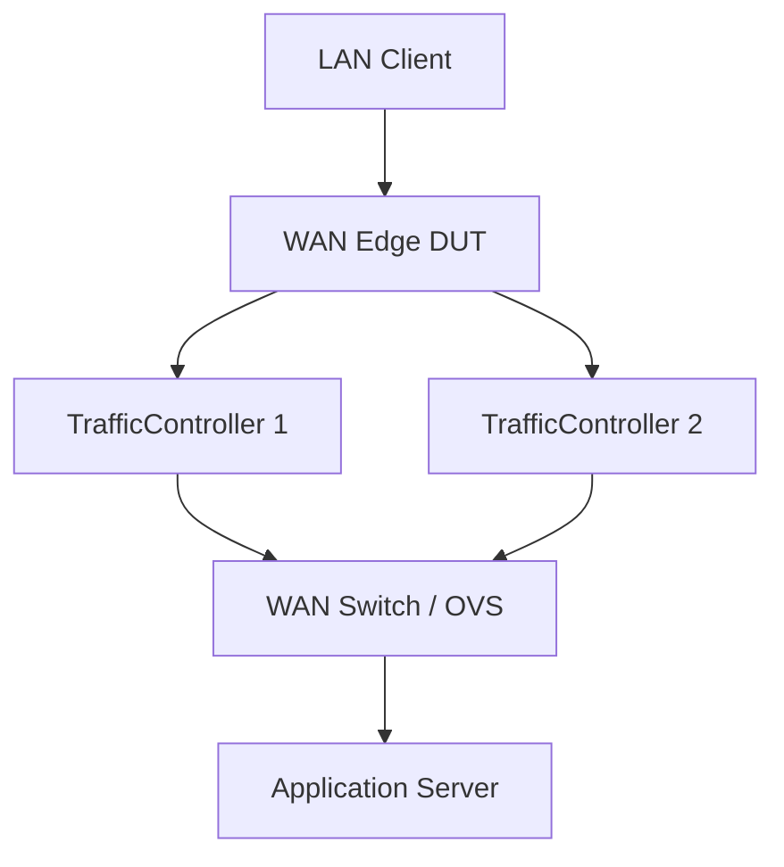

# Design: Application Services (North-Side)

| Field | Value |
| --- | --- |
| Status | Implemented |
| Date | 2026-03-20 |
| Related | [architecture.md](architecture.md), [testbed-configuration.md](testbed-configuration.md), [ADR-0001](../../adr/0001-scope-to-digital-twin-phase-3.5.md) |

---

## 1. Context and Scope

The Application Services are the **North-Side target endpoints** that LAN clients reach through the DUT. They exist to generate realistic, measurable application traffic for QoE (Quality of Experience) assessment across three pillars: Productivity (SaaS), Streaming (Video on Demand), and Conferencing (Real-Time).

Test results must reflect the DUT's performance, not the server's limitations. Each service uses high-performance, lightweight server software (Nginx, pion) so that measured degradation is attributable to the WAN path — impairment profiles applied by the TrafficControllers — rather than the origin server.

All three services run as containers on the **WAN side** of the Traffic Controllers, connected via OVS bridges managed by Raikou. They serve HTTPS (TLS 1.3), HTTP/3 (QUIC), and WSS using certificates issued by the testbed CA.

---

## 2. Architecture & Topology



The Application Server is a single container hosting multiple services on different ports to simulate a rich internet environment.

**Docker Strategy:**
*   **Base Image:** `nginx:alpine` (lightweight, high concurrency).
*   **Networking:** Exposes ports 80, 443 (SaaS), 8081 (HLS streaming proxy), 8443 (WebRTC signalling).

---

## 3. Non-Goals

The following are explicitly out of scope per [ADR-0001](../../adr/0001-scope-to-digital-twin-phase-3.5.md):

*   **Malicious Host / threat emulation** — Active inbound attacks (port scans, SYN floods) and passive threat services (C2 listeners, EICAR distribution) require a dedicated Kali container (`KaliMaliciousHost`). This component was descoped with the decision to conclude at Phase 3.5.
*   **Commercial CDN integration** — The streaming architecture uses MinIO as an S3-compatible content origin. Integration with AWS S3 or other commercial CDN providers is not implemented.

---

## 4. Service: Productivity (Mock SaaS)

**Goal:** Simulate Office 365 / Salesforce interaction patterns so the QoE Client can measure page load time, throughput, and application response time.

### Implementation

Nginx serves a static SPA (Single Page Application) with configurable payload sizes:

*   `index.html` — Minimal application framework.
*   `large_asset.js` — A 2–5 MB dummy file to measure page load time and throughput.
*   `api/latency` — An endpoint that reflects the request timestamp to measure application response time.

### Protocol Support

Nginx serves content over HTTPS (TLS 1.3) and HTTP/3 (QUIC) using certificates issued by the testbed CA. Nginx 1.29.5, built with `--with-http_v3_module`, listens on port 443 for both TLS and QUIC traffic. The `Alt-Svc` header advertises HTTP/3 availability; browsers upgrade on the second request.

```nginx
listen 443 ssl;
listen 443 quic reuseport;
ssl_certificate     /certs/productivity-server.crt;
ssl_certificate_key /certs/productivity-server.key;
ssl_protocols       TLSv1.3;
add_header Alt-Svc 'h3=":443"; ma=86400';
```

### Boardfarm Template: `ProductivityServer`

**Location:** `boardfarm3/templates/productivity_server.py`

```python
class ProductivityServer(ABC):
    @abstractmethod
    def get_service_url(self) -> str:
        """Return the base URL for the SaaS application."""

    @abstractmethod
    def set_response_delay(self, delay_ms: int) -> None:
        """Inject server-side processing delay (latency simulation)."""

    @abstractmethod
    def set_content_size(self, size_bytes: int) -> None:
        """Configure the size of the 'large asset' to simulate heavy/light apps."""
```

**Implementation (`NginxProductivityServer`):**
*   `get_service_url()` — Returns the `https://` base URL constructed from the Boardfarm inventory config.
*   `set_response_delay()` — Updates the Nginx config or CGI script to sleep before responding.
*   `set_content_size()` — Generates a dummy file of the specified size on the fly.

---

## 5. Service: Streaming (Video on Demand)

**Goal:** Simulate Netflix / YouTube / training video delivery so the QoE Client can measure adaptive bitrate selection, buffering events, and startup latency under impairment.

### Architecture

A two-container design mirrors commercial CDN infrastructure:

*   **`NginxStreamingServer` (CDN edge)** — Nginx with [`nginx-s3-gateway`](https://github.com/nginxinc/nginx-s3-gateway) proxies HLS manifest and segment requests to the MinIO content origin. The edge is stateless — it caches nothing and holds no content.
*   **`MinIO` (content origin)** — S3-compatible object store holding `.m3u8` playlists and `.ts` segments. MinIO is testbed infrastructure with no Boardfarm template or device class. See **§7** for full MinIO details.

### Request Flow

The QoE Client requests the HLS master manifest from `NginxStreamingServer`, which proxies the request to MinIO over the `content-internal` Raikou bridge (`http://10.100.0.2:9000`). The browser's ABR (Adaptive Bitrate) logic selects the appropriate quality profile based on the impairment applied by the TrafficController.

> **DASH:** DASH (`.mpd`) is explicitly deferred. HLS is sufficient for all QoE pillar test cases and is natively supported by Playwright/Chromium via `hls.js`. DASH support can be added to the same MinIO bucket without any server changes.

### S3 Gateway Configuration

```nginx
# nginx.conf (nginx-s3-gateway proxies /hls/* to MinIO)
server {
    listen 8081;
    location /hls/ {
        proxy_pass http://10.100.0.2:9000/streaming-content/;
        proxy_set_header Host 10.100.0.2:9000;
        # nginx-s3-gateway handles AWS SigV4 signing automatically
        # 10.100.0.2 is MinIO's Raikou-assigned IP on the content-internal bridge
    }
}
```

TLS applies to the Nginx edge only. MinIO remains plain HTTP on the `content-internal` bridge — it is not reachable from LAN clients or the DUT.

### Boardfarm Template: `StreamingServer`

**Location:** `boardfarm3/templates/streaming_server.py`

```python
class StreamingServer(ABC):
    @abstractmethod
    def get_manifest_url(self, video_id: str = "default") -> str:
        """Return the HLS master playlist URL for the given video asset.

        :param video_id: Asset subdirectory in the MinIO bucket (e.g. 'default', 'bbb').
        :returns: Full URL to the HLS master manifest, e.g.
                  'http://172.16.0.11:8081/hls/default/index.m3u8'
        """

    @abstractmethod
    def list_available_bitrates(self, video_id: str = "default") -> list[str]:
        """Return list of available quality profiles for the given asset.

        :returns: Profile labels, e.g. ['360p', '720p', '1080p']
        """

    @abstractmethod
    def ensure_content_available(self, video_id: str = "default") -> None:
        """Guarantee that the named video asset is present and ready to serve.

        Called by the Boardfarm session-scoped setup fixture before any test
        runs. Implementations must be idempotent — if content is already
        present the method returns immediately without re-ingesting.

        This method is testbed infrastructure, not a test operation. It is
        called directly through the typed StreamingServer template reference
        from conftest.py — no use_case wrapper is required or appropriate.

        :param video_id: Asset identifier in the content origin (e.g. 'default', 'bbb').
        :raises RuntimeError: If content cannot be made available.
        """
```

**Implementation (`NginxStreamingServer`):**
*   `get_manifest_url()` — Constructs the URL from env config (`base_url` + `video_id`).
*   `list_available_bitrates()` — Queries MinIO via the S3 `ListObjectsV2` API to enumerate subdirectories for the given `video_id`. No profile names are hard-coded.
*   `ensure_content_available()` — Connects to `app-server` via SSH, checks whether the MinIO bucket already contains the asset (`mc ls testbed/streaming-content/<video_id>/`), and if absent runs the FFmpeg content generation script followed by `mc cp` ingest to MinIO at `http://10.100.0.2:9000` over the `content-internal` Raikou bridge. A second call on an already-populated bucket is a no-op.

---

## 6. Service: Conferencing (Synthetic WebRTC)

**Goal:** Simulate Teams / Zoom real-time protocol (RTP) traffic so the QoE Client can measure round-trip latency, jitter, and packet loss under impairment.

### Implementation

A **WebRTC Echo server** built on `pion` negotiates a real WebRTC peer connection with the client and echoes the media stream back. This produces genuine application-layer signalling (SDP/ICE) and UDP RTP flows indistinguishable from a real conferencing session.

### WebRTC Connectivity Model

WebRTC's ICE process gathers **ICE candidates** (IP:port pairs) on each peer, exchanges them over the signalling channel, then attempts connectivity in priority order: `host` → `srflx` (STUN) → `relay` (TURN). In this testbed, neither STUN nor TURN is needed:

*   All peers have statically known, routable IPs on Raikou OVS bridges — no NAT is present.
*   The direct path `lan-qoe-client` (`192.168.10.10`) → DUT → TrafficController → `conf-server` (`172.16.0.12`) is always available.
*   A single `host` ICE candidate (`172.16.0.12`) is sufficient. The `srflx` and `relay` candidate types are never required.

### ICE Candidate Configuration

The `pion` server runs with two network interfaces: `eth0` (Docker management, `192.168.55.x`) and `eth1` (north-segment, `172.16.0.12`). If `pion` autodiscovers all interfaces, it advertises the management-network IP as a `host` candidate. The `lan-qoe-client` browser (on `192.168.10.0/24`) cannot reach `192.168.55.x`, causing ICE negotiation to fail silently.

The `pion` server is configured to advertise only `172.16.0.12`:

```bash
# docker-compose.yaml environment — suppresses management-network candidates
environment:
    - PION_PUBLIC_IP=172.16.0.12   # Advertise only the north-segment IP as host candidate
    - PION_PORT=8443               # WebRTC signalling (WSS) and ICE UDP port
```

`PION_PUBLIC_IP` instructs `pion` to use a static `host` candidate instead of interface autodiscovery. This is the single configuration step that makes WebRTC work correctly in this testbed.

### Signalling and TLS

The signalling channel uses **WSS** (WebSocket Secure) on port 8443, with a TLS certificate issued by the testbed CA. The QoE Client connects to `wss://172.16.0.12:8443/<session_id>` to initiate the offer/answer exchange. ICE handling is unaffected by TLS — STUN/TURN remains unnecessary.

### Playwright Session Flow

The `QoEClient` uses Playwright/Chromium to drive the WebRTC session. Chromium has full native WebRTC support — no special browser flags are needed for direct-path connectivity:

1. `qoe_client.measure_conferencing(url)` navigates Chromium to the WSS signalling URL (e.g. `wss://172.16.0.12:8443/session1`).
2. The browser performs WebRTC offer/answer exchange with `pion` over the WSS connection.
3. ICE negotiation completes using the `host` candidate pair: `192.168.10.10` ↔ `172.16.0.12`.
4. UDP RTP media flows directly from `lan-qoe-client` to `conf-server` through the DUT and TrafficController.
5. `pion` echoes the media stream back; Playwright measures round-trip latency, jitter, and packet loss via the WebRTC `getStats()` API.

### Container Configuration

| Parameter | Value |
| :--- | :--- |
| Image | Custom `pion`-based WebRTC Echo server build |
| Raikou bridge | `north-segment` (`172.16.0.12/24`) |
| Management SSH port | 5007 |
| Signalling port | 8443 (WSS) |
| `PION_PUBLIC_IP` | `172.16.0.12` — suppresses management-network ICE candidates |
| `PION_PORT` | `8443` |
| Signalling URL pattern | `wss://172.16.0.12:8443/<session_id>` |

### Boardfarm Template: `ConferencingServer`

**Location:** `boardfarm3/templates/conferencing_server.py`

```python
class ConferencingServer(ABC):
    @abstractmethod
    def start_session(self, session_id: str) -> str:
        """Start a new conference room/session.

        :param session_id: Unique identifier for the session (used in the WSS URL path).
        :return: The WebRTC signalling URL for clients to connect,
                 e.g. 'wss://172.16.0.12:8443/session1'.
        """

    @abstractmethod
    def get_session_stats(self, session_id: str) -> dict:
        """Return server-side RTCP statistics for the session.

        :param session_id: Session identifier passed to start_session().
        :return: Dict with keys: 'packets_sent', 'packets_lost', 'jitter_ms',
                 'round_trip_time_ms'. Used to correlate client-side MOS with
                 server-side media quality metrics.
        """
```

**Implementation (`WebRTCConferencingServer`):**
*   `start_session()` — Signals the `pion` process (via SSH or HTTP control endpoint) to open a new session slot and returns the WSS URL constructed from the `simulated_ip` and `port` Boardfarm inventory config values.
*   `get_session_stats()` — Queries `pion`'s internal RTCP statistics endpoint (HTTP) and parses packet loss, jitter, and round-trip time for the named session.

---

## 7. Content Origin (MinIO)

MinIO is the **S3-compatible content origin** for the HLS streaming service. It is not a Boardfarm device — it has no template and no device class. It is testbed infrastructure whose lifecycle is managed by Raikou and Docker Compose. Its only Boardfarm-visible interface is `StreamingServer.ensure_content_available()`, implemented by `NginxStreamingServer`.

### 7.1 Role and Isolation

*   Holds HLS `.m3u8` playlists and `.ts` segments for the `NginxStreamingServer` CDN edge to proxy.
*   Connected to the `content-internal` Raikou OVS bridge **only** — there is no route to LAN clients or the DUT. Test traffic cannot reach MinIO directly.
*   The management host accesses MinIO's Docker management-network port (19000) for content ingest and debugging. This port is not involved in any testbed traffic path.
*   `NginxStreamingServer` reaches MinIO at `http://10.100.0.2:9000` (MinIO's Raikou-assigned IP on `content-internal`), deliberately avoiding Docker hostname resolution to enforce testbed isolation.

### 7.2 Content Specification

| Profile | Resolution | Target bitrate | When selected by ABR |
| :--- | :--- | :--- | :--- |
| `low` | 640×360 | 400 kbps | `congested` / `satellite` impairment profile |
| `medium` | 1280×720 | 1500 kbps | `cable_typical` impairment profile |
| `high` | 1920×1080 | 4000 kbps | `pristine` impairment profile — validates SLO headroom |

> **4K excluded:** 4K (≥ 15 Mbps) exceeds typical testbed WAN capacities and would rarely be selected by the ABR algorithm. It is not included in the bitrate ladder.

*   **HLS segment duration:** 6 seconds (Apple recommended default; industry standard)
*   **Content duration per asset:** 60 seconds (10 segments per profile)
*   **Default asset:** Synthetically generated using FFmpeg `testsrc2` — no external download dependency, reproducible, compresses efficiently in H.264

**FFmpeg generation command:**

```bash
ffmpeg -f lavfi -i "testsrc2=size=1920x1080:rate=25" -t 60 \
  -map 0 -s:v:0 640x360   -b:v:0 400k  -hls_time 6 \
    -hls_segment_filename /tmp/streaming/default/360p/seg%03d.ts \
    /tmp/streaming/default/360p/index.m3u8 \
  -map 0 -s:v:1 1280x720  -b:v:1 1500k -hls_time 6 \
    -hls_segment_filename /tmp/streaming/default/720p/seg%03d.ts \
    /tmp/streaming/default/720p/index.m3u8 \
  -map 0 -s:v:2 1920x1080 -b:v:2 4000k -hls_time 6 \
    -hls_segment_filename /tmp/streaming/default/1080p/seg%03d.ts \
    /tmp/streaming/default/1080p/index.m3u8

# To substitute an alternative asset (e.g. Big Buck Bunny) for demos:
# mc cp --recursive /path/to/bbb/ testbed/streaming-content/bbb/
```

### 7.3 Content Ingest and `ensure_content_available()`

Content readiness is managed through `StreamingServer.ensure_content_available()`, implemented by `NginxStreamingServer`. The Boardfarm `sdwan_testbed_setup` session-scoped autouse fixture (in `tests/conftest.py`) calls this method **once per test session**, before any test runs. See `architecture.md §3.9` for the fixture skeleton.

**Steps performed by `NginxStreamingServer.ensure_content_available()`:**

1. SSH into `app-server`.
2. Check whether the MinIO bucket already contains the asset: `mc ls testbed/streaming-content/<video_id>/`.
3. If absent: run the FFmpeg generation command (§7.2), then push segments to MinIO via `mc cp` over the `content-internal` bridge at `http://10.100.0.2:9000`.
4. If present: return immediately (no-op — the method is idempotent).

> **Manual fallback (debugging only):** If content needs to be seeded outside a Boardfarm session, use the management-network S3 API port directly from the host:
> ```bash
> mc alias set testbed http://localhost:19000 testbed testbed-secret
> mc mb --ignore-existing testbed/streaming-content
> mc cp --recursive /tmp/streaming/ testbed/streaming-content/
> ```

### 7.4 S3 Endpoint Portability

The `NginxStreamingServer` container image does not change across testbed tiers. Only the S3 endpoint, credentials, and bucket name change — all of which are Boardfarm env config values.

| Testbed tier | `s3_endpoint` (nginx-s3-gateway) | `mc` ingest endpoint | Notes |
| :--- | :--- | :--- | :--- |
| Docker (current) | `http://10.100.0.2:9000` | `http://localhost:19000` | MinIO on `content-internal` Raikou bridge; management port for ingest |
| VM-based digital twin | `http://<minio-vm>:9000` | `http://<minio-vm>:9000` | MinIO on VM; same S3 API |
| Pre-production / cloud | `https://s3.<region>.amazonaws.com` | AWS CLI / S3 console | AWS S3; IAM credentials replace `access_key` / `secret_key` |

### 7.5 Container Configuration

| Parameter | Value |
| :--- | :--- |
| Image | `minio/minio:latest` |
| Raikou bridge | `content-internal` (`10.100.0.2/30`) |
| Management ports | 19000 (S3 API), 19001 (web console) |
| Default bucket | `streaming-content` |
| Credentials | `MINIO_ROOT_USER=testbed` / `MINIO_ROOT_PASSWORD=testbed-secret` |
| Data persistence | `minio-data` Docker volume (persists content across container restarts) |
| `depends_on` | `raikou-net` — Raikou injects `eth1` on `content-internal` before MinIO begins serving |

See `testbed-configuration.md §4.1` (config.json) and `§4.2` (docker-compose.yaml) for the complete container declarations, and `§3.5` for the `content-internal` bridge segment detail.

---

## 8. VM Migration Note

To migrate these components to VMs:

*   **App Server:** Install `nginx`. Copy the `nginx.conf` and web root (`/var/www/html`) from the Docker build context.
*   **Security:** Ensure the host VM firewall (UFW/iptables) allows the test traffic (e.g., allow port 80/443/8081/8443).
