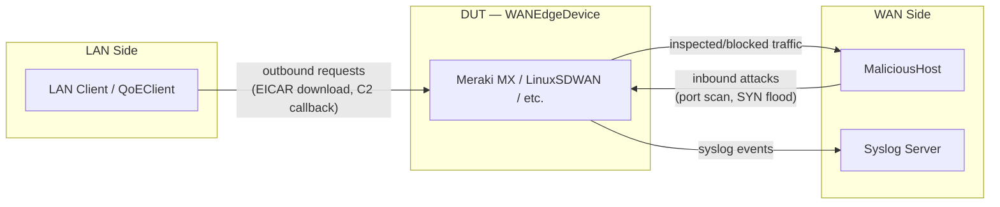

# Security Testing Design — SD-WAN Appliances

> **Purpose:** Define the architecture and test flows for automated security
> efficacy testing of SD-WAN appliances — IPS, AMP (malware protection),
> content filtering, L7 firewall, and threat mitigation.
>
> **Date:** 2026-03-12
> **Status:** Designed — not yet implemented (descoped per [ADR-0001](../../../adr/0001-scope-to-digital-twin-phase-3.5.md))
>
> This document covers the `MaliciousHost` template, `LinuxMaliciousHost`
> device class, `security_use_cases.py`, and all security test scenarios.
> It is retained as the reference design for future implementation.
>
> **Related documents:**
>
> | Document | Relevance |
> |----------|-----------|
> | [sdwan-testing-architecture.md](../architecture.md) §3, §11 | Security pillar definition, SLOs, risk register |
> | [cross-vendor sdwan API analysis.md](../cross-vendor-api-analysis.md) §3.7, §8 | Security service vendor translations |
> | [adr/0001-scope-to-digital-twin-phase-3.5.md](../../../adr/0001-scope-to-digital-twin-phase-3.5.md) | Scope decision — security tooling descoped |
> | `boardfarm3/templates/wan_edge.py` | DUT-side security methods |

---

## 1. Overview

Security testing validates that the WAN Edge appliance correctly detects,
blocks, and logs malicious or policy-violating traffic.  The testing
architecture splits responsibility between two sides:

- **DUT side** — the `WANEdgeDevice` template configures security services
  and reads back events.  All methods for this are already implemented.
- **Infrastructure side** — a `MaliciousHost` template on the WAN (internet)
  side generates threat traffic.  A LAN-side client (existing `QoEClient`
  or LAN device) originates outbound requests that the DUT should block.



---

## 2. DUT-Side Coverage — `WANEdgeDevice` Template

The following template methods are already in place and cover all DUT-side
actions needed for security testing.

### 2.1 Security Service Configuration

| Method | Signature | Purpose |
|--------|-----------|---------|
| `configure_ips` | `(mode: str, ruleset: str) -> None` | Enable IPS in `"prevention"` / `"detection"` / `"disabled"` mode |
| `get_ips_settings` | `() -> dict` | Read back current IPS config (`mode`, `ruleset`) |
| `configure_malware_protection` | `(enabled: bool) -> None` | Enable/disable AMP / malware engine |
| `get_malware_settings` | `() -> dict` | Read back AMP status (`enabled`) |
| `configure_content_filter` | `(enabled, blocked_categories, allowed_urls, blocked_urls) -> None` | Block URL categories (e.g. `"Gambling"`) |
| `get_content_filter_settings` | `() -> dict` | Read back content filter config |

### 2.2 Firewall Rules

| Method | Signature | Purpose |
|--------|-----------|---------|
| `apply_firewall_rule` | `(rule: FirewallRule, via: str) -> None` | Apply L3/L4 or L7 firewall rule |
| `remove_firewall_rule` | `(name: str, via: str) -> None` | Remove rule (teardown) |
| `get_firewall_rules` | `() -> list[FirewallRule]` | Read back active rules |

`FirewallRule` supports both specific-app blocking (`application` field) and
category-based blocking (`application_category` field).

### 2.3 Logging and Event Verification

| Method | Signature | Purpose |
|--------|-----------|---------|
| `configure_syslog` | `(server: str, port: int, roles: list[str] \| None) -> None` | Direct security events to syslog server |
| `get_syslog_settings` | `() -> dict` | Read back syslog config |
| `get_security_log_events` | `(since_s: int) -> list[dict]` | Query security events (IPS, malware, firewall, content filter) |

`get_security_log_events` returns dicts with required fields (`action`,
`src_ip`, `dst_port`, `protocol`, `timestamp`) and optional fields that
enable precise assertion:

| Optional field | Present when |
|---|---|
| `event_type` | Always recommended: `"ips"`, `"malware"`, `"firewall"`, `"content_filter"`, `"l7_firewall"` |
| `url` | Content filter and URL-based blocks |
| `category` | Content filter or L7 category match |
| `application` | L7 application identification |
| `signature` | IPS signature match |
| `rule_name` | Firewall rule match |

---

## 3. Infrastructure Gap — `MaliciousHost` Template

### 3.1 Concept

The `MaliciousHost` is a WAN-side device that generates threat traffic
directed at or through the DUT.  It serves two roles:

1. **Active inbound attacks** — port scans, SYN floods, exploit payloads
   directed at the DUT's WAN interface.
2. **Passive target services** — an HTTP server hosting EICAR test files,
   a TCP listener simulating a C2 command server, malicious URLs for
   content filter testing.

> Per the testing architecture ([sdwan-testing-architecture.md](../architecture.md)):
> all threat infrastructure lives in **one** `MaliciousHost`
> container.  No separate LAN-side threat device is needed.

### 3.2 Proposed Template

```python
from abc import ABC, abstractmethod


class MaliciousHost(ABC):
    """WAN-side threat simulation infrastructure.

    Provides raw attack/target-service actions.  Composite test scenarios
    and DUT-side assertions live in security_use_cases.py.
    """

    # ── Passive target services ─────────────────────────────

    @abstractmethod
    def get_eicar_url(self) -> str:
        """Return HTTP URL serving the EICAR anti-malware test file.

        The EICAR file is the industry-standard 68-byte test string
        recognised by all AMP/AV engines as malware.  The URL is
        served over HTTP (not HTTPS) so the DUT can inspect the
        payload without SSL decryption.

        :return: URL string, e.g. "http://10.20.1.100:8080/eicar.com"
        """

    @abstractmethod
    def start_c2_listener(self, port: int = 4444) -> None:
        """Start a TCP listener simulating a C2 (Command & Control) server.

        The listener accepts connections and sends a recognisable payload.
        The DUT's Application Control or IPS should block the LAN client's
        outbound connection attempt to this listener.

        :param port: TCP port to listen on.
        """

    @abstractmethod
    def stop_c2_listener(self) -> None:
        """Stop the C2 listener (teardown)."""

    @abstractmethod
    def serve_malicious_url(self, category: str = "malware") -> str:
        """Return a URL that serves content matching the given threat category.

        Supported categories:
        - "malware" — serves EICAR or similar test payload
        - "phishing" — serves a phishing-like page
        - "c2" — serves content that triggers C2 detection signatures

        :param category: Threat category.
        :return: URL string.
        """

    # ── Active inbound attacks ──────────────────────────────

    @abstractmethod
    def run_port_scan(
        self, target: str, port_range: str = "1-1024"
    ) -> dict:
        """Run a TCP port scan (Nmap-style) against the target.

        :param target: Target IP address (DUT WAN IP).
        :param port_range: Port range to scan (e.g. "1-1024", "22,80,443").
        :return: Scan results dict with at minimum:
            - "open_ports": list of open port numbers
            - "scan_duration_s": float
        """

    @abstractmethod
    def inject_syn_flood(
        self, target: str, rate_pps: int = 1000, duration_s: int = 10
    ) -> None:
        """Inject a SYN flood attack against the target.

        :param target: Target IP address (DUT WAN IP).
        :param rate_pps: SYN packets per second.
        :param duration_s: Duration of the flood.
        """

    @abstractmethod
    def stop_attack(self) -> None:
        """Stop any currently running attack (teardown)."""
```

### 3.3 Proposed Implementation — `LinuxMaliciousHost`

A Docker container based on Alpine or Kali with pre-installed tools:

| Tool | Purpose |
|------|---------|
| `nmap` | Port scanning (`run_port_scan`) |
| `hping3` | SYN flood generation (`inject_syn_flood`) |
| Python `http.server` | EICAR file serving (`get_eicar_url`) |
| `socat` or Python socket | C2 listener simulation (`start_c2_listener`) |

The EICAR test file is the standard 68-byte string:

```
X5O!P%@AP[4\PZX54(P^)7CC)7}$EICAR-STANDARD-ANTIVIRUS-TEST-FILE!$H+H*
```

Served by a simple HTTP endpoint so the DUT can inspect the download
without requiring SSL decryption.

### 3.4 Artifact Management

Static test payloads are stored in `bf_config/security_artifacts/`:

```
bf_config/security_artifacts/
    eicar.com              # 68-byte EICAR test file
    eicar.com.zip          # EICAR in ZIP container (AMP depth test)
    c2_beacon.py           # C2 listener script
    phishing_page.html     # Phishing page for content filter test
```

Paths are resolved from the boardfarm environment configuration and
provided to `MaliciousHost` at boot time.

---

## 4. LAN-Side Role — No New Template Needed

The LAN-side "compromised client" that originates outbound requests is
the existing **LAN device** or **QoEClient**.  It performs standard
client actions — HTTP downloads, TCP connections — that the DUT should
block.

| LAN-side action | Existing capability |
|---|---|
| Download file from URL | QoEClient HTTP request / `curl` from LAN device |
| Attempt TCP connection to C2 server | `curl` / Python socket from LAN device |
| Browse URL (content filter test) | QoEClient Playwright navigation |

No additional LAN-side template or device class is required.

---

## 5. Test Scenarios — Full Flow Traces

### 5.1 IPS Detection / Prevention

**Goal:** Verify the DUT detects and blocks inbound threat traffic when
IPS is enabled.

```
┌─────────────────┐    ┌──────────────┐    ┌────────────────┐
│  MaliciousHost   │    │     DUT      │    │  Syslog Server │
│   (WAN side)     │    │  (Meraki MX) │    │                │
└────────┬────────┘    └──────┬───────┘    └───────┬────────┘
         │                     │                     │
         │  Step 1: configure_ips(mode="prevention") │
         │                     │◄────────────────────┤
         │  Step 2: configure_syslog(roles=["security"])
         │                     │─────────────────────►│
         │                     │                      │
         │  Step 3: run_port_scan(dut_wan_ip)         │
         │────────────────────►│                      │
         │                     │  IPS detects scan    │
         │                     │─────syslog event────►│
         │                     │                      │
         │  Step 4: get_security_log_events(since_s=30)
         │                     │                      │
         │  assert event_type="ips" and action="block"│
         │                     │                      │
         │  Step 5: configure_ips(mode="disabled")    │
         │                     │  (teardown)          │
```

**Template methods used:**

| Step | Device | Method |
|------|--------|--------|
| 1 | DUT | `configure_ips(mode="prevention", ruleset="balanced")` |
| 2 | DUT | `configure_syslog(server, port, roles=["security"])` |
| 3 | MaliciousHost | `run_port_scan(dut_wan_ip, "1-1024")` |
| 4 | DUT | `get_security_log_events(since_s=30)` |
| 5 | DUT | `configure_ips(mode="disabled")` (teardown) |

**Assertions:**
- `get_ips_settings()` returns `{"mode": "prevention", "ruleset": "balanced"}`
- `get_security_log_events()` contains at least one event with
  `event_type="ips"` and `action="block"`

---

### 5.2 AMP / Malware Blocking (EICAR)

**Goal:** Verify the DUT blocks download of the EICAR test file when AMP
is enabled.

```
┌──────────────┐    ┌──────────────┐    ┌────────────────┐    ┌──────────────┐
│  LAN Client   │    │     DUT      │    │ MaliciousHost  │    │ Syslog Server│
│  (QoEClient)  │    │  (Meraki MX) │    │  (WAN side)    │    │              │
└──────┬───────┘    └──────┬───────┘    └──────┬─────────┘    └──────┬───────┘
       │                    │                    │                     │
       │  Step 1: configure_malware_protection(enabled=True)          │
       │                    │                    │                     │
       │  Step 2: configure_syslog(roles=["security"])                │
       │                    │────────────────────┼────────────────────►│
       │                    │                    │                     │
       │  Step 3: eicar_url = get_eicar_url()    │                     │
       │                    │                    │                     │
       │  Step 4: attempt HTTP download of eicar_url                   │
       │───────────────────►│───────────────────►│                     │
       │                    │  AMP detects EICAR  │                     │
       │  ◄── blocked ──────│                    │                     │
       │                    │──── syslog event ──┼────────────────────►│
       │                    │                    │                     │
       │  Step 5: get_security_log_events(since_s=30)                  │
       │                    │                    │                     │
       │  assert event_type="malware" and action="block"               │
       │                    │                    │                     │
       │  Step 6: configure_malware_protection(enabled=False) (teardown)
```

**Template methods used:**

| Step | Device | Method |
|------|--------|--------|
| 1 | DUT | `configure_malware_protection(enabled=True)` |
| 2 | DUT | `configure_syslog(server, port, roles=["security"])` |
| 3 | MaliciousHost | `get_eicar_url()` |
| 4 | LAN Client | HTTP GET to the EICAR URL (e.g. `curl`) |
| 5 | DUT | `get_security_log_events(since_s=30)` |
| 6 | DUT | `configure_malware_protection(enabled=False)` (teardown) |

**Assertions:**
- `get_malware_settings()` returns `{"enabled": True}`
- The LAN client download fails (connection reset or block page)
- `get_security_log_events()` contains event with `event_type="malware"`
  and `action="block"`
- Zero bytes of EICAR payload transferred to the client

**Note — HTTPS limitation:** EICAR served over HTTP allows the DUT to
inspect the payload inline.  Testing EICAR over HTTPS requires SSL
decryption / inspection to be enabled on the DUT (see Open Questions §10).

---

### 5.3 C2 Callback Blocking

**Goal:** Verify the DUT blocks outbound connections from LAN clients to
a known C2 server pattern.

| Step | Device | Method |
|------|--------|--------|
| 1 | DUT | `configure_ips(mode="prevention")` |
| 2 | DUT | `configure_syslog(server, port, roles=["security"])` |
| 3 | MaliciousHost | `start_c2_listener(port=4444)` |
| 4 | LAN Client | Attempt outbound TCP connection to `malicious_host_ip:4444` |
| 5 | DUT | `get_security_log_events(since_s=30)` |
| 6 | MaliciousHost | `stop_c2_listener()` (teardown) |
| 7 | DUT | `configure_ips(mode="disabled")` (teardown) |

**Assertions:**
- The LAN client connection attempt fails (timeout or reset)
- `get_security_log_events()` contains event with `action="block"`
- Event includes `dst_port=4444` and source IP matching the LAN client

**Alternative approach — L7 firewall rule:** Instead of relying on IPS
signatures to detect C2 traffic, the test can also apply an explicit
firewall rule blocking the destination:

```python
apply_firewall_rule(FirewallRule(
    name="block-c2",
    action="deny",
    protocol="tcp",
    src_cidr="192.168.0.0/16",
    dst_cidr=f"{malicious_host_ip}/32",
    dst_port="4444",
    log=True,
))
```

This tests the firewall path rather than the IPS path. Both are valid
test scenarios.

---

### 5.4 Content Filter — Block URL Category

**Goal:** Verify the DUT blocks access to a URL category (e.g. "Gambling")
and logs the event.

| Step | Device | Method |
|------|--------|--------|
| 1 | DUT | `configure_content_filter(enabled=True, blocked_categories=["Gambling"])` |
| 2 | DUT | `configure_syslog(server, port, roles=["urls", "security"])` |
| 3 | LAN Client | Attempt to browse a gambling website |
| 4 | DUT | `get_content_filter_settings()` — verify config |
| 5 | DUT | `get_security_log_events(since_s=30)` |
| 6 | DUT | `configure_content_filter(enabled=False)` (teardown) |

**Assertions:**
- `get_content_filter_settings()` includes `"Gambling"` in `blocked_categories`
- LAN client receives block page or connection refused
- `get_security_log_events()` contains event with `event_type="content_filter"`,
  `category="Gambling"`, `action="block"`

---

### 5.5 L7 Firewall — Block Application Category

**Goal:** Verify the DUT blocks all traffic for an application category
(e.g. "Sports") via an L7 firewall rule and logs the event.

| Step | Device | Method |
|------|--------|--------|
| 1 | DUT | `get_application_categories()` — discover valid category names |
| 2 | DUT | `apply_firewall_rule(FirewallRule(name="block-sports", action="deny", protocol="any", src_cidr="any", dst_cidr="any", dst_port="any", application_category="Sports", log=True))` |
| 3 | DUT | `configure_syslog(server, port, roles=["firewall", "security"])` |
| 4 | LAN Client | Attempt to access a sports website |
| 5 | DUT | `get_firewall_rules()` — verify rule is active |
| 6 | DUT | `get_security_log_events(since_s=30)` |
| 7 | DUT | `remove_firewall_rule("block-sports")` (teardown) |

**Assertions:**
- `get_firewall_rules()` includes a rule with `application_category="Sports"`
- LAN client access is blocked
- `get_security_log_events()` contains event with `event_type="l7_firewall"`,
  `category="Sports"`, `action="block"`

---

### 5.6 Security Performance Overhead

**Goal:** Measure the throughput and latency impact of enabling inline
security services (IPS + AMP) compared to a baseline.

| Step | Device | Method |
|------|--------|--------|
| 1 | TrafficGenerator | Measure baseline throughput (IPS/AMP off) |
| 2 | DUT | `configure_ips(mode="prevention")` |
| 3 | DUT | `configure_malware_protection(enabled=True)` |
| 4 | TrafficGenerator | Measure throughput with security enabled |
| 5 | DUT | `get_telemetry()` — check CPU utilisation |
| 6 | DUT | `configure_ips(mode="disabled")` + `configure_malware_protection(enabled=False)` (teardown) |

**Assertions (from [sdwan-testing-architecture.md](../architecture.md) SLOs):**
- Throughput degradation < 20% vs. baseline
- Added latency < 5ms
- DUT CPU utilisation < 80% at inspection load

---

## 6. Proposed `security_use_cases.py` Signatures

Composite use-case functions that orchestrate both DUT-side and
infrastructure-side actions.  These follow the five-layer Boardfarm
architecture: use cases (Layer 3) combine template methods (Layer 4);
step definitions (Layer 2) call use cases.

```python
"""Security test use cases.

Composite scenarios combining WANEdgeDevice template methods with
MaliciousHost actions and DUT-side assertions.
"""


def assert_ips_blocks_port_scan(
    wan_edge: WANEdgeDevice,
    malicious_host: MaliciousHost,
    syslog_server: str,
    mode: str = "prevention",
    ruleset: str = "balanced",
) -> None:
    """Enable IPS, run port scan from MaliciousHost, assert DUT blocks and logs."""


def assert_malware_download_blocked(
    wan_edge: WANEdgeDevice,
    malicious_host: MaliciousHost,
    lan_client,  # LAN device or QoEClient
    syslog_server: str,
) -> None:
    """Enable AMP, attempt EICAR download via LAN client, assert DUT blocks."""


def assert_c2_callback_blocked(
    wan_edge: WANEdgeDevice,
    malicious_host: MaliciousHost,
    lan_client,
    syslog_server: str,
    c2_port: int = 4444,
) -> None:
    """Start C2 listener, attempt outbound connection from LAN, assert DUT blocks."""


def assert_content_filter_blocks_category(
    wan_edge: WANEdgeDevice,
    lan_client,
    category: str,
    test_url: str,
    syslog_server: str,
) -> None:
    """Enable content filter for category, attempt access, assert block + log."""


def assert_l7_firewall_blocks_category(
    wan_edge: WANEdgeDevice,
    lan_client,
    category: str,
    test_url: str,
    syslog_server: str,
) -> None:
    """Apply L7 firewall rule for category, attempt access, assert block + log."""


def assert_traffic_blocked(
    wan_edge: WANEdgeDevice,
    src_ip: str,
    dst_port: int,
    since_s: int = 30,
) -> None:
    """Generic assertion: verify a block event exists in DUT security logs."""


def measure_security_overhead(
    wan_edge: WANEdgeDevice,
    traffic_generator,
    baseline_throughput_mbps: float,
    max_degradation_pct: float = 20.0,
    max_added_latency_ms: float = 5.0,
    max_cpu_pct: float = 80.0,
) -> dict:
    """Enable IPS+AMP, measure throughput, assert within SLO, return metrics."""
```

---

## 7. Meraki MX Specifics

The Meraki MX maps cleanly to this architecture:

| Template method | Meraki API |
|---|---|
| `configure_ips` | `updateNetworkApplianceSecurityIntrusion(mode, idsRulesets)` |
| `get_ips_settings` | `getNetworkApplianceSecurityIntrusion` |
| `configure_malware_protection` | `updateNetworkApplianceSecurityMalware(mode)` |
| `get_malware_settings` | `getNetworkApplianceSecurityMalware` |
| `configure_syslog` | `updateNetworkSyslogServers(servers=[...])` |
| `get_security_log_events` | `getNetworkApplianceSecurityEvents` |

Meraki IPS operates at the network level with three modes (`disabled`,
`detection`, `prevention`) and three rulesets (`connectivity`, `balanced`,
`security`).  These map 1:1 to the template vocabulary.

Meraki AMP is a binary toggle (`enabled`/`disabled`).  It inspects HTTP
file downloads and blocks known malware hashes.

See `meraki-implementation.md` §4.18–§4.22 for full API payload details.

---

## 8. Cross-Vendor Applicability

All test scenarios are portable across commercial SD-WAN platforms:

| Scenario | Meraki | Cisco Catalyst | FortiGate | VeloCloud | Prisma |
|---|---|---|---|---|---|
| IPS detection | `mode: "prevention"` | UTD IPS mode | IPS sensor: block | IPS mode: protect | Threat Prevention: block |
| AMP / malware | AMP `enabled` | AMP feature template | AV profile | Limited | WildFire |
| Content filter | Content filtering | URL filter policy | Web filter profile | URL category filter | URL filter profile |
| L7 firewall | L7 firewall rules | NBAR2 ACL | App control | App category policy | App-ID security rule |
| Syslog | `updateNetworkSyslogServers` | Logging template | `log.syslogd/setting` | Edge syslog export | Syslog server profile |
| Security events | `getSecurityEvents` | Security logs | IPS/AV/web filter logs | Events API | Threat logs |

See `cross-vendor sdwan API analysis.md` §8 for detailed vendor
translations of IPS mode, ruleset, malware, and content filter parameters.

---

## 9. Implementation Priority

| Priority | Component | Depends on |
|----------|-----------|------------|
| 1 | `MaliciousHost` template (`boardfarm3/templates/malicious_host.py`) | — |
| 2 | `LinuxMaliciousHost` device class (`boardfarm3/devices/linux_malicious_host.py`) | Docker container with nmap, hping3, Python HTTP server |
| 3 | Security artifacts (`bf_config/security_artifacts/`) | EICAR file, C2 listener script |
| 4 | `security_use_cases.py` (`boardfarm3/use_cases/security.py`) | MaliciousHost template + WANEdgeDevice template |
| 5 | BDD step definitions for security scenarios | security_use_cases.py |

---

## 10. Open Questions

1. **EICAR over HTTPS:** Meraki AMP inspects HTTP downloads natively.
   Testing EICAR over HTTPS requires SSL decryption (Meraki: "SSL
   Inspection" license).  Should we test both HTTP and HTTPS, or
   HTTP-only for the initial implementation?

2. **SYN flood detection thresholds:** What SYN/s rate reliably triggers
   detection across different DUT platforms?  The testing doc suggests
   >= 1,000 SYN/s.  This may need per-vendor tuning.

3. **C2 detection mechanism:** IPS-based C2 detection relies on
   signature matching.  A simple TCP connection to port 4444 may not
   trigger IPS on all platforms.  Should the C2 listener also send a
   recognisable payload (e.g. Metasploit-like handshake) to ensure
   signature match?

4. **Additional payload types:** Should `MaliciousHost` support
   CVE-specific exploit simulations beyond EICAR and port scans?

5. **QoE + security composite tests:** The architecture doc notes that
   security and QoE SLOs are complementary.  Should
   `security_use_cases.py` include composite assertions that verify
   security blocking does not degrade QoE for legitimate traffic?

6. **Meraki AMP file hash detection:** Meraki AMP blocks files matching
   known malware hashes (cloud lookup).  The EICAR hash is well-known
   and should be detected.  Should we also test with custom hash
   blocking (Meraki allows adding custom file hashes to the block list)?
