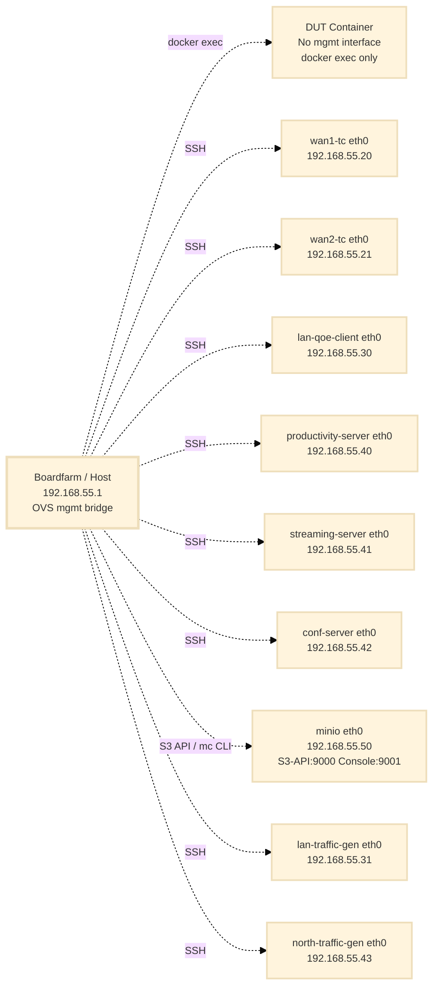
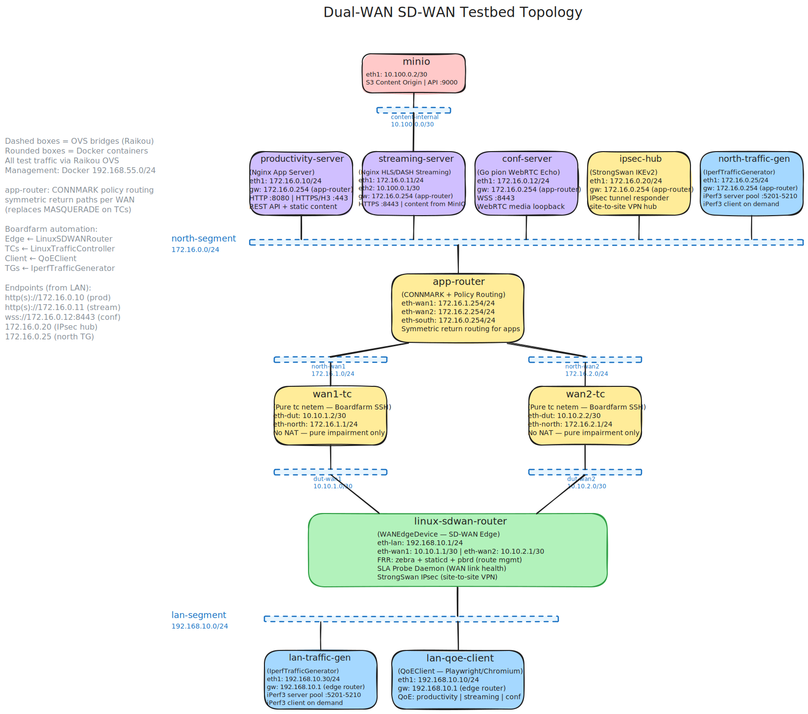

# SD-WAN Testbed Configuration

**Date:** March 8, 2026
**Status:** Deployed — Phase 3.5+ (Digital Twin Hardening + TrafficGenerator)
**Related:** `architecture.md`, `app-router.md`, `traffic-generator.md`, `traffic-management.md`

---

## Configuration File Reference

The SD-WAN testbed uses **dedicated configuration files** to keep it isolated from other testbeds (e.g. OpenWrt, prplOS). All references in this document and related implementation plans use these paths.

| Purpose | File | Location |
| :--- | :--- | :--- |
| **Boardfarm inventory** | `bf_config_sdwan.json` | `bf_config/bf_config_sdwan.json` |
| **Boardfarm environment** | `bf_env_sdwan.json` | `bf_config/bf_env_sdwan.json` |
| **Docker Compose** | `docker-compose-sdwan.yaml` | `raikou/docker-compose-sdwan.yaml` |
| **Raikou OVS topology** | `config_sdwan.json` | `raikou/config_sdwan.json` |

**Docker project name:** `boardfarm-bdd-sdwan` (set via `name:` in `docker-compose-sdwan.yaml` or `-p boardfarm-bdd-sdwan`).

**CLI usage:**
```bash
# Start the SD-WAN testbed
docker compose -p boardfarm-bdd-sdwan -f raikou/docker-compose-sdwan.yaml up -d

# Run Boardfarm tests
pytest --inventory-config bf_config/bf_config_sdwan.json --env-config bf_config/bf_env_sdwan.json ...
```

---

## Overview

The SD-WAN testbed is a fully Dockerised, Raikou-orchestrated environment that simulates a WAN Edge Appliance deployment with two independent WAN paths and a set of North-side application services. It operates on two distinct network layers:

- **OVS Management Bridge** (`192.168.55.0/24`): All containers use `network_mode: none`; SSH access is provided via a dedicated OVS `mgmt` bridge managed by Raikou (the DUT has no management interface — see below). See [Management Network Isolation](../../architecture/management-network-isolation.md).
- **Simulated Network** (seven OVS bridges): The functional testbed topology created by Raikou using Open vSwitch. This is the network through which test traffic actually flows.

The Raikou orchestrator container reads `config_sdwan.json` that declares the OVS bridge topology and the interface assignments for each container. Docker Compose (`docker-compose-sdwan.yaml`) starts the containers; Raikou then wires them together via OVS.

---

## 1. Network Architecture

### 1.1 Component Overview

| Component | Boardfarm Role | Container Name | Description |
| :--- | :--- | :--- | :--- |
| **Linux SD-WAN Router** | DUT (`WANEdgeDevice`) | `linux-sdwan-router` | Device Under Test. FRR, Policy-Based Routing (pbr-map), dual WAN. |
| **WAN1 Traffic Controller** | Impairment (`TrafficController`) | `wan1-tc` | Pure `tc netem` impairment emulator on the MPLS/Fiber path. North-side on `north-wan1`. |
| **WAN2 Traffic Controller** | Impairment (`TrafficController`) | `wan2-tc` | Pure `tc netem` impairment emulator on the Internet/Cable path. North-side on `north-wan2`. |
| **App-Router** | Infrastructure | `app-router` | CONNMARK policy router. Connects per-WAN north-side networks to the shared app-services network. Ensures symmetric return routing. See `app-router.md`. |
| **LAN Client** | Client (`QoEClient`) | `lan-qoe-client` | Playwright-based QoE measurement container (productivity, streaming, conferencing). |
| **Productivity Server** | Server (North-side) | `productivity-server` | Nginx Mock SaaS (index.html, large_asset.js, /api/latency). Separate from `streaming-server` to enable independent L7 path steering. |
| **Streaming Server** | Server (North-side) | `streaming-server` | Nginx HLS streaming edge (proxies to MinIO via `content-internal` bridge). Separate from `productivity-server` to enable independent L7 path steering. |
| **MinIO Content Store** | Infrastructure | `minio` | S3-compatible object store. Holds HLS manifests and `.ts` segments. Connected to the `content-internal` Raikou OVS bridge — only `streaming-server` reaches it for proxy traffic. The management host accesses the MinIO S3 API via the OVS management bridge for content ingest. |
| **Log Collector** | Infrastructure | `log-collector` | Fluent Bit container on the management network. Reads all container stdout/stderr (including DUT) via the Docker socket and writes a unified, timestamped log to the host. No OVS interfaces — log traffic never enters the simulated network. |
| **Raikou Orchestrator** | Infrastructure | `orchestrator` | OVS bridge manager. Creates and wires simulated network. No test traffic. |
| **Conferencing Server** | Server (North-side) | `conf-server` | `pion`-based WebRTC Echo server (WSS :8443) for conferencing QoE measurement. Phase 3.5: TLS certificates mounted. |
| **IPsec Hub** | Infrastructure | `ipsec-hub` | StrongSwan IKEv2 responder peer for `linux-sdwan-router` site-to-site VPN tunnel. Phase 3.5: IKEv2 certificates mounted. |
| **LAN Traffic Generator** | Load (`TrafficGenerator`) | `lan-traffic-gen` | iPerf3 client/server container for QoS contention background load. See `traffic-generator.md`. |
| **North Traffic Generator** | Load (`TrafficGenerator`) | `north-traffic-gen` | iPerf3 client/server container on the north-segment. Receives upstream traffic and can initiate downstream. See `traffic-generator.md`. |
| **Malicious Host** _(Phase 4+)_ | Threat (`MaliciousHost`) | `malicious-host` | Kali Linux container. Active inbound attacker + passive threat services (C2 listener, EICAR). Added when Security pillar validation begins. |

### 1.2 Network Segments

| OVS Bridge | Subnet | Purpose |
| :--- | :--- | :--- |
| `lan-segment` | `192.168.10.0/24` | LAN side — clients and DUT LAN port |
| `dut-wan1` | `10.10.1.0/30` | Point-to-point link: DUT WAN1 ↔ WAN1-TC south port |
| `dut-wan2` | `10.10.2.0/30` | Point-to-point link: DUT WAN2 ↔ WAN2-TC south port |
| `north-wan1` | `172.16.1.0/24` | Per-WAN north side: WAN1-TC ↔ app-router |
| `north-wan2` | `172.16.2.0/24` | Per-WAN north side: WAN2-TC ↔ app-router |
| `north-segment` | `172.16.0.0/24` | App-services network: app-router ↔ application servers and threat infrastructure |
| `content-internal` | `10.100.0.0/30` | Internal only — `streaming-server` (HLS proxy) ↔ `minio` content origin |

---

## 2. Network Topology Diagrams

### 2.1 OVS Management Bridge

All containers use `network_mode: none`. Boardfarm accesses them via the OVS `mgmt` bridge (`192.168.55.0/24`) — no Docker port mappings.

> **Device access:** The `linux-sdwan-router` (DUT) has no management bridge interface. All its interfaces come from Raikou OVS. Boardfarm accesses it via `docker exec` (similar to the CPE in the home-gateway testbed). This prevents management-network traffic from influencing device forwarding decisions.



### 2.2 Simulated Network Topology (Dual WAN)

This is the functional testbed network created by Raikou using OVS bridges. Test traffic flows here.

```mermaid
%%{init: {'theme': 'base', 'themeVariables': { 'fontSize': '12px', 'fontFamily': 'arial' }}}%%
graph LR
    %% --- LAN SIDE ---
    LAN_CLIENT[lan-qoe-client<br/>QoEClient<br/>192.168.10.10]
    LAN_GEN[lan-traffic-gen<br/>TrafficGenerator<br/>192.168.10.20]

    %% --- OVS BRIDGES ---
    BR_LAN[lan-segment bridge<br/>192.168.10.0/24]
    BR_WAN1[dut-wan1 bridge<br/>10.10.1.0/30]
    BR_WAN2[dut-wan2 bridge<br/>10.10.2.0/30]
    BR_NWAN1[north-wan1 bridge<br/>172.16.1.0/24]
    BR_NWAN2[north-wan2 bridge<br/>172.16.2.0/24]
    BR_NORTH[north-segment bridge<br/>172.16.0.0/24]
    BR_CONTENT[content-internal bridge<br/>10.100.0.0/30]

    %% --- DUT ---
    DUT[linux-sdwan-router<br/>DUT — WANEdgeDevice<br/>LAN: 192.168.10.1<br/>WAN1: 10.10.1.1<br/>WAN2: 10.10.2.1]

    %% --- TRAFFIC CONTROLLERS ---
    TC1[wan1-tc<br/>TrafficController<br/>MPLS/Fiber path<br/>south: 10.10.1.2<br/>north: 172.16.1.1]
    TC2[wan2-tc<br/>TrafficController<br/>Internet/Cable path<br/>south: 10.10.2.2<br/>north: 172.16.2.1]

    %% --- APP-ROUTER ---
    APPROUTER[app-router<br/>CONNMARK Policy Router<br/>wan1: 172.16.1.254<br/>wan2: 172.16.2.254<br/>south: 172.16.0.254]

    %% --- NORTH SIDE SERVICES ---
    PROD[productivity-server<br/>Mock SaaS<br/>172.16.0.10]
    STREAM[streaming-server<br/>HLS proxy<br/>172.16.0.11]
    CONF[conf-server<br/>WebRTC Echo<br/>172.16.0.12]
    IPSEC[ipsec-hub<br/>StrongSwan IKEv2<br/>172.16.0.20]
    NORTH_GEN[north-traffic-gen<br/>TrafficGenerator<br/>172.16.0.25]
    MAL[malicious-host<br/>Kali Linux<br/>MaliciousHost<br/>172.16.0.30<br/>Phase 4+]

    %% --- CONTENT ORIGIN ---
    MINIO[minio<br/>MinIO Content Store<br/>10.100.0.2]

    %% --- LAN CONNECTIONS ---
    LAN_CLIENT <-->|eth1| BR_LAN
    LAN_GEN <-->|eth1| BR_LAN
    DUT <-->|eth-lan| BR_LAN

    %% --- DUT-to-TC CONNECTIONS ---
    DUT <-->|eth-wan1| BR_WAN1
    TC1 <-->|eth-dut| BR_WAN1

    DUT <-->|eth-wan2| BR_WAN2
    TC2 <-->|eth-dut| BR_WAN2

    %% --- TC-to-NORTH-WAN CONNECTIONS ---
    TC1 <-->|eth-north| BR_NWAN1
    TC2 <-->|eth-north| BR_NWAN2

    %% --- APP-ROUTER CONNECTIONS ---
    APPROUTER <-->|eth-wan1| BR_NWAN1
    APPROUTER <-->|eth-wan2| BR_NWAN2
    APPROUTER <-->|eth-south| BR_NORTH

    %% --- NORTH-SIDE CONNECTIONS ---
    PROD <-->|eth1| BR_NORTH
    STREAM <-->|eth1| BR_NORTH
    CONF <-->|eth1| BR_NORTH
    IPSEC <-->|eth1| BR_NORTH
    NORTH_GEN <-->|eth1| BR_NORTH
    MAL -. eth1 .-> BR_NORTH

    %% --- CONTENT-INTERNAL CONNECTIONS ---
    STREAM <-->|eth2| BR_CONTENT
    MINIO <-->|eth1| BR_CONTENT

    %% --- STYLING ---
    classDef dut fill:#fff9c4,stroke:#fbc02d,stroke-width:2px,color:black
    classDef tc fill:#e3f2fd,stroke:#1565c0,stroke-width:2px,color:black
    classDef client fill:#e8f5e9,stroke:#2e7d32,stroke-width:2px,color:black
    classDef north fill:#fce4ec,stroke:#c62828,stroke-width:2px,color:black
    classDef planned fill:#fafafa,stroke:#9e9e9e,stroke-width:1px,stroke-dasharray:5 5,color:#757575
    classDef bridge fill:#f3e5f5,stroke:#7b1fa2,stroke-width:2px,color:black
    classDef infra fill:#f5f5f5,stroke:#616161,stroke-width:2px,color:black

    class DUT dut
    class TC1,TC2 tc
    class LAN_CLIENT,LAN_GEN,NORTH_GEN client
    class PROD,STREAM north
    class CONF north
    class IPSEC infra
    class MAL planned
    class APPROUTER infra
    class BR_LAN,BR_WAN1,BR_WAN2,BR_NWAN1,BR_NWAN2,BR_NORTH,BR_CONTENT bridge
    class MINIO infra
```





---

## 3. Per-Segment Detail

### 3.1 LAN Segment (`lan-segment` bridge)

| Container | Interface | IP Address | Role |
| :--- | :--- | :--- | :--- |
| `linux-sdwan-router` | `eth-lan` | `192.168.10.1/24` | LAN gateway |
| `lan-qoe-client` | `eth1` | `192.168.10.10/24` | QoEClient — Playwright measurements |
| `lan-traffic-gen` | `eth1` | `192.168.10.20/24` | TrafficGenerator — iPerf3 client/server |

### 3.2 DUT–WAN1 Segment (`dut-wan1` bridge)

Point-to-point link between the DUT WAN1 interface and the WAN1 Traffic Controller's south-facing port. Simulates the MPLS/Fiber uplink.

| Container | Interface | IP Address | Role |
| :--- | :--- | :--- | :--- |
| `linux-sdwan-router` | `eth-wan1` | `10.10.1.1/30` | DUT WAN1 interface (MPLS/Fiber) |
| `wan1-tc` | `eth-dut` | `10.10.1.2/30` | TC south port — WAN1 gateway seen by DUT |

### 3.3 DUT–WAN2 Segment (`dut-wan2` bridge)

Point-to-point link between the DUT WAN2 interface and the WAN2 Traffic Controller's south-facing port. Simulates the Internet/Cable uplink.

| Container | Interface | IP Address | Role |
| :--- | :--- | :--- | :--- |
| `linux-sdwan-router` | `eth-wan2` | `10.10.2.1/30` | DUT WAN2 interface (Internet/Cable) |
| `wan2-tc` | `eth-dut` | `10.10.2.2/30` | TC south port — WAN2 gateway seen by DUT |

### 3.4 North-WAN1 Segment (`north-wan1` bridge)

Per-WAN north-side link between WAN1 Traffic Controller and the app-router. Part of the split north-segment topology (see `app-router.md`).

| Container | Interface | IP Address | Role |
| :--- | :--- | :--- | :--- |
| `wan1-tc` | `eth-north` | `172.16.1.1/24` | WAN1 north-side egress — forward path to app-router |
| `app-router` | `eth-wan1` | `172.16.1.254/24` | App-router WAN1 ingress — CONNMARK tags connections arriving from WAN1 |

### 3.5 North-WAN2 Segment (`north-wan2` bridge)

Per-WAN north-side link between WAN2 Traffic Controller and the app-router.

| Container | Interface | IP Address | Role |
| :--- | :--- | :--- | :--- |
| `wan2-tc` | `eth-north` | `172.16.2.1/24` | WAN2 north-side egress — forward path to app-router |
| `app-router` | `eth-wan2` | `172.16.2.254/24` | App-router WAN2 ingress — CONNMARK tags connections arriving from WAN2 |

### 3.6 App-Services Segment (`north-segment` bridge)

The simulated Internet/cloud services network. The app-router connects this segment to the per-WAN north bridges, providing symmetric return routing via CONNMARK + policy routing. All application services and the IPsec hub reside here with a common gateway of `172.16.0.254` (app-router).

| Container | Interface | IP Address | Role |
| :--- | :--- | :--- | :--- |
| `app-router` | `eth-south` | `172.16.0.254/24` | Default gateway for all app services — symmetric return routing |
| `productivity-server` | `eth1` | `172.16.0.10/24` | Nginx Mock SaaS (HTTP :8080, HTTPS :443) |
| `streaming-server` | `eth1`, `eth2` | `172.16.0.11/24`, `10.100.0.1/30` | Nginx HLS streaming edge (`eth1` north-segment, `eth2` content-internal to MinIO; HTTPS :8443) |
| `conf-server` | `eth1` | `172.16.0.12/24` | `pion`-based WebRTC Echo server (WSS :8443) |
| `ipsec-hub` | `eth1` | `172.16.0.20/24` | StrongSwan IKEv2 responder — site-to-site VPN hub |
| `north-traffic-gen` | `eth1` | `172.16.0.25/24` | TrafficGenerator — iPerf3 client/server (north side) |
| `malicious-host` _(Phase 4+)_ | `eth1` | `172.16.0.30/24` | Kali Linux — active attacks + passive C2/EICAR services |

### 3.7 Content-Internal Segment (`content-internal` bridge)

An isolated point-to-point link between `streaming-server` and `minio`. This bridge is invisible to all test traffic — LAN clients cannot reach MinIO directly. The streaming-server proxies all HLS requests to MinIO over this bridge using the Raikou-assigned IP address (`10.100.0.2:9000`), deliberately avoiding Docker's default DNS resolution (`minio:9000`) to enforce testbed isolation.

| Container | Interface | IP Address | Role |
| :--- | :--- | :--- | :--- |
| `streaming-server` | `eth2` | `10.100.0.1/30` | HLS proxy → MinIO egress |
| `minio` | `eth1` | `10.100.0.2/30` | MinIO S3 API endpoint for streaming-server proxy |

> **Management access to MinIO:** The `minio` container has a management bridge interface (`eth0` on OVS `mgmt`, `192.168.55.50`), which exposes S3 API (:9000) and web console (:9001) directly on the management bridge. This is used exclusively for content ingest (`mc cp`) and operational debugging. It does not carry any testbed traffic.

---

## 4. Raikou Configuration

### 4.1 `config_sdwan.json` — OVS Bridge and Interface Assignments

**Location:** `raikou/config_sdwan.json`

The Raikou orchestrator reads this file at startup and:
1. Creates the seven OVS bridges.
2. For each container entry, creates a veth pair, attaches one end to the named OVS bridge, and injects the other end into the container with the specified name and IP assignment.

```json
{
    "bridge": {
        "lan-segment":      {},
        "dut-wan1":         {},
        "dut-wan2":         {},
        "north-wan1":       {},
        "north-wan2":       {},
        "north-segment":    {},
        "content-internal": {}
    },
    "container": {
        "linux-sdwan-router": [
            { "bridge": "lan-segment", "iface": "eth-lan",  "ipaddress": "192.168.10.1/24" },
            { "bridge": "dut-wan1",    "iface": "eth-wan1", "ipaddress": "10.10.1.1/30" },
            { "bridge": "dut-wan2",    "iface": "eth-wan2", "ipaddress": "10.10.2.1/30" }
        ],
        "wan1-tc": [
            { "bridge": "dut-wan1",   "iface": "eth-dut",   "ipaddress": "10.10.1.2/30" },
            { "bridge": "north-wan1", "iface": "eth-north", "ipaddress": "172.16.1.1/24" }
        ],
        "wan2-tc": [
            { "bridge": "dut-wan2",   "iface": "eth-dut",   "ipaddress": "10.10.2.2/30" },
            { "bridge": "north-wan2", "iface": "eth-north", "ipaddress": "172.16.2.1/24" }
        ],
        "app-router": [
            { "bridge": "north-wan1",    "iface": "eth-wan1",  "ipaddress": "172.16.1.254/24" },
            { "bridge": "north-wan2",    "iface": "eth-wan2",  "ipaddress": "172.16.2.254/24" },
            { "bridge": "north-segment", "iface": "eth-south", "ipaddress": "172.16.0.254/24" }
        ],
        "lan-qoe-client": [
            { "bridge": "lan-segment", "iface": "eth1", "ipaddress": "192.168.10.10/24", "gateway": "192.168.10.1" }
        ],
        "productivity-server": [
            { "bridge": "north-segment", "iface": "eth1", "ipaddress": "172.16.0.10/24", "gateway": "172.16.0.254" }
        ],
        "streaming-server": [
            { "bridge": "north-segment",  "iface": "eth1", "ipaddress": "172.16.0.11/24", "gateway": "172.16.0.254" },
            { "bridge": "content-internal", "iface": "eth2", "ipaddress": "10.100.0.1/30" }
        ],
        "conf-server": [
            { "bridge": "north-segment", "iface": "eth1", "ipaddress": "172.16.0.12/24", "gateway": "172.16.0.254" }
        ],
        "ipsec-hub": [
            { "bridge": "north-segment", "iface": "eth1", "ipaddress": "172.16.0.20/24", "gateway": "172.16.0.254" }
        ],
        "lan-traffic-gen": [
            { "bridge": "lan-segment", "iface": "eth1", "ipaddress": "192.168.10.20/24", "gateway": "192.168.10.1" }
        ],
        "north-traffic-gen": [
            { "bridge": "north-segment", "iface": "eth1", "ipaddress": "172.16.0.25/24", "gateway": "172.16.0.254" }
        ],
        "minio": [
            { "bridge": "content-internal", "iface": "eth1", "ipaddress": "10.100.0.2/30" }
        ]
    },
    "vlan_translations": []
}
```

### 4.2 `docker-compose-sdwan.yaml`

**Location:** `raikou/docker-compose-sdwan.yaml`

#### Resource Allocation

The compose file enforces CPU and memory limits on all services using `deploy.resources`. Two values are set per service:

- **Limit:** Hard ceiling — the container is throttled at this value.
- **Reservation:** Soft guarantee — Docker's scheduler ensures at least this CPU share is available under host contention.

The latency-sensitive containers (`linux-sdwan-router`, `wan1-tc`, `wan2-tc`) have reservations to protect BFD echo timers (100 ms interval) from being starved by CPU-hungry containers (Chromium/Playwright, iPerf3 saturation flows). Without reservations, a complex Playwright navigation can briefly consume 3+ cores and cause `tc netem` timer slip on the host kernel, corrupting the impairment profile under test.

**Minimum recommended host:** 8 physical cores (16 threads), 32 GB RAM.

| Container | CPU Limit | CPU Reservation | Memory Limit | Notes |
| :--- | :---: | :---: | :---: | :--- |
| `linux-sdwan-router` | 2.0 | 1.5 | 512M | BFD timer sensitivity — guaranteed cores |
| `wan1-tc` / `wan2-tc` | 0.5 | 0.25 | 128M | `tc netem` is kernel-driven; container is near-idle |
| `app-router` | 0.25 | 0.1 | 64M | CONNMARK policy routing; minimal CPU |
| `lan-qoe-client` | 3.0 | 1.5 | 3G | Chromium + WebRTC codec work; largest memory consumer |
| `productivity-server` | 1.0 | 0.5 | 256M | Nginx serving static assets + HTTPS/HTTP3 |
| `streaming-server` | 2.0 | 1.0 | 512M | Nginx + MinIO proxy for HLS segments + HTTPS |
| `conf-server` | 1.0 | 0.5 | 256M | pion WebRTC echo + WSS |
| `ipsec-hub` | 0.5 | 0.25 | 128M | StrongSwan IKEv2 responder |
| `minio` | 1.0 | — | 256M | Content origin; management-plane ingest only |
| `log-collector` | 0.25 | 0.1 | 128M | Fluent Bit is extremely lightweight at this log volume |
| `raikou-net` | 0.5 | 0.25 | 128M | Startup only; idle during tests |
| `lan-traffic-gen` | 1.0 | 0.5 | 256M | iPerf3 UDP at 85 Mbps is PPS-heavy in userspace |
| `north-traffic-gen` | 1.0 | 0.5 | 256M | iPerf3 server + downstream client capability |
| `malicious-host` _(Phase 4+)_ | 1.5 | 0.5 | 256M | Brief spikes during nmap scans / hping3 floods |

> **CI environments:** On a 4–8 vCPU CI runner, reduce `lan-qoe-client` to `cpus: '1.0'` and `streaming-server` to `cpus: '1.0'`. Phase 4+ containers (`malicious-host`) are not in scope until their respective pillars are validated.

The compose file is located at `raikou/docker-compose-sdwan.yaml`. It is the authoritative source — the YAML below is a reference copy. See the actual file for the latest version.

> **Phase 4+ services** (`malicious-host`) are added to the compose file and `config_sdwan.json` when their respective testing pillars begin implementation.
---

## 5. Container Specifications

### 5.1 Access Summary

All containers use `network_mode: none`. Management access is via the OVS `mgmt` bridge — no Docker port mappings.

| Container | Management IP | Services | Connection Method | Notes |
| :--- | :--- | :--- | :--- | :--- |
| `linux-sdwan-router` | — | — | `docker exec -it linux-sdwan-router bash` | No mgmt interface |
| `wan1-tc` | `192.168.55.20` | SSH | `ssh root@192.168.55.20` | |
| `wan2-tc` | `192.168.55.21` | SSH | `ssh root@192.168.55.21` | |
| `app-router` | — | — | `docker exec -it app-router sh` | Infrastructure only; no SSH |
| `lan-qoe-client` | `192.168.55.30` | SSH, SOCKS v5 (:8080) | `ssh root@192.168.55.30` | SOCKS proxy for developer browser access — see §5.2 |
| `productivity-server` | `192.168.55.40` | SSH, HTTP (:8080), HTTPS (:443) | `ssh root@192.168.55.40` | Nginx productivity SaaS; TLS certs mounted |
| `streaming-server` | `192.168.55.41` | SSH, HTTP (:8081), HTTPS (:8443) | `ssh root@192.168.55.41` | HLS proxy to MinIO via content-internal; TLS certs mounted |
| `conf-server` | `192.168.55.42` | SSH, WSS (:8443) | `ssh root@192.168.55.42` | pion WebRTC Echo; TLS certs mounted |
| `ipsec-hub` | — | — | `docker exec -it ipsec-hub bash` | StrongSwan IKEv2 responder; IKEv2 certs mounted |
| `minio` | `192.168.55.50` | S3 API (:9000), Console (:9001) | `mc alias set testbed http://192.168.55.50:9000 testbed testbed-secret` | Mgmt bridge (ingest/debug); `eth1` on `content-internal` carries proxy traffic |
| `lan-traffic-gen` | `192.168.55.31` | SSH | `ssh root@192.168.55.31` | |
| `north-traffic-gen` | `192.168.55.43` | SSH | `ssh root@192.168.55.43` | |
| `malicious-host` _(Phase 4+)_ | `192.168.55.44` | SSH | `ssh root@192.168.55.44` | |
| `log-collector` | — | — | `tail -f logs/sdwan-testbed.log` | Docker socket access; no OVS interfaces — see §5.4 |

**Default credentials:** `root` / `boardfarm`

### 5.2 Developer Debugging Access

The `lan-qoe-client` container provides two complementary tools for debugging QoE test failures. Neither tool compromises testbed isolation — all traffic still traverses the DUT and WAN impairment containers via the OVS bridges.

#### SOCKS v5 Proxy (Dante) — Browse through the testbed LAN

Dante is running inside `lan-qoe-client` and listening on port 8080 at its management IP. Configure your browser to use it as a SOCKS v5 proxy:

```
Firefox → Settings → Network Settings → Manual Proxy Configuration
  SOCKS Host: 192.168.55.30
  Port:       8080
  SOCKS v5
  ✓ Proxy DNS when using SOCKS v5
```

With this configuration your browser routes traffic out via the `lan-qoe-client`'s `eth1` interface on the `lan-segment` bridge — through the DUT — through the active WAN impairment — to the north-side services. This is **the exact same path Playwright uses**.

| Service reachable via proxy | URL |
| :--- | :--- |
| Productivity server (HTTP) | `http://172.16.0.10:8080/` |
| Productivity server (HTTPS) | `https://172.16.0.10:443/` |
| HLS streaming edge (HTTP) | `http://172.16.0.11:8081/hls/default/index.m3u8` |
| HLS streaming edge (HTTPS) | `https://172.16.0.11:8443/hls/default/index.m3u8` |
| WebRTC conferencing | `wss://172.16.0.12:8443/session1` |

This is the primary tool for verifying that north-side services are reachable and rendering correctly, and for experiencing impairment profiles firsthand when calibrating QoE SLOs.

#### Playwright Trace Viewer — Inspect automated browser sessions

For failures specific to Playwright's automated session (element selection, navigation timing, WebRTC `getStats()` parsing), use Playwright's built-in trace recording. This requires no container changes.

```bash
# View a trace captured during a test run
playwright show-trace trace.zip
```

See `qoe-client.md §3.4` for the full tracing setup and CI artifact integration.

### 5.3 Component Image Sources

| Container | Image / Build Context | Package Requirements |
| :--- | :--- | :--- |
| `linux-sdwan-router` | `components/sdwan-router` | `frr`, `iproute2`, `iptables`, `strongswan` |
| `wan1-tc`, `wan2-tc` | `components/traffic-controller` | `iproute2` (tc + netem), `openssh-server` |
| `app-router` | `components/app-router` | `iproute2`, `iptables` (Alpine) |
| `lan-qoe-client` | `components/lan_qoe_client` | `playwright`, `chromium`, `openssh-server` |
| `productivity-server` | `components/productivity-server` | `nginx`, `openssh-server` |
| `streaming-server` | `components/streaming-server` | `nginx`, `openssh-server` |
| `conf-server` | `components/conf-server` | `pion` WebRTC Echo binary, `openssh-server` |
| `ipsec-hub` | `components/ipsec-hub` | `strongswan`, `iproute2` |
| `minio` | `components/minio` | Custom build on MinIO base |
| `log-collector` | `fluent/fluent-bit:3.2` (official image, no custom build) | — |
| `lan-traffic-gen`, `north-traffic-gen` | `components/traffic-gen` | `iperf3`, `openssh-server`, `iproute2` |
| `malicious-host` _(Phase 4+)_ | `components/malicious-host` | `kali-linux-core`, `nmap`, `hping3`, `netcat`, `openssh-server` |

---

### 5.4 Centralized Log Access

The `log-collector` container (Fluent Bit) provides a unified, chronologically ordered stream of all container logs on the management network. It reads container stdout/stderr via the Docker socket — including the DUT (`network_mode: none`) whose FRR daemons write to stdout — and writes a single rotating log file to the host. Log traffic never touches the OVS bridges.

#### Fluent Bit Configuration

Two files are mounted from `./fluent-bit/` in the project directory:

**`fluent-bit/fluent-bit.conf`**

```ini
[SERVICE]
    Flush             5
    Daemon            Off
    Log_Level         info
    Parsers_File      /fluent-bit/etc/parsers.conf

# Tail Docker JSON log files directly — low-latency, works for all containers
# including network_mode: none (DUT). Docker captures stdout/stderr for all
# containers regardless of network configuration.
[INPUT]
    Name              tail
    Tag               docker.*
    Path              /var/lib/docker/containers/*/*.log
    Parser            docker_json
    Docker_Mode       On
    Docker_Mode_Flush 4
    DB                /fluent-bit/db/pos.db
    Refresh_Interval  10
    Rotate_Wait       30

# Enrich each record with the container name (extracted from the file path)
# and a testbed label for filtering in optional Loki/Grafana setup.
[FILTER]
    Name              record_modifier
    Match             docker.*
    Record            testbed sdwan-testbed

# Primary output — unified rotating log file on the host.
# Each line: [ISO-8601 timestamp] [container_name] <message>
# Retained for 7 days; rotatable without restarting Fluent Bit.
[OUTPUT]
    Name              file
    Match             *
    Path              /logs
    File              sdwan-testbed.log
    Format            plain
```

**`fluent-bit/parsers.conf`**

```ini
[PARSER]
    Name        docker_json
    Format      json
    Time_Key    time
    Time_Format %Y-%m-%dT%H:%M:%S.%L%z
    Time_Keep   On
```

#### DUT Log Configuration (FRR)

Configure FRR to write to stdout so Docker captures it without any network path. In `/etc/frr/frr.conf` (or via `vtysh`):

```
log stdout informational
log facility daemon
```

This produces structured FRR log lines (daemon name, severity, message) that appear in `sdwan-testbed.log` labelled as `linux-sdwan-router`.

#### Accessing Logs

**Live tail — all containers:**
```bash
tail -f logs/sdwan-testbed.log
```

**Filter by container — correlate a single component:**
```bash
grep "linux-sdwan-router" logs/sdwan-testbed.log | tail -50   # DUT (FRR)
grep "wan1-tc" logs/sdwan-testbed.log | tail -50              # WAN1 impairment
grep "lan-qoe-client" logs/sdwan-testbed.log | tail -50           # Playwright / Dante
```

**Correlate a time window across all containers** (the primary debugging use case):
```bash
# Show everything between two timestamps — reconstructs the full event sequence
awk '/2026-02-25T10:23:40/,/2026-02-25T10:23:46/' logs/sdwan-testbed.log
```

**Per-container logs still available directly** (unchanged by centralized logging):
```bash
docker logs linux-sdwan-router --timestamps --tail 100
docker logs wan1-tc --since 5m
docker logs lan-qoe-client --follow
```

#### Optional Extension — Loki + Grafana

For structured querying and a visual timeline, add the following to `docker-compose-sdwan.yaml`. Fluent Bit's existing pipeline requires one additional output block only; the flat file output continues to run alongside it.

**Additional compose services:**
```yaml
    loki:
        container_name: loki
        image: grafana/loki:3.3.0
        ports:
            - "3100:3100"
        command: -config.file=/etc/loki/local-config.yaml
        hostname: loki

    grafana:
        container_name: grafana
        image: grafana/grafana:11.5.0
        ports:
            - "3001:3000"
        environment:
            - GF_SECURITY_ADMIN_PASSWORD=testbed
        depends_on:
            - loki
        hostname: grafana
```

**Additional Fluent Bit output block** (append to `fluent-bit.conf`):
```ini
[OUTPUT]
    Name            loki
    Match           *
    Host            loki
    Port            3100
    Labels          testbed=sdwan-testbed
    Label_Keys      $container_name
    Line_Format     key_value
```

Access Grafana at `http://localhost:3001` (credentials: `admin` / `testbed`). Add Loki as a data source at `http://loki:3100`. The Explore view supports LogQL queries such as:

```logql
{testbed="sdwan-testbed"} |= "BFD"
{container_name="linux-sdwan-router"} | logfmt | level="error"
```

---

## 6. Boardfarm Integration

### 6.1 Device Mapping (Boardfarm Inventory)

**Location:** `bf_config/bf_config_sdwan.json` (or `--inventory-config` path)

Inventory holds device identity and connection details. The DUT uses `local_cmd` (docker exec) for access; all other testbed-managed devices use `authenticated_ssh`. Infrastructure-only containers (`app-router`, `ipsec-hub`, `minio`, `log-collector`) are not Boardfarm-managed devices and do not appear in the inventory.

```json
{
    "sdwan": {
        "devices": [
            {
                "name": "sdwan",
                "type": "linux_sdwan_router",
                "connection_type": "local_cmd",
                "conn_cmd": ["docker exec -i linux-sdwan-router bash -i"],
                "wan_interfaces": {
                    "wan1": "eth-wan1",
                    "wan2": "eth-wan2"
                },
                "wan_gateways": {
                    "wan1": "10.10.1.2",
                    "wan2": "10.10.2.2"
                },
                "wan_metrics": {
                    "wan1": 10,
                    "wan2": 200
                },
                "lan_interface": "eth-lan"
            },
            {
                "name": "wan1_tc",
                "type": "linux_traffic_controller",
                "connection_type": "authenticated_ssh",
                "ipaddr": "192.168.55.20",
                "username": "root",
                "password": "boardfarm"
            },
            {
                "name": "wan2_tc",
                "type": "linux_traffic_controller",
                "connection_type": "authenticated_ssh",
                "ipaddr": "192.168.55.21",
                "username": "root",
                "password": "boardfarm"
            },
            {
                "name": "lan_qoe_client",
                "type": "playwright_qoe_client",
                "connection_type": "authenticated_ssh",
                "ipaddr": "192.168.55.30",
                "username": "root",
                "password": "boardfarm",
                "simulated_ip": "192.168.10.10"
            },
            {
                "name": "lan_traffic_gen",
                "type": "iperf_traffic_generator",
                "connection_type": "authenticated_ssh",
                "ipaddr": "192.168.55.31",
                "username": "root",
                "password": "boardfarm",
                "simulated_ip": "192.168.10.20"
            },
            {
                "name": "north_traffic_gen",
                "type": "iperf_traffic_generator",
                "connection_type": "authenticated_ssh",
                "ipaddr": "192.168.55.43",
                "username": "root",
                "password": "boardfarm",
                "simulated_ip": "172.16.0.25"
            }
        ]
    }
}
```

### 6.2 Environment Config (Boardfarm Env)

**Location:** `bf_config/bf_env_sdwan.json` (or `--env-config` path)

The environment config defines per-device defaults and behavior. The DUT has SLA probe configuration (`sla_defaults`). Each TrafficController has per-interface impairment defaults. Named impairment presets are defined at the top level for use by `tc_use_cases.apply_preset()`.

```json
{
    "environment_def": {
        "sdwan": {
            "sla_defaults": {
                "max_latency_ms": 150,
                "max_jitter_ms": 30,
                "max_loss_percent": 10,
                "probe_interval_ms": 100,
                "failover_threshold": 3,
                "recovery_threshold": 5
            }
        },
        "lan_qoe_client": {},
        "wan1_tc": {
            "interfaces": {
                "eth-north": { "latency_ms": 5, "jitter_ms": 1, "loss_percent": 0, "bandwidth_limit_mbps": 1000 },
                "eth-dut":   { "latency_ms": 5, "jitter_ms": 1, "loss_percent": 0, "bandwidth_limit_mbps": 1000 }
            }
        },
        "wan2_tc": {
            "interfaces": {
                "eth-north": { "latency_ms": 5, "jitter_ms": 1, "loss_percent": 0, "bandwidth_limit_mbps": 1000 },
                "eth-dut":   { "latency_ms": 5, "jitter_ms": 1, "loss_percent": 0, "bandwidth_limit_mbps": 1000 }
            }
        },
        "impairment_presets": {
            "pristine":      { "latency_ms": 5,   "jitter_ms": 1,  "loss_percent": 0,   "bandwidth_limit_mbps": 1000 },
            "cable_typical": { "latency_ms": 15,  "jitter_ms": 5,  "loss_percent": 0.1, "bandwidth_limit_mbps": 100  },
            "4g_mobile":     { "latency_ms": 80,  "jitter_ms": 30, "loss_percent": 1,   "bandwidth_limit_mbps": 20   },
            "satellite":     { "latency_ms": 600, "jitter_ms": 50, "loss_percent": 2,   "bandwidth_limit_mbps": 10   },
            "congested":     { "latency_ms": 25,  "jitter_ms": 40, "loss_percent": 3,   "bandwidth_limit_mbps": null }
        }
    }
}
```

### 6.3 Startup Sequence

1. **`docker compose -p boardfarm-bdd-sdwan -f raikou/docker-compose-sdwan.yaml up -d`** — starts all containers. Raikou starts last (`depends_on`). The `streaming-server` may start before MinIO is ready — content ingest is handled by the Boardfarm session fixture, not at startup.
2. **Raikou** reads `config_sdwan.json`, creates all seven OVS bridges, and injects veth pairs into each container with the configured IP and interface names.
3. **Device startup** — The `linux-sdwan-router` container has `restart: always` so it restarts after `boardfarm_device_boot` power cycles it. FRR initialises policy-based routing. WAN1 and WAN2 interfaces receive their IPs from Raikou. StrongSwan starts automatically if IKEv2 certificates are mounted (Phase 3.5).
4. **App-router startup** — The `app-router` container enables IP forwarding, creates `wan1`/`wan2` routing tables, installs CONNMARK rules for ingress WAN tagging, and adds `ip rule fwmark` entries for symmetric return routing. See `app-router.md`.
5. **TC startup** — each Traffic Controller enables IP forwarding between `eth-dut` and `eth-north`. No impairment is applied by default (`pristine` state). MASQUERADE is **not** used — symmetric return routing is handled by the app-router.
6. **IPsec hub startup** — The `ipsec-hub` container starts StrongSwan as an IKEv2 responder, awaiting tunnel initiation from the DUT.
7. **Traffic generator startup** — `lan-traffic-gen` and `north-traffic-gen` containers wait for their Raikou OVS interface (`eth1`), add static routes for remote testbed subnets via their OVS gateway, start the iPerf3 server pool (ports 5201–5210), and launch SSHD. See [traffic-generator.md](traffic-generator.md).
8. **Content ingest (handled automatically by Boardfarm)** — The `sdwan_testbed_setup` session-scoped autouse fixture in `tests/conftest.py` calls `streaming_server.ensure_content_available()` through the typed `StreamingServer` template reference before the first test runs. The method is idempotent: it checks whether the asset is already present in MinIO and returns immediately if so; otherwise it runs FFmpeg content generation and `mc cp` ingest automatically.

    > **Manual fallback (debugging only):** If needed outside of a Boardfarm session, the ingest can be triggered manually. The shell script below mirrors what `ensure_content_available()` does internally via SSH into `streaming-server`:
    ```bash
    # Generate synthetic HLS content
    scripts/generate_streaming_content.sh

    # Ingest into MinIO via the management bridge (host → MinIO eth0 on OVS mgmt)
    mc alias set testbed http://192.168.55.50:9000 testbed testbed-secret
    mc mb --ignore-existing testbed/streaming-content
    mc cp --recursive /tmp/streaming/ testbed/streaming-content/
    ```
    At runtime, `streaming-server` proxies to MinIO at `http://10.100.0.2:9000` over the `content-internal` Raikou bridge — not via Docker hostname resolution.
    See `application-services.md §3.2` for the full FFmpeg command and bitrate ladder.
9. **Boardfarm** connects to all containers via SSH (or `docker exec` for DUT), parses `bf_config_sdwan.json` and `bf_env_sdwan.json`, instantiates devices with merged config, and the testbed is ready.

---

## 7. Traffic Flow Reference

### 7.1 QoE Test Flow (LAN → North via DUT → TC → App Server)

```
lan-qoe-client (192.168.10.10)
  → [lan-segment bridge]
  → DUT eth-lan → DUT eth-wan1 (active WAN, PBR selects wan1)
  → [dut-wan1 bridge]
  → wan1-tc eth-dut → [netem impairment applied] → wan1-tc eth-north
  → [north-wan1 bridge]
  → app-router eth-wan1 → [CONNMARK tags connection as wan1] → app-router eth-south
  → [north-segment bridge]
  → productivity-server (172.16.0.10) :8080
```

### 7.2 Path Failover Flow (WAN1 → WAN2)

```
wan1-tc applies: ImpairmentProfile(latency_ms=600, loss_percent=50)  ← brownout / blackout
DUT SLA probe on WAN1 detects breach; FRR metric-based routing promotes WAN2 route
Traffic re-routes:
  lan-qoe-client → DUT eth-wan2 → [dut-wan2] → wan2-tc → [north-wan2] → app-router → [north-segment] → productivity-server
Return path: app-router CONNMARK restores fwmark 2 → routes reply via north-wan2 → wan2-tc → DUT
```

### 7.3 QoS Contention Flow (Background load + Priority traffic)

```
lan-traffic-gen (192.168.10.20)
  → iPerf3 UDP DSCP=0 (Best Effort, 85 Mbps background)
  → DUT → wan1-tc (100 Mbps WAN1 link creates queue pressure)
  → north-segment → north-traffic-gen (172.16.0.25) iPerf3 server

lan-qoe-client (192.168.10.10)
  → WebRTC DSCP=46 (EF — voice priority)
  → DUT QoS policy: EF traffic in high-priority queue → guaranteed forwarding
  → conf-server (172.16.0.12) :8443
```

### 7.4 Security Flow (C2 Callback Block Test)

```
malicious-host (172.16.0.30) starts nc listener on :4444
lan-qoe-client (192.168.10.10) attempts outbound TCP → 172.16.0.30:4444
  → DUT Application Control policy → DROP (log entry written)
  → malicious-host check_connection_received() → False  ← assert passes
```

---

## 8. Network Addresses Summary

### 8.1 Complete Address Table

| Network | Subnet | Purpose |
| :--- | :--- | :--- |
| OVS Management Bridge | `192.168.55.0/24` | Boardfarm SSH access (DUT excluded); MinIO console/ingest |
| LAN Segment | `192.168.10.0/24` | LAN clients and DUT LAN port |
| DUT–WAN1 (p2p) | `10.10.1.0/30` | DUT WAN1 ↔ WAN1-TC south |
| DUT–WAN2 (p2p) | `10.10.2.0/30` | DUT WAN2 ↔ WAN2-TC south |
| North-WAN1 | `172.16.1.0/24` | WAN1-TC north ↔ app-router wan1 |
| North-WAN2 | `172.16.2.0/24` | WAN2-TC north ↔ app-router wan2 |
| North Segment (app-services) | `172.16.0.0/24` | App-router south ↔ application services and infrastructure |
| Content-Internal (p2p) | `10.100.0.0/30` | streaming-server (HLS proxy) ↔ MinIO origin — invisible to test traffic |

### 8.2 Service IP Quick Reference

| Service | Simulated IP | Ports (simulated net) | Boardfarm Device |
| :--- | :--- | :--- | :--- |
| DUT LAN gateway | `192.168.10.1` | — | `sdwan` |
| DUT WAN1 | `10.10.1.1` | — | `sdwan` |
| DUT WAN2 | `10.10.2.1` | — | `sdwan` |
| WAN1-TC south | `10.10.1.2` | — | `wan1_tc` |
| WAN2-TC south | `10.10.2.2` | — | `wan2_tc` |
| WAN1-TC north | `172.16.1.1` | — | `wan1_tc` |
| WAN2-TC north | `172.16.2.1` | — | `wan2_tc` |
| LAN traffic generator | `192.168.10.20` | 5201–5210 (iPerf3) | `lan_traffic_gen` |
| App-router wan1 | `172.16.1.254` | — | — (infrastructure) |
| App-router wan2 | `172.16.2.254` | — | — (infrastructure) |
| App-router south | `172.16.0.254` | — | — (infrastructure) |
| Productivity server | `172.16.0.10` | 8080 (HTTP), 443 (HTTPS/H3) | — |
| Streaming server (HLS edge) | `172.16.0.11` | 8081 (HTTP), 8443 (HTTPS) | — |
| Streaming server → MinIO egress | `10.100.0.1` | — (content-internal) | — |
| MinIO content origin | `10.100.0.2` | 9000 (S3 API via content-internal) | — |
| Conferencing server | `172.16.0.12` | 8443 (WSS) | — |
| IPsec hub | `172.16.0.20` | IKEv2 (500/4500 UDP) | — (infrastructure) |
| North traffic generator | `172.16.0.25` | 5201–5210 (iPerf3) | `north_traffic_gen` |
| Malicious host _(Phase 4+)_ | `172.16.0.30` | 4444 (C2), 80 (EICAR HTTP) | `malicious_host` |

---

## 9. Triple WAN Expansion

When expanding to Triple WAN (Project Phase 4), add the following to `config_sdwan.json` and `docker-compose-sdwan.yaml`:

**Additional container:** `wan3-tc` (LTE/4G mobile path)

**Additional OVS bridge:** `dut-wan3` (`10.10.3.0/30`)

**DUT additional interface entry:**
```json
{
    "bridge":    "dut-wan3",
    "iface":     "eth-wan3",
    "ipaddress": "10.10.3.1/30"
}
```

**Additional OVS bridge:** `north-wan3` (`172.16.3.0/24`)

**`wan3-tc` config_sdwan.json entry:**
```json
"wan3-tc": [
    { "bridge": "dut-wan3",   "iface": "eth-dut",   "ipaddress": "10.10.3.2/30" },
    { "bridge": "north-wan3", "iface": "eth-north", "ipaddress": "172.16.3.1/24" }
]
```

**`app-router` additional interface:**
```json
{ "bridge": "north-wan3", "iface": "eth-wan3", "ipaddress": "172.16.3.254/24" }
```

The app-router gains a third WAN interface and corresponding CONNMARK rule / routing table. No changes are required to the North segment or application services — WAN3 adds a third path through the app-router to the same `north-segment` bridge. The `LinuxSDWANRouter` driver's `wan_interfaces` config gains a `"wan3": "eth-wan3"` entry.

---

## 10. Boardfarm Initialization (Device Boot)

To run Boardfarm initialization **with** device boot (power cycle of `linux-sdwan-router`), use:

```bash
boardfarm --board-name sdwan \
  --env-config bf_config/bf_env_sdwan.json \
  --inventory-config bf_config/bf_config_sdwan.json
```

**Important:** Do **not** pass `--skip-boot`. With `--skip-boot`, Boardfarm runs `boardfarm_skip_boot` instead of `boardfarm_device_boot`, and the DUT will not be power cycled.

When boot runs, you should see log lines:
- `Booting sdwan (linux_sdwan_router)`
- `Power cycling sdwan (connection_type=local_cmd)`
- `Sending reboot command to sdwan`
- `Reconnected to sdwan after reboot`

The `linux-sdwan-router` container will restart (visible via `docker ps` — its "Up" time resets).

---

## 11. Verification Commands

All commands assume the SD-WAN testbed is running under project name `boardfarm-bdd-sdwan`. Run from the project root.

```bash
# Verify all containers are running
docker compose -p boardfarm-bdd-sdwan -f raikou/docker-compose-sdwan.yaml ps

# Check OVS bridge topology — expect 7 bridges (run on host)
docker exec orchestrator ovs-vsctl show

# Verify DUT interface configuration
docker exec linux-sdwan-router ip addr show
docker exec linux-sdwan-router ip route show
docker exec linux-sdwan-router vtysh -c "show ip route"

# Verify app-router policy routing
docker exec app-router ip rule show
docker exec app-router iptables -t mangle -L PREROUTING -n -v

# Verify LAN connectivity through DUT → app-router → app server
docker exec lan-qoe-client ping -c 3 192.168.10.1         # DUT LAN gateway
docker exec lan-qoe-client ping -c 3 172.16.0.10          # Productivity server (via WAN)

# Verify Traffic Controller forwarding (no MASQUERADE)
docker exec wan1-tc ip route show
docker exec wan1-tc tc qdisc show dev eth-north        # Confirm netem is clean
docker exec wan1-tc iptables -t nat -L -n               # Should show empty nat table

# Verify application server services (via management bridge)
curl http://192.168.55.40:8080/health                     # Productivity (HTTP)
curl http://192.168.55.41:8081/hls/default/index.m3u8    # Streaming (HLS playlist)

# Verify application server services (HTTPS)
curl -k https://192.168.55.40:443/health                  # Productivity (HTTPS)
curl -k https://192.168.55.41:8443/hls/default/index.m3u8 # Streaming (HTTPS)

# Verify IPsec hub
docker exec ipsec-hub ipsec statusall

# Check SSH access to all SSH-enabled containers (via OVS mgmt bridge)
for ip in 192.168.55.20 192.168.55.21 192.168.55.30 192.168.55.40 192.168.55.41 192.168.55.42 192.168.55.31 192.168.55.43; do
    ssh -o ConnectTimeout=3 root@$ip "hostname" && echo "$ip OK"
done
```

---

## 12. Future Enhancements

The testbed is currently deployed at **Phase 3.5 (Digital Twin Hardening)**. The remaining phases from the project roadmap (see `architecture.md §5`) describe additional capabilities that build on the existing infrastructure without requiring changes to the deployed topology or existing test scenarios.

### 12.1 Phase 4 — Linux Router Expansion

Phase 4 extends the Linux Router digital twin with capabilities needed for QoS and Security pillar validation. StrongSwan (VPN/Overlay) was already completed in Phase 3.5 and is not repeated here. All items are **deferred** until a commercial DUT drives the requirement.

| Deliverable | Pillar | Testbed Impact | New Boardfarm Components |
| :--- | :--- | :--- | :--- |
| **DUT QoS shaping** (`tc htb`, `fq_codel`) | QoS | `linux-sdwan-router` gains LLQ/WFQ traffic classes on WAN egress interfaces; DUT `apply_policy()` extended with QoS dict | — |
| **DUT firewall** (`iptables`/`nftables`) | Security | `linux-sdwan-router` gains zone-based stateful firewall rules (LAN/WAN/DMZ zones) | — |
| ~~**Traffic Generator**~~ (`iPerf3`) | QoS | **Completed** — `lan-traffic-gen` and `north-traffic-gen` deployed. See [traffic-generator.md](traffic-generator.md) | `TrafficGenerator` template, `IperfTrafficGenerator` device class |
| **Malicious Host** (Kali Linux) | Security | New `malicious-host` container on `north-segment` (172.16.0.30); provides port scanning (Nmap), SYN flood (hping3), C2 listener, and EICAR file server | `MaliciousHost` template, `KaliMaliciousHost` device class |
| **Security use cases** | Security | — | `security_use_cases.py`: `assert_port_scan_detected()`, `assert_syn_flood_mitigated()`, `assert_c2_callback_blocked()`, `assert_eicar_download_blocked()` |
| **Triple WAN** | Path Steering | Third WAN path — see [Section 9](#9-triple-wan-expansion) for topology details (`dut-wan3`, `north-wan3` bridges, `wan3-tc` container) | `wan_interfaces` gains `"wan3": "eth-wan3"` |

**Exit criteria (from `architecture.md`):**

- QoS: LLQ test confirms voice traffic (DSCP EF) maintains MOS > 4.0 under link saturation.
- Security: port scan detected and logged; C2 callback blocked (100%); EICAR blocked on first attempt.
- Triple WAN: `dut.get_active_wan_interface()` correctly identifies WAN3 as failover target when both WAN1 and WAN2 are degraded.

**QoS SLOs:**

| Category | SLO |
| :--- | :--- |
| Throughput degradation (IPS + SSL) | < 20% reduction vs. raw throughput |
| Added latency (DPI) | < 5 ms one-way |
| DUT CPU under max inspection load | < 80% utilisation |

**Security SLOs:**

| Category | SLO |
| :--- | :--- |
| Zone-based firewalling | 100% deny-rule traffic blocked; session tracking; 100% deny events logged within 5 s |
| Application control (L7) | 100% C2 blocked; EICAR blocked on first attempt; < 0.1% false positive rate |
| Inbound threat mitigation | Port scan logged within 5 s; LAN < 1% loss during SYN flood ≥ 1 000 SYN/s |
| VPN/Overlay integrity | IKEv2 SA < 3 s *(already met)*; Phase 2 re-key < 1 s; zero plaintext on WAN *(already met)* |

### 12.2 Phase 5 — Commercial DUT Integration

Phase 5 swaps the Linux Router digital twin for a commercial SD-WAN appliance (e.g. Cisco C8000, FortiGate, VMware VeloCloud). The testbed infrastructure, OVS topology, application services, and test scenarios remain unchanged — only the DUT and its Boardfarm driver change.

**What changes:**

| Item | Phase 3.5 (current) | Phase 5 |
| :--- | :--- | :--- |
| DUT container / appliance | `linux-sdwan-router` (FRR + StrongSwan) | Vendor virtual/physical appliance |
| Boardfarm device class | `LinuxSDWANRouter` | Vendor-specific (e.g. `CiscoC8000DUT`, `FortiGateDUT`) |
| `WANEdgeDevice` implementation | SSH + `vtysh` + `ip route get` | Vendor REST / NETCONF API |
| `bf_config_sdwan.json` | `connection_type: "local_cmd"` | `connection_type: "ssh"` or `"rest_api"` with vendor credentials |
| `bf_env_sdwan.json` | `apply_policy()` FRR PBR format | Vendor-specific policy dict |
| Test scenarios | `.feature` files | **No changes** |

**What stays the same:**

- All OVS bridges, IP addressing, and network segments
- All application service containers (productivity, streaming, conferencing)
- Traffic controllers (wan1-tc, wan2-tc)
- App-router and CONNMARK policy routing
- IPsec hub (peer for vendor DUT VPN tunnels)
- QoE client and measurement infrastructure
- All BDD scenarios and step definitions
- All `use_cases/` modules (qoe, wan_edge, traffic_control, traffic_generator)

**New capabilities enabled by commercial DUT:**

| Capability | Why Linux Router cannot validate it |
| :--- | :--- |
| DPI-based application classification | Requires commercial deep-packet inspection engine to identify applications (e.g. "Zoom" vs "Salesforce") from packet content |
| SSL Inspection / TLS MITM | Requires commercial DUT to intercept, decrypt, inspect, and re-encrypt TLS flows inline |
| QUIC blocking / downgrade-to-HTTP/2 policies | Requires vendor Application Control policy engine for protocol-level enforcement |
| Hardware-accelerated IPsec | Linux StrongSwan validates the protocol; commercial DUT validates hardware offload throughput |
| Vendor cloud orchestration | REST/NETCONF management plane integration with vendor cloud controller |

**Transition checklist:**

1. Provision vendor DUT (virtual or physical) with WAN1, WAN2, and LAN interfaces on the existing OVS bridges.
2. Implement vendor `WANEdgeDevice` device class wrapping vendor CLI/API.
3. Update `bf_config_sdwan.json`: device type, IP, credentials, connection method.
4. Update `bf_env_sdwan.json`: vendor-specific `apply_policy()` dict format (if applicable).
5. Run all Phase 3 / 3.5 scenarios — expect pass with no test code changes.
6. Enable Phase 4 pillars (QoS, Security) once `TrafficGenerator` and `MaliciousHost` are implemented.

### 12.3 Component Readiness Map

The table below summarises which component phases must be complete before each project phase gate. Component implementation plans (linked) are the authoritative source.

| Component | Ph 3.5 *(current)* | Ph 4 — Expansion | Ph 5 — Commercial DUT |
| :--- | :--- | :--- | :--- |
| [LinuxSDWANRouter](linux-sdwan-router.md) | StrongSwan + CA ✅ | FRR QoS (`tc`), iptables firewall | Replaced by vendor device class |
| [QoEClient](qoe-client.md) | CA trust + `protocol` field ✅ | — | — |
| [Application Services](application-services.md) | HTTPS + HTTP/3 ✅ | Malicious Host container | — |
| [Traffic Management](traffic-management.md) | `LinuxTrafficController` ✅ | — | `SpirentTrafficController` *(optional)* |
| [TrafficGenerator](traffic-generator.md) | Container + Driver ✅ | — | — |
