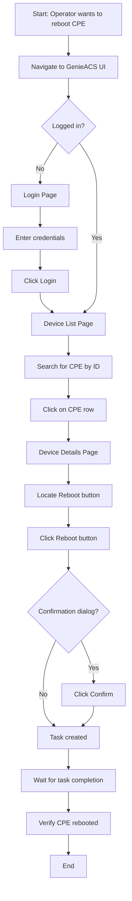

# GenieACS UI Interaction Map - Reboot Example

## Purpose

This document provides a concrete example of how to chart and document UI interactions for the GenieACS reboot functionality. Use this as a template for documenting other UI operations.

## Reboot Operation - UI Flow

### Flow Diagram



## Page-by-Page Breakdown

### 1. Login Page

**URL Pattern:** `http://{acs_ip}:{port}/login` or `http://{acs_ip}:{port}/` (redirects to login)

**Purpose:** Authenticate user before accessing GenieACS

**Elements:**

| Element | Type | Selector | Purpose |
|---------|------|----------|---------|
| Username field | Input | `input[name="username"]` or `#username` | Enter username |
| Password field | Input | `input[type="password"]` or `#password` | Enter password |
| Login button | Button | `button[type="submit"]` or `.btn-primary` | Submit credentials |
| Error message | Div | `.alert-danger` or `.error-message` | Display login errors |

**Actions:**

```python
def login(self, username: str, password: str) -> None:
    """Login to GenieACS UI."""
    # Navigate to login page
    self.driver.get(f"{self.base_url}/login")
    
    # Wait for page to load
    username_field = self.wait.until(
        EC.presence_of_element_located((By.NAME, "username"))
    )
    
    # Enter credentials
    username_field.send_keys(username)
    password_field = self.driver.find_element(By.CSS_SELECTOR, "input[type='password']")
    password_field.send_keys(password)
    
    # Click login
    login_btn = self.driver.find_element(By.CSS_SELECTOR, "button[type='submit']")
    login_btn.click()
    
    # Wait for redirect to device list
    self.wait.until(EC.url_contains("/devices"))
```

**Success Criteria:**
- URL changes to `/devices`
- No error message displayed
- Device list is visible

---

### 2. Device List Page

**URL Pattern:** `http://{acs_ip}:{port}/devices`

**Purpose:** Display all registered CPE devices

**Elements:**

| Element | Type | Selector | Purpose |
|---------|------|----------|---------|
| Search box | Input | `input[placeholder*="Search"]` or `.search-input` | Filter devices |
| Device table | Table | `table.devices` or `#device-table` | Display device list |
| Device row | TR | `tr[data-device-id="{cpe_id}"]` or `tr.device-row` | Individual device entry |
| Device ID link | Link | `a[href="/devices/{cpe_id}"]` | Navigate to device details |
| Refresh button | Button | `button[title="Refresh"]` | Reload device list |
| Filter dropdown | Select | `select.filter` | Filter by status/tag |

**Actions:**

```python
def search_device(self, cpe_id: str) -> None:
    """Search for a device by CPE ID."""
    search_box = self.wait.until(
        EC.presence_of_element_located((By.CSS_SELECTOR, "input[placeholder*='Search']"))
    )
    search_box.clear()
    search_box.send_keys(cpe_id)
    
    # Wait for search results to update
    time.sleep(1)  # Or wait for specific element

def select_device(self, cpe_id: str) -> None:
    """Click on a device to view details."""
    # Option 1: Click on device row
    device_row = self.wait.until(
        EC.element_to_be_clickable((By.CSS_SELECTOR, f"tr[data-device-id='{cpe_id}']"))
    )
    device_row.click()
    
    # Option 2: Click on device ID link
    # device_link = self.wait.until(
    #     EC.element_to_be_clickable((By.CSS_SELECTOR, f"a[href='/devices/{cpe_id}']"))
    # )
    # device_link.click()
    
    # Wait for device details page to load
    self.wait.until(EC.url_contains(f"/devices/{cpe_id}"))
```

**Success Criteria:**
- Device appears in search results
- Clicking device navigates to device details page
- URL changes to `/devices/{cpe_id}`

---

### 3. Device Details Page

**URL Pattern:** `http://{acs_ip}:{port}/devices/{cpe_id}`

**Purpose:** Display detailed information about a specific CPE and perform operations

**Elements:**

| Element | Type | Selector | Purpose |
|---------|------|----------|---------|
| Device ID header | H3 | `h3.device-id` or `.device-header` | Display CPE ID |
| Reboot button | Button | `button[title="Reboot"]` or `button:contains("Reboot")` | Trigger reboot |
| Refresh button | Button | `button[title="Refresh"]` | Trigger connection request |
| Factory Reset button | Button | `button[title="Factory Reset"]` | Trigger factory reset |
| Parameters table | Table | `table.parameters` or `#parameters-table` | Display TR-069 parameters |
| Parameter row | TR | `tr[data-param="{param_name}"]` | Individual parameter |
| Parameter value | TD | `td.param-value` | Parameter value cell |
| Tasks section | Div | `div.tasks` or `#tasks-panel` | Display pending/completed tasks |
| Task status | Span | `span.task-status` | Task status indicator |

**Actions:**

```python
def click_reboot_button(self) -> None:
    """Click the Reboot button on device details page."""
    # Wait for page to load
    self.wait.until(
        EC.presence_of_element_located((By.CSS_SELECTOR, "h3.device-id"))
    )
    
    # Find and click Reboot button
    reboot_btn = self.wait.until(
        EC.element_to_be_clickable((By.CSS_SELECTOR, "button[title='Reboot']"))
    )
    reboot_btn.click()
    
    # Handle confirmation dialog if present
    try:
        confirm_btn = WebDriverWait(self.driver, 2).until(
            EC.element_to_be_clickable((By.CSS_SELECTOR, "button.confirm"))
        )
        confirm_btn.click()
    except TimeoutException:
        # No confirmation dialog
        pass
    
    # Wait for task to be created
    self.wait.until(
        EC.presence_of_element_located((By.CSS_SELECTOR, "span.task-status"))
    )

def get_parameter_value(self, param_name: str) -> str:
    """Get the value of a TR-069 parameter from the UI."""
    # Find parameter row
    param_row = self.wait.until(
        EC.presence_of_element_located(
            (By.CSS_SELECTOR, f"tr[data-param='{param_name}']")
        )
    )
    
    # Get value cell
    value_cell = param_row.find_element(By.CSS_SELECTOR, "td.param-value")
    return value_cell.text

def get_task_status(self) -> str:
    """Get the status of the most recent task."""
    status_element = self.wait.until(
        EC.presence_of_element_located((By.CSS_SELECTOR, "span.task-status"))
    )
    return status_element.text
```

**Success Criteria:**
- Reboot button is clickable
- Clicking reboot creates a task
- Task status is visible
- Task status changes from "pending" to "completed"

---

### 4. Confirmation Dialog (if present)

**Purpose:** Confirm destructive operations like Reboot or Factory Reset

**Elements:**

| Element | Type | Selector | Purpose |
|---------|------|----------|---------|
| Dialog container | Div | `.modal` or `.dialog` | Modal dialog |
| Dialog title | H4 | `.modal-title` | Dialog title |
| Dialog message | P | `.modal-body` | Confirmation message |
| Confirm button | Button | `button.confirm` or `.btn-primary` | Confirm action |
| Cancel button | Button | `button.cancel` or `.btn-secondary` | Cancel action |

**Actions:**

```python
def handle_confirmation_dialog(self, confirm: bool = True) -> None:
    """Handle confirmation dialog."""
    try:
        # Wait for dialog to appear
        dialog = WebDriverWait(self.driver, 2).until(
            EC.presence_of_element_located((By.CSS_SELECTOR, ".modal"))
        )
        
        if confirm:
            confirm_btn = dialog.find_element(By.CSS_SELECTOR, "button.confirm")
            confirm_btn.click()
        else:
            cancel_btn = dialog.find_element(By.CSS_SELECTOR, "button.cancel")
            cancel_btn.click()
        
        # Wait for dialog to close
        self.wait.until(EC.invisibility_of_element_located((By.CSS_SELECTOR, ".modal")))
    except TimeoutException:
        # No dialog appeared
        pass
```

---

## Complete Example: Reboot via UI

Here's a complete example showing how to reboot a CPE via the GenieACS UI:

```python
# File: boardfarm/boardfarm3/lib/gui/genieacs/genieacs_ui_helper.py

from typing import TYPE_CHECKING
from selenium.webdriver.common.by import By
from selenium.webdriver.support import expected_conditions as EC
from selenium.webdriver.support.ui import WebDriverWait
from selenium.common.exceptions import TimeoutException
import time

if TYPE_CHECKING:
    from selenium.webdriver.remote.webdriver import WebDriver

class GenieACSUIHelper:
    """Helper class for GenieACS UI automation."""
    
    def __init__(self, driver: WebDriver, base_url: str, username: str, password: str):
        self.driver = driver
        self.base_url = base_url
        self.username = username
        self.password = password
        self.wait = WebDriverWait(driver, 20)
        self._logged_in = False
    
    def login(self) -> None:
        """Login to GenieACS UI."""
        if self._logged_in:
            return
        
        # Navigate to login page
        self.driver.get(f"{self.base_url}/login")
        
        # Enter credentials
        username_field = self.wait.until(
            EC.presence_of_element_located((By.NAME, "username"))
        )
        username_field.send_keys(self.username)
        
        password_field = self.driver.find_element(By.CSS_SELECTOR, "input[type='password']")
        password_field.send_keys(self.password)
        
        # Click login
        login_btn = self.driver.find_element(By.CSS_SELECTOR, "button[type='submit']")
        login_btn.click()
        
        # Wait for redirect
        self.wait.until(EC.url_contains("/devices"))
        self._logged_in = True
    
    def navigate_to_device(self, cpe_id: str) -> None:
        """Navigate to device details page."""
        # Ensure logged in
        self.login()
        
        # Navigate to device list
        self.driver.get(f"{self.base_url}/devices")
        
        # Search for device
        search_box = self.wait.until(
            EC.presence_of_element_located((By.CSS_SELECTOR, "input[placeholder*='Search']"))
        )
        search_box.clear()
        search_box.send_keys(cpe_id)
        time.sleep(1)  # Wait for search results
        
        # Click on device
        device_link = self.wait.until(
            EC.element_to_be_clickable((By.CSS_SELECTOR, f"a[href='/devices/{cpe_id}']"))
        )
        device_link.click()
        
        # Wait for device details page
        self.wait.until(EC.url_contains(f"/devices/{cpe_id}"))
    
    def reboot_device(self, cpe_id: str, command_key: str = "reboot") -> list[dict]:
        """Reboot a device via GenieACS UI.
        
        :param cpe_id: CPE identifier
        :param command_key: Command key for reboot task (not used in UI, kept for API compatibility)
        :return: Empty list for compatibility with NBI method
        """
        # Navigate to device details page
        self.navigate_to_device(cpe_id)
        
        # Click Reboot button
        reboot_btn = self.wait.until(
            EC.element_to_be_clickable((By.CSS_SELECTOR, "button[title='Reboot']"))
        )
        reboot_btn.click()
        
        # Handle confirmation dialog if present
        try:
            confirm_btn = WebDriverWait(self.driver, 2).until(
                EC.element_to_be_clickable((By.CSS_SELECTOR, "button.confirm"))
            )
            confirm_btn.click()
        except TimeoutException:
            # No confirmation dialog
            pass
        
        # Wait for task to be created
        try:
            self.wait.until(
                EC.presence_of_element_located((By.CSS_SELECTOR, "span.task-status"))
            )
        except TimeoutException:
            # Task status might not be immediately visible
            pass
        
        # Return empty list for compatibility with NBI method
        return []
```

---

## Integration with GenieACS Device Class

```python
# File: boardfarm/boardfarm3/devices/genie_acs.py

from boardfarm3.lib.gui.genieacs.genieacs_ui_helper import GenieACSUIHelper
from boardfarm3.lib.gui.gui_helper import GuiHelperNoProxy

class GenieACS(LinuxDevice, ACS):
    """GenieACS connection class for TR-069 operations."""
    
    def __init__(self, config: dict, cmdline_args: Namespace) -> None:
        super().__init__(config, cmdline_args)
        self._client: httpx.Client | None = None
        self._cpeid: str | None = None
        self._base_url: str | None = None
        self._ui_helper: GenieACSUIHelper | None = None
        self._gui_helper: GuiHelperNoProxy | None = None
    
    def _init_ui_helper(self) -> None:
        """Initialize UI automation helper."""
        if self._ui_helper is None:
            # Create GUI helper
            self._gui_helper = GuiHelperNoProxy(
                default_delay=20,
                headless=self.config.get("ui_headless", True)
            )
            
            # Get WebDriver
            driver = self._gui_helper.get_web_driver()
            
            # Create UI helper
            self._ui_helper = GenieACSUIHelper(
                driver=driver,
                base_url=self._base_url,
                username=self.config.get("http_username", "admin"),
                password=self.config.get("http_password", "admin")
            )
    
    def Reboot_UI(self, CommandKey: str = "reboot", cpe_id: str | None = None) -> list[dict]:
        """Execute Reboot via GenieACS UI.
        
        Provides the same interface as Reboot() but uses UI automation
        instead of NBI API. Useful for testing UI workflows.
        
        :param CommandKey: reboot command key (kept for API compatibility)
        :param cpe_id: CPE identifier
        :return: reboot task creation response (empty list for compatibility)
        """
        cpe_id = cpe_id if cpe_id else self._cpeid
        if not cpe_id:
            raise ValueError("cpe_id is required for Reboot_UI operation")
        
        self._init_ui_helper()
        return self._ui_helper.reboot_device(cpe_id, CommandKey)
    
    @hookimpl
    def boardfarm_shutdown_device(self) -> None:
        """Boardfarm hook implementation to shutdown ACS device."""
        _LOGGER.info("Shutdown %s(%s) device", self.device_name, self.device_type)
        self._disconnect()
        if self._client:
            self._client.close()
        if self._gui_helper:
            # Close WebDriver
            self._gui_helper._driver.quit()
```

---

## Testing the UI Method

```python
# File: boardfarm-bdd/tests/step_defs/reboot_ui_steps.py

from pytest_bdd import given, when, then, scenario

@scenario('../features/Remote CPE Reboot UI.feature', 
          'UC-12347-UI: Successful Remote Reboot via UI')
def test_reboot_via_ui():
    """Test reboot via GenieACS UI."""
    pass

@when("the operator initiates a reboot task via the ACS UI for the CPE")
def operator_initiates_reboot_ui(acs, cpe, bf_context):
    """Operator clicks Reboot button in GenieACS UI."""
    cpe_id = f"{cpe.config['oui']}-{cpe.config['product_class']}-{cpe.config['serial']}"
    
    # Use UI method instead of NBI
    acs.Reboot_UI(cpe_id=cpe_id, CommandKey="reboot_ui_test")
    
    bf_context.reboot_command_key = "reboot_ui_test"
```

---

## Troubleshooting Guide

### Common Issues

#### 1. Element Not Found

**Problem:** `NoSuchElementException: Unable to locate element`

**Solutions:**
- Verify CSS selector is correct (use browser DevTools)
- Add explicit wait before finding element
- Check if element is in iframe
- Verify page has loaded completely

```python
# Bad
element = driver.find_element(By.CSS_SELECTOR, "button.reboot")

# Good
element = WebDriverWait(driver, 10).until(
    EC.presence_of_element_located((By.CSS_SELECTOR, "button.reboot"))
)
```

#### 2. Element Not Clickable

**Problem:** `ElementClickInterceptedException: Element is not clickable`

**Solutions:**
- Wait for element to be clickable
- Scroll element into view
- Check if element is hidden by overlay/modal

```python
# Wait for element to be clickable
element = WebDriverWait(driver, 10).until(
    EC.element_to_be_clickable((By.CSS_SELECTOR, "button.reboot"))
)

# Scroll into view
driver.execute_script("arguments[0].scrollIntoView(true);", element)
element.click()
```

#### 3. Stale Element Reference

**Problem:** `StaleElementReferenceException: Element is no longer attached to DOM`

**Solutions:**
- Re-find element before interacting
- Use explicit waits
- Avoid storing element references

```python
# Bad
element = driver.find_element(By.CSS_SELECTOR, "button.reboot")
time.sleep(5)
element.click()  # May be stale

# Good
def click_reboot():
    element = driver.find_element(By.CSS_SELECTOR, "button.reboot")
    element.click()

click_reboot()
```

---

## Next Steps

1. **Verify selectors** by manually inspecting GenieACS UI
2. **Update selectors** in this document based on actual GenieACS version
3. **Implement Login page** object
4. **Implement Device Details page** object
5. **Test Reboot_UI** method with real GenieACS instance
6. **Document other operations** (GPV, SPV, Download, etc.)

---

## References

- [GenieACS Documentation](https://genieacs.com/)
- [Selenium Python Documentation](https://selenium-python.readthedocs.io/)
- [Page Object Model Pattern](https://www.selenium.dev/documentation/test_practices/encouraged/page_object_models/)
- [CSS Selectors Reference](https://www.w3schools.com/cssref/css_selectors.asp)
