# OpenWrt Raspberry Pi Gateway Implementation Plan

**Document Version**: 1.6  
**Created**: January 7, 2026  
**Last Updated**: January 7, 2026  
**Status**: ⚠️ Phase 4 Complete - Network Connectivity Verified (Topology Correction Required)

**⚠️ IMPORTANT**: This document describes the current implementation which uses an **incorrect topology**. The Router container was incorrectly assumed to be part of the home gateway, when it actually represents the **ISP Edge Router** sitting between the CPE and cloud-based ISP services.

**For the corrected topology and migration plan, see**: [`openwrt_topology_correction_migration.md`](./openwrt_topology_correction_migration.md)

---

## Executive Summary

This document outlines the plan to integrate a physical Raspberry Pi running OpenWrt as the gateway device in the Boardfarm testbed. This replaces the containerized PrplOS CPE with real hardware, enabling more realistic testing scenarios and access to the full OpenWrt ecosystem.

### Key Benefits

1. **Real Hardware Testing** - Test actual routing, NAT, firewall, and network behavior
2. **OpenWrt Ecosystem** - Access to full OpenWrt packages (TR-069 clients, VoIP, WiFi)
3. **Production Similarity** - Closer to real-world deployment scenarios
4. **Flexibility** - Easy to swap hardware or OpenWrt versions
5. **WiFi Testing** - Potential for wireless testing with RPi's built-in WiFi

---

## Current vs. Target Architecture

### Current Architecture (Containerized CPE)

```text
┌─────────────────────────────────────────────────────────────────────────┐
│                           Docker Host                                    │
├─────────────────────────────────────────────────────────────────────────┤
│                                                                          │
│   ┌─────────────┐         ┌─────────────┐                               │
│   │     CPE     │◄───────►│   Router    │                               │
│   │  Container  │         │  Container  │                               │
│   │  (PrplOS)   │         │             │                               │
│   └──────┬──────┘         └──────┬──────┘                               │
│          │                       │                                       │
│   ┌──────┴──────┐         ┌──────┴──────┐                               │
│   │  lan-cpe    │         │  cpe-rtr    │                               │
│   │   bridge    │         │   bridge    │                               │
│   └─────────────┘         └─────────────┘                               │
│                                                                          │
└─────────────────────────────────────────────────────────────────────────┘
```

**Characteristics**:

- CPE is a Docker container with `network_mode: none`
- Interfaces added dynamically by Raikou orchestrator
- Access via `docker exec -it cpe ash`
- Uses PrplOS firmware with TR-181 data model

### Target Architecture (Physical RPi OpenWrt) ⏳ TO BE CORRECTED

```mermaid
graph TB
    subgraph "Raikou OVS Bridges"
        BRIDGE_CPE_RTR[cpe-rtr bridge]
        BRIDGE_LAN_CPE[lan-cpe bridge]
        BRIDGE_RTR_WAN[rtr-wan bridge]
        BRIDGE_RTR_UPLINK[rtr-uplink bridge]
    end

    subgraph "Home Gateway Components"
        OPENWRT[OpenWrt RPi<br/>Physical Device<br/>eth1: 10.1.1.x/24 WAN<br/>eth0: Connected to br-lan LAN<br/>br-lan: 192.168.10.1/24]
    end

    subgraph "ISP Infrastructure"
        ROUTER[Router Container<br/>ISP Edge Router<br/>cpe: 10.1.1.1/24<br/>eth1: 172.25.1.1/24<br/>aux0: 172.25.2.1/24]
        WAN[WAN Container<br/>Network Services<br/>eth1: 172.25.1.2/24<br/>HTTP/TFTP/FTP/DNS/Testing]
        ACS[ACS Container<br/>TR-069 Management<br/>eth1: 172.25.1.40/24]
        DHCP[DHCP Container<br/>Network Provisioning<br/>eth1: 172.25.1.20/24]
        SIP[SIP Center<br/>Voice Services<br/>eth1: 172.25.1.5/24]
    end

    subgraph "Client Devices"
        LAN_PHONE[LAN Phone<br/>Number: 1000<br/>eth1: Connected to br-lan]
        WAN_PHONE[WAN Phone<br/>Number: 2000<br/>eth1: 172.25.1.3/24]
        WAN_PHONE2[WAN Phone 2<br/>Number: 3000<br/>eth1: 172.25.1.4/24]
    end

    %% Raikou Bridge Connections
    OPENWRT <-->|eth1| BRIDGE_CPE_RTR
    ROUTER <-->|cpe| BRIDGE_CPE_RTR

    OPENWRT <-->|eth0| BRIDGE_LAN_CPE
    LAN_PHONE <-->|eth1| BRIDGE_LAN_CPE

    ROUTER <-->|eth1| BRIDGE_RTR_WAN
    WAN <-->|eth1| BRIDGE_RTR_WAN
    ACS <-->|eth1| BRIDGE_RTR_WAN
    DHCP <-->|eth1| BRIDGE_RTR_WAN
    SIP <-->|eth1| BRIDGE_RTR_WAN
    WAN_PHONE <-->|eth1| BRIDGE_RTR_WAN
    WAN_PHONE2 <-->|eth1| BRIDGE_RTR_WAN

    ROUTER <-->|aux0| BRIDGE_RTR_UPLINK

    %% Styling - Using default theme for automatic light/dark mode support
    classDef gateway stroke-width:2px
    classDef infrastructure stroke-width:2px
    classDef client stroke-width:2px
    classDef bridge stroke-width:2px

    class OPENWRT gateway
    class WAN,ACS,DHCP,SIP,ROUTER infrastructure
    class LAN_PHONE,WAN_PHONE,WAN_PHONE2 client
    class BRIDGE_CPE_RTR,BRIDGE_LAN_CPE,BRIDGE_RTR_WAN,BRIDGE_RTR_UPLINK bridge
```



**Key Architecture Changes from Containerized Setup**:

- **OpenWrt replaces CPE container**: Physical RPi provides home gateway functionality
- **OpenWrt provides LAN gateway**: br-lan at 192.168.10.1 (replaces CPE container's LAN gateway function)
- **LAN Container remains**: As a client device (test tool), not part of the gateway
- **Router container is ISP Edge Router**: Sits between CPE and ISP services (WAN, ACS, DHCP)
- **OpenWrt WAN connects to cpe-rtr bridge** (10.1.1.x), NOT directly to rtr-wan
- **OpenWrt gets IP from Router DHCP relay** (10.1.1.100+), not directly from DHCP container
- **Router container provides full gateway**: Routes between cpe-rtr (10.1.1.x) and rtr-wan (172.25.1.x)
- **cpe-rtr bridge required**: Router's cpe interface (10.1.1.1) provides gateway for CPE network

**Characteristics**:

- CPE is a physical Raspberry Pi with OpenWrt (replaces CPE container)
- WAN via USB-Ethernet dongle (DHCP client, gets 10.1.1.x from Router DHCP relay)
- LAN gateway via native Ethernet (br-lan, 192.168.10.1) - provides DHCP server for LAN clients
- Access via serial console only (LAN network is isolated on `lan-cpe` bridge, not accessible from host)
- LAN Container is a test client device (DHCP client, HTTP proxy) - connects to `lan-cpe` bridge
- Router container is ISP Edge Router: Routes CPE traffic to ISP services (WAN, ACS, DHCP)
- Internet access via Router → rtr-uplink → Host NAT

---

## Discovered Hardware Configuration

Based on verification performed on January 7, 2026:

### RPi OpenWrt Device

| Property            | Value                            |
| ------------------- | -------------------------------- |
| **OpenWrt Version** | 24.10.5 (r29087-d9c5716d1d)      |
| **Target**          | bcm27xx/bcm2711 (Raspberry Pi 4) |
| **Architecture**    | aarch64_cortex-a72               |

| Interface       | Device   | MAC Address         | Current IP          | Role                 |
| --------------- | -------- | ------------------- | ------------------- | -------------------- |
| Native Ethernet | eth0     | `88:a2:9e:69:ee:1d` | (bridged)           | LAN (part of br-lan) |
| USB Dongle      | eth1     | `00:e0:4c:1f:65:b8` | 192.168.1.97*       | WAN                  |
| WiFi AP         | phy0-ap0 | `88:a2:9e:69:ee:1e` | (bridged)           | LAN (part of br-lan) |
| LAN Bridge      | br-lan   | `88:a2:9e:69:ee:1d` | **192.168.10.1/24** | LAN Gateway          |

*Currently from home network DHCP; will be 10.1.1.x from Router DHCP relay on cpe-rtr bridge

### Docker Host USB Dongles

| Interface         | MAC Address         | Driver | Purpose (Planned)            |
| ----------------- | ------------------- | ------ | ---------------------------- |
| `enx00e04c5b7570` | `00:e0:4c:5b:75:70` | r8152  | **cpe-rtr bridge** → RPi WAN (10.1.1.x network) |
| `enx00e04c327b58` | `00:e0:4c:32:7b:58` | r8152  | **lan-cpe bridge** → RPi LAN (192.168.10.x network) |

### ✅ Issue Fixed: UCI Parse Error

The OpenWrt network configuration had an unterminated quote on line 31 (now fixed):

```bash
# WAS BROKEN:
config interface 'wan6'
        option device 'eth1'
        option proto 'dhcpv6    # <-- Missing closing quote!

# NOW FIXED:
config interface 'wan6'
        option device 'eth1'
        option proto 'dhcpv6'
```

**Verification (January 7, 2026):**

```bash
root@OpenWrt:~# uci show network
network.loopback=interface
network.loopback.device='lo'
network.loopback.proto='static'
network.loopback.ipaddr='127.0.0.1'
network.loopback.netmask='255.0.0.0'
network.globals=globals
network.globals.ula_prefix='fdcb:a58b:f873::/48'
network.@device[0]=device
network.@device[0].name='br-lan'
network.@device[0].type='bridge'
network.@device[0].ports='eth0'
network.lan=interface
network.lan.device='br-lan'
network.lan.proto='static'
network.lan.ipaddr='192.168.10.1'
network.lan.netmask='255.255.255.0'
network.lan.ip6assign='60'
network.wan=interface
network.wan.device='eth1'
network.wan.proto='dhcp'
network.wan6=interface
network.wan6.device='eth1'
network.wan6.proto='dhcpv6'
```

---

## Hardware Requirements

### Raspberry Pi

| Component | Specification                                  |
| --------- | ---------------------------------------------- |
| Model     | Raspberry Pi 4 Model B (recommended) or Pi 3B+ |
| RAM       | 2GB minimum, 4GB recommended                   |
| Storage   | 16GB+ microSD card                             |
| Firmware  | OpenWrt 23.05 or later                         |

### USB-Ethernet Dongles (on Docker Host)

| Quantity | Purpose                                     | Chipset Recommendation |
| -------- | ------------------------------------------- | ---------------------- |
| 1        | Connect to RPi WAN (USB dongle on RPi)      | RTL8152, ASIX AX88179  |
| 1        | Connect to RPi LAN (native ethernet on RPi) | RTL8152, ASIX AX88179  |

### Network Cables

| Quantity | Purpose                                    |
| -------- | ------------------------------------------ |
| 2        | Connect host USB dongles to RPi interfaces |

---

## RPi OpenWrt Configuration

The RPi is pre-configured with OpenWrt and the following setup:

### Interface Layout (Verified)

| Interface       | Physical | MAC Address         | OpenWrt Name   | IP Configuration    | Purpose     |
| --------------- | -------- | ------------------- | -------------- | ------------------- | ----------- |
| Native Ethernet | eth0     | `88:a2:9e:69:ee:1d` | Part of br-lan | (bridged)           | LAN port    |
| USB-Eth Dongle  | eth1     | `00:e0:4c:1f:65:b8` | wan            | DHCP (10.1.1.x/24)  | WAN uplink  |
| WiFi AP         | phy0-ap0 | `88:a2:9e:69:ee:1e` | Part of br-lan | (bridged)           | WiFi LAN    |
| LAN Bridge      | br-lan   | `88:a2:9e:69:ee:1d` | lan            | **192.168.10.1/24** | LAN gateway |

### Expected OpenWrt UCI Configuration

```bash
# WAN Interface (USB dongle)
network.wan=interface
network.wan.device='eth1'  # or USB dongle device name
network.wan.proto='dhcp'

# LAN Interface (native ethernet)
network.lan=interface
network.lan.device='br-lan'
network.lan.proto='static'
network.lan.ipaddr='192.168.1.1'
network.lan.netmask='255.255.255.0'

# LAN Bridge members
network.@device[0]=device
network.@device[0].name='br-lan'
network.@device[0].type='bridge'
network.@device[0].ports='eth0'
```

### TR-069 Client (Optional)

For ACS integration, install a TR-069 client:

```bash
# easycwmp (recommended)
opkg update
opkg install easycwmp

# Configure ACS URL
uci set easycwmp.@acs[0].url='http://172.25.1.40:7547'
uci commit easycwmp
/etc/init.d/easycwmpd enable
/etc/init.d/easycwmpd start
```

---

## Implementation Phases

### Phase 1: Prerequisites & Verification (Day 1)

#### 1.1 Verify RPi OpenWrt Setup

**Tasks**:

- [x] Confirm OpenWrt is installed and accessible via serial console
- [x] Verify interface configuration (WAN on USB dongle, LAN on native ethernet)
- [x] Test serial console connectivity to RPi (picocom -b 115200 /dev/ttyUSB0)
- [x] Note the WAN device name from UCI → **`eth1`**

**Note**: The LAN network (192.168.10.x) is isolated on the `lan-cpe` bridge and not accessible from the Docker host. Access to OpenWrt RPi is via serial console only.

**Verification Commands (on RPi)**:

```bash
# Check OpenWrt version
cat /etc/openwrt_release

#result:
DISTRIB_ID='OpenWrt'
DISTRIB_RELEASE='24.10.5'
DISTRIB_REVISION='r29087-d9c5716d1d'
DISTRIB_TARGET='bcm27xx/bcm2711'
DISTRIB_ARCH='aach64_cortex-a72'
DISTRIB_DESCRIPTION='OpenWrt 24.10.5 r29087-d9c5716d1d'
DISTRIB_TAINTS=''NTS=''

root@OpenWrt:~# ip link show
1: lo: <LOOPBACK,UP,LOWER_UP> mtu 65536 qdisc noqueue state UNKNOWN qlen 1000
    link/loopback 00:00:00:00:00:00 brd 00:00:00:00:00:00
2: eth0: <BROADCAST,MULTICAST,UP,LOWER_UP> mtu 1500 qdisc mq master br-lan state UP qlen 1000
    link/ether 88:a2:9e:69:ee:1d brd ff:ff:ff:ff:ff:ff
3: eth1: <BROADCAST,MULTICAST,UP,LOWER_UP> mtu 1500 qdisc fq_codel state UP qlen 1000
    link/ether 00:e0:4c:1f:65:b8 brd ff:ff:ff:ff:ff:ff
4: phy0-ap0: <BROADCAST,MULTICAST,UP,LOWER_UP> mtu 1500 qdisc fq_codel master br-lan state UP qlen 1000
    link/ether 88:a2:9e:69:ee:1e brd ff:ff:ff:ff:ff:ff
6: br-lan: <BROADCAST,MULTICAST,UP,LOWER_UP> mtu 1500 qdisc noqueue state UP qlen 1000
    link/ether 88:a2:9e:69:ee:1d brd ff:ff:ff


root@OpenWrt:~# ip addr show
1: lo: <LOOPBACK,UP,LOWER_UP> mtu 65536 qdisc noqueue state UNKNOWN qlen 1000
    link/loopback 00:00:00:00:00:00 brd 00:00:00:00:00:00
    inet 127.0.0.1/8 scope host lo
       valid_lft forever preferred_lft forever
    inet6 ::1/128 scope host
       valid_lft forever preferred_lft forever
2: eth0: <BROADCAST,MULTICAST,UP,LOWER_UP> mtu 1500 qdisc mq master br-lan state UP qlen 1000
    link/ether 88:a2:9e:69:ee:1d brd ff:ff:ff:ff:ff:ff
3: eth1: <BROADCAST,MULTICAST,UP,LOWER_UP> mtu 1500 qdisc fq_codel state UP qlen 1000
    link/ether 00:e0:4c:1f:65:b8 brd ff:ff:ff:ff:ff:ff
    inet 192.168.1.97/24 brd 192.168.1.255 scope global eth1
       valid_lft forever preferred_lft forever
    inet6 fe80::2e0:4cff:fe1f:65b8/64 scope link
       valid_lft forever preferred_lft forever
4: phy0-ap0: <BROADCAST,MULTICAST,UP,LOWER_UP> mtu 1500 qdisc fq_codel master br-lan state UP qlen 1000
    link/ether 88:a2:9e:69:ee:1e brd ff:ff:ff:ff:ff:ff
6: br-lan: <BROADCAST,MULTICAST,UP,LOWER_UP> mtu 1500 qdisc noqueue state UP qlen 1000
    link/ether 88:a2:9e:69:ee:1d brd ff:ff:ff:ff:ff:ff
    inet 192.168.10.1/24 brd 192.168.10.255 scope global br-lan
       valid_lft forever preferred_lft forever
    inet6 fdcb:a58b:f873::1/60 scope global noprefixroute
       valid_lft forever preferred_lft forever
    inet6 fe80::8aa2:9eff:fe69:ee1d/64 scope link
       valid_lft forever preferred_lft forever

# Check UCI network config
uci show network.wan
uci show network.lan

#result
uci: Parse error (EOF with unterminated \') at line 31, byte 24

# Check WAN DHCP status
root@OpenWrt:~# cat /tmp/dhcp.leases
1767831982 00:e0:4c:42:57:f8 192.168.10.143 RJVISSERTPX1 01:00:e0:4c:42:57:f8
```

```bash
root@OpenWrt:~# cat /etc/config/network

config interface 'loopback'
        option device 'lo'
        option proto 'static'
        option ipaddr '127.0.0.1'
        option netmask '255.0.0.0'

config globals 'globals'
        option ula_prefix 'fdcb:a58b:f873::/48'

config device
        option name 'br-lan'
        option type 'bridge'
        list ports 'eth0'

config interface 'lan'
        option device 'br-lan'
        option proto 'static'
        option ipaddr '192.168.10.1'
        option netmask '255.255.255.0'
        option ip6assign '60'

config interface 'wan'
        option device 'eth1'
        option proto 'dhcp'

config interface 'wan6'
        option device 'eth1'
        option proto 'dhcpv6
```

#### 1.2 Identify Host USB Dongle Interfaces

**Tasks**:

- [x] Connect both USB-Ethernet dongles to Docker host
- [x] Identify their interface names
- [x] Document MAC addresses for reference

**✅ COMPLETED - Interface Mapping:**
| Host Interface | MAC | Bridge | Connects To |
| -------------- | --- | ------ | ----------- |
| `enx00e04c5b7570` | `00:e0:4c:5b:75:70` | `cpe-rtr` | RPi eth1 (WAN) |
| `enx00e04c327b58` | `00:e0:4c:32:7b:58` | `lan-cpe` | RPi eth0 (LAN) |

**Verification Commands (on Docker Host)**:

```bash
# List all network interfaces
ip link show

#result:
1: lo: <LOOPBACK,UP,LOWER_UP> mtu 65536 qdisc noqueue state UNKNOWN mode DEFAULT group default qlen 1000
    link/loopback 00:00:00:00:00:00 brd 00:00:00:00:00:00
2: eno1: <BROADCAST,MULTICAST,UP,LOWER_UP> mtu 1500 qdisc fq_codel state UP mode DEFAULT group default qlen 1000
    link/ether 74:d0:2b:c6:be:4a brd ff:ff:ff:ff:ff:ff
    altname enp0s25
3: enx00e04c5b7570: <NO-CARRIER,BROADCAST,MULTICAST,UP> mtu 1500 qdisc fq_codel state DOWN mode DEFAULT group default qlen 1000
    link/ether 00:e0:4c:5b:75:70 brd ff:ff:ff:ff:ff:ff
4: enx00e04c327b58: <NO-CARRIER,BROADCAST,MULTICAST,UP> mtu 1500 qdisc fq_codel state DOWN mode DEFAULT group default qlen 1000
    link/ether 00:e0:4c:32:7b:58 brd ff:ff:ff:ff:ff:ff
5: wlp5s0: <NO-CARRIER,BROADCAST,MULTICAST,UP> mtu 1500 qdisc noqueue state DOWN mode DORMANT group default qlen 1000
    link/ether d8:fe:e3:65:72:aa brd ff:ff:ff:ff:ff:ff
6: docker0: <NO-CARRIER,BROADCAST,MULTICAST,UP> mtu 1500 qdisc noqueue state DOWN mode DEFAULT group default 
    link/ether c6:b3:0f:6c:ee:eb brd ff:ff:ff:ff:ff:ff


# Find USB ethernet adapters
ls -la /sys/class/net/*/device/driver | grep -E "usb|r8152|asix|cdc"

#result:
lrwxrwxrwx 1 root root 0 Jan  7 06:58 /sys/class/net/enx00e04c327b58/device/driver -> ../../../../../../bus/usb/drivers/r8152
lrwxrwxrwx 1 root root 0 Jan  7 06:58 /sys/class/net/enx00e04c5b7570/device/driver -> ../../../../../../bus/usb/drivers/r8152


# Check dmesg for USB network device detection
dmesg | grep -i "usb.*eth\|enx\|r8152\|asix"

#result:
[    1.810856] usbcore: registered new device driver r8152-cfgselector
[    1.927503] r8152-cfgselector 1-9: reset high-speed USB device number 4 using xhci_hcd
[    2.097022] r8152 1-9:1.0 eth0: v1.12.13
[    2.208499] r8152-cfgselector 1-10: reset high-speed USB device number 5 using xhci_hcd
[    2.380249] r8152 1-10:1.0 eth1: v1.12.13
[    2.380323] usbcore: registered new interface driver r8152
[    2.387870] usbcore: registered new interface driver cdc_ether
[    2.397846] r8152 1-9:1.0 enx00e04c5b7570: renamed from eth0
[    2.398946] r8152 1-10:1.0 enx00e04c327b58: renamed from eth1


# Get interface details
for iface in /sys/class/net/enx*; do
    name=$(basename $iface)
    mac=$(cat $iface/address)
    echo "$name: $mac"
done


#result:
enx00e04c327b58: 00:e0:4c:32:7b:58
enx00e04c5b7570: 00:e0:4c:5b:75:70
```

#### 1.3 Physical Cabling

**Tasks**:

- [x] Connect Host USB Dongle 1 (for cpe-rtr bridge) to RPi WAN (USB dongle on Pi)
- [x] Connect Host USB Dongle 2 (for lan-cpe bridge) to RPi LAN (native ethernet on Pi)
- [x] Verify link status on both connections

**Verification** (January 7, 2026):

```bash
rjvisser@alottabytes:~$ cat /sys/class/net/enx00e04c5b7570/carrier
1
rjvisser@alottabytes:~$ cat /sys/class/net/enx00e04c327b58/carrier
1
```

✅ **Both links are UP!**

---

### Phase 2: Configuration Files (Day 1-2) ✅ COMPLETE

#### 2.1 Create Raikou Configuration ✅

**File**: `boardfarm-bdd/raikou/config_openwrt.json` **CREATED**

**Key Changes**:

- Add `host_interface` section with USB dongle interface names
- Remove `cpe` from `container` section
- Keep all other container configurations unchanged

**Template** (with discovered interface names):

```json
{
    "bridge": {
        "cpe-rtr": {},
        "lan-cpe": {},
        "rtr-uplink": {},
        "rtr-wan": {}
    },
    "host_interface": {
        "enx00e04c5b7570": {
            "bridge": "cpe-rtr"
        },
        "enx00e04c327b58": {
            "bridge": "lan-cpe"
        }
    },
    "container": {
        // ... (all containers except cpe)
    }
}
```

#### 2.2 Create Docker Compose File ✅

**File**: `boardfarm-bdd/raikou/docker-compose-openwrt.yaml` **CREATED**

**Key Changes**:

- Remove `cpe` service definition
- Update `raikou-net` depends_on to remove `cpe`
- Reference new config file (`config_openwrt.json`)

#### 2.3 Create Boardfarm Configuration ✅

**File**: `boardfarm-bdd/bf_config/boardfarm_config_openwrt.json` **CREATED**

**Key Changes**:

- Replace `bf_cpe` device with `bf_openwrt_cpe`
- Change connection from `docker exec` to `local_cmd` (serial console)
- Add RPi-specific configuration (serial port, interface names)

**Template** (with discovered values):

```json
{
    "openwrt-rpi-1": {
        "devices": [
            {
                "conn_cmd": [
                    "picocom -b 115200 /dev/ttyUSB0"
                ],
                "connection_type": "local_cmd",
                "lan_iface": "br-lan",
                "name": "board",
                "type": "bf_openwrt_cpe",
                "wan_iface": "eth1",
                "wan_mac": "00:e0:4c:1f:65:b8"
            },
            // ... other devices unchanged
        ]
    }
}
```

**Note**: The LAN network (192.168.10.x) is isolated on the `lan-cpe` bridge and not accessible from the Docker host. Access to OpenWrt RPi is via serial console (`/dev/ttyUSB0` at 115200 baud) only.

---

### Phase 3: Device Class Implementation (Day 2-3) ✅ COMPLETE

#### 3.1 Create OpenWrt Device Class ✅

**File**: `boardfarm/boardfarm3/devices/openwrt_cpe.py` **CREATED**

**Components**:

| Class        | Purpose                                                 | Lines (est.) |
| ------------ | ------------------------------------------------------- | ------------ |
| `OpenWrtHW`  | Hardware abstraction (console, power cycle, MAC/serial) | ~200         |
| `OpenWrtSW`  | Software operations (version, network, TR-069)          | ~250         |
| `OpenWrtCPE` | Main device class with boardfarm hooks                  | ~100         |

**Key Methods**:

```python
# OpenWrtHW
- connect_to_consoles()    # Serial console connection
- power_cycle()            # Soft reboot via serial console
- mac_address              # From WAN interface
- serial_number            # From RPi CPU info

# OpenWrtSW  
- version                  # OpenWrt release version
- is_online()              # WAN has IP
- configure_management_server()  # Configure TR-069 client
- json_values              # UCI configuration dump

# OpenWrtCPE
- boardfarm_device_boot()       # Boot sequence
- boardfarm_device_configure()  # Post-boot config
- boardfarm_skip_boot()         # Skip boot for quick start
```

#### 3.2 Register Device Type

Ensure the device class is discoverable by boardfarm:

- Add to `boardfarm3/devices/__init__.py` if using explicit imports
- Or rely on automatic plugin discovery

**Note**: The `OpenWrtCPE` class is registered as `bf_openwrt_cpe` device type.

---

### Phase 4: Integration Testing (Day 3-4) ⚠️ **NEEDS TOPOLOGY CORRECTION**

#### 4.1 Start Testbed ✅

```bash
cd ~/projects/req-tst/boardfarm-bdd/raikou

# Start with new configuration
docker compose -f docker-compose-openwrt.yaml up -d

# Wait for orchestrator
sleep 15

# Enable host NAT for internet access
./enable_internet_access.sh

# Verify bridges are created
docker exec orchestrator ovs-vsctl show
```

#### 4.2 Network Connectivity Verified ⚠️ **NEEDS CORRECTION**

**Note**: Current implementation uses incorrect topology. After correction, OpenWrt should connect to `cpe-rtr` bridge, not directly to `rtr-wan`.

| Test | Current (Incorrect) | Target (Correct) |
|------|---------------------|------------------|
| OpenWrt WAN IP | 172.25.1.100 (rtr-wan) | 10.1.1.100+ (cpe-rtr) |
| OpenWrt IPv6 | 2001:dead:beef:2::100 | 2001:dead:cafe:1::100+ |
| Gateway | 172.25.1.1 (Router eth1) | 10.1.1.1 (Router cpe) |
| Internet (IPv4) | ✅ Working | ✅ Should work |
| DNS resolution | ✅ Working | ✅ Should work |
| Package downloads | ✅ Working | ✅ Should work |

**Current Verification (Incorrect Topology):**

```bash
root@OpenWrt:~# ip addr show eth1
3: eth1: <BROADCAST,MULTICAST,UP,LOWER_UP> mtu 1500 state UP qlen 1000
    inet 172.25.1.100/24 brd 172.25.1.255 scope global eth1  # ❌ Wrong network
    inet6 2001:dead:beef:2::100/128 scope global dynamic      # ❌ Wrong network

root@OpenWrt:~# ip route show
default via 172.25.1.1 dev eth1  src 172.25.1.100  # ❌ Wrong gateway
172.25.1.0/24 dev eth1 scope link  src 172.25.1.100
```

**Target Verification (After Correction):**

```bash
root@OpenWrt:~# ip addr show eth1
3: eth1: <BROADCAST,MULTICAST,UP,LOWER_UP> mtu 1500 state UP qlen 1000
    inet 10.1.1.100/24 brd 10.1.1.255 scope global eth1  # ✅ Correct network
    inet6 2001:dead:cafe:1::100/128 scope global dynamic  # ✅ Correct network

root@OpenWrt:~# ip route show
default via 10.1.1.1 dev eth1  src 10.1.1.100  # ✅ Correct gateway (Router cpe)
10.1.1.0/24 dev eth1 scope link  src 10.1.1.100
```

#### 4.3 OpenWrt Configuration Applied ✅

The following UCI configurations were applied to OpenWrt:

```bash
# DNS Configuration (bypass broken WAN container DNS)
uci set network.wan.peerdns='0'
uci add_list network.wan.dns='8.8.8.8'
uci add_list network.wan.dns='8.8.4.4'
uci commit network

# DHCPv6 Configuration (force address request)
uci set network.wan6.reqaddress='force'
uci commit network

# Apply changes
/etc/init.d/network restart
```

**Current OpenWrt Network Configuration:**

```bash
root@OpenWrt:~# uci show network.wan
network.wan=interface
network.wan.device='eth1'
network.wan.proto='dhcp'
network.wan.peerdns='0'
network.wan.dns='8.8.8.8' '8.8.4.4'

root@OpenWrt:~# uci show network.wan6
network.wan6=interface
network.wan6.device='eth1'
network.wan6.proto='dhcpv6'
network.wan6.reqaddress='force'
```

#### 4.4 Test Boardfarm Connection ⏳ NEXT

```bash
cd ~/projects/req-tst/boardfarm-bdd
source .venv-3.12/bin/activate

# Quick connectivity test
pytest --board-name openwrt-rpi-1 \
       --env-config ./bf_config/boardfarm_env_example.json \
       --inventory-config ./bf_config/boardfarm_config_openwrt.json \
       --collect-only
```

---

### Phase 5: TR-069 Integration (Day 4-5)

#### 5.1 Install TR-069 Client on OpenWrt

```bash
ssh root@192.168.1.1

# Update package lists
opkg update

# Install easycwmp (TR-069 client)
opkg install easycwmp

# Basic configuration
uci set easycwmp.@acs[0].url='http://172.25.1.40:7547'
uci set easycwmp.@acs[0].periodic_enable='1'
uci set easycwmp.@acs[0].periodic_interval='300'
uci commit easycwmp

# Enable and start
/etc/init.d/easycwmpd enable
/etc/init.d/easycwmpd start
```

#### 5.2 Verify ACS Registration

```bash
# Check GenieACS for device registration
curl -u admin:admin http://localhost:7557/devices

# Or via GenieACS UI at http://localhost:3000
```

#### 5.3 Test TR-069 Scenarios

```bash
# Run ACS-related test scenarios
pytest --board-name openwrt-rpi-1 \
       --env-config ./bf_config/boardfarm_env_example.json \
       --inventory-config ./bf_config/boardfarm_config_openwrt.json \
       --legacy \
       -k "ACS" \
       -v -s
```

---

### Phase 6: Validation & Documentation (Day 5)

#### 6.1 Validate Existing Scenarios

Run the existing test scenarios to ensure compatibility:

```bash
# Run all passing scenarios
pytest --board-name openwrt-rpi-1 \
       --env-config ./bf_config/boardfarm_env_example.json \
       --inventory-config ./bf_config/boardfarm_config_openwrt.json \
       --legacy \
       --html=report_openwrt.html \
       -v
```

#### 6.2 Document Differences

Create a comparison document noting:

- [ ] API compatibility (which methods work, which need adaptation)
- [ ] TR-181 vs UCI parameter mapping
- [ ] Performance differences (boot time, response time)
- [ ] Any failing scenarios and required fixes

#### 6.3 Update Network Topology Documentation

- [ ] Update `Testbed Network Topology.md` with new architecture
- [ ] Add RPi-specific troubleshooting section
- [ ] Document SSH access details

---

## File Inventory

### Files Created/Updated ✅

| File                            | Location                        | Purpose                                      | Status |
| ------------------------------- | ------------------------------- | -------------------------------------------- | ------ |
| `config_openwrt.json`           | `boardfarm-bdd/raikou/`         | Raikou network topology with host interfaces | ✅     |
| `docker-compose-openwrt.yaml`   | `boardfarm-bdd/raikou/`         | Docker services without CPE container        | ✅     |
| `boardfarm_config_openwrt.json` | `boardfarm-bdd/bf_config/`      | Boardfarm device inventory                   | ✅     |
| `openwrt_cpe.py`                | `boardfarm/boardfarm3/devices/` | OpenWrt device class                         | ✅     |
| `kea-dhcp4.conf`                | `boardfarm-bdd/raikou/config/`  | DHCPv4 config for 172.25.1.x pool           | ✅     |
| `kea-dhcp6.conf`                | `boardfarm-bdd/raikou/config/`  | DHCPv6 config for 2001:dead:beef:2::/64     | ✅     |
| `staticd.conf`                  | `boardfarm-bdd/raikou/config/`  | FRR static routes (default route)           | ✅     |
| `enable_internet_access.sh`     | `boardfarm-bdd/raikou/`         | Host NAT setup script                        | ✅     |
| `Raikou_Physical_Interface_Integration.md` | `boardfarm-bdd/docs/`  | Architecture documentation                   | ✅     |

### Key Configuration Changes

#### Raikou Config (`config_openwrt.json`)

```json
{
    "bridge": {
        "lan-cpe": {"parents": [{"iface": "enx00e04c327b58"}]},
        "rtr-uplink": {"iprange": "172.25.2.0/24", "ipaddress": "172.25.2.254/24"},
        "rtr-wan": {"parents": [{"iface": "enx00e04c5b7570"}]}
    },
    "container": {
        "router": [
            {"bridge": "rtr-wan", "iface": "eth1"},
            {"bridge": "rtr-uplink", "iface": "aux0"}
        ]
    }
}
```

#### Docker Compose Router Settings

```yaml
router:
    environment:
        - ENABLE_NAT_ON=aux0
        - FRR_AUTO_CONF=no
        - TRIPLE_PLAY=no
    volumes:
        - ./config/staticd.conf:/etc/frr/staticd.conf
```

#### DHCP Config Changes ⚠️ **NEEDS CORRECTION**

**Note**: Current implementation incorrectly changed DHCP to serve rtr-wan network. After correction, DHCP should serve cpe-rtr network via Router relay.

- **DHCPv4 (Current - Incorrect)**: Changed subnet from `10.1.1.0/24` to `172.25.1.0/24`, pool `172.25.1.100-200`
- **DHCPv4 (Target - Correct)**: Should serve `10.1.1.0/24` subnet, pool `10.1.1.100-200` (via Router DHCP relay)
- **DHCPv6 (Current - Incorrect)**: Changed subnet from `2001:dead:cafe:1::/64` to `2001:dead:beef:2::/64`
- **DHCPv6 (Target - Correct)**: Should serve `2001:dead:cafe:1::/64` subnet (via Router DHCP relay)

### Files to Update

| File                                       | Change                            |
| ------------------------------------------ | --------------------------------- |
| `boardfarm/boardfarm3/devices/__init__.py` | Add OpenWrtCPE import (if needed) |
| `Testbed Network Topology.md`              | Document new architecture option  |

---

## Risk Assessment

### Technical Risks

| Risk                        | Impact | Mitigation                                             |
| --------------------------- | ------ | ------------------------------------------------------ |
| USB dongle instability      | High   | Use quality dongles with known-good chipsets (RTL8152) |
| SSH connection drops        | Medium | Implement retry logic in device class                  |
| TR-069 client compatibility | Medium | Test with easycwmp; fallback to manual configuration   |
| Power management (no PDU)   | Low    | Use soft reboot; consider USB relay for hard reset     |

### Compatibility Risks

| Risk                       | Impact | Mitigation                                |
| -------------------------- | ------ | ----------------------------------------- |
| PrplOS-specific tests fail | Medium | Identify and adapt TR-181 dependent tests |
| UCI vs TR-181 differences  | Medium | Create abstraction layer in device class  |
| Different command syntax   | Low    | Update shell prompts and command patterns |

---

## Rollback Plan

If the OpenWrt integration fails:

1. **Stop OpenWrt testbed**: `docker compose -f docker-compose-openwrt.yaml down`
2. **Disconnect USB dongles from bridges** (automatic on compose down)
3. **Start original testbed**: `docker compose -f docker-compose.yaml up -d`
4. **Use original config**: `--inventory-config ./bf_config/boardfarm_config_example.json`

Both configurations can coexist - simply use the appropriate compose file and inventory config.

---

## Success Criteria

### Phase 1 Complete ✅

- [x] RPi accessible via serial console (LAN network isolated, not accessible from Docker host)
- [x] Host USB dongles identified and documented
- [x] Fix UCI parse error on RPi (`wan6` interface)
- [x] Physical cabling complete with link status verified

### Phase 2 Complete ✅

- [x] All configuration files created
- [x] Configurations validated (JSON syntax, interface names)

### Phase 3 Complete ✅

- [x] Device class implemented
- [x] Device class registered with boardfarm

### Phase 4 Complete ⚠️ **NEEDS TOPOLOGY CORRECTION**

- [x] Testbed starts successfully
- [x] RPi obtains WAN IP via DHCP (172.25.1.100) ⚠️ **Incorrect - should be 10.1.1.100+**
- [x] RPi obtains IPv6 via DHCPv6 (2001:dead:beef:2::100) ⚠️ **Incorrect - should be 2001:dead:cafe:1::100+**
- [x] Internet connectivity working (IPv4)
- [x] Package downloads working (`opkg update`)
- [ ] **Topology correction required** - See `openwrt_topology_correction_migration.md`
- [ ] Boardfarm can connect and execute commands (after correction)

### Phase 5 Pending

- [ ] TR-069 client installed and configured
- [ ] Device registers with GenieACS
- [ ] Basic TR-069 operations work (GPV, SPV)

### Phase 6 Pending

- [ ] Majority of existing scenarios pass
- [ ] Documentation updated
- [ ] Runbook created for operations

---

## Resume Instructions (Next Session)

### Quick Start

```bash
cd ~/projects/req-tst/boardfarm-bdd/raikou

# 1. Start testbed
docker compose -f docker-compose-openwrt.yaml up -d

# 2. Wait for orchestrator
sleep 15

# 3. Enable host NAT (if not persistent)
./enable_internet_access.sh

# 4. Power on RPi (if not already on)

# 5. Verify connectivity
docker exec router ping -c 2 8.8.8.8
docker exec wan ping -c 2 8.8.8.8
```

### Verify OpenWrt Connectivity ⚠️ **NEEDS CORRECTION**

Access OpenWrt RPi via serial console (LAN network is isolated, not accessible from host):

```bash
# Connect via serial console
picocom -b 115200 /dev/ttyUSB0
```

**Current (Incorrect):**
```bash
# Check WAN IP
ip addr show eth1  # Currently shows 172.25.1.100+ (wrong network)
```

**Target (After Correction):**
```bash
# Check WAN IP
ip addr show eth1  # Should be 10.1.1.100+ (cpe-rtr network)

# Check gateway
ip route show      # Should show default via 10.1.1.1 (Router cpe interface)

# Check internet
ping -c 2 8.8.8.8
ping -c 2 -4 downloads.openwrt.org
```

**Note**: If OpenWrt still shows the old IP (172.25.1.100+), restart the network service:
```bash
/etc/init.d/network restart
```

### Next Steps

1. **Test Boardfarm connection** (Phase 4.4)
2. **Install TR-069 client** (Phase 5)
3. **Configure ACS registration** (Phase 5)

### Known Issues / Workarounds

| Issue | Workaround |
|-------|------------|
| WAN container DNS not working | OpenWrt configured to use 8.8.8.8 directly |
| DHCPv6 server socket failure | Restart DHCP container after orchestrator is up |
| IPv6 internet not working | IPv4 works; IPv6 NAT not configured on host |

---

## Appendix A: Configuration File Templates

See the main implementation discussion for complete file contents. Key templates:

- **Raikou config**: Adds `host_interface` section for USB dongles
- **Docker compose**: Removes CPE service, updates dependencies
- **Boardfarm config**: Changes device type and connection method
- **Device class**: ~550 lines implementing CPEHW and CPESwLibraries

---

## Appendix B: Troubleshooting

### USB Dongle Not Detected

```bash
# Check USB device detection
lsusb
dmesg | tail -50

# Reload USB driver
modprobe -r r8152 && modprobe r8152
```

### RPi Not Getting WAN IP

```bash
# On RPi - check DHCP client
logread | grep -i dhcp

# Manually request IP
udhcpc -i eth1  # or wan device name

# Check router DHCP relay
docker exec router cat /var/log/messages | grep -i dhcp
```

### Serial Console Access Issues

```bash
# Access OpenWrt RPi via serial console
picocom -b 115200 /dev/ttyUSB0

# If serial console doesn't connect, check:
# 1. USB-to-serial adapter is connected
# 2. Correct device path (/dev/ttyUSB0 or /dev/ttyUSB1, etc.)
# 3. Permissions: sudo chmod 666 /dev/ttyUSB0
# 4. User is in dialout group: sudo usermod -aG dialout $USER

# Once connected, verify network configuration
ip addr show eth1  # WAN interface
ip addr show br-lan  # LAN interface
```

**Note**: The LAN network (192.168.10.x) is isolated on the `lan-cpe` bridge and not accessible from the Docker host. SSH access from host to OpenWrt RPi is not possible - use serial console only.

### UCI Parse Error

If `uci show` fails with parse error:

```bash
# Check the config file for unterminated quotes
cat /etc/config/network | grep -n "'"

# Edit and fix the broken line
vi /etc/config/network

# Verify fix
uci show network.wan
uci show network.wan6
```

### OVS Bridge Issues

```bash
# Check bridge status
docker exec orchestrator ovs-vsctl show

# Manually add interface (for debugging)
docker exec orchestrator ovs-vsctl add-port cpe-rtr enxXXXXXX

# Check port status
docker exec orchestrator ovs-ofctl show cpe-rtr
```

---

## Appendix C: Future Enhancements

### WiFi Testing

- Enable RPi's built-in WiFi for wireless client testing
- Configure hostapd for access point mode
- Add WiFi HAL implementation to device class

### PDU Integration

- Add USB relay or network PDU for hard power cycling
- Implement `power_cycle()` using PDU API

### Multi-RPi Support

- Scale to multiple RPi devices
- Implement device pooling and allocation

### CI/CD Integration

- Automated testbed provisioning
- Scheduled regression testing
- Results dashboard integration

---

**Document End**

*Prepared for review. Please provide feedback on scope, timeline, and any missing considerations.*
