# OpenWrt Topology Correction Migration Plan

**Document Version**: 1.0  
**Created**: January 7, 2026  
**Status**: 📋 **Planning Phase**

---

## Executive Summary

This document outlines the migration plan to correct the OpenWrt RPi integration topology. The Router container was incorrectly assumed to be part of the home gateway, when it actually represents the **ISP Edge Router** sitting between the CPE and cloud-based ISP services.

### Correct Architecture Understanding

**Network Hierarchy:**

```
Internet
    │
    ▼
Host NAT (rtr-uplink)
    │
    ▼
Router Container (ISP Edge Router) ← Sits BETWEEN CPE and ISP Services
    │
    ├─── eth1 (172.25.1.1) → rtr-wan → ISP Services (DHCP, ACS, WAN)
    │
    └─── cpe (10.1.1.1) → cpe-rtr → OpenWrt RPi (Home Gateway)
```

- **Home Gateway (RPi OpenWrt)**: Replaces CPE container
  
  - CPE functionality (home gateway device)
  - LAN gateway functionality (br-lan at 192.168.10.1 for home devices)
  - Connects to Router via `cpe-rtr` bridge (10.1.1.x network)
  
- **LAN Container**: Remains as a client device (not part of gateway)
  
  - Test client device on LAN side (DHCP client, HTTP proxy)
  - Connects to `lan-cpe` bridge to test CPE functionality
  - Provides testing services (HTTP proxy on port 8002)

- **ISP Edge Router (Router container)**: Sits BETWEEN CPE and ISP services
  
  - **CPE-facing side**: `cpe` interface (10.1.1.1/24) on `cpe-rtr` bridge
  - **ISP-facing side**: `eth1` interface (172.25.1.1/24) on `rtr-wan` bridge
  - **Internet-facing side**: `aux0` interface (172.25.2.1/24) on `rtr-uplink` bridge
  - Routes traffic between CPE network (10.1.1.x) and ISP services (172.25.1.x)
  - Provides NAT: 10.1.1.x → 172.25.1.1
  - Relays DHCP requests from CPE to DHCP container

---

## Current vs. Target Architecture

### Current (Incorrect) Architecture

```
┌─────────────────────────────────────────────────────────────┐
│                    rtr-wan (172.25.1.x)                     │
│  ┌──────┐  ┌──────┐  ┌──────┐         ┌──────────┐        │
│  │ DHCP │  │ ACS  │  │ WAN  │         │ OpenWrt  │        │
│  │ .20  │  │ .40  │  │ .2   │         │   RPi    │        │
│  └──────┘  └──────┘  └──────┘         │ .100+    │        │
│                                        └─────┬─────┘        │
└─────────────────────────────────────────────┼─────────────┘
                                               │ eth1 (WAN)
                                    [USB Dongle: enx00e04c5b7570]
                                               │
                                    ┌──────────┴──────────┐
                                    │   OpenWrt RPi       │
                                    │  (Physical Device)  │
                                    └──────────┬──────────┘
                                               │ eth0 (LAN)
                                    [USB Dongle: enx00e04c327b58]
                                               │
                                    ┌──────────┴──────────┐
                                    │      lan-cpe        │
                                    └─────────────────────┘
```

**Problems:**

- RPi connects directly to rtr-wan (172.25.1.x) - bypasses Router
- Router container has no cpe interface - cannot route CPE traffic
- No cpe-rtr bridge exists - missing CPE network segment
- DHCP serves 172.25.1.x directly - should serve 10.1.1.x via Router relay

### Target (Correct) Architecture

```mermaid
graph TB
    subgraph "Raikou OVS Bridges"
        BRIDGE_CPE_RTR[cpe-rtr bridge]
        BRIDGE_LAN_CPE[lan-cpe bridge]
        BRIDGE_RTR_WAN[rtr-wan bridge]
        BRIDGE_RTR_UPLINK[rtr-uplink bridge]
    end

    subgraph "Home Gateway Components"
        OPENWRT[OpenWrt RPi<br/>Physical Device<br/>eth1: 10.1.1.x/24 WAN<br/>eth0: Connected to br-lan LAN<br/>br-lan: 192.168.10.1/24]
    end

    subgraph "ISP Infrastructure"
        ROUTER[Router Container<br/>ISP Edge Router<br/>cpe: 10.1.1.1/24<br/>eth1: 172.25.1.1/24<br/>aux0: 172.25.2.1/24]
        WAN[WAN Container<br/>Network Services<br/>eth1: 172.25.1.2/24<br/>HTTP/TFTP/FTP/DNS/Testing]
        ACS[ACS Container<br/>TR-069 Management<br/>eth1: 172.25.1.40/24]
        DHCP[DHCP Container<br/>Network Provisioning<br/>eth1: 172.25.1.20/24]
        SIP[SIP Center<br/>Voice Services<br/>eth1: 172.25.1.5/24]
    end

    subgraph "Client Devices"
        LAN_PHONE[LAN Phone<br/>Number: 1000<br/>eth1: Connected to br-lan]
        WAN_PHONE[WAN Phone<br/>Number: 2000<br/>eth1: 172.25.1.3/24]
        WAN_PHONE2[WAN Phone 2<br/>Number: 3000<br/>eth1: 172.25.1.4/24]
    end

    %% Raikou Bridge Connections
    OPENWRT <-->|eth1| BRIDGE_CPE_RTR
    ROUTER <-->|cpe| BRIDGE_CPE_RTR

    OPENWRT <-->|eth0| BRIDGE_LAN_CPE
    LAN_PHONE <-->|eth1| BRIDGE_LAN_CPE

    ROUTER <-->|eth1| BRIDGE_RTR_WAN
    WAN <-->|eth1| BRIDGE_RTR_WAN
    ACS <-->|eth1| BRIDGE_RTR_WAN
    DHCP <-->|eth1| BRIDGE_RTR_WAN
    SIP <-->|eth1| BRIDGE_RTR_WAN
    WAN_PHONE <-->|eth1| BRIDGE_RTR_WAN
    WAN_PHONE2 <-->|eth1| BRIDGE_RTR_WAN

    ROUTER <-->|aux0| BRIDGE_RTR_UPLINK

    %% Styling - Using default theme for automatic light/dark mode support
    classDef gateway stroke-width:2px
    classDef infrastructure stroke-width:2px
    classDef client stroke-width:2px
    classDef bridge stroke-width:2px

    class OPENWRT gateway
    class WAN,ACS,DHCP,SIP,ROUTER infrastructure
    class LAN_PHONE,WAN_PHONE,WAN_PHONE2 client
    class BRIDGE_CPE_RTR,BRIDGE_LAN_CPE,BRIDGE_RTR_WAN,BRIDGE_RTR_UPLINK bridge
```



**Key Architecture Points:**

1. **Router Container (ISP Edge Router)** sits BETWEEN CPE and ISP Services:
   
   - **CPE-facing**: `cpe` interface (10.1.1.1/24) on `cpe-rtr` bridge
   - **ISP-facing**: `eth1` interface (172.25.1.1/24) on `rtr-wan` bridge  
   - **Internet-facing**: `aux0` interface (172.25.2.1/24) on `rtr-uplink` bridge

2. **OpenWrt RPi (Home Gateway)** replaces CPE container:
   
   - WAN connects to `cpe-rtr` bridge (10.1.1.x network)
   - LAN gateway (br-lan at 192.168.10.1) connects to `lan-cpe` bridge (192.168.10.x network)
   
3. **LAN Container** remains as a client device:
   
   - Test client device (DHCP client, HTTP proxy) on LAN side
   - Connects to `lan-cpe` bridge to test CPE functionality
   - Not part of the home gateway - it's a test tool

3. **Traffic Flow**:
   
   ```
   OpenWrt RPi (10.1.1.100)
       │
       ▼ eth1 (WAN)
   cpe-rtr bridge (10.1.1.x)
       │
       ▼ cpe interface
   Router Container (ISP Edge Router) ← Sits BETWEEN CPE and ISP Services
       │ Routes & NATs: 10.1.1.x → 172.25.1.1
       ▼ eth1 interface
   rtr-wan bridge (172.25.1.x)
       │
       ▼
   ISP Services (DHCP .20, ACS .40, WAN .2)
   ```

**Key Changes:**

- RPi WAN connects to `cpe-rtr` bridge (10.1.1.x) - NOT rtr-wan
- Router container has `cpe` interface on `cpe-rtr` bridge (10.1.1.1/24)
- Router container routes between `cpe-rtr` (10.1.1.x) and `rtr-wan` (172.25.1.x)
- DHCP serves 10.1.1.x on `cpe-rtr` bridge (via Router DHCP relay)
- Router provides NAT: 10.1.1.x → 172.25.1.1

---

## Migration Steps

### Phase 1: Raikou Configuration Updates

#### 1.1 Update `config_openwrt.json`

**File**: `boardfarm-bdd/raikou/config_openwrt.json`

**Changes Required:**

1. **Add `cpe-rtr` bridge**:
   
   ```json
   {
    "bridge": {
        "cpe-rtr": {
            "parents": [
                {"iface": "enx00e04c5b7570"}
            ]
        },
        "lan-cpe": {
            "parents": [
                {"iface": "enx00e04c327b58"}
            ]
        },
        "rtr-uplink": {
            "iprange": "172.25.2.0/24",
            "ipaddress": "172.25.2.254/24"
        },
        "rtr-wan": {}
    }
   }
   ```

2. **Update Router container** - Add `cpe` interface:
   
   ```json
   "router": [
    {
        "bridge": "cpe-rtr",
        "iface": "cpe"
    },
    {
        "bridge": "rtr-wan",
        "iface": "eth1"
    },
    {
        "bridge": "rtr-uplink",
        "iface": "aux0"
    }
   ]
   ```

3. **Remove USB dongle from rtr-wan** - RPi no longer connects directly:
   
   ```json
   "rtr-wan": {}  // No parents - pure bridge only
   ```

**Complete Updated Config**:

```json
{
    "bridge": {
        "cpe-rtr": {
            "parents": [
                {"iface": "enx00e04c5b7570"}
            ]
        },
        "lan-cpe": {
            "parents": [
                {"iface": "enx00e04c327b58"}
            ]
        },
        "rtr-uplink": {
            "iprange": "172.25.2.0/24",
            "ipaddress": "172.25.2.254/24"
        },
        "rtr-wan": {}
    },
    "container": {
        "router": [
            {
                "bridge": "cpe-rtr",
                "iface": "cpe"
            },
            {
                "bridge": "rtr-wan",
                "iface": "eth1"
            },
            {
                "bridge": "rtr-uplink",
                "iface": "aux0"
            }
        ],
        // ... other containers unchanged
    }
}
```

#### 1.2 Update `docker-compose-openwrt.yaml`

**File**: `boardfarm-bdd/raikou/docker-compose-openwrt.yaml`

**Changes Required:**

1. **Update Router environment** - Restore full Router functionality:
   
   ```yaml
   router:
    container_name: router
    ports:
        - 4000:22
    environment:
        - ENABLE_NAT_ON=eth1          # NAT on WAN interface (not aux0)
        - FRR_AUTO_CONF=yes            # Enable auto-configuration
        - TRIPLE_PLAY=no
        - CPE_DATA_IFACE=cpe           # CPE interface name
        - CPE_DATA_BUNDLE=10.1.1.1/24,2001:dead:cafe:1::1/64
        - DHCP_RELAY=eth1,172.25.1.20,2001:dead:beef:2::20
    build:
        context: ./components/router
        tags:
            - router:v1.2.0
    privileged: true
    hostname: router
    # Remove staticd.conf volume - use auto-config
    depends_on:
        - ssh_service
   ```

2. **Update comments** - Reflect correct architecture:
   
   ```yaml
   # OpenWrt RPi Gateway Configuration
   # This compose file is used with a physical Raspberry Pi running OpenWrt
   # instead of the containerized PrplOS CPE.
   #
   # Architecture:
   #   - OpenWrt RPi WAN connects to cpe-rtr bridge (10.1.1.x)
   #   - Router container (ISP Edge Router) provides gateway between CPE and WAN services
   #   - Router has: cpe interface (10.1.1.1) on cpe-rtr, eth1 (172.25.1.1) on rtr-wan
   #   - Router provides NAT and routing between CPE network and ISP services
   #   - LAN container (client device) connects to OpenWrt's LAN side via lan-cpe bridge
   #
   # USB-Ethernet dongles on host:
   #   - enx00e04c5b7570 -> cpe-rtr bridge (RPi WAN side, 10.1.1.x network)
   #   - enx00e04c327b58 -> lan-cpe bridge (RPi LAN side)
   ```

### Phase 2: DHCP Configuration Updates

#### 2.1 Update `kea-dhcp4.conf`

**File**: `boardfarm-bdd/raikou/config/kea-dhcp4.conf`

**Changes Required:**

1. **Change subnet from 172.25.1.0/24 to 10.1.1.0/24**:
   
   ```json
   "subnet4": [
    {
        "subnet": "10.1.1.0/24",           // Changed from 172.25.1.0/24
        "interface": "eth1",
        "option-data": [
            {
                "name": "routers",
                "data": "10.1.1.1"         // Changed from 172.25.1.1
            },
            {
                "name": "domain-name-servers",
                "data": "172.25.1.2"       // DNS still on rtr-wan
            }
        ],
        "pools": [
            {
                "pool": "10.1.1.100 - 10.1.1.200"  // Changed from 172.25.1.100-200
            }
        ]
    }
   ]
   ```

**Note**: DHCP container still connects to `rtr-wan` bridge, but Router will relay DHCP requests from `cpe-rtr` bridge to DHCP container.

#### 2.2 Update `kea-dhcp6.conf`

**File**: `boardfarm-bdd/raikou/config/kea-dhcp6.conf`

**Changes Required:**

1. **Change subnet from 2001:dead:beef:2::/64 to 2001:dead:cafe:1::/64**:
   
   ```json
   "subnet6": [
    {
        "subnet": "2001:dead:cafe:1::/64",  // Changed from 2001:dead:beef:2::/64
        "interface": "eth1",
        "pools": [
            {
                "pool": "2001:dead:cafe:1::100 - 2001:dead:cafe:1::1ff"  // Updated pool
            }
        ],
        // ... rest unchanged
    }
   ]
   ```

### Phase 3: OpenWrt Configuration Updates

#### 3.1 Update OpenWrt Network Configuration

**On RPi OpenWrt device:**

1. **WAN interface should get IP from cpe-rtr network (10.1.1.x)**:
   
   ```bash
   # Current (incorrect):
   # WAN gets 172.25.1.100+ from rtr-wan
   ```

# Target (correct):

# WAN should get 10.1.1.100+ from cpe-rtr via Router DHCP relay

```
2. **Update DNS configuration** - DNS server is on rtr-wan (172.25.1.2):
```bash
# OpenWrt will get DNS via DHCP option from Router
# Router relays DNS option: 172.25.1.2
```

3. **Default gateway** - Should be Router's cpe interface (10.1.1.1):
   
   ```bash
   # OpenWrt will get gateway via DHCP option from Router
   # Router provides: 10.1.1.1
   ```

**UCI Configuration** (should remain DHCP, but will get different IP):

```bash
# No changes needed - DHCP client will automatically get new IP
# from Router's DHCP relay on cpe-rtr network
```

### Phase 4: Boardfarm Configuration Updates

#### 4.1 Update `boardfarm_config_openwrt.json`

**File**: `boardfarm-bdd/bf_config/boardfarm_config_openwrt.json`

**Changes Required:**

1. **Update OpenWrt device configuration** - Expected WAN IP changes:
   
   ```json
   {
    "openwrt-rpi-1": {
        "devices": [
            {
                "conn_cmd": [
                    "picocom -b 115200 /dev/ttyUSB0"
                ],
                "connection_type": "local_cmd",
                "lan_iface": "br-lan",
                "name": "board",
                "type": "bf_openwrt_cpe",
                "wan_iface": "eth1",
                "wan_mac": "00:e0:4c:1f:65:b8"
                // Note: WAN IP will be 10.1.1.100+ (not 172.25.1.100+)
            }
        ]
    }
   }
   ```

2. **Update DHCP provisioner configuration** - Change VLAN IP range:
   
   ```json
   {
    "name": "provisioner",
    "type": "bf_dhcp",
    "vlans": {
        "untagged": {
            "cpe_pd": "2001:dead:bed1::/56",
            "iface": "eth1",
            "ipv4": "10.1.1.0/24",              // Already correct!
            "ipv6": "2001:dead:cafe:1::/64"    // Already correct!
        }
    }
   }
   ```

**Note**: The provisioner config already has correct IP ranges - no changes needed!

### Phase 5: Documentation Updates

#### 5.1 Update `Raikou_Physical_Interface_Integration.md`

**File**: `boardfarm-bdd/docs/Raikou_Physical_Interface_Integration.md`

**Changes Required:**

1. **Update architecture diagram** - Show cpe-rtr bridge
2. **Update key differences table** - Correct Router role
3. **Update configuration examples** - Show cpe-rtr bridge
4. **Update traffic flow** - Show CPE → Router → WAN path

#### 5.2 Update `openwrt_implementation_plan.md`

**File**: `boardfarm-bdd/docs/openwrt_implementation_plan.md`

**Changes Required:**

1. **Update target architecture diagram** - Show correct topology
2. **Update key architecture changes** - Correct Router role
3. **Update network segments** - Document cpe-rtr bridge
4. **Update verification steps** - Check 10.1.1.x IP assignment

---

## Verification Steps

### Step 1: Verify Bridge Creation

```bash
cd ~/projects/req-tst/boardfarm-bdd/raikou
docker compose -f docker-compose-openwrt.yaml up -d
sleep 15

# Check bridges
docker exec orchestrator ovs-vsctl show

# Should see:
# - cpe-rtr bridge with USB dongle (enx00e04c5b7570)
# - lan-cpe bridge with USB dongle (enx00e04c327b58)
# - rtr-wan bridge (no parents)
# - rtr-uplink bridge
```

### Step 2: Verify Router Container Interfaces

```bash
# Check Router has cpe interface
docker exec router ip addr show cpe
# Should show: 10.1.1.1/24

# Check Router has eth1 interface
docker exec router ip addr show eth1
# Should show: 172.25.1.1/24

# Check Router has aux0 interface
docker exec router ip addr show aux0
# Should show: 172.25.2.1/24
```

### Step 3: Verify OpenWrt WAN IP

```bash
# Access OpenWrt RPi via serial console
picocom -b 115200 /dev/ttyUSB0

# Once connected, check WAN IP
ip addr show eth1
# Should show: 10.1.1.100+ (not 172.25.1.100+)

# If OpenWrt still has old IP (172.25.1.100+), restart network:
/etc/init.d/network restart

# Wait a few seconds, then check again
ip addr show eth1
# Should now show: 10.1.1.100+ (correct network)

# Check default route
ip route show
# Should show: default via 10.1.1.1 dev eth1
```

**Note**: 
- OpenWrt RPi is accessed via serial console (`/dev/ttyUSB0` at 115200 baud), not SSH, because the LAN network (192.168.10.x) is isolated on the `lan-cpe` bridge.
- If OpenWrt shows the old IP address (172.25.1.100+), it has a cached DHCP lease from the previous topology. Restart the network service to clear the lease and request a new one from the Router DHCP relay.

### Step 4: Configure Host NAT for Internet Access

**IMPORTANT**: The host must have NAT configured to allow traffic from the Router container to reach the internet.

```bash
# Run the enable_internet_access.sh script (requires sudo)
cd ~/projects/req-tst/boardfarm-bdd/raikou
./enable_internet_access.sh [internet_interface]

# Example: if your host's internet interface is eno1
./enable_internet_access.sh eno1

# This script:
# 1. Adds iptables MASQUERADE rule for 172.25.2.0/24 → internet_interface
# 2. Adds FORWARD rules to allow traffic between rtr-uplink and internet_interface (both directions)
# 3. Enables IP forwarding on the host
```

**Note**: If you don't know your host's internet interface, check with:
```bash
ip route show default | grep -oP 'dev \K\S+'
```

### Step 5: Verify Routing and NAT

```bash
# From Router container, verify default route
docker exec router ip route show default
# Should show: default via 172.25.2.254 dev aux0

# From Router container, verify NAT rules
docker exec router iptables -t nat -L POSTROUTING -n -v
# Should show MASQUERADE rules for both eth1 and aux0

# From Router container, ping host gateway
docker exec router ping -c 2 172.25.2.254
# Should work

# From Router container, ping internet
docker exec router ping -c 2 8.8.8.8
# Should work - Router routes to rtr-uplink → host NAT → internet

# From OpenWrt RPi (via serial console), ping WAN container
ping -c 2 172.25.1.2
# Should work - Router NATs 10.1.1.x → 172.25.1.1

# From OpenWrt RPi (via serial console), ping internet
ping -c 2 8.8.8.8
# Should work - Router routes to rtr-uplink → host NAT → internet
```

### Step 5: Verify DHCP Relay

```bash
# Check Router DHCP relay process is running
docker exec router ps aux | grep dhcrelay
# Should show dhcrelay processes for IPv4 and IPv6

# Check Router DHCP relay configuration
docker exec router cat /var/log/messages | grep -i "dhcrelay\|dhcp relay"
# Should show relay starting and forwarding requests

# Check DHCP container sees requests from Router relay
docker exec dhcp tail -20 /var/log/kea/kea-dhcp4-info.log
# Should see DHCP requests with source IP from Router (172.25.1.1)

# Monitor DHCP activity (run in separate terminal)
docker exec dhcp tail -f /var/log/kea/kea-dhcp4-info.log
# Then restart network on OpenWrt to see the request flow
```

**Troubleshooting**: If OpenWrt doesn't get an IP after network restart:
1. Check Router DHCP relay is running: `docker exec router ps aux | grep dhcrelay`
2. Check Router cpe interface is up: `docker exec router ip link show cpe`
3. Check DHCP container is reachable from Router: `docker exec router ping -c 2 172.25.1.20`
4. Check DHCP container logs for errors: `docker exec dhcp tail -50 /var/log/kea/kea-dhcp4-info.log`

---

## Rollback Plan

If migration fails:

1. **Stop OpenWrt testbed**:
   
   ```bash
   cd ~/projects/req-tst/boardfarm-bdd/raikou
   docker compose -f docker-compose-openwrt.yaml down
   ```

2. **Restore original config files**:
   
   ```bash
   git checkout boardfarm-bdd/raikou/config_openwrt.json
   git checkout boardfarm-bdd/raikou/docker-compose-openwrt.yaml
   git checkout boardfarm-bdd/raikou/config/kea-dhcp4.conf
   git checkout boardfarm-bdd/raikou/config/kea-dhcp6.conf
   ```

3. **Restart with original config**:
   
   ```bash
   docker compose -f docker-compose-openwrt.yaml up -d
   ```

---

## Implementation Checklist

### Raikou Configuration

- [ ] Update `config_openwrt.json` - Add cpe-rtr bridge
- [ ] Update `config_openwrt.json` - Add Router cpe interface
- [ ] Update `config_openwrt.json` - Remove USB dongle from rtr-wan
- [ ] Update `docker-compose-openwrt.yaml` - Restore Router full config
- [ ] Update `docker-compose-openwrt.yaml` - Update comments

### DHCP Configuration

- [ ] Update `kea-dhcp4.conf` - Change subnet to 10.1.1.0/24
- [ ] Update `kea-dhcp4.conf` - Change gateway to 10.1.1.1
- [ ] Update `kea-dhcp4.conf` - Change pool to 10.1.1.100-200
- [ ] Update `kea-dhcp6.conf` - Change subnet to 2001:dead:cafe:1::/64
- [ ] Update `kea-dhcp6.conf` - Change pool range

### OpenWrt Configuration

- [ ] Verify OpenWrt WAN interface uses DHCP (no changes needed)
- [ ] Test OpenWrt gets 10.1.1.x IP from Router relay
- [ ] Verify DNS resolution works (via Router relay)

### Boardfarm Configuration

- [ ] Update `boardfarm_config_openwrt.json` - Update comments about WAN IP
- [ ] Verify provisioner config already has correct IP ranges

### Documentation

- [ ] Update `Raikou_Physical_Interface_Integration.md`
- [ ] Update `openwrt_implementation_plan.md`
- [ ] Create migration completion document

### Testing

- [ ] Verify bridge creation
- [ ] Verify Router interfaces
- [ ] Verify OpenWrt WAN IP assignment
- [ ] Verify routing and NAT
- [ ] Verify DHCP relay
- [ ] Test end-to-end connectivity

---

## Success Criteria

### Phase 1 Complete ✅

- [ ] cpe-rtr bridge created with USB dongle
- [ ] Router container has cpe interface (10.1.1.1/24)
- [ ] Router container routes between cpe-rtr and rtr-wan

### Phase 2 Complete ✅

- [ ] DHCP serves 10.1.1.x on cpe-rtr bridge
- [ ] Router relays DHCP requests correctly
- [ ] OpenWrt gets 10.1.1.x IP address

### Phase 3 Complete ✅

- [ ] OpenWrt can reach WAN services (172.25.1.x)
- [ ] OpenWrt can reach internet (8.8.8.8)
- [ ] NAT working (10.1.1.x → 172.25.1.1)

### Phase 4 Complete ✅

- [ ] All tests passing
- [ ] Documentation updated
- [ ] Configuration validated

---

## Timeline Estimate

- **Phase 1**: 1-2 hours (Raikou config updates)
- **Phase 2**: 1 hour (DHCP config updates)
- **Phase 3**: 1 hour (OpenWrt verification)
- **Phase 4**: 1 hour (Boardfarm config updates)
- **Phase 5**: 2-3 hours (Documentation updates)
- **Testing**: 2-3 hours (Verification and validation)

**Total**: 8-10 hours

---

## Known Issues & Troubleshooting

### Issue: OpenWrt Gets Wrong IP Address After Topology Change

**Symptom**: After bringing up the corrected topology, OpenWrt RPi still has the old IP address (172.25.1.100) instead of the new one (10.1.1.100).

**Root Cause**: OpenWrt has a cached DHCP lease from the previous (incorrect) topology configuration. The DHCP client doesn't immediately request a new lease when the network topology changes.

**Solution**: Restart the network service on OpenWrt to clear the cached lease and request a new one:

```bash
# Access OpenWrt RPi via serial console
picocom -b 115200 /dev/ttyUSB0

# Once connected, restart network service
/etc/init.d/network restart

# Wait a few seconds, then verify
ip addr show eth1
# Should now show: 10.1.1.100/24 (correct network)

ip route show
# Should show: default via 10.1.1.1 dev eth1 (correct gateway)
```

**Note**: OpenWrt RPi is accessed via serial console because the LAN network (192.168.10.x) is isolated on the `lan-cpe` bridge and not accessible from the Docker host.

**Prevention**: When changing network topology, you can proactively clear DHCP leases before restarting:

```bash
# On OpenWrt RPi, before topology change:
rm /tmp/dhcp.leases
/etc/init.d/network restart
```

**Verification**: After network restart, verify:
- WAN IP is in `10.1.1.100-200` range (not `172.25.1.100-200`)
- Default gateway is `10.1.1.1` (Router cpe interface)
- Can ping Router: `ping -c 2 10.1.1.1`
- Can reach WAN services: `ping -c 2 172.25.1.2` (via Router NAT)

### Issue: No Internet Connectivity from CPE

**Symptom**: OpenWrt RPi cannot ping internet (8.8.8.8), but can ping Router and WAN services.

**Troubleshooting Steps**:

1. **Check Router default route**:
```bash
docker exec router ip route show default
# Should show: default via 172.25.2.254 dev aux0
```

2. **Check Router NAT rules**:
```bash
docker exec router iptables -t nat -L POSTROUTING -n -v
# Should show MASQUERADE rules for both eth1 and aux0
```

3. **Check Router can reach host gateway**:
```bash
docker exec router ping -c 2 172.25.2.254
# Should work - if this fails, check rtr-uplink bridge configuration
```

4. **Check Router can reach internet**:
```bash
docker exec router ping -c 2 8.8.8.8
# Should work - if this fails, check host NAT and FORWARD rules
```

5. **Check host NAT and FORWARD configuration**:
```bash
# Run enable_internet_access.sh script (requires sudo)
cd ~/projects/req-tst/boardfarm-bdd/raikou
./enable_internet_access.sh [internet_interface]

# Verify NAT rule exists (requires sudo)
sudo iptables -t nat -L POSTROUTING -n -v | grep "172.25.2.0/24"
# Should show MASQUERADE rule for rtr-uplink network

# Verify FORWARD rules exist (requires sudo)
sudo iptables -L FORWARD -n -v | grep rtr-uplink
# Should show two ACCEPT rules:
#   - rtr-uplink → eno1 (outgoing)
#   - eno1 → rtr-uplink (return)
```

6. **Check host IP forwarding**:
```bash
cat /proc/sys/net/ipv4/ip_forward
# Should show: 1
```

7. **Verify Router routing for internet traffic**:
```bash
docker exec router ip route get 8.8.8.8
# Should show: 8.8.8.8 via 172.25.2.254 dev aux0
# NOT: via 172.25.1.254 dev eth1 (old incorrect route)
```

**Solution**: The `enable_internet_access.sh` script configures:
- NAT rule: MASQUERADE for `172.25.2.0/24` → internet interface
- FORWARD rules: Allow traffic between `rtr-uplink` and internet interface (both directions)
- IP forwarding: Enabled on host

**Common Issue**: If Router can ping host gateway but not internet, check FORWARD chain policy:
```bash
sudo iptables -L FORWARD -n -v | head -3
# If policy is DROP, ensure FORWARD rules are added by enable_internet_access.sh script
```

---

### Issue: DHCP Relay Not Working

**Symptom**: OpenWrt doesn't get any IP address after network restart.

**Troubleshooting Steps**:

1. **Check Router DHCP relay is running**:
```bash
docker exec router ps aux | grep dhcrelay
# Should show two processes: one for IPv4, one for IPv6
```

2. **Check Router cpe interface is up**:
```bash
docker exec router ip link show cpe
# Should show: state UP
```

3. **Check Router can reach DHCP container**:
```bash
docker exec router ping -c 2 172.25.1.20
# Should succeed
```

4. **Check DHCP container logs**:
```bash
docker exec dhcp tail -50 /var/log/kea/kea-dhcp4-info.log
# Look for DHCP requests and any errors
```

5. **Check Router DHCP relay logs**:
```bash
docker exec router cat /var/log/messages | grep -i "dhcrelay\|dhcp relay"
# Should show relay starting and forwarding requests
```

**Common Causes**:
- Router container started before DHCP container (check `depends_on` in docker-compose)
- Router cpe interface not configured (check `config_openwrt.json`)
- DHCP_RELAY environment variable not set correctly
- DHCP container not listening on correct interface

---

## Notes

1. **Router DHCP Relay**: Router container will relay DHCP requests from `cpe-rtr` bridge to DHCP container on `rtr-wan` bridge. This is configured via `DHCP_RELAY` environment variable.

2. **NAT Configuration**: 
   - Router NATs traffic from `cpe-rtr` (10.1.1.x) to `rtr-wan` (172.25.1.x) on the `eth1` interface for ISP services.
   - Router NATs traffic from `cpe-rtr` (10.1.1.x) to `rtr-uplink` (172.25.2.x) on the `aux0` interface for internet connectivity.
   - Host must also have NAT configured (via `enable_internet_access.sh` script) to masquerade traffic from `rtr-uplink` (172.25.2.0/24) to the host's internet interface.

3. **IPv6**: IPv6 configuration follows same pattern - Router relays IPv6 DHCP from `cpe-rtr` to DHCP container.

4. **Backward Compatibility**: Original containerized setup (`config.json`, `docker-compose.yaml`) remains unchanged and can still be used.

5. **OpenWrt RPi Access**: The LAN network (192.168.10.x) is isolated on the `lan-cpe` bridge and is not accessible from the Docker host. Access to the OpenWrt RPi is via serial console only (`picocom -b 115200 /dev/ttyUSB0`). SSH access from the host to 192.168.10.1 is not possible due to network isolation.

---

**Document End**

*Ready for implementation. Please review and provide feedback before proceeding.*
