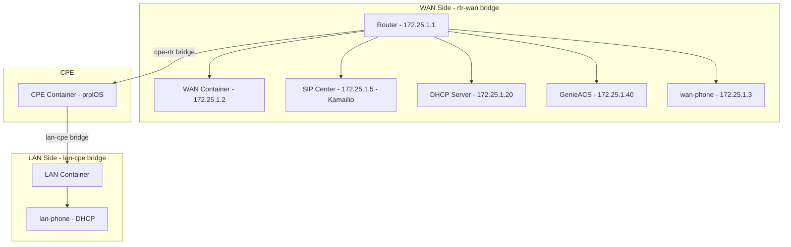

# SIP Phone Configuration Analysis

## Current Configuration Overview

### Network Topology

The current testbed uses **raikou-net** (an OVS-based Docker orchestrator) to create the following network topology:



### Current SIP Phone Configuration

#### 1. **lan-phone** (LAN-side phone)
- **Location**: Connected to `lan-cpe` bridge
- **Network**: Obtains IP via DHCP from CPE
- **Container**: Uses `phone:v1.2.0` image
- **SSH Port**: 4006
- **Phone Number**: 1000
- **Purpose**: Tests SIP functionality through CPE (behind NAT)

#### 2. **wan-phone** (WAN-side phone)
- **Location**: Connected to `rtr-wan` bridge  
- **Network**: Static IP `172.25.1.3/24`
- **Container**: Uses `phone:v1.2.0` image
- **SSH Port**: 4007
- **Phone Number**: 2000
- **Purpose**: Tests SIP functionality directly on WAN side

#### 3. **sipcenter** (SIP Server)
- **Type**: Kamailio 5.7.1 with RTPEngine
- **Location**: Connected to `rtr-wan` bridge
- **Network**: Static IP `172.25.1.5/24`
- **Registered Numbers**: 1000, 2000
- **SSH Port**: 4005

### Phone Container Details

The phone containers are based on **Debian stable-slim** and include:
- **PJSIP**: Version 2.14 (`pjsua` binary)
- **Network Tools**: iproute2, ping, traceroute, dnsutils
- **DHCP Client**: isc-dhcp-client
- **SSH Access**: Root login enabled (password: bigfoot1)

## Answer to Your Question: Can We Add Two SIP Phones on the WAN Side?

**Yes, absolutely!** The configuration already supports one WAN-side phone (`wan-phone`), and you can easily add a second one.

### Proposed Configuration for Two WAN-Side Phones

Here's what needs to be modified:

#### 1. **docker-compose.yaml** Changes

Add a new phone service (e.g., `wan-phone2`):

```yaml
wan-phone2:
    container_name: wan-phone2
    image: phone:v1.2.0
    ports:
        - 4008:22
    environment:
        - LEGACY=no
    privileged: true
    hostname: wan-phone2
    depends_on:
        - phone-image
```

Update the orchestrator dependencies:
```yaml
raikou-net:
    depends_on:
        # ... existing dependencies ...
        - wan-phone
        - wan-phone2  # Add this
```

#### 2. **config.json** Changes

Add network configuration for the second WAN phone:

```json
{
    "container": {
        "wan-phone2": [
            {
                "bridge": "rtr-wan",
                "gateway": "172.25.1.1",
                "gateway6": "2001:dead:beef:2::1",
                "iface": "eth1",
                "ip6address": "2001:dead:beef:2::4/64",
                "ipaddress": "172.25.1.4/24"
            }
        ]
    }
}
```

#### 3. **boardfarm_config_example.json** Changes

Add the device configuration:

```json
{
    "color": "green",
    "connection_type": "authenticated_ssh",
    "ipaddr": "localhost",
    "name": "wan_phone2",
    "number": "3000",
    "options": "wan-static-ip:172.25.1.4/24, wan-no-dhcp-server, wan-static-ipv6:2001:dead:beef:2::4/64, static-route:0.0.0.0/0-172.25.1.1",
    "port": 4008,
    "type": "bf_phone"
}
```

#### 4. **SIP Server Configuration**

Update the sipcenter to register the new phone number (3000):

```json
{
    "name": "sipcenter",
    "numbers": [
        "1000",
        "2000",
        "3000"  // Add this
    ]
}
```

## Recommended SIP Phone Use Cases

Based on the configuration and boardfarm's SIP phone capabilities, here are recommended test scenarios:

### Basic Call Scenarios

1. **WAN-to-WAN Calls**
   - wan-phone (2000) ↔ wan-phone2 (3000)
   - Direct SIP communication without CPE involvement
   - Tests: Basic call setup, hold, transfer, conference

2. **LAN-to-WAN Calls**  
   - lan-phone (1000) ↔ wan-phone (2000)
   - Tests CPE NAT traversal, SIP ALG functionality
   - Tests: Bidirectional calls, RTP media flow

3. **LAN-to-LAN Calls** (if you add multiple LAN phones)
   - Tests CPE internal routing
   - Tests: Hairpin NAT scenarios

### Advanced Test Scenarios

4. **Simultaneous Calls**
   - wan-phone calls lan-phone while wan-phone2 calls another endpoint
   - Tests: CPE concurrent session handling, RTP engine capacity

5. **Call Features**
   - Call waiting (wan-phone receives call while already on call)
   - Call forwarding (configure forwarding rules on SIP server)
   - Call transfer (blind/attended)
   - 3-way conferencing

6. **Codec Testing**
   - Test different codecs (G.711, G.729, Opus)
   - Verify codec negotiation and transcoding

7. **IPv4/IPv6 Dual Stack**
   - Test SIP over IPv6
   - Test mixed IPv4/IPv6 scenarios

8. **Failure Scenarios**
   - SIP server restart during active call
   - Network interruption and recovery
   - Registration expiry and re-registration

9. **Voice Quality Testing**
   - DTMF transmission
   - Echo detection
   - Jitter/packet loss simulation

10. **Security Testing**
    - SIP authentication
    - TLS/SRTP (if configured)
    - Unauthorized call attempts

## Implementation Recommendations

### Phase 1: Basic Setup
1. Add second WAN phone as described above
2. Verify basic registration to SIP server
3. Test simple WAN-to-WAN calls

### Phase 2: BDD Test Development
Create feature files for:
- `sip_registration.feature` - Phone registration scenarios
- `basic_calls.feature` - Simple call setup/teardown
- `call_features.feature` - Hold, transfer, conference
- `nat_traversal.feature` - LAN-WAN call scenarios
- `concurrent_calls.feature` - Multiple simultaneous calls

### Phase 3: Advanced Scenarios
- Implement stress testing
- Add voice quality metrics
- Create failure recovery tests

## Key Configuration Files to Monitor

1. **[docker-compose.yaml](file:///home/rjvisser/projects/req-tst/boardfarm-bdd/raikou/docker-compose.yaml)** - Container definitions
2. **[config.json](file:///home/rjvisser/projects/req-tst/boardfarm-bdd/raikou/config.json)** - Network topology (raikou-net)
3. **[boardfarm_config_example.json](file:///home/rjvisser/projects/req-tst/boardfarm-bdd/bf_config/boardfarm_config_example.json)** - Boardfarm device configuration
4. **[kamailio.py](file:///home/rjvisser/projects/req-tst/boardfarm/boardfarm3/devices/kamailio.py)** - SIP server device class
5. **[pjsip_phone.py](file:///home/rjvisser/projects/req-tst/boardfarm/boardfarm3/devices/pjsip_phone.py)** - Phone device class

## Available Phone Methods (from PJSIPPhone class)

The boardfarm PJSIPPhone class provides these key methods:

- `phone_start()` - Start the PJSIP phone
- `phone_config(ipv6_flag, sipserver_fqdn)` - Configure phone
- `dial(sequence)` - Dial a number or VSC
- `answer()` - Answer incoming call
- `hangup()` - Hang up active call
- `reinvite()` - Send re-INVITE
- `is_idle()`, `is_ringing()`, `is_connected()` - State checks
- `validate_state(state)` - Validate call state
- `dtmf_transmit(sequence)` - Send DTMF tones
- `call_hold()`, `call_unhold()` - Call hold operations
- `call_transfer()` - Transfer calls
- `conference_call()` - Conference calling

## Summary

> [!IMPORTANT]
> **Yes, you can easily configure two (or more) SIP phones on the WAN side.** The current infrastructure already has one WAN-side phone, and adding more is straightforward:
> 
> 1. Add new phone service in docker-compose.yaml
> 2. Configure network in config.json (assign unique IP)
> 3. Add device definition in boardfarm config
> 4. Register new phone number in SIP server
> 
> The containerized architecture using raikou-net makes this very flexible - you can add phones to either WAN or LAN side as needed for your test scenarios.
